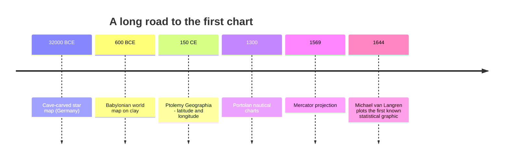

Long before there were "data visualizations," there were **pictures
that carried information**. The story of data visualization is, in
the end, the story of one of humanity's oldest habits: turning
abstract things into shapes we can see.

This page is a short, deliberate detour through that history.
Knowing where charts come from will change how you read every chart
for the rest of your life.

<svg
  viewBox="0 0 640 200"
  role="img"
  aria-label="Three eras side by side: an ochre cave-painting cluster of dots, then tally marks, then a small coordinate chart — pictures slowly becoming data"
  style={{ display: "block", width: "100%", maxWidth: "640px", height: "auto", margin: "2.5rem auto" }}
>
  <g style={{ color: "var(--ds-red-500)" }} fill="currentColor">
    <circle cx="95" cy="95" r="7" fillOpacity="0.4" />
    <circle cx="115" cy="80" r="5" fillOpacity="0.5" />
    <circle cx="138" cy="72" r="6" fillOpacity="0.45" />
    <circle cx="160" cy="82" r="5" fillOpacity="0.5" />
    <circle cx="175" cy="100" r="7" fillOpacity="0.4" />
    <circle cx="158" cy="118" r="5" fillOpacity="0.5" />
    <circle cx="132" cy="124" r="8" fillOpacity="0.45" />
    <circle cx="108" cy="116" r="4" fillOpacity="0.55" />
  </g>
  <g fill="currentColor" opacity="0.2">
    <circle cx="232" cy="60" r="3" />
    <circle cx="232" cy="100" r="3" />
    <circle cx="232" cy="140" r="3" />
    <circle cx="424" cy="60" r="3" />
    <circle cx="424" cy="100" r="3" />
    <circle cx="424" cy="140" r="3" />
  </g>
  <g style={{ color: "var(--ds-yellow-500)" }} fill="currentColor">
    <rect x="270" y="70" width="8" height="60" rx="4" />
    <rect x="284" y="70" width="8" height="60" rx="4" />
    <rect x="298" y="70" width="8" height="60" rx="4" />
    <rect x="312" y="70" width="8" height="60" rx="4" />
    <rect x="259" y="96" width="72" height="8" rx="4" transform="rotate(-30 295 100)" />
    <rect x="350" y="70" width="8" height="60" rx="4" fillOpacity="0.55" />
    <rect x="364" y="70" width="8" height="60" rx="4" fillOpacity="0.55" />
    <rect x="378" y="70" width="8" height="60" rx="4" fillOpacity="0.55" />
  </g>
  <g fill="currentColor" opacity="0.25">
    <rect x="460" y="60" width="4" height="100" rx="2" />
    <rect x="460" y="156" width="120" height="4" rx="2" />
  </g>
  <g style={{ color: "var(--ds-blue-500)" }} fill="currentColor">
    <circle cx="490" cy="135" r="6" />
    <circle cx="515" cy="118" r="6" />
    <circle cx="540" cy="98" r="6" />
  </g>
  <g style={{ color: "var(--ds-green-500)" }} fill="currentColor">
    <circle cx="565" cy="78" r="7" />
  </g>
</svg>

## Before there were charts, there were maps

The oldest known map is a star chart carved into a mammoth tusk
roughly **32,000 years old**, found in a cave in Germany. The
earliest geographic maps we have come from Babylon around 600 BCE
— clay tablets that show rivers, cities, and the boundaries of the
world as the mapmaker understood it.



Maps are interesting because they were the first widely-used
*visual abstractions*. A line on a map is not a river — it is a
**symbol** for a river. The map and the world are not the same
thing. Understanding this gap — between *the thing* and *the
picture of the thing* — is the entire foundation of data
visualization.

## The first statistical graphic

In **1644**, the Flemish astronomer **Michael van Langren** made
what historians now consider the first statistical chart. He was
trying to figure out the longitude between Toledo and Rome — a
fierce open problem at the time. Twelve different astronomers had
published estimates ranging from 17° to 30°. Van Langren drew them
on a horizontal line:

```
Toledo                                          Rome
  |                                              |
  | x   x x  x  x x   x x x      x  x       x
  17°  18°  19°  20°  21°  22°  23°  24°  ...  30°
```

Just by *seeing* the dots, you immediately notice they cluster on
the left side. The eye does the statistics for you. Van Langren
had discovered something profound: **a picture of disagreement is
often more honest than a single number.**

## Playfair and the birth of the chart

If van Langren is the great-grandfather of statistical graphics,
the *father* is **William Playfair** — a Scottish engineer and
political economist working in the 1780s. In a single book, his
*Commercial and Political Atlas* (1786), Playfair invented or
popularized three chart types we still use today:

- The **line chart**, for showing change over time.
- The **bar chart**, for comparing categories.
- A few years later, the **pie chart**, for showing parts of a
  whole.

Playfair's leap was philosophical. He argued that **economic and
political data could be *seen***, not just *read*. To a generation
raised on tables of numbers, this was strange and a little
suspicious. A bar chart was a *picture* of trade — was that
serious? Today the answer is obvious; in 1786 it was not.

## Why pictures became scientific

Three things had to come together for the chart to become a
standard scientific tool:

1. **Cheap reproduction.** Printing presses and engraving had to
   become good enough to produce a clean chart at low cost.
2. **A culture of evidence.** Scientific journals had to start
   *expecting* visual evidence rather than narrative description.
3. **A theory of perception.** Researchers had to start asking
   *why* a chart works at all — why a length is easier to compare
   than a shaded area, why color carries meaning, and so on.

We will spend an entire chapter on the third one later in this
course. For now, sit with this thought: **every chart you see
today is the descendant of a 250-year-old idea that pictures of
data are a legitimate way to know things.**

## Why this matters for you

You are about to write Python code that produces charts. The code
is the easy part. The hard part is the same hard part Playfair
faced: **deciding what to draw, and why anyone should believe it.**

When you make a bar chart in Plotly Express, you are standing on
two and a half centuries of cumulative human invention. Treat each
chart you produce as a small act of communication, not a piece of
decoration.

## Check your understanding

<MultipleChoice
  markdown={`Why is Michael van Langren's 1644 longitude chart historically important?

- It was the first map of the world.
  > The earliest geographic maps predate van Langren by thousands of years — Babylonian clay tablets from around 600 BCE and Ptolemy's *Geographia* from 150 CE are among many examples. Van Langren's 1644 chart was not a map of the world.
- [o] It was an early statistical graphic that revealed disagreement among measurements by plotting them visually.
  > By plotting each astronomer's estimate as a dot on a line, van Langren let the *eye* notice that the values clustered far below the conventional answer of the day. A picture of disagreement turned out to be more honest than any single number.
- It proved that Toledo and Rome were 17° apart.
  > The actual longitude difference between Toledo and Rome is approximately 14.5°. More importantly, van Langren's chart showed the *range of uncertainty* across twelve different estimates — it did not definitively prove any single value.
- It was the first chart drawn with a computer.
  > Computers did not exist in 1644 — van Langren drew his chart by hand. Electronic computers emerged in the mid-20th century, more than 300 years later.

Van Langren's insight — that a picture of data can reveal a story numbers alone can't — is the seed of every chart you will make in this course.`}
/>

<MultipleChoice
  markdown={`Which chart types is **William Playfair** credited with inventing or popularizing?

- [o] Line chart, bar chart, and pie chart.
  > Playfair introduced the line chart and bar chart in his 1786 *Commercial and Political Atlas* and the pie chart in his later *Statistical Breviary* (1801). All three are still among the most-used chart types on Earth.
- Scatter plot and heatmap.
  > Scatter plots are credited to later contributors — Francis Galton used them extensively in the 1880s. Heatmaps became common in 20th-century scientific visualization. Neither is associated with Playfair.
- 3-D surface plot and treemap.
  > 3-D surface plots emerged with computational graphics in the 20th century. Treemaps were invented by Ben Shneiderman in 1991. Neither has any connection to William Playfair in the 18th century.
- Histogram and box plot.
  > Histograms are attributed to Karl Pearson, who introduced the term in the 1890s. Box plots were invented by John Tukey in the 1970s. Both post-date Playfair by at least a century.

These chart types feel "natural" today only because Playfair won the argument. In 1786 they were strange new objects.`}
/>

<MultipleChoice
  markdown={`A map is a *visual abstraction*. What does that mean?

- The map is identical to the territory it represents.
  > A map that were identical to the territory would be the territory — useless as a navigational tool. Maps are deliberately simplified, scaled, and symbolized abstractions of the real world, which is what makes them useful.
- [o] The map represents the territory using symbols and conventions — the line on the page is not the river itself.
  > Every visualization is a *symbolic representation* of something else. A bar in a bar chart is not "sales"; it is a *symbol* for sales, drawn in a way that makes comparison easy. Internalizing this gap between data and picture is the foundation of visual reasoning.
- A map only contains symbols, never real geography.
  > Maps do represent real geography — specific locations, distances, and relationships — but they do so through symbolic conventions (lines, colors, icons) rather than as a literal copy of the terrain. The statement is too absolute; maps encode real geography, they just do so symbolically.
- A map is a photograph of the world.
  > A photograph captures light reflected from a scene at a moment in time. A map is a deliberate symbolic abstraction that selects, simplifies, and encodes geographic features according to the mapmaker's purpose.

We will return to this idea again and again: charts *encode* data into visual properties. Choosing the encoding is the act of design.`}
/>
