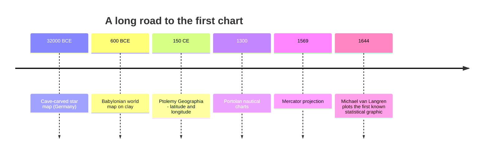
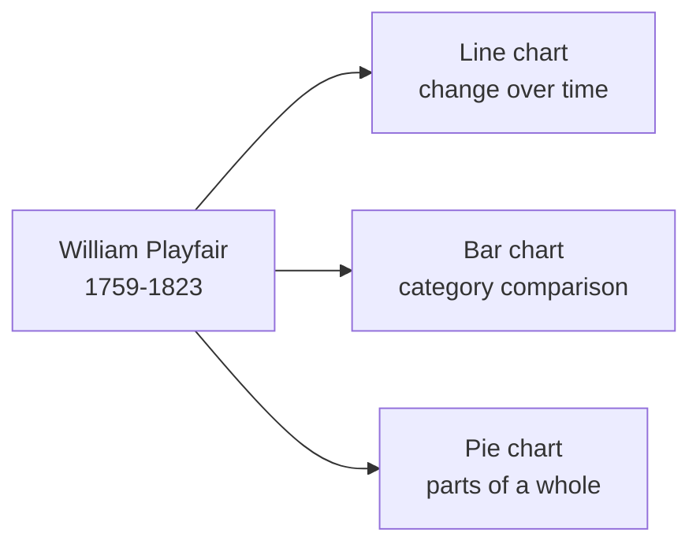

Long before there were "data visualizations," there were **pictures
that carried information**. The story of data visualization is, in
the end, the story of one of humanity's oldest habits: turning
abstract things into shapes we can see.

This page is a short, deliberate detour through that history.
Knowing where charts come from will change how you read every chart
for the rest of your life.

## Before there were charts, there were maps

The oldest known map is a star chart carved into a mammoth tusk
roughly **32,000 years old**, found in a cave in Germany. The
earliest geographic maps we have come from Babylon around 600 BCE
— clay tablets that show rivers, cities, and the boundaries of the
world as the mapmaker understood it.



Maps are interesting because they were the first widely-used
*visual abstractions*. A line on a map is not a river — it is a
**symbol** for a river. The map and the world are not the same
thing. Understanding this gap — between *the thing* and *the
picture of the thing* — is the entire foundation of data
visualization.

## The first statistical graphic

In **1644**, the Flemish astronomer **Michael van Langren** made
what historians now consider the first statistical chart. He was
trying to figure out the longitude between Toledo and Rome — a
fierce open problem at the time. Twelve different astronomers had
published estimates ranging from 17° to 30°. Van Langren drew them
on a horizontal line:

```
Toledo                                          Rome
  |                                              |
  | x   x x  x  x x   x x x      x  x       x
  17°  18°  19°  20°  21°  22°  23°  24°  ...  30°
```

Just by *seeing* the dots, you immediately notice they cluster on
the left side. The eye does the statistics for you. Van Langren
had discovered something profound: **a picture of disagreement is
often more honest than a single number.**

## Playfair and the birth of the chart

If van Langren is the great-grandfather of statistical graphics,
the *father* is **William Playfair** — a Scottish engineer and
political economist working in the 1780s. In a single book, his
*Commercial and Political Atlas* (1786), Playfair invented or
popularized three chart types we still use today:

- The **line chart**, for showing change over time.
- The **bar chart**, for comparing categories.
- A few years later, the **pie chart**, for showing parts of a
  whole.



Playfair's leap was philosophical. He argued that **economic and
political data could be *seen***, not just *read*. To a generation
raised on tables of numbers, this was strange and a little
suspicious. A bar chart was a *picture* of trade — was that
serious? Today the answer is obvious; in 1786 it was not.

## Why pictures became scientific

Three things had to come together for the chart to become a
standard scientific tool:

1. **Cheap reproduction.** Printing presses and engraving had to
   become good enough to produce a clean chart at low cost.
2. **A culture of evidence.** Scientific journals had to start
   *expecting* visual evidence rather than narrative description.
3. **A theory of perception.** Researchers had to start asking
   *why* a chart works at all — why a length is easier to compare
   than a shaded area, why color carries meaning, and so on.

We will spend an entire chapter on the third one later in this
course. For now, sit with this thought: **every chart you see
today is the descendant of a 250-year-old idea that pictures of
data are a legitimate way to know things.**

## Why this matters for you

You are about to write Python code that produces charts. The code
is the easy part. The hard part is the same hard part Playfair
faced: **deciding what to draw, and why anyone should believe it.**

When you make a bar chart in Plotly Express, you are standing on
two and a half centuries of cumulative human invention. Treat each
chart you produce as a small act of communication, not a piece of
decoration.

## Check your understanding

<MultipleChoice
  markdown={`Why is Michael van Langren's 1644 longitude chart historically important?

- It was the first map of the world.
- [o] It was an early statistical graphic that revealed disagreement among measurements by plotting them visually.
  > By plotting each astronomer's estimate as a dot on a line, van Langren let the *eye* notice that the values clustered far below the conventional answer of the day. A picture of disagreement turned out to be more honest than any single number.
- It proved that Toledo and Rome were 17° apart.
- It was the first chart drawn with a computer.

Van Langren's insight — that a picture of data can reveal a story numbers alone can't — is the seed of every chart you will make in this course.`}
/>

<MultipleChoice
  markdown={`Which chart types is **William Playfair** credited with inventing or popularizing?

- [o] Line chart, bar chart, and pie chart.
  > Playfair introduced the line chart and bar chart in his 1786 *Commercial and Political Atlas* and the pie chart in his later *Statistical Breviary* (1801). All three are still among the most-used chart types on Earth.
- Scatter plot and heatmap.
- 3-D surface plot and treemap.
- Histogram and box plot.

These chart types feel "natural" today only because Playfair won the argument. In 1786 they were strange new objects.`}
/>

<MultipleChoice
  markdown={`A map is a *visual abstraction*. What does that mean?

- The map is identical to the territory it represents.
- [o] The map represents the territory using symbols and conventions — the line on the page is not the river itself.
  > Every visualization is a *symbolic representation* of something else. A bar in a bar chart is not "sales"; it is a *symbol* for sales, drawn in a way that makes comparison easy. Internalizing this gap between data and picture is the foundation of visual reasoning.
- A map only contains symbols, never real geography.
- A map is a photograph of the world.

We will return to this idea again and again: charts *encode* data into visual properties. Choosing the encoding is the act of design.`}
/>
