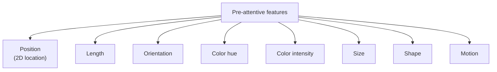

This is one of the most important pages in the course. If you grasp
what it says, you will have a *theory* for why some charts feel
effortless to read and others feel like work. Without the theory,
chart design is guesswork. With the theory, it becomes principled.

## Pre-attentive processing

Your visual system processes some properties of an image **before
your conscious attention gets involved**. These properties are
called **pre-attentive features**. Detecting them takes about
*200 milliseconds*, and crucially, it is **independent of how many
items are on screen** — you can spot one red dot among a thousand
gray dots as fast as you can spot it among ten.

Try this. Below is a paragraph. Find the **bold** word.

> Lorem ipsum dolor sit amet consectetur adipiscing elit sed do
> eiusmod tempor incididunt ut **labore** et dolore magna aliqua.

You did it instantly. Your visual system flagged **bold** for
you before you read a single word. *Boldness* (a form of weight /
intensity) is a pre-attentive feature.

The same is true for many other visual properties. Here are the
ones most relevant to data visualization:

## The Cleveland-McGill ranking

In a famous 1984 study, **William Cleveland and Robert McGill**
asked: *which visual properties let people compare quantities most
accurately?* They ran experiments and produced a ranking — from
most accurate to least accurate — for *quantitative* comparisons:

1. **Position along a common scale** (most accurate)
2. **Position along non-aligned scales**
3. **Length**
4. **Angle / slope**
5. **Area**
6. **Volume / curvature**
7. **Color intensity / shading** (least accurate)

This ranking has been replicated many times and is the *empirical
backbone* of modern visualization theory.

Several practical conclusions fall out immediately:

- **Bar charts beat pie charts** for comparing magnitudes — bars
  use length and aligned position; pies use angles and areas.
- **Scatter plots are extremely powerful** — they use the top two
  positions on the ranking for both axes.
- **Color is great for *categories* and *terrible* for *exact
  magnitudes***. The eye can quickly distinguish red from blue,
  but it cannot reliably tell you whether "this red" is 17%
  brighter than "that red."
- **3-D charts hurt** more than they help — they swap accurate
  cues (position, length) for inaccurate ones (volume, angle).

## See it for yourself

Look at these two charts of the same data. Which one lets you
compare values more easily?

<CodeBlock
  adapter="python"
  starterCode={`import pandas as pd
import plotly.express as px

df = pd.DataFrame({
    "category": ["A", "B", "C", "D", "E"],
    "value":    [27, 24, 22, 19, 16],
})

# Pie chart — judging slice angles is hard.
fig1 = px.pie(df, names="category", values="value",
              template="simple_white",
              title="Pie chart — guess each category's value")
fig1.show()

# Bar chart — judging bar lengths is easy.
fig2 = px.bar(df, x="category", y="value",
              template="simple_white",
              title="Bar chart — same data, clearer comparison")
fig2.show()
`}
/>

The bar chart almost forces you to *see* that A is biggest, then
B, then C — and roughly by how much. The pie chart leaves you
squinting at slice sizes that are all "about the same."

## Color: powerful and dangerous

Color deserves its own paragraph because it is the most over-used
and abused encoding in data visualization.

What color is *good* for:

- **Categories.** Red, blue, green for distinct groups. The eye
  separates them instantly.
- **Diverging quantities** with a meaningful midpoint. Red for
  "below average," blue for "above average." A *diverging* color
  scale (red→white→blue) makes the midpoint visually obvious.
- **Sequential quantities** when *precise* values aren't crucial.
  Light yellow → deep blue for "increasing." Good for heatmaps
  and maps.

What color is *bad* for:

- **Precise quantity comparison.** "Is this red 23% more than
  that one?" — you can't tell.
- **Rainbow / jet colormaps** that are *perceptually nonuniform*.
  These create false visual ridges that look like data structure
  but aren't. The world has largely moved on from them.
- **More than ~7 categorical colors.** After ~7, the eye starts
  confusing similar shades.

## Accessibility: not everyone sees color the same way

About **8% of men and 0.5% of women** have some form of color
vision deficiency. The most common is red-green confusion. If your
chart distinguishes "good" from "bad" only by red vs green, a
significant chunk of your audience cannot read it.

The fixes are simple and free:

- Use **colorblind-safe palettes** (Plotly's `Viridis`, `Cividis`,
  and `Plotly3` qualitative palettes are all good defaults).
- **Double-encode** important distinctions — different colors *and*
  different shapes, or different colors *and* labels.
- For sequential data, prefer **luminance-varying** palettes (light
  → dark), which work even in grayscale.

We will revisit this in the ethics and accessibility chapter.

## A practical rule of thumb

Here is the heuristic that summarizes this whole chapter:

> **Use the highest-ranked encoding (position, length) for the
> most important variable. Use lower-ranked encodings (color,
> size) for secondary variables that you mostly want the reader to
> *notice categorically*, not compare precisely.**

In a Plotly Express scatter plot like
`px.scatter(df, x="gdp", y="lifeExp", color="continent", size="pop")`:

- The **most accurate** comparisons are along **x** and **y**.
- **Color** lets you spot which dots belong to the same continent.
- **Size** lets you notice "this is a populous country" but not
  reliably compare which is bigger.

That ordering matches the variables' importance for the story.

## Check your understanding

<MultipleChoice
  markdown={`What does it mean for a visual property to be **pre-attentive**?

- It can only be seen with conscious effort.
- It requires special training to notice.
- [o] The visual system detects it *before* conscious attention is engaged, in roughly 200 milliseconds, regardless of how many other items are on screen.
  > Pre-attentive features (color hue, position, length, motion, ...) "pop out" — you spot a red dot among a thousand gray dots as fast as among ten. Good charts use pre-attentive features to surface the most important information.
- It must be in the foreground of the chart.

If something is important, encode it with a pre-attentive feature so it pops out instantly.`}
/>

<MultipleChoice
  markdown={`According to the Cleveland-McGill ranking, which visual encoding is **most accurate** for comparing quantitative values?

- Color intensity (shading).
- Area.
- Angle.
- [o] Position along a common scale.
  > Position along a shared axis (the x or y axis of a chart) is the most accurate visual encoding for quantitative comparison. This is why bar charts and scatter plots are so powerful — they use position for the things you want to compare precisely.

Length is second. Color and area are far down the list. Plan your charts accordingly.`}
/>

<MultipleChoice
  markdown={`Why are pie charts generally weaker than bar charts for comparing values?

- Pie charts are an outdated format.
- Pie charts can only show two values.
- [o] Pie charts encode quantity using **angle / area**, which the visual system judges much less accurately than the **length / position** used by bar charts.
  > The Cleveland-McGill experiments showed angles and areas are among the *worst* encodings for quantitative comparison. With more than 3-4 slices, viewers can no longer reliably rank them. Bar charts use length along a common scale — much easier on the eye.
- Pie charts don't support color.

Pie charts have a few legitimate uses (we'll cover them in their own chapter), but they're rarely the right answer.`}
/>

<MultipleChoice
  markdown={`Which is a **good** use of color in a chart?

- Showing precise dollar amounts using shades of red.
- Distinguishing 25 different product categories.
- [o] Showing a categorical grouping (e.g., continent) with 5-7 distinct hues.
  > Color excels at *categorical* distinctions when the number of categories is small (≈5-7 max). For more than that, viewers start confusing similar shades. For precise quantitative values, use position or length instead.
- Indicating the chart's title.

Color is one of the most over-used encodings. Use it deliberately.`}
/>

<MultipleChoice
  markdown={`Why does using **only red vs green** to encode "bad" vs "good" create an accessibility problem?

- Red and green look identical on phone screens.
- Red and green are banned by the WCAG specification.
- [o] About 8% of men have red-green color vision deficiency and cannot reliably distinguish the two colors.
  > Red-green color blindness is the most common form of color vision deficiency. Charts that rely *only* on red vs green to convey meaning exclude a significant slice of the audience. The fix is to double-encode (color + shape, color + label) or to use a colorblind-safe palette.
- Red and green are culturally inappropriate.

Free, modern palettes (Viridis, Cividis, ColorBrewer) are designed to remain distinguishable for color-blind viewers. Use them.`}
/>

<MultipleChoice
  markdown={`A chart shows **size="population"** and **color="continent"** in a scatter plot of **x="gdp"**, **y="lifeExp"**. Which variables can the viewer compare **most precisely**?

- Population (via size).
- Continent (via color).
- [o] GDP and life expectancy (via x and y position).
  > Position along an axis is the most accurate encoding. Size and color are excellent for *categorical noticing* — "ah, that's a big country" or "those are the African nations" — but not for precise comparison. Always put your most important quantitative variables on x and y.
- All variables are equally precise to compare.

Encoding choice = importance ordering. Use the strongest channels for the variables that matter most.`}
/>
