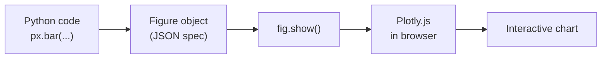

You have seen Plotly Express in action through several previous
pages. Now we slow down and look at it carefully — *as a library*,
not as magic. By the end of this page you will understand what
`import plotly.express as px` actually does, what a Plotly figure
*is*, and how to read the names of all the chart functions.

## The standard import

Every Plotly Express chart in this course (and in essentially every
notebook in the wild) starts the same way:

```python
import plotly.express as px
```

That single line does two things:

1. It loads the `plotly.express` module, which contains all the
   chart functions: `px.bar`, `px.line`, `px.scatter`, and so on.
2. It gives the module the short name `px`. By convention, every
   Python data analyst calls Plotly Express `px`. Just like NumPy
   is `np` and pandas is `pd`.

You will also frequently see:

```python
import pandas as pd
import plotly.express as px
```

`pd` and `px` are the canonical pair. Most charts in this course
will begin with those two imports.

## The basic shape of a Plotly Express call

Every Plotly Express function takes a DataFrame plus some
*encoding* arguments and returns a **Figure** object. The pattern
looks like this:

```python
fig = px.bar(
    df,                      # the data
    x="col_name",            # what goes on x
    y="col_name",            # what goes on y
    color="col_name",        # optional: color encoding
    title="My chart",        # optional: title
    template="simple_white", # optional: visual theme
)
fig.show()
```

That's the entire shape of essentially every chart call you will
ever make. The first argument is the data; the rest are encodings
and styling.

Try it:

<CodeBlock
  adapter="python"
  initialCode={`import pandas as pd
import plotly.express as px

df = pd.DataFrame({
    "fruit": ["Apple", "Banana", "Cherry", "Date", "Elderberry"],
    "kg":    [12, 8, 5, 3, 2],
})

fig = px.bar(
    df,
    x="fruit",
    y="kg",
    title="Fruit sold at the market (kg)",
    template="simple_white",
)
fig.show()
`}
/>

Notice the *separation of concerns*:

- `df` is the data.
- `x="fruit"` and `y="kg"` are *encodings* — they say "use the
  fruit column for x and the kg column for y."
- `title=...` and `template=...` are *styling*.

This separation is what makes Plotly Express so readable.

## The Plotly Express function family

Plotly Express has about **30** chart functions. You don't need to
memorize them; the names follow a tiny set of patterns. Here are
the ones we'll meet in this course:

| Function | Purpose |
| --- | --- |
| `px.scatter` | Two-variable relationships, also bubble charts |
| `px.line` | Trends over an ordered axis (usually time) |
| `px.bar` | Compare values across categories |
| `px.histogram` | Distribution of one variable |
| `px.box` | Distribution + outliers across categories |
| `px.violin` | Distribution shape across categories |
| `px.pie` | Parts of a whole (use sparingly) |
| `px.density_heatmap` | 2-D density via colored grid |
| `px.imshow` | Image / matrix / heatmap |
| `px.choropleth` | Map colored by region |
| `px.scatter_geo` | Points on a world map |
| `px.scatter_mapbox` | Points on a tile-based map |
| `px.timeline` | Gantt-style time intervals |
| `px.sunburst` / `px.treemap` | Hierarchical compositions |

There are more (`px.parallel_coordinates`, `px.scatter_matrix`,
`px.density_contour`, ...). The cheat sheet on
[plotly.com](https://plotly.com/python/plotly-express/) is the
canonical reference; don't try to memorize.

## What `fig.show()` actually does

When you call `fig.show()`, Plotly Express does the following:

1. Builds a JSON description of the chart (axes, data, encodings,
   styling).
2. Sends that JSON to the **Plotly.js** library running in your
   browser.
3. Plotly.js renders the chart as interactive SVG or WebGL,
   wrapped in HTML.



You don't normally need to think about this pipeline. But it
explains why Plotly charts are interactive *for free*: the chart
*is* a small JavaScript application.

## The Figure object — a brief intro

The `fig` variable returned by every Plotly Express call is a
**Figure**. You can inspect it:

<CodeBlock
  adapter="python"
  initialCode={`import plotly.express as px

df = px.data.iris()

fig = px.scatter(df, x="sepal_width", y="sepal_length",
                 template="simple_white")

print("Type:", type(fig).__name__)
print("Data traces:", len(fig.data))
print("X-axis title:", fig.layout.xaxis.title.text)
print("Y-axis title:", fig.layout.yaxis.title.text)
`}
/>

Most of the time you won't print the figure; you'll just call
`.show()`. But knowing that `fig` is a real Python object — that
you can modify it before showing — opens the door to more advanced
customization later (`fig.update_layout(...)`,
`fig.update_traces(...)`, and so on).

## Where do datasets come from?

Throughout this course we'll use three sources of data:

1. **Built-in Plotly datasets** — small, classic datasets that
   ship with Plotly Express. Examples: `px.data.iris()`,
   `px.data.tips()`, `px.data.gapminder()`, `px.data.stocks()`.
2. **Hand-built DataFrames** — small tables we type out with
   `pd.DataFrame({...})`. Useful for tiny illustrative examples.
3. **CSV / Parquet files loaded with pandas** — the real-world
   workflow. We will introduce these in the next chapter.

The built-in datasets are perfect for learning because they are
small, real, and don't require any file I/O.

## Check your understanding

<MultipleChoice
  markdown={`What does `import plotly.express as px` do?

- It imports the `plotly` module and runs it.
- It installs Plotly Express.
- [o] It loads the Plotly Express module and gives it the short alias `px`, so you can write `px.bar(...)` instead of `plotly.express.bar(...)`.
  > Yes. Aliasing imports (`as px`, `as pd`, `as np`) is a near-universal Python convention. The alias `px` is the canonical one for Plotly Express; you will see it in essentially every notebook in the wild.
- It downloads a Plotly chart.

You will type this line at the top of nearly every file in this course.`}
/>

<MultipleChoice
  markdown={`A Plotly Express function call like `px.bar(df, x="month", y="sales")` returns:

- A PNG image.
- An HTML string.
- [o] A Plotly **Figure** object that can be inspected, modified, and rendered with `fig.show()`.
  > Right. The Figure is a Python object that holds a complete description of the chart. Calling `.show()` sends it to your browser to be drawn by Plotly.js. You can also modify the figure (e.g., `fig.update_layout(...)`) before showing it.
- The DataFrame, sorted.

The fact that `fig` is a real Python object is what makes Plotly Express extensible: you can call Plotly Express for the easy 90% and then tweak the figure for the last 10%.`}
/>

<MultipleChoice
  markdown={`Which of these is **NOT** part of the standard Plotly Express call pattern?

- A DataFrame as the first argument.
- Column names as the values of `x`, `y`, `color`, etc.
- A `template=...` argument for visual styling.
- [o] A function that runs the chart against a SQL database directly.
  > Correct — this is the odd one out. Plotly Express does not query databases. You first load data into a pandas DataFrame (using SQL, CSV, Parquet, or whatever), and *then* you call Plotly Express. Keeping data loading separate from charting is a feature, not a limitation.

Pandas does the loading and reshaping; Plotly Express does the visualization. Two tools, one workflow.`}
/>

<MultipleChoice
  markdown={`Which built-in Plotly Express dataset is most useful for **time-series** examples?

- `px.data.iris()`
- `px.data.tips()`
- [o] `px.data.gapminder()` or `px.data.stocks()`
  > Yes. `gapminder()` has yearly country-level data from 1952-2007; `stocks()` has daily stock prices. Both are excellent for line charts, faceted time-series, and animated trends. `iris` and `tips` are static datasets — no time component.
- `px.data.election()`

The built-in datasets are deliberately diverse so you have a sample for each chart type.`}
/>
