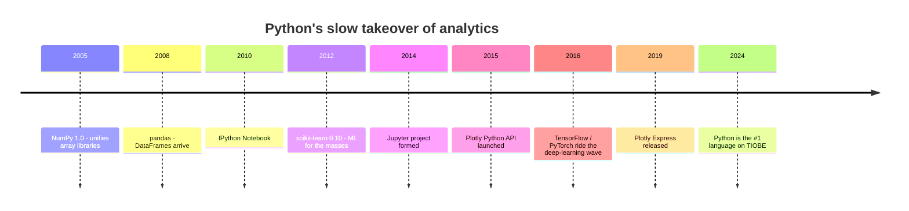
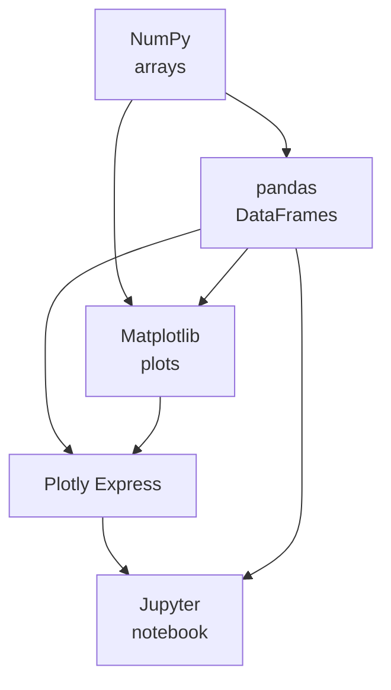

If you walked into a data team at any major company today and
asked "what language do you use?", the most common answer — by a
wide margin — would be **Python**. This was not always the case,
and it was not even obvious twenty years ago. The story of how
Python ended up there is worth understanding, because it explains
*why this course uses Python at all*.

<svg
  viewBox="0 0 640 220"
  role="img"
  aria-label="A friendly snake assembled from rotated pill segments slithers across the scene, growing more solid toward its head — Python quietly taking over analytics"
  style={{ display: "block", width: "100%", maxWidth: "640px", height: "auto", margin: "2.5rem auto" }}
>
  <g fill="currentColor" opacity="0.18">
    <circle cx="140" cy="192" r="3" />
    <circle cx="220" cy="192" r="3" />
    <circle cx="300" cy="192" r="3" />
    <circle cx="380" cy="192" r="3" />
    <circle cx="460" cy="192" r="3" />
  </g>
  <g style={{ color: "var(--ds-green-500)" }} fill="currentColor">
    <rect x="114" y="141" width="40" height="14" rx="7" transform="rotate(-30 134 148)" fillOpacity="0.3" />
    <rect x="152" y="119" width="40" height="14" rx="7" transform="rotate(-28 172 126)" fillOpacity="0.4" />
    <rect x="192" y="99" width="40" height="14" rx="7" transform="rotate(-22 212 106)" fillOpacity="0.5" />
    <rect x="234" y="91" width="40" height="14" rx="7" transform="rotate(5 254 98)" fillOpacity="0.6" />
    <rect x="276" y="99" width="40" height="14" rx="7" transform="rotate(22 296 106)" fillOpacity="0.7" />
    <rect x="316" y="121" width="40" height="14" rx="7" transform="rotate(28 336 128)" fillOpacity="0.8" />
    <rect x="356" y="137" width="40" height="14" rx="7" transform="rotate(14 376 144)" fillOpacity="0.9" />
    <rect x="398" y="133" width="40" height="14" rx="7" transform="rotate(-16 418 140)" />
    <rect x="438" y="111" width="40" height="14" rx="7" transform="rotate(-28 458 118)" />
    <circle cx="496" cy="98" r="15" />
  </g>
  <g style={{ color: "var(--ds-white)" }} fill="currentColor">
    <circle cx="501" cy="93" r="3" />
  </g>
  <g style={{ color: "var(--ds-red-500)" }} fill="currentColor">
    <polygon points="510,96 528,89 524,99" fillOpacity="0.8" />
  </g>
  <g style={{ color: "var(--ds-yellow-500)" }} fill="currentColor">
    <circle cx="560" cy="70" r="5" fillOpacity="0.8" />
    <circle cx="580" cy="56" r="3.5" fillOpacity="0.6" />
  </g>
</svg>

## The competition

In the early 2000s, the analytics world ran on three or four
mutually-suspicious languages:

- **SAS**, **SPSS**, and **Stata** — proprietary statistical
  packages with enormous installed bases in academia, government,
  and pharma.
- **R** — a free, open-source statistical language designed by
  and for statisticians.
- **MATLAB** — dominant in engineering and physics.
- **Excel + VBA** — the lingua franca of business.
- **SQL** — the universal language for *getting* data, but not
  *analyzing* it deeply.

Python was *nowhere* on this list. In 2005, Python was a "scripting
language" — popular with web developers and system administrators
but viewed with mild suspicion by serious analysts. It had no good
numerical library, no good plotting library, no good DataFrame
library, no notebook.

## Three libraries that changed everything

Three libraries — and a notebook — turned Python into an analytics
platform between 2005 and 2014.

### NumPy: arrays

**NumPy** (Numerical Python, 2005) gave Python its first proper
numerical array type. Suddenly you could write `a + b` to add two
arrays of a million numbers in a single line, and it would run as
fast as C. Every other analytics library since has been built on
top of NumPy.

### pandas: DataFrames

**pandas** (2008, by Wes McKinney) added the **DataFrame** — a
labeled, spreadsheet-like table that lives in memory. If NumPy
made Python *numerical*, pandas made Python *tabular*. A DataFrame
looks and behaves a lot like a sheet in Excel — but you can have
*billions* of rows, you can write code to manipulate it, and you
can chain operations together cleanly.

DataFrames are the **central object** of the rest of this course.
Plotly Express expects a DataFrame as input. Every chart on every
page of this course starts with a pandas DataFrame.

### Matplotlib: plotting

**Matplotlib** (2003) was the original Python plotting library —
designed deliberately to feel like MATLAB's plotting commands so
that scientists could switch over with zero friction. Matplotlib
is the *grandparent* of every Python visualization library,
including Plotly Express. It is still excellent for static,
publication-quality figures.

### Jupyter: the notebook

In 2010, **Fernando Pérez** released the **IPython Notebook** — a
web-based environment where you could write Python and prose side
by side, and see chart outputs appear inline. Renamed **Jupyter**
in 2014, the notebook is now the *default* working environment for
data scientists, ML researchers, and quantitative analysts
worldwide.

## Why Python won

There were better statistical languages (R), better numerical
languages (MATLAB, Julia), and better systems languages (C++,
Rust). Why did Python — a deliberately *unspecialized* language —
end up at the center?

Three reasons:

1. **Python is "good enough" at everything.** You can write a
   data pipeline, train a machine-learning model, build a web
   app, and write a script to email yourself the results — all in
   one language. R analysts had to drop into Python or Bash for
   "the other stuff"; Python analysts rarely had to leave.
2. **Python reads like English.** A line of pandas code is often
   readable to someone who has never seen pandas. This matters
   *enormously* when you're sharing analyses with non-programmers.
3. **The ecosystem became self-reinforcing.** Once every machine-
   learning library, every cloud SDK, every bioinformatics tool,
   and every visualization library had a Python interface, *not*
   using Python became the costly choice.

## Why Python is great for visualization, specifically

For visualization in particular, Python offers a sweet spot:

- **DataFrames in, charts out.** Plotly Express, Matplotlib,
  Seaborn, and Altair all consume pandas DataFrames. You spend
  almost no time on data wrangling between *cleaning* and
  *plotting*.
- **Code is the recipe.** A Plotly Express chart is one line of
  Python. That one line is the *definitive*, reproducible record
  of how that chart was made. Six months later, you can re-run
  it and get the same result.
- **You can embed charts everywhere.** Inside a Jupyter notebook,
  inside a static HTML report, inside an interactive web
  application, inside a slide deck. The same Python chart code
  works in all of them.

## A tiny tour

Here is a hint of what a Python visualization workflow feels like.
Don't worry about understanding every line yet — we will unpack
all of this in detail soon.

<CodeBlock
  adapter="python"
  files={[
    {
      filename: "main.py",
      starterCode: `import pandas as pd
import plotly.express as px

# Load a tiny built-in dataset:
df = px.data.gapminder().query("year == 2007 and continent == 'Europe'")

# Pandas: peek at the first 5 rows.
print(df.head())

# Plotly Express: one line, one chart.
fig = px.bar(
    df.sort_values("lifeExp"),
    x="lifeExp",
    y="country",
    orientation="h",
    template="simple_white",
    title="Life expectancy in Europe (2007)",
    labels={"lifeExp": "Life expectancy (years)", "country": "Country"},
)
fig.show()
`,
    },
  ]}
/>

That is the *entire workflow*: load data into a DataFrame, optionally
manipulate it, call one Plotly Express function. The chart is
interactive and shippable. This pattern will repeat on essentially
every page from here on.

## Check your understanding

<MultipleChoice
  markdown={`Which Python library introduced the **DataFrame** — a labeled, spreadsheet-like table that has become the central object of Python data analysis?

- NumPy
  > NumPy (2005) introduced efficient numerical arrays to Python, but its primary data structure is a homogeneous multidimensional array, not a labeled table with named columns. The DataFrame concept was added later by pandas.
- Matplotlib
  > Matplotlib (2003) is a plotting library built on top of NumPy. It did not introduce the DataFrame — its focus is rendering charts, not storing or manipulating tabular data with named columns.
- [o] pandas
  > Pandas (2008, by Wes McKinney) brought the DataFrame to Python, building on top of NumPy's arrays. Plotly Express expects DataFrames as input, so pandas is the workhorse you'll use throughout this course.
- Jupyter
  > Jupyter is a notebook environment for writing code and prose side by side. It provides an interactive interface for Python but did not introduce the DataFrame data structure.

Almost every page of this course starts with a **px.data.something()** call that returns a pandas DataFrame.`}
/>

<MultipleChoice
  markdown={`Which of the following is the **best** reason that Python "won" the analytics ecosystem?

- Python is faster than C++ for numerical code.
  > Python is generally slower than C++ for raw computation. The numerical performance of Python's scientific stack comes from libraries like NumPy and pandas that call optimized C and Fortran routines under the hood — but Python itself is not faster than C++.
- Python charts are prettier than R charts.
  > Chart aesthetics depend on the library, the theme, and the designer's choices, not the host language. R's ggplot2 and tidyverse graphics are widely considered beautiful. Chart appearance is not why Python won the analytics ecosystem.
- [o] Python is "good enough" at everything from data pipelines to ML to web apps, so analysts rarely have to leave it.
  > Python is rarely the *best* language for any single task, but the cost of switching languages mid-project is high. By being adequate at everything, Python eliminated the friction of "which language do I write this next part in?"
- Python is the only language with notebooks.
  > R Markdown, Observable notebooks (for JavaScript), and Pluto.jl (for Julia) all offer notebook-style environments. Jupyter itself supports dozens of languages through kernels. Notebooks are not exclusive to Python.

R, Julia, and even SQL have notebook-like environments — but the Python ecosystem became self-reinforcing first, and now leads by a wide margin.`}
/>

<MultipleChoice
  markdown={`What is a **Jupyter notebook**?

- A spreadsheet application.
  > Spreadsheet applications like Excel or Google Sheets use a grid-based cell model. Jupyter notebooks use a cell-based model too, but each cell contains code or Markdown prose rather than grid values, and outputs (charts, tables) appear inline below the cell.
- A database management tool.
  > Database management tools like pgAdmin or DBeaver are for querying and administering databases. Jupyter notebooks run Python (or other language) code and are not connected to any particular database by default.
- [o] A web-based environment for writing code, prose, and seeing chart outputs inline — the default working environment for many data scientists.
  > Jupyter (originally IPython Notebook, 2010) lets you write Python and Markdown side by side, with chart and table outputs appearing directly under the code that produced them. It is to modern analytics what the spreadsheet was to 1990s business.
- A type of Python web framework.
  > Python web frameworks like Django or Flask are used to build server-side web applications. Jupyter is an interactive computational environment for running code and exploring data, not a framework for building production web apps.

This course doesn't require you to install Jupyter — every code block here runs in your browser — but you'll likely use Jupyter outside this course.`}
/>
