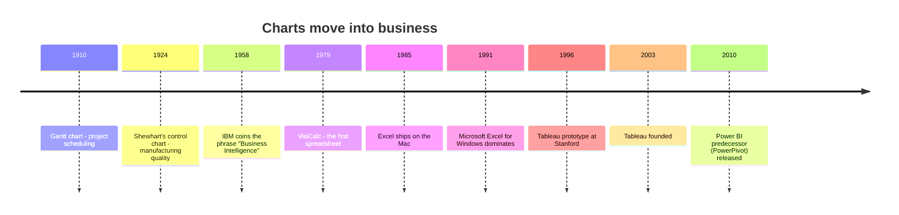
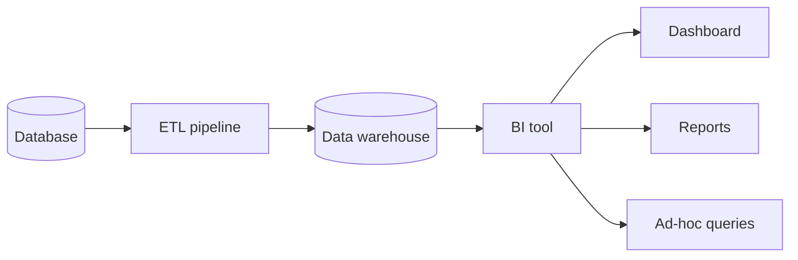

The hundred years between Florence Nightingale's rose diagram and
your first Plotly chart are the story of **how visualization moved
from being a rare, dramatic gesture to being the everyday language
of business**. The chapter is sometimes called "the rise of
business intelligence" (BI), and although the acronym sounds dry,
the actual history is anything but.

## Statistics in the corner office

Through the late 19th and early 20th centuries, statistical
graphics spread out of public health and into commerce. **Henry
Gantt** invented his famous bar chart for project scheduling in
1910. **Walter Shewhart**, working at Bell Labs in the 1920s,
invented the **control chart** to keep telephone components within
spec — laying the foundation for what would later be called
statistical process control and, eventually, the Six Sigma movement.

By mid-century, every large company had a "statistics department"
that produced reports — usually printed on green-bar paper, with
tables that ran for pages. Charts were sometimes attached as a
courtesy. Almost nobody read them carefully.

## The phrase "Business Intelligence"

The phrase **"business intelligence"** was coined in a 1958 IBM
research paper by Hans Peter Luhn, but it did not catch on for
another 30 years. In the late 1980s, an analyst at Gartner named
**Howard Dresner** popularized the term to describe a new class of
software: tools that let *managers*, not statisticians, ask
questions of corporate data and get back charts and tables.

The promise of BI was radical and simple:

> **You should not need a programmer to ask a question of your
> data.**

That sentence is older than most BI software and is still, in
2026, the central promise of every dashboard product on the
market.

## The decade of the spreadsheet

The single biggest event in the history of business visualization
was not a research breakthrough. It was **VisiCalc**, the first
electronic spreadsheet, released in **1979** for the Apple II.
Suddenly, an accountant with no programming background could put
numbers in a grid, write a formula, and see the result update
instantly. **Lotus 1-2-3** followed in 1983. **Microsoft Excel**
arrived on the Macintosh in 1985 and on Windows in 1987.

By the early 1990s, every business in the world ran on Excel — and
Excel could draw charts. For a generation of analysts, "data
visualization" *meant* "click the Chart Wizard." This had two
consequences, one good and one bad:

- **Good:** Hundreds of millions of people learned to *think* in
  rows, columns, and charts. The cultural infrastructure for
  visualization went mainstream.
- **Bad:** Many of the chart types Excel made easy (3-D pie charts,
  rotated bar charts with garish gradients) are *exactly* the kinds
  of charts that mislead.

We will spend a lot of time later in this course unpacking why a
3-D pie chart is almost always a bad idea.

## The dashboard era

By the late 1990s, BI tools like **Cognos**, **Business Objects**,
and **MicroStrategy** were selling expensive enterprise dashboards
to Fortune 500 companies. The dashboard was a *single screen* with
many charts arranged like the instrument panel of a car —
"speedometer," "fuel gauge," "warning lights" for the business.

The dashboard was a *good idea executed badly*, again and again,
for two decades. Dashboards became dumping grounds. A typical
executive dashboard in 2005 had **30+ charts on one screen** and
required a written guide to interpret. We will talk about why this
happened — and how to do better — in the dashboard chapter near the
end of the course.

## Tableau and the modern era

In **2003**, three Stanford researchers — Chris Stolte, Pat
Hanrahan, and Christian Chabot — founded **Tableau**, based on a
PhD thesis by Stolte about a "visual query language" called VizQL.
Tableau's pitch was that you could *drag and drop* a column onto a
chart and Tableau would pick a reasonable visualization for you.

This was a turning point. **Visualization was no longer the
*output* of an analysis; it was the *interface* to the data.**
Tableau, Power BI (Microsoft's answer, 2015), Looker, and dozens
of others now dominate corporate analytics.

These tools are wonderful — but they are also where Plotly Express
comes in. Drag-and-drop tools are great for *exploration* and
*business reporting*, but they make it hard to:

- **Reproduce** an analysis exactly six months later.
- **Version control** a chart the way you version code.
- **Customize** a chart beyond the menu options the tool exposes.
- **Embed** a chart in a notebook alongside the *reasoning* that
  produced it.

For all those reasons, an entire generation of analysts has gone
back to *code* — and Python, with Plotly Express, has become the
quiet workhorse of modern data analysis.

## Why this history matters to you

You are joining a 100-year-old conversation. The instinct to "throw
a chart on the dashboard" comes from somewhere. Knowing where it
comes from helps you decide when to follow the tradition and when
to push back.

Three takeaways:

- **The democratization of charts has been a 60-year project.**
  Plotly Express continues that project — anyone can write
  `px.bar(df, x=..., y=...)`. You don't need a PhD.
- **The "default chart" of business is often *bad*** because it
  was the default in 1995 Excel. We will name and replace these
  defaults.
- **Code-based visualization is a deliberate choice.** It trades
  click-speed for reproducibility, customization, and the ability
  to tell *exactly* the story you mean to tell.

## Check your understanding

<MultipleChoice
  markdown={`Which 1979 event was arguably the most important moment in the **democratization** of business visualization?

- The invention of Tableau.
- The publication of Tufte's "Visual Display of Quantitative Information."
- [o] The release of VisiCalc, the first electronic spreadsheet, on the Apple II.
  > Right. VisiCalc made it possible for non-programmers to manipulate tabular data and produce charts. This single product seeded the cultural infrastructure that BI and modern dashboards depend on.
- The founding of the Census Bureau.

Excel inherited VisiCalc's model and brought it to billions of people. Every modern BI tool is, in some sense, a successor to that 1979 release.`}
/>

<MultipleChoice
  markdown={`What does the term **Business Intelligence (BI)** broadly refer to?

- Software that uses AI to run a business.
- A subfield of artificial intelligence.
- [o] Software and processes that help non-technical users query, analyze, and visualize business data without needing to write code.
  > Yes. The promise of BI is that *anyone* — not just programmers — should be able to ask data questions and get back visual answers. Tools like Tableau, Power BI, and Looker continue that mission.
- A government agency that monitors competitors.

BI predates "data science" by about 30 years and is still, by revenue, far larger.`}
/>

<MultipleChoice
  markdown={`Why might an analyst choose to use **code** (Python + Plotly Express) instead of a drag-and-drop tool like Tableau?

- Code is always faster than dragging and dropping.
- Tableau cannot produce interactive charts.
- [o] Code makes analyses **reproducible**, **version-controllable**, **customizable**, and easy to embed alongside the reasoning that produced them.
  > Correct. Dragging and dropping is great for fast exploration, but the moment you need to re-run an analysis in six months — or share *exactly* how you got a number — code wins. Both approaches have their place.
- Code is required by law for financial reporting.

Many serious analytics teams use *both*: dashboards for stakeholders, code-based notebooks for the rigorous work behind them.`}
/>
