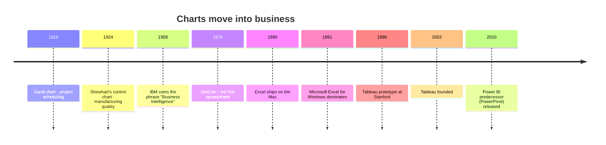
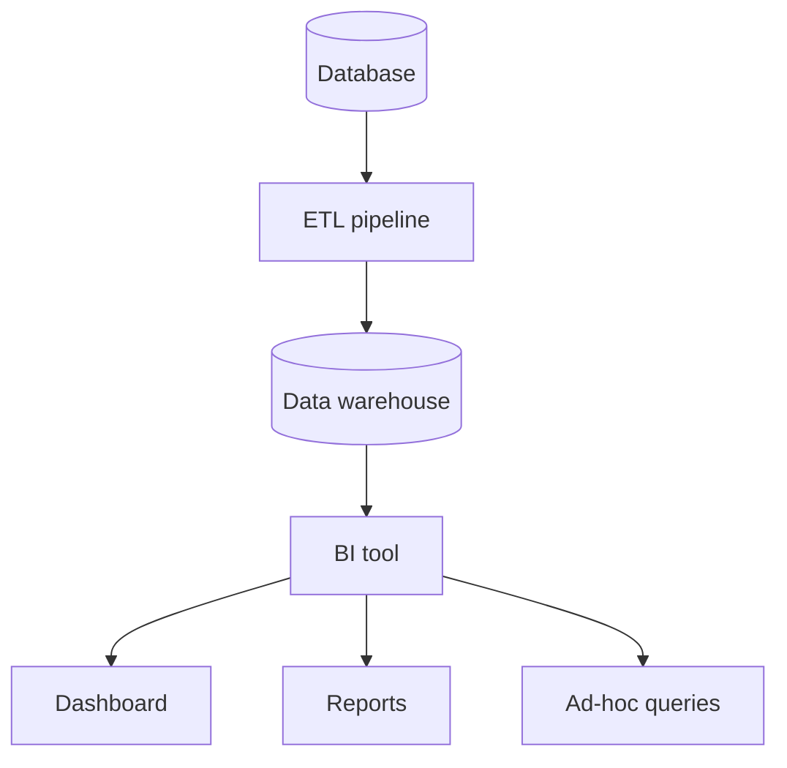

The hundred years between Florence Nightingale's rose diagram and
your first Plotly chart are the story of **how visualization moved
from being a rare, dramatic gesture to being the everyday language
of business**. The chapter is sometimes called "the rise of
business intelligence" (BI), and although the acronym sounds dry,
the actual history is anything but.

<svg
  viewBox="0 0 640 230"
  role="img"
  aria-label="One framed masterpiece chart on the left multiplies into a wall of nine small everyday chart tiles — visualization becoming the routine language of business"
  style={{ display: "block", width: "100%", maxWidth: "640px", height: "auto", margin: "2.5rem auto" }}
>
  <g fill="currentColor">
    <rect x="60" y="55" width="150" height="130" rx="10" opacity="0.08" />
    <rect x="74" y="69" width="122" height="102" rx="6" opacity="0.1" />
  </g>
  <g style={{ color: "var(--ds-blue-500)" }} fill="currentColor">
    <circle cx="95" cy="150" r="4" fillOpacity="0.5" />
    <circle cx="112" cy="138" r="4.5" fillOpacity="0.6" />
    <circle cx="130" cy="122" r="5" fillOpacity="0.7" />
    <circle cx="150" cy="103" r="5.5" fillOpacity="0.85" />
    <circle cx="170" cy="88" r="6" />
  </g>
  <g fill="currentColor" opacity="0.3">
    <circle cx="232" cy="120" r="3" />
    <circle cx="250" cy="120" r="3.5" />
    <circle cx="268" cy="120" r="4" />
    <polygon points="280,112 280,128 294,120" />
  </g>
  <g fill="currentColor" opacity="0.09">
    <rect x="320" y="45" width="70" height="46" rx="8" />
    <rect x="398" y="45" width="70" height="46" rx="8" />
    <rect x="476" y="45" width="70" height="46" rx="8" />
    <rect x="320" y="99" width="70" height="46" rx="8" />
    <rect x="398" y="99" width="70" height="46" rx="8" />
    <rect x="476" y="99" width="70" height="46" rx="8" />
    <rect x="320" y="153" width="70" height="46" rx="8" />
    <rect x="398" y="153" width="70" height="46" rx="8" />
    <rect x="476" y="153" width="70" height="46" rx="8" />
  </g>
  <g style={{ color: "var(--ds-blue-500)" }} fill="currentColor">
    <circle cx="340" cy="78" r="4" fillOpacity="0.7" />
    <circle cx="355" cy="68" r="4" fillOpacity="0.7" />
    <circle cx="370" cy="58" r="4" fillOpacity="0.7" />
    <rect x="414" y="62" width="38" height="6" rx="3" fillOpacity="0.6" />
    <rect x="414" y="74" width="24" height="6" rx="3" fillOpacity="0.6" />
    <circle cx="354" cy="176" r="9" fillOpacity="0.55" />
  </g>
  <g style={{ color: "var(--ds-green-500)" }} fill="currentColor">
    <circle cx="500" cy="68" r="9" fillOpacity="0.6" />
    <rect x="334" y="112" width="6" height="22" rx="3" fillOpacity="0.7" />
    <rect x="346" y="106" width="6" height="28" rx="3" fillOpacity="0.7" />
    <rect x="358" y="118" width="6" height="16" rx="3" fillOpacity="0.7" />
    <circle cx="496" cy="184" r="4" fillOpacity="0.7" />
    <circle cx="510" cy="174" r="4" fillOpacity="0.7" />
    <circle cx="524" cy="166" r="4" fillOpacity="0.7" />
  </g>
  <g style={{ color: "var(--ds-yellow-500)" }} fill="currentColor">
    <circle cx="420" cy="122" r="5" fillOpacity="0.8" />
    <circle cx="436" cy="116" r="5" fillOpacity="0.5" />
    <rect x="414" y="168" width="40" height="6" rx="3" fillOpacity="0.7" />
    <rect x="414" y="180" width="28" height="6" rx="3" fillOpacity="0.5" />
  </g>
  <g style={{ color: "var(--ds-red-500)" }} fill="currentColor">
    <circle cx="496" cy="124" r="4" fillOpacity="0.6" />
    <circle cx="512" cy="116" r="4" fillOpacity="0.6" />
  </g>
</svg>

## Statistics in the corner office

Through the late 19th and early 20th centuries, statistical
graphics spread out of public health and into commerce. **Henry
Gantt** invented his famous bar chart for project scheduling in
1910. **Walter Shewhart**, working at Bell Labs in the 1920s,
invented the **control chart** to keep telephone components within
spec — laying the foundation for what would later be called
statistical process control and, eventually, the Six Sigma movement.

By mid-century, every large company had a "statistics department"
that produced reports — usually printed on green-bar paper, with
tables that ran for pages. Charts were sometimes attached as a
courtesy. Almost nobody read them carefully.

## The phrase "Business Intelligence"

The phrase **"business intelligence"** was coined in a 1958 IBM
research paper by Hans Peter Luhn, but it did not catch on for
another 30 years. In the late 1980s, an analyst at Gartner named
**Howard Dresner** popularized the term to describe a new class of
software: tools that let *managers*, not statisticians, ask
questions of corporate data and get back charts and tables.

The promise of BI was radical and simple:

> **You should not need a programmer to ask a question of your
> data.**

That sentence is older than most BI software and is still, in
2026, the central promise of every dashboard product on the
market.

## The decade of the spreadsheet

The single biggest event in the history of business visualization
was not a research breakthrough. It was **VisiCalc**, the first
electronic spreadsheet, released in **1979** for the Apple II.
Suddenly, an accountant with no programming background could put
numbers in a grid, write a formula, and see the result update
instantly. **Lotus 1-2-3** followed in 1983. **Microsoft Excel**
arrived on the Macintosh in 1985 and on Windows in 1987.

By the early 1990s, every business in the world ran on Excel — and
Excel could draw charts. For a generation of analysts, "data
visualization" *meant* "click the Chart Wizard." This had two
consequences, one good and one bad:

- **Good:** Hundreds of millions of people learned to *think* in
  rows, columns, and charts. The cultural infrastructure for
  visualization went mainstream.
- **Bad:** Many of the chart types Excel made easy (3-D pie charts,
  rotated bar charts with garish gradients) are *exactly* the kinds
  of charts that mislead.

We will spend a lot of time later in this course unpacking why a
3-D pie chart is almost always a bad idea.

## The dashboard era

By the late 1990s, BI tools like **Cognos**, **Business Objects**,
and **MicroStrategy** were selling expensive enterprise dashboards
to Fortune 500 companies. The dashboard was a *single screen* with
many charts arranged like the instrument panel of a car —
"speedometer," "fuel gauge," "warning lights" for the business.

The dashboard was a *good idea executed badly*, again and again,
for two decades. Dashboards became dumping grounds. A typical
executive dashboard in 2005 had **30+ charts on one screen** and
required a written guide to interpret. We will talk about why this
happened — and how to do better — in the dashboard chapter near the
end of the course.

## Tableau and the modern era

In **2003**, three Stanford researchers — Chris Stolte, Pat
Hanrahan, and Christian Chabot — founded **Tableau**, based on a
PhD thesis by Stolte about a "visual query language" called VizQL.
Tableau's pitch was that you could *drag and drop* a column onto a
chart and Tableau would pick a reasonable visualization for you.

This was a turning point. **Visualization was no longer the
*output* of an analysis; it was the *interface* to the data.**
Tableau, Power BI (Microsoft's answer, 2015), Looker, and dozens
of others now dominate corporate analytics.

These tools are wonderful — but they are also where Plotly Express
comes in. Drag-and-drop tools are great for *exploration* and
*business reporting*, but they make it hard to:

- **Reproduce** an analysis exactly six months later.
- **Version control** a chart the way you version code.
- **Customize** a chart beyond the menu options the tool exposes.
- **Embed** a chart in a notebook alongside the *reasoning* that
  produced it.

For all those reasons, an entire generation of analysts has gone
back to *code* — and Python, with Plotly Express, has become the
quiet workhorse of modern data analysis.

## Why this history matters to you

You are joining a 100-year-old conversation. The instinct to "throw
a chart on the dashboard" comes from somewhere. Knowing where it
comes from helps you decide when to follow the tradition and when
to push back.

Three takeaways:

- **The democratization of charts has been a 60-year project.**
  Plotly Express continues that project — anyone can write
  `px.bar(df, x=..., y=...)`. You don't need a PhD.
- **The "default chart" of business is often *bad*** because it
  was the default in 1995 Excel. We will name and replace these
  defaults.
- **Code-based visualization is a deliberate choice.** It trades
  click-speed for reproducibility, customization, and the ability
  to tell *exactly* the story you mean to tell.

## Check your understanding

<MultipleChoice
  markdown={`Which 1979 event was arguably the most important moment in the **democratization** of business visualization?

- The invention of Tableau.
  > Tableau was founded in 2003, not 1979; it is a product of the BI era that spreadsheets helped create, not the event that initiated that era.
- The publication of Tufte's "Visual Display of Quantitative Information."
  > Tufte's influential book was published in 1983, four years after VisiCalc; while important for design thinking, it did not democratize chart-making in the same direct way.
- [o] The release of VisiCalc, the first electronic spreadsheet, on the Apple II.
  > VisiCalc made it possible for non-programmers to manipulate tabular data and produce charts. This single product seeded the cultural infrastructure that BI and modern dashboards depend on.
- The founding of the Census Bureau.
  > The US Census Bureau was established in the early 20th century and operates independently of commercial data visualization; it is not related to the 1979 spreadsheet revolution.

Excel inherited VisiCalc's model and brought it to billions of people. Every modern BI tool is, in some sense, a successor to that 1979 release.`}
/>

<MultipleChoice
  markdown={`What does the term **Business Intelligence (BI)** broadly refer to?

- Software that uses AI to run a business.
  > Business Intelligence predates AI by decades; BI tools like early Cognos and Business Objects relied on SQL queries and predefined reports, not machine learning.
- A subfield of artificial intelligence.
  > BI is a category of software and analytical practice, not a subdiscipline of AI; the two fields have overlapping toolsets today but distinct histories and purposes.
- [o] Software and processes that help non-technical users query, analyze, and visualize business data without needing to write code.
  > The promise of BI is that *anyone* — not just programmers — should be able to ask data questions and get back visual answers. Tools like Tableau, Power BI, and Looker continue that mission.
- A government agency that monitors competitors.
  > No such agency exists; "intelligence" in the BI context is borrowed from the sense of "gathered information to inform decisions," not from government or military intelligence organizations.

BI predates "data science" by about 30 years and is still, by revenue, far larger.`}
/>

<MultipleChoice
  markdown={`Why might an analyst choose to use **code** (Python + Plotly Express) instead of a drag-and-drop tool like Tableau?

- Code is always faster than dragging and dropping.
  > For quick exploratory charts, dragging and dropping in a BI tool is typically *faster* than writing code; speed is not the primary advantage of a code-based approach.
- Tableau cannot produce interactive charts.
  > Tableau produces fully interactive charts and dashboards; the question is about reproducibility and customization, not whether interactivity is possible.
- [o] Code makes analyses **reproducible**, **version-controllable**, **customizable**, and easy to embed alongside the reasoning that produced them.
  > Dragging and dropping is great for fast exploration, but the moment you need to re-run an analysis in six months — or share *exactly* how you got a number — code wins. Both approaches have their place.
- Code is required by law for financial reporting.
  > No such legal requirement exists; financial reporting standards govern what must be disclosed, not the tools used to produce the charts or analysis.

Many serious analytics teams use *both*: dashboards for stakeholders, code-based notebooks for the rigorous work behind them.`}
/>
