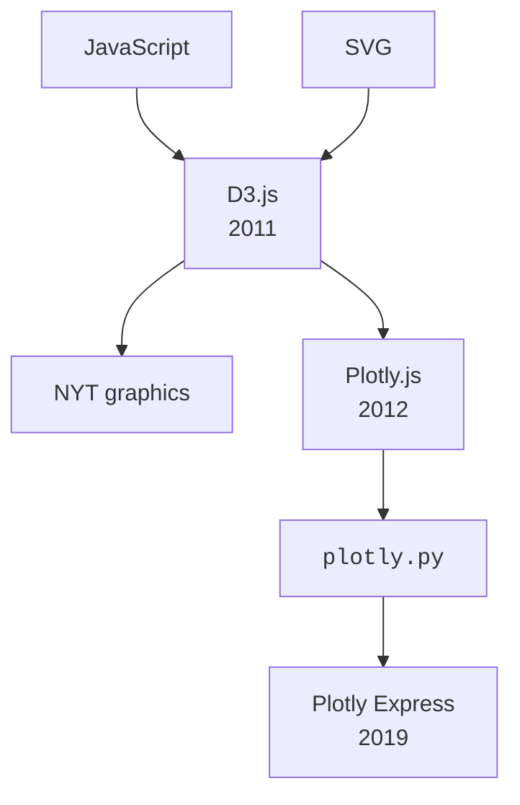
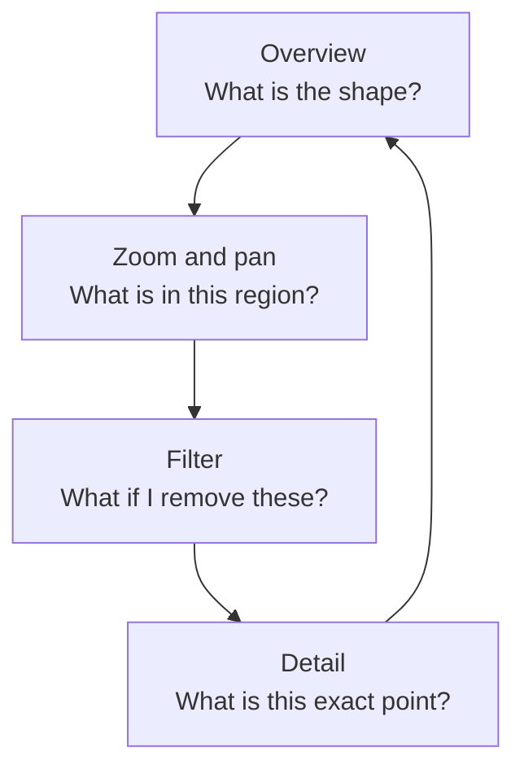

In the previous chapter we left the story in the early 2000s, with
dashboards taking over the corner office and Tableau changing how
analysts thought about charts. This chapter is about what happened
*next* — and especially about a small idea that turned out to be
much bigger than anyone expected: **the chart you can touch**.

<svg
  viewBox="0 0 640 230"
  role="img"
  aria-label="A value lifts out of a flat spreadsheet grid and floats above it as a glowing dot with touch ripples — the chart you can touch"
  style={{ display: "block", width: "100%", maxWidth: "640px", height: "auto", margin: "2.5rem auto" }}
>
  <g fill="currentColor" opacity="0.18">
    <rect x="96" y="60" width="54" height="26" rx="4" />
    <rect x="158" y="60" width="54" height="26" rx="4" />
    <rect x="220" y="60" width="54" height="26" rx="4" />
    <rect x="282" y="60" width="54" height="26" rx="4" />
  </g>
  <g fill="currentColor" opacity="0.1">
    <rect x="96" y="92" width="54" height="26" rx="4" />
    <rect x="158" y="92" width="54" height="26" rx="4" />
    <rect x="220" y="92" width="54" height="26" rx="4" />
    <rect x="96" y="124" width="54" height="26" rx="4" />
    <rect x="158" y="124" width="54" height="26" rx="4" />
    <rect x="220" y="124" width="54" height="26" rx="4" />
    <rect x="282" y="124" width="54" height="26" rx="4" />
    <rect x="96" y="156" width="54" height="26" rx="4" />
    <rect x="158" y="156" width="54" height="26" rx="4" />
    <rect x="220" y="156" width="54" height="26" rx="4" />
    <rect x="282" y="156" width="54" height="26" rx="4" />
  </g>
  <g style={{ color: "var(--ds-blue-500)" }} fill="currentColor">
    <rect x="282" y="92" width="54" height="26" rx="4" fillOpacity="0.35" />
    <circle cx="356" cy="96" r="3" fillOpacity="0.4" />
    <circle cx="378" cy="84" r="3.5" fillOpacity="0.45" />
    <circle cx="400" cy="72" r="4" fillOpacity="0.5" />
    <circle cx="448" cy="72" r="13" />
    <path d="M424 72 a24 24 0 1 0 48 0 a24 24 0 1 0 -48 0 Z M429 72 a19 19 0 1 0 38 0 a19 19 0 1 0 -38 0 Z" fillRule="evenodd" fillOpacity="0.3" />
    <path d="M414 72 a34 34 0 1 0 68 0 a34 34 0 1 0 -68 0 Z M418 72 a30 30 0 1 0 60 0 a30 30 0 1 0 -60 0 Z" fillRule="evenodd" fillOpacity="0.13" />
  </g>
  <g style={{ color: "var(--ds-green-500)" }} fill="currentColor">
    <circle cx="530" cy="150" r="6" fillOpacity="0.7" />
    <circle cx="552" cy="138" r="4" fillOpacity="0.5" />
  </g>
</svg>

## The static century

For most of the history of statistical graphics, charts were
**static**. Playfair's line charts were ink on paper. Nightingale's
rose diagram was a foldout in a parliamentary report. Excel
charts, even into the late 1990s, were essentially small pictures
embedded in a spreadsheet. You could look at them — you could not
*ask* them anything.

This is not a small limitation. A static chart says:

> "Here is what I, the author, decided was important."

That is sometimes exactly what you want. Newspaper graphics, slide
decks, printed reports — all are static, and they need to be,
because the author and the reader are not in the same room.

But during *analysis* — when *you* are the author and the reader —
a static chart is a constant frustration. You see something
suspicious in a corner of the plot and you want to **zoom in**.
You want to know exactly which country that dot represents. You
want to *hide* one of the series and see what the others look like.
With a static chart, you cannot. You have to go back, edit the
code, regenerate the picture, and hope you asked the right
question this time.

## The Web changes everything

In the late 1990s and 2000s, two technologies arrived that quietly
made every chart on every webpage *interactive-capable*:

- **SVG** (Scalable Vector Graphics) — a way to draw shapes that
  scale crisply at any resolution and can respond to mouse and
  touch events.
- **JavaScript** — the browser's universal scripting language,
  which can react to user input in real time.

In 2011, **Mike Bostock** released **D3.js** — a JavaScript library
for binding data to SVG elements. D3 was extraordinarily powerful
and extraordinarily *hard*: producing a single chart could take
hundreds of lines of code. It became the foundation of nearly
every interactive newspaper graphic (New York Times, FiveThirtyEight,
The Pudding) for the next decade.

D3 was the *engine* of the modern interactive era. But it was an
engine that required a mechanic. The next 10 years were spent
building friendlier wrappers around it — and Plotly was one of
the most important.

## Interactivity is not a gimmick

It is tempting to think of interactivity as a *nice extra* —
something you turn on to impress executives. It is not. A truly
interactive chart changes the **cognitive workload** of analysis
in fundamental ways:

1. **Overview first, details on demand.** You see the *whole
   shape* of the data, then drill into the part that interests
   you. (This is the title of a famous 1996 paper by Ben
   Shneiderman that defined modern interactive visualization.)
2. **You can ask follow-up questions without writing code.** Hover.
   Zoom. Filter. Each interaction is a tiny ad-hoc query.
3. **You catch mistakes faster.** A weird outlier in a static
   chart is a mystery; in an interactive chart, you hover and
   instantly see "Oh, that's a typo in the data."
4. **You share *exploration*, not just *conclusions*.** A
   colleague opens your interactive chart and *does the
   exploration themselves*, often finding something you missed.

This loop — **overview, zoom, filter, detail, repeat** — is the
rhythm of modern exploratory data analysis. It works in your head
*much* faster than the equivalent loop with static charts and
code edits.

## A first taste of interactivity

You have already seen interactive Plotly charts in this course —
every chart so far has been pannable, zoomable, and hoverable.
Let's slow down and *notice* the interactivity.

<CodeBlock
  adapter="python"
  files={[
    {
      filename: "main.py",
      starterCode: `import plotly.express as px

# A small built-in dataset of restaurant tips.
df = px.data.tips()

fig = px.scatter(
    df,
    x="total_bill",
    y="tip",
    color="sex",
    symbol="smoker",
    template="simple_white",
    title="Restaurant tips vs total bill",
    labels={"total_bill": "Total bill (USD)", "tip": "Tip (USD)"},
)
fig.show()
`,
    },
  ]}
/>

Try this in the chart above:

1. **Hover** over any point. You'll see exact values pop up.
2. **Click "Male"** in the legend — only female tippers remain.
3. **Click "Male" again** — both groups return.
4. **Click-and-drag** a rectangle inside the chart — Plotly zooms
   into that region. Double-click to reset.
5. **Look at the top-right toolbar.** There's a download button
   that saves a PNG, a "zoom" button, a "pan" button, and more.

Every one of those interactions is a *question you asked the
chart*. None of them required you to re-run the code. This is what
the modern era of analytics is built on.

## The role of dashboards

The other consequence of interactivity is the modern **dashboard**.
A dashboard is just a collection of charts on one page, often
linked so that filtering one chart filters the others. Done well,
a dashboard lets a manager *answer their own questions* in
real time. Done badly — and most are done badly — it becomes a
"wall of charts" that nobody understands.

We will spend an entire chapter on dashboard intuition later. For
now, the headline is: **dashboards are interactive, multi-chart
documents**. They are not magic. The same rules of good
visualization apply.

## Why Python landed at the center

Through the 2010s, a curious thing happened. The *web* had become
the universal interactive surface. *JavaScript* was the universal
web language. But the *analysts* doing the work — biologists,
economists, marketers, journalists — wrote in **Python**.

The natural solution was a Python library that *produced*
interactive web charts. There were several attempts. The one that
won — for an exploratory, low-friction workflow — was **Plotly
Express**, which we will meet properly in the next chapter.

## Check your understanding

<MultipleChoice
  markdown={`Ben Shneiderman's famous "visual information seeking mantra" is sometimes phrased as which of the following?

- "Always show a pie chart first."
  > Shneiderman's mantra is about the sequence of interaction in an analytical interface, not about which chart type to use first.
- [o] "Overview first, zoom and filter, then details on demand."
  > This 1996 phrase defines the loop of modern interactive analysis: see the whole, narrow down, then inspect specifics. Every good interactive chart supports this loop.
- "Show conclusions, hide data."
  > Shneiderman's mantra is about the *process of exploration*, not about hiding the underlying data; hiding data would undermine rather than support good analysis.
- "One chart per page, no exceptions."
  > Shneiderman's principle concerns the sequence of interaction — starting with an overview and drilling down — not a rule about chart density per page.

If you remember one rule about interactive design, make it this one.`}
/>

<MultipleChoice
  markdown={`Why is **interactivity** more than a cosmetic feature for analytical work?

- It makes charts look more professional.
  > Professionalism is a side effect, not the substantive benefit; a static chart can look just as polished, but cannot support the interactive exploration loop that changes how analysis is done.
- It allows charts to animate.
  > Animation is one specific form of interactivity, not the core benefit; the fundamental value is that the viewer can explore the data themselves rather than being limited to what the author anticipated.
- [o] It lets the *viewer* ask follow-up questions — hover for detail, filter to subsets, zoom into regions — without re-running code.
  > Interactivity changes the *cognitive workload* of analysis. A static chart can only answer the questions the author anticipated; an interactive chart can answer the questions the viewer discovers on the spot.
- It is required by web browsers.
  > Web browsers have no such requirement; static SVG or PNG images display perfectly in any browser, and interactivity is a deliberate enhancement, not a browser prerequisite.

The exploratory loop "overview → zoom → filter → detail" is dramatically faster with interactive charts than with static ones.`}
/>

<MultipleChoice
  markdown={`Which JavaScript library, released in 2011, became the foundation of most modern interactive data graphics on the web?

- jQuery
  > jQuery (released in 2006) is a DOM-manipulation and AJAX library, not a data visualization library; it was not designed for binding data to graphical elements.
- React
  > React (released in 2013) is a UI component library for building web interfaces; it was not the library that pioneered data-driven interactive graphics on the web.
- [o] D3.js
  > D3 (Data-Driven Documents) by Mike Bostock pioneered the idea of binding data to SVG elements with full control over rendering. Plotly.js is built on top of D3, and many newspaper graphics teams still use D3 directly.
- TensorFlow.js
  > TensorFlow.js is a machine-learning library for running neural networks in the browser; it was not released in 2011 and is not a data visualization library.

Plotly Express in Python eventually compiles down to Plotly.js, which itself uses D3 — so when you make a Plotly chart in Python, you are standing on this stack.`}
/>

<MultipleChoice
  markdown={`Which of the following is **NOT** a benefit of interactive visualizations during exploratory data analysis?

- You can hover over points to see exact values.
  > Hovering to see exact values is a real and direct benefit — it removes the need to look up individual data points in a table.
- You can zoom into a region of interest.
  > Zooming is a core interactive feature that supports the "overview → detail" exploration loop, letting the analyst focus on a dense cluster or a specific time window.
- You can filter series by clicking the legend.
  > Legend-click filtering lets the viewer toggle groups on and off, making it easy to compare subsets without regenerating the chart.
- [o] They guarantee that your conclusions are statistically valid.
  > This is the odd one out. Interactive charts make exploration *faster* and *richer*, but they do **not** validate your statistics. You still need careful analysis behind the visualization. Pretty interactivity will not save a bad analysis.

A chart, no matter how interactive, is a *tool for thinking*, not a substitute for thinking.`}
/>
