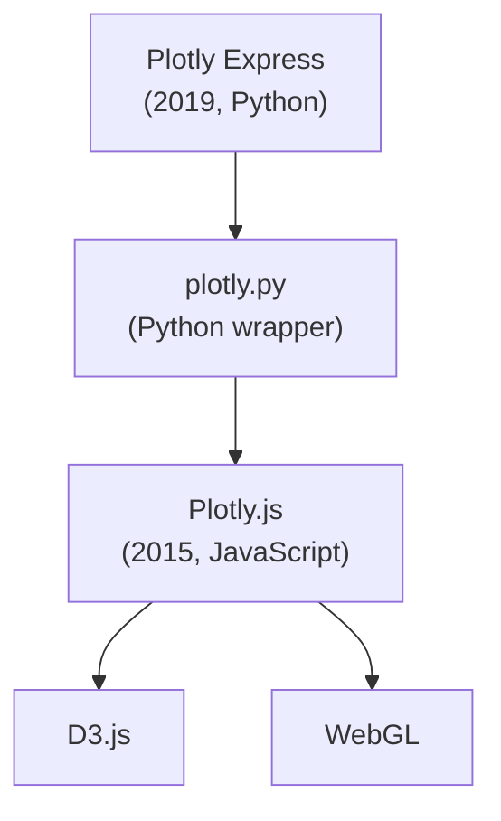

You will spend a lot of time with **Plotly** in the rest of this
course, so it's worth knowing where it came from, what it actually
is, and why **Plotly Express** in particular is the right tool for
beginners.

## A company, a library, a wrapper

The name "Plotly" can mean three different things, and people use
them interchangeably in confusing ways. Let's be precise:

- **Plotly** (the company) — a Montréal-based company founded in
  2012 by Alex Johnson, Jack Parmer, Chris Parmer, and Matthew
  Sundquist. Their original product was a web app for making
  charts collaboratively in the browser.
- **Plotly.js** — an open-source JavaScript charting library
  released by the company in **2015**, built on top of D3.js and
  WebGL. It is what actually *renders* every Plotly chart you see.
- **plotly.py** — the Python wrapper around Plotly.js, also open
  source. It lets you build interactive web charts from Python.
- **Plotly Express** — a much simpler, higher-level API on top of
  plotly.py, released in **2019** by Nicolas Kruchten.



For most of this course, when we say "Plotly," we mean **Plotly
Express**. It is the gateway drug. Almost every chart you need can
be made with one line of Plotly Express. When you outgrow it, you
can always drop down to `plotly.graph_objects` for full control —
but that day is months away.

## Why the company started

In 2012, the team at Plotly noticed something simple. Researchers
and analysts spent enormous amounts of time making the same charts
over and over again — in MATLAB, in Excel, in R, in Python — and
then *emailing screenshots* of them around. Every chart's
interactivity was lost as soon as it was shared.

Their early product was a web tool: paste a CSV, get back a chart
URL you could share with collaborators, where everyone could still
hover and zoom. It was a good idea, but it didn't catch on. What
did catch on was the **chart engine** underneath it. Researchers
wanted to embed the *engine* into their own notebooks and apps.

So Plotly open-sourced the engine. **Plotly.js** in 2015 was the
result. It is, to this day, one of the most-downloaded JavaScript
charting libraries in the world.

## The "old" Python API

The first Python wrapper (plotly.py, around 2014) was *powerful*
but verbose. A simple bar chart looked like this:

```python
import plotly.graph_objects as go

fig = go.Figure()
fig.add_trace(go.Bar(
    x=["A", "B", "C"],
    y=[10, 7, 14],
    name="Counts",
))
fig.update_layout(
    title="Counts by category",
    xaxis_title="Category",
    yaxis_title="Count",
    template="simple_white",
)
fig.show()
```

That's *nine lines* — for the most basic chart in the world. The
verbosity scared off beginners and frustrated even experienced
analysts.

## Plotly Express: one line, one chart

In 2019, Nicolas Kruchten released **Plotly Express** as a
high-level API on top of `plotly.graph_objects`. The pitch was
radical and simple:

> **A single function call, with a DataFrame as input, should
> produce a publication-quality interactive chart.**

The bar chart above becomes:

```python
import plotly.express as px

px.bar(df, x="category", y="count",
       title="Counts by category",
       template="simple_white")
```

That's *one* line of meaningful code. Try it:

<CodeBlock
  adapter="python"
  starterCode={`import pandas as pd
import plotly.express as px

df = pd.DataFrame(
    {
        "category": ["A", "B", "C", "D", "E"],
        "count": [10, 7, 14, 4, 11],
    }
)

fig = px.bar(
    df,
    x="category",
    y="count",
    title="Counts by category",
    template="simple_white",
)
fig.show()
`}
/>

The chart that came out is *fully* interactive. You can hover, zoom,
download. There are no sacrifices for the brevity.

## What makes Plotly Express different

Three design choices set Plotly Express apart from other Python
chart libraries:

1. **It takes a DataFrame and *column names***, not arrays. You
   write `x="category"`, not `x=df["category"]`. This makes the
   code read more like a *sentence* about your data.
2. **Encodings are arguments.** Want to add color? Pass `color="..."`.
   Want to facet into small multiples? Pass `facet_col="..."`. The
   *grammar* is uniform across every chart type.
3. **It produces interactive charts by default.** Every output is
   pannable, zoomable, hoverable. You don't have to opt in.

The whole flow is one line: a **DataFrame** goes into a call like
`px.bar` / `px.line` / `px.scatter`, encodings ride along as arguments
(`x=`, `y=`, `color=`, `size=`, `facet_col=`, ...), and out comes an
interactive Plotly figure you can hover, zoom, and download.

## Plotly Express's place in the ecosystem

You will hear about other Python chart libraries. Here's a fair
summary:

- **Matplotlib** — the foundational, static plotting library.
  Excellent for *publication* (papers, books) and total
  customization. Verbose; not interactive by default.
- **Seaborn** — a high-level wrapper around Matplotlib, focused on
  *statistical* charts. Beautiful defaults; not interactive.
- **Altair** — a declarative chart library based on Vega-Lite.
  Elegant grammar; produces interactive web charts.
- **Bokeh** — another interactive web chart library, popular in
  scientific computing.
- **Plotly Express** — the easiest path from DataFrame to
  *interactive* chart. The choice for this course.

There is no single "best" library. Plotly Express is the right
*beginner* library because it gives you the modern interactive
experience with the fewest lines of code. Once you're comfortable,
you can branch out — and many real teams use two or three of these
libraries side by side.

## A peek at what's possible

Here is a more substantial chart to give a sense of Plotly Express's
range:

<CodeBlock
  adapter="python"
  starterCode={`import plotly.express as px

df = px.data.gapminder()

fig = px.scatter(
    df.query("year == 2007"),
    x="gdpPercap",
    y="lifeExp",
    color="continent",
    size="pop",
    hover_name="country",
    log_x=True,
    size_max=55,
    template="simple_white",
    title="Life expectancy vs GDP per capita (2007)",
    labels={
        "gdpPercap": "GDP per capita (USD, log)",
        "lifeExp": "Life expectancy (years)",
    },
)
fig.show()
`}
/>

That's one Plotly Express call. The chart maps four variables at
once (GDP, life expectancy, continent, population), uses a log scale,
labels axes properly, and produces a fully interactive web chart.
That density of meaning per line of code is what makes Plotly
Express the right beginner tool.

## Check your understanding

<MultipleChoice
  markdown={`What is the *relationship* between Plotly Express and Plotly.js?

- They are two unrelated libraries that happen to share a name.
- Plotly Express is a different programming language.
- [o] Plotly Express is a high-level Python API on top of plotly.py, which is a Python wrapper around the Plotly.js JavaScript library.
  > When you call **px.bar(...)** in Python, Plotly Express builds a configuration object, plotly.py serializes it, and Plotly.js renders the interactive chart in the browser. You write Python, the browser executes JavaScript — invisible to you.
- Plotly.js is a fork of Plotly Express.

This three-layer stack (Plotly Express → plotly.py → Plotly.js) is invisible most of the time. You'll only notice it when something breaks.`}
/>

<MultipleChoice
  markdown={`What is the **distinguishing design idea** behind Plotly Express compared to the older **plotly.graph_objects** API?

- It is faster than plotly.graph_objects.
- It produces static images.
- [o] It is a high-level wrapper that takes a DataFrame and column names, producing a complete chart in essentially one function call.
  > Plotly Express trades fine-grained control for brevity. One line of **px.bar(df, x=..., y=...)** replaces nine lines of **graph_objects** code, and the chart is just as interactive.
- It requires a paid Plotly subscription.

Both are free and open source. When you outgrow Plotly Express, you can always drop down to **graph_objects** for fine control.`}
/>

<MultipleChoice
  markdown={`Which of the following is a chart library you might **outgrow into**, after you're comfortable with Plotly Express?

- HTML
- CSS
- [o] plotly.graph_objects — the lower-level Plotly API for full chart customization.
  > Plotly Express handles 90% of the charts you'll ever want to make, but when you need precise control — custom subplot layouts, multi-axis charts, animated transitions — you drop down to **plotly.graph_objects**. The two APIs work together seamlessly.
- JavaScript

You will rarely *have* to leave Plotly Express. When you do, **graph_objects** is the natural next step.`}
/>
