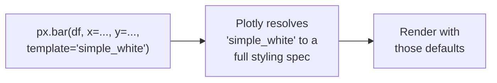

You've seen the same argument appear in every chart on every page
of this course:

```python
template="simple_white"
```

Now is a good time to stop and explain *why* — and to introduce
the larger idea of Plotly **templates**.

## What is a template?

A Plotly template is a **named bundle of default styling**: the
background color, the gridlines, the fonts, the default color
palette, the axis style, the legend position, and so on. You pick
one with the `template=` argument, and every chart you make with
that template inherits its visual identity.

Templates are *purely cosmetic*. They do not change which data is
plotted, which encodings you use, or any analytical content. They
only change how the chart *looks*.



## The built-in templates

Plotly ships with about a dozen named templates. The main ones are:

| Template | Look |
| --- | --- |
| `plotly` | The default — gray background, dotted gridlines |
| `plotly_white` | White background, blue/orange palette |
| `plotly_dark` | Dark background — good for dashboards |
| `simple_white` | Pure white, very minimal — *this course's default* |
| `ggplot2` | Mimics R's ggplot2 theme |
| `seaborn` | Mimics Python's Seaborn defaults |
| `none` | No styling at all |
| `presentation` | Larger fonts, suitable for slides |
| `gridon` | Like plotly but with extra grid |
| `xgridoff` | Disables vertical gridlines |
| `ygridoff` | Disables horizontal gridlines |

You can see them in action by changing the `template=` argument.

<CodeBlock
  adapter="python"
  initialCode={`import plotly.express as px

df = px.data.iris()

# Try changing the template name in the next line!
fig = px.scatter(
    df, x="sepal_width", y="sepal_length",
    color="species",
    template="simple_white",
    title="Iris — change the template above to see other styles",
)
fig.show()
`}
/>

Edit the code and try `"plotly"`, `"plotly_dark"`, `"ggplot2"`,
`"presentation"`, etc.

## Why this course uses `simple_white`

<Callout type="info" title="Why simple_white?">
This course uses `template="simple_white"` for every Plotly chart
because:

- **It removes visual noise.** No gray background, no heavy
  gridlines competing with the data.
- **The data is the loudest thing on the page.** That matches the
  central message of this course: charts are *for the data*.
- **It prints well.** Light background, dark ink — readable on
  paper, in slides, and on both light and dark documentation
  themes.
- **It looks professional out of the box.** No fiddling needed
  before sharing with a colleague.

**Other templates are completely valid** — `plotly_dark` is great
for dashboards, `presentation` is great for slide decks,
`ggplot2` is loved by statisticians. We use `simple_white` here for
consistency and clarity, not because it is "best."
</Callout>

## Setting a template *globally*

If you don't want to type `template="simple_white"` every time, you
can set it as the default for an entire session:

```python
import plotly.io as pio
pio.templates.default = "simple_white"
```

After that, every chart you make will use `simple_white` unless you
override it. Try it:

<CodeBlock
  adapter="python"
  initialCode={`import plotly.express as px
import plotly.io as pio

# Set the default for this code block:
pio.templates.default = "simple_white"

df = px.data.gapminder().query("year == 2007")

fig = px.scatter(
    df, x="gdpPercap", y="lifeExp", color="continent",
    log_x=True, size="pop", size_max=40,
    title="Notice: no template= argument, but it still looks clean",
    labels={"gdpPercap": "GDP per capita (USD, log)", "lifeExp": "Life expectancy"},
)
fig.show()
`}
/>

In a notebook or a script, set the default *once* near your imports
and then forget about it.

## What a template *doesn't* fix

Templates only handle *style*. They don't:

- Choose the right chart type for your data.
- Sort your bars in a sensible order.
- Add a meaningful title or axis labels.
- Decide which encodings best convey your story.

A bad chart in `simple_white` is still a bad chart. A good chart
in *any* template still communicates the story.

## Composing your own template (optional, advanced)

You can also create *partial* templates — small overrides on top
of an existing one. For example, change the default font:

```python
import plotly.io as pio
pio.templates["my_clean"] = pio.templates["simple_white"]
pio.templates["my_clean"].layout.font.family = "Helvetica, Arial, sans-serif"
pio.templates.default = "my_clean"
```

This is rarely necessary for individual analysis work, but it's
how teams enforce a consistent brand look across many notebooks
and dashboards.

## Check your understanding

<MultipleChoice
  markdown={`What does a Plotly **template** control?

- The numeric data plotted.
- Which chart type is used.
- [o] The visual styling: background, gridlines, default colors, fonts, and other purely cosmetic settings.
  > Yes. A template is a named bundle of styling defaults. It does not change any analytical content — only how the chart *looks*. Templates are layered on top of whatever encodings you've already chosen.
- Whether the chart is interactive.

Templates are pure cosmetics. Your encoding choices (`x`, `y`, `color`, ...) determine what the chart *means*.`}
/>

<MultipleChoice
  markdown={`Why does this course pick `template="simple_white"` as the default?

- It is the only template that supports interactive charts.
- It is required by Plotly Express.
- [o] It removes visual noise (no gray background, minimal gridlines), letting the data stand out — and it prints / renders cleanly on most surfaces.
  > Yes. `simple_white` is a deliberately minimal style: light background, light gridlines, clean fonts. It works well for both screen and print, and lets the encoded data be the most prominent element. Other templates (e.g., `plotly_dark`) are perfectly valid for other contexts.
- `simple_white` makes charts render faster.

Other templates are equally valid; `simple_white` was chosen here for consistency and clarity, not because it's "best."`}
/>

<MultipleChoice
  markdown={`How can you set `simple_white` as the **default template for an entire session**, so you don't have to type `template="simple_white"` on every chart?

- Pass `default=True` to your first chart.
- Rename the package.
- [o] Set `plotly.io.templates.default = "simple_white"` once near your imports.
  > Right. `plotly.io.templates.default = "..."` configures the default template for all subsequent Plotly figures in the session. You can still override it on individual charts by passing an explicit `template=`.
- Edit the Plotly source code.

In a notebook, this one line near the top saves you a lot of repetition.`}
/>
