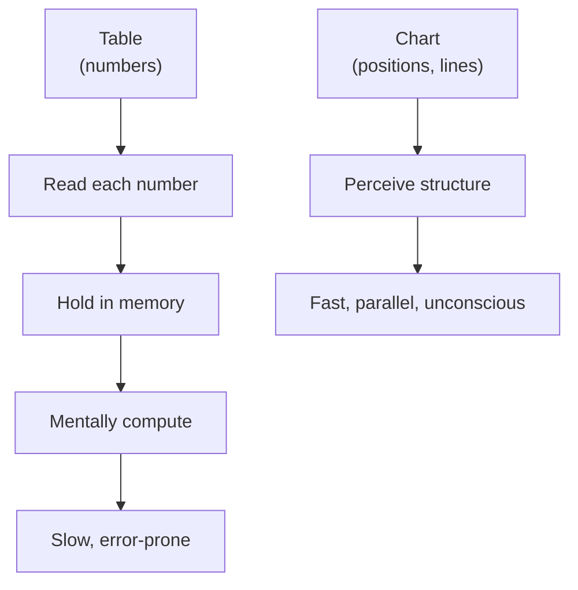

The previous chapter defined what a visualization *is*. This chapter
asks a related but distinct question: **why do we need charts at
all?** A table of numbers contains all the same information. Why
do humans, in every culture and every era, keep inventing new ways
to draw the data?

The answer is the central reason data visualization is a discipline.

## Tables make you read; charts let you see

Take 30 seconds to look at this table. It shows life expectancy in
seven countries in two years (1952 and 2007).

| Country     | 1952 | 2007 |
| ----------- | ---: | ---: |
| Afghanistan |   30 |   44 |
| Brazil      |   51 |   73 |
| China       |   44 |   73 |
| Germany     |   67 |   80 |
| Japan       |   63 |   83 |
| Norway      |   72 |   81 |
| Senegal     |   37 |   55 |

Now answer:

- Which country had the **largest gain**?
- Which countries were **already over 60** in 1952?
- Is there a country that **grew faster than China**?

You can answer all three from the table — but it takes mental
effort. Your eye has to find each number, your brain has to
remember what you found, and you have to do subtractions in your
head.

Now look at the same data as a chart:

<CodeBlock
  adapter="python"
  initialCode={`import pandas as pd
import plotly.express as px

df = pd.DataFrame({
    "country": ["Afghanistan", "Brazil", "China", "Germany",
                "Japan", "Norway", "Senegal"] * 2,
    "year": [1952]*7 + [2007]*7,
    "lifeExp": [30, 51, 44, 67, 63, 72, 37,
                44, 73, 73, 80, 83, 81, 55],
})

fig = px.line(
    df, x="year", y="lifeExp", color="country", markers=True,
    template="simple_white",
    title="Life expectancy, 1952 vs 2007",
    labels={"lifeExp": "Life expectancy (years)", "year": "Year"},
)
fig.show()
`}
/>

Now the questions are *trivial*:

- **Largest gain** = steepest line. China and Brazil leap up;
  Afghanistan is the most modest gain.
- **Already over 60 in 1952** = the dots above 60 on the left.
  Germany, Japan, Norway.
- **Grew faster than China** = a line steeper than China's. Brazil
  is competitive; none is clearly steeper.

You did not consciously compute any of those. Your eye did the
work.

## What chart is really doing

Several things are happening at once that the table cannot do:

1. **Spatial proximity** lets your eye compare adjacent values.
2. **Lines** show direction-of-change at a glance.
3. **Color** binds the same country together across the chart.
4. **Aligned axes** let your brain compare *all* countries to *all*
   other countries simultaneously.
5. **Pattern recognition** — your visual system spots the upward
   trend in essentially zero conscious time.

These are all things the visual cortex is built for and the
conscious arithmetic part of the brain is *terrible* at.

## When tables are actually better

Charts are not always the right answer. Tables win when:

- The reader needs to read **exact values** (financial statements,
  scientific reports).
- The data has **many columns** of *different* kinds (a table of
  product specs).
- The reader will **look up** specific rows ("what's the price of
  SKU 7?").
- The data is **sparse**: just a few values that don't share
  comparable units.

A good rule of thumb:

- **Looking up?** Use a table.
- **Comparing or finding patterns?** Use a chart.

Many real reports have both — a chart for the *story* and a table
below it for *the receipts*.

## Charts as cognitive offloading

Researchers in cognition use the phrase **"cognitive offloading"**
for tools that move some of the work of thinking out of the brain
and into the world. A grocery list is cognitive offloading: you
don't try to remember every item, you read them off paper.

A chart is the same idea, applied to data. The chart "remembers"
the data values for you, *and* arranges them so that your visual
system can do certain comparisons automatically. The brain only
has to do the *interesting* part of the thinking.

This is also why charts are so good for **collaboration**. If you
and a colleague are both looking at the same chart, you are
*sharing* the same offloaded thinking. You can point at a peak
and say "look at *that*." You can't do that with two columns of
numbers in a spreadsheet.

## Why charts are sometimes *worse* than tables

Beginners sometimes hear "charts are better than tables" as a
universal rule. They aren't. Charts have failure modes too:

- **They round.** A bar chart with values 99 and 101 looks
  identical to one with 100 and 100. The eye can't see a 2%
  difference; a table can.
- **They mislead with bad encodings.** A 3-D pie chart can make the
  same number look bigger or smaller depending on the angle.
- **They invite over-interpretation.** Seeing a "trend" in three
  data points is easy — and often wrong.
- **They impose a frame.** The author's choice of axes, colors, and
  scales shapes how the data is read.

The honest rule isn't "charts beat tables." It's "**charts and
tables are different tools for different jobs.** Pick the one that
answers the question."

## Check your understanding

<MultipleChoice
  markdown={`Why are charts often easier to read than tables of numbers?

- Charts always show more data than tables.
- Charts use less memory than tables.
- [o] Charts let the human visual system perceive patterns in parallel — comparisons of position, length, and slope happen almost instantly without conscious effort.
  > Yes. The visual cortex is optimized for exactly the kinds of comparisons charts make easy (which is taller? which is rising fastest?). The conscious arithmetic part of the brain is slow at these tasks; the visual system does them in milliseconds.
- Charts are required by law.

This is **cognitive offloading**: the chart does some of the comparison work for you, freeing your mind for higher-level interpretation.`}
/>

<MultipleChoice
  markdown={`Which of the following is a case where a **table** is probably better than a chart?

- Comparing trends in revenue across 12 quarters.
- Showing the distribution of customer ages.
- [o] An invoice listing each line item with its exact price.
  > Right. When the reader needs exact, individual values that they will *look up* (not compare), a table is the right tool. A chart of invoice line items would obscure the precise dollars and cents that matter to accounting.
- Showing how two variables relate to each other.

Tables for look-up; charts for patterns. Many good reports use both.`}
/>

<MultipleChoice
  markdown={`Which is **NOT** a legitimate failure mode of charts that tables don't share?

- Rounding away small but important differences.
- Inviting over-interpretation of short trends.
- Imposing the author's framing through axes and colors.
- [o] Always being slower to read than tables.
  > This is the odd one out. Charts are typically *much faster* to read than tables for pattern-finding tasks. The other three are real failure modes: charts can hide small differences, suggest spurious trends, and reflect the author's framing more strongly than a raw table.

Being honest about the limits of each tool is what separates competent analysts from naïve ones.`}
/>

<MultipleChoice
  markdown={`What does "cognitive offloading" mean in the context of data visualization?

- Using a computer to do calculations.
- Writing notes by hand.
- [o] Moving some of the work of thinking — remembering values, comparing them — out of the brain and into an external representation like a chart.
  > Yes. A chart "remembers" data values for you and *arranges* them so the visual system can compare them automatically. Your mind is left free for higher-level interpretation: *why* is this trend happening, *what* should we do about it.
- Forgetting things on purpose.

Cognitive offloading is one of the deep reasons charts have spread so widely as a cultural technology. It's the same reason we use shopping lists and to-do apps.`}
/>
