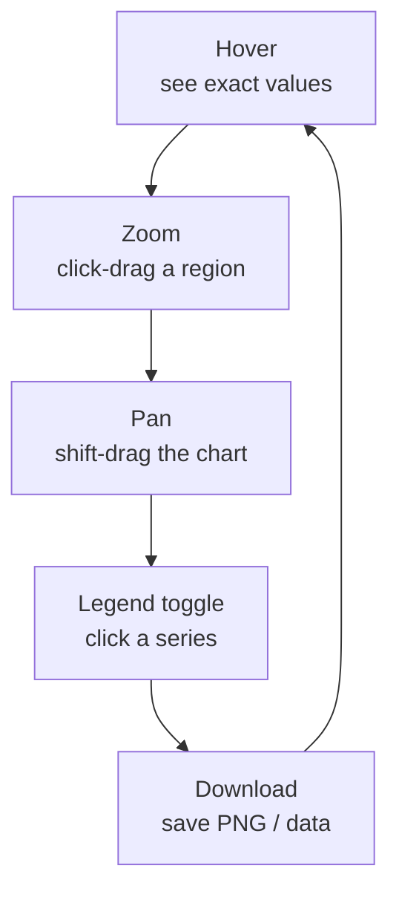

We touched on interactivity in an earlier chapter. This one is
a deeper look — because **the shift from static to interactive
charts is the single most important change** in how data analysis
is done today. If you only take one concept from the first half of
this course, take this one.

## Static charts are a *summary*. Interactive charts are a *medium*.

A static chart is a finished product. The author has done the
analysis, drawn the most important picture, and frozen it. The
reader can look at it, but they cannot interrogate it.

An interactive chart is *not* a finished product. It is a small
analytical environment. The author has chosen what data to show
and what encodings to use, but the reader can still:

- **Hover** to read exact values.
- **Zoom** to focus on a subregion.
- **Pan** to scroll across a long time series.
- **Filter** by clicking legend entries.
- **Brush** to highlight a subset and see it carried across linked
  panels.
- **Toggle** between linear and log axes.
- **Download** the chart as a PNG or the data as a CSV.

Each of these is a *question* the reader can ask without writing
any code.

## The five interactions every Plotly chart supports

Out of the box, every chart Plotly Express produces supports five
key interactions:

Try every one of them on this chart:

<CodeBlock
  adapter="python"
  starterCode={`import plotly.express as px

df = px.data.gapminder().query("continent == 'Asia'")

fig = px.line(
    df,
    x="year",
    y="lifeExp",
    color="country",
    template="simple_white",
    title="Life expectancy in Asia, 1952 – 2007 (hover, zoom, click legend)",
    labels={"lifeExp": "Life expectancy (years)", "year": "Year"},
)
fig.show()
`}
/>

Things to try:

1. **Hover** over any line. The tooltip shows year, country, and
   exact life expectancy.
2. **Click "Afghanistan"** in the legend. Afghanistan's line
   disappears. Click again, it returns.
3. **Double-click "Afghanistan"** — now *only* Afghanistan is
   visible.
4. **Click-and-drag** a rectangle to zoom in on a year range or a
   life-expectancy band. Double-click to reset.
5. Try the **mode bar** in the top-right — toggle between zoom,
   pan, and lasso, or download a PNG.

These five gestures are not "features" of this chart. They are
features of *every* Plotly chart, free.

## Overview-first, details-on-demand

We mentioned **Ben Shneiderman's mantra** earlier:

> Overview first, zoom and filter, then details on demand.

Interactive charts make this mantra mechanical. The default view is
the *overview*. The hover tooltip gives *details on demand*. The
legend and zoom give *filter* and *zoom*. The cycle takes seconds
instead of minutes.

This loop is what separates **exploration** from **presentation**:

- **Exploration** is about *you* discovering the structure of the
  data. You want everything interactive, everything quick. Plotly
  Express + a Jupyter notebook is the ideal.
- **Presentation** is about *another person* understanding what
  *you* found. Sometimes that's still an interactive chart;
  sometimes it's a single, static, hand-tuned image.

A frequent mistake is mixing these up: presenting a 15-chart
exploratory dashboard to an executive who has 30 seconds, or
publishing a beautiful static infographic when what the analyst
needed was a quick scatter to filter.

## Linked views and "brushing"

A more advanced (and powerful) interactive idea is **linked views**.
You have two or three charts side by side, and when you select a
subset in one, the others **highlight or filter** the same rows.

Plotly Express supports a piece of this through **facets** (which
we'll meet later) and **selection events** in full dashboard
frameworks like Dash. For now, just remember: "linked brushing" is
why a dashboard with two related charts can be *vastly* more
informative than two charts on separate pages.

## A common worry: "isn't interactive a distraction?"

When people first see interactive charts, a reasonable worry is:
*aren't all these buttons distracting?* Sometimes yes. There are
contexts (slide decks, printed reports) where static is better.
There are also charts where the interactivity adds nothing
meaningful.

The good news: Plotly Express lets you **simplify or remove the
interactivity** when you don't want it. You can hide the mode bar,
disable specific gestures, or export to a static PNG. We will
cover those tricks in the chapter on best practices.

## Why this matters now, before you write more code

Most beginners think of interactivity as a bonus. **They write the
code, see a chart, and think "nice, it has hover."** They then
treat it like a static chart anyway, taking a screenshot and pasting
it into a slide.

This course wants you to do the opposite. **Treat interactivity as
the default analytical surface.** Every chart you make should be
hovered, zoomed, and clicked *while you're still writing the
analysis.* You will catch bugs, find outliers, and develop
questions far faster than you would with a screenshot.

## Check your understanding

<MultipleChoice
  markdown={`What does "overview first, zoom and filter, then details on demand" describe?

- A SQL query optimization strategy.
- A type of Plotly chart.
- [o] A foundational rhythm for interactive data exploration — first see the whole, then narrow down, then inspect specifics.
  > Yes. This phrase from Ben Shneiderman (1996) captures how an analyst uses an interactive chart in practice: get the gestalt of the data, then drill into the interesting subset, then look at exact values. Plotly Express supports every step of this loop out of the box.
- A type of database index.

The Plotly mode bar (zoom, pan, lasso, reset) and the hover tooltip together implement this mantra mechanically.`}
/>

<MultipleChoice
  markdown={`Which of the following is **NOT** a built-in interaction in a default Plotly Express chart?

- Hovering over points to see values.
- Click-dragging to zoom into a region.
- Clicking a legend item to hide a series.
- [o] Editing the data values by clicking a bar and typing a new value.
  > This is the odd one out. Plotly charts are read-only by design. You can hover, zoom, pan, filter via legend, and download — but you cannot edit the underlying data through the chart. If you want editable charts you need a dashboard framework like Plotly Dash with form widgets.

Read-only interactivity is enough for 95% of analytical work. The other 5% is what dashboard frameworks exist for.`}
/>

<MultipleChoice
  markdown={`When is a *static* chart usually a better choice than an interactive one?

- When you are exploring data for the first time.
- When you have hundreds of overlapping points to investigate.
- [o] When the chart will be printed, slide-projected, or published in a context where the reader cannot interact with it.
  > Right. Print, slides, PDFs, and many newsletter formats render only a static snapshot. For those contexts you want every important detail visible *in the image itself* — labels, annotations, callouts — because the reader cannot hover or zoom.
- When you don't know what your data looks like yet.

Interactive charts are the default for *exploration* and *digital* presentation; static charts are the default for *print* and *broadcast*.`}
/>

<MultipleChoice
  markdown={`What is **linked brushing** in interactive visualization?

- A keyboard shortcut for pan.
- A way to format chart text.
- [o] Selecting a subset of rows in one chart and seeing the same rows highlighted (or filtered) in another linked chart.
  > Yes. Linked brushing — when two or more charts share a selection — is enormously powerful because the same observation can be looked at through several lenses simultaneously. Plotly Dash and other dashboard frameworks make this easy; we'll touch on it briefly in the dashboard chapter.
- A way to draw on top of a chart.

You won't need linked brushing for most beginner analysis, but it's good to know the term — you'll meet it again in any serious dashboard course.`}
/>
