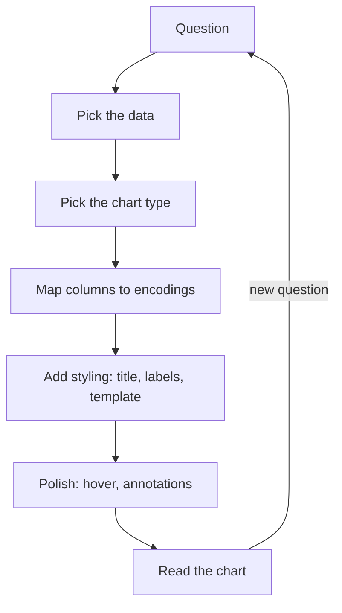

We're going to slow down and build a single chart together, one
decision at a time. You've seen many charts so far; this page is
about the *process* of arriving at one. By the end, you should
feel ready to make a chart from any dataset placed in front of you.

## The data

We'll use Plotly's built-in `tips` dataset — restaurant tip data
collected by a single waiter over a few weeks. It is small,
relatable, and has both numeric and categorical columns.

<CodeBlock
  adapter="python"
  starterCode={`import plotly.express as px

df = px.data.tips()

print(df.head())
print()
print("Shape:", df.shape)
print("Columns:", list(df.columns))
`}
/>

You should see columns like `total_bill`, `tip`, `sex`, `smoker`,
`day`, `time`, `size`.

## The question

Before any chart, ask: **what question am I trying to answer?**
Let's pick a concrete one:

> *Do bigger restaurant bills lead to bigger tips, and does it
> matter whether the customer is a smoker?*

This is two questions, really:

1. Is there a relationship between `total_bill` and `tip`?
2. Does that relationship differ for smokers vs non-smokers?

## Choosing the chart type

Walk through the data types:

- `total_bill` — quantitative.
- `tip` — quantitative.
- `smoker` — categorical (Yes / No).

When we have *two quantitative* variables, a **scatter plot** is
almost always the right starting point. (Lines connect points; we
only want lines when there's a meaningful order, like time.)

The third variable (`smoker`) is categorical and small (just two
groups), so we'll map it to **color**.

## Building it up step by step

We'll add encodings one at a time so you can see each one earn its
place.

### Step 1: bare scatter

<CodeBlock
  adapter="python"
  starterCode={`import plotly.express as px

df = px.data.tips()

fig = px.scatter(df, x="total_bill", y="tip", template="simple_white")
fig.show()
`}
/>

This is the absolute minimum. We can already see that yes, bigger
bills tend to come with bigger tips — there's a clear upward
cloud. But the chart is anonymous: no title, no axis labels, no
groups.

### Step 2: add color for smokers

<CodeBlock
  adapter="python"
  starterCode={`import plotly.express as px

df = px.data.tips()

fig = px.scatter(df, x="total_bill", y="tip", color="smoker", template="simple_white")
fig.show()
`}
/>

Now we can compare. Hover and toggle the legend (click "Yes" or
"No"). Do the two clouds look different? Maybe slightly; nothing
dramatic.

### Step 3: add a regression line per group

<CodeBlock
  adapter="python"
  starterCode={`import plotly.express as px

df = px.data.tips()

fig = px.scatter(
    df,
    x="total_bill",
    y="tip",
    color="smoker",
    trendline="ols",
    template="simple_white",
)
fig.show()
`}
/>

With `trendline="ols"`, Plotly Express fits an ordinary-least-
squares line to each color group. Suddenly the question "is the
relationship different?" gets a visual answer: the two lines'
slopes are similar — bigger bills predict bigger tips at roughly
the same rate for both groups.

### Step 4: title, labels, and the simple_white template

A chart without labels is rude to its readers.

<CodeBlock
  adapter="python"
  starterCode={`import plotly.express as px

df = px.data.tips()

fig = px.scatter(
    df,
    x="total_bill",
    y="tip",
    color="smoker",
    trendline="ols",
    template="simple_white",
    title="Tip vs total bill, split by smoker status",
    labels={
        "total_bill": "Total bill (USD)",
        "tip": "Tip (USD)",
        "smoker": "Smoker?",
    },
)
fig.show()
`}
/>

The chart now communicates without needing any external context:

- The **title** says what's being shown.
- The **axis labels** carry units (USD).
- The **legend** has a friendly label ("Smoker?").
- The **template** (`simple_white`) gives a clean look that won't
  fight the data.

### Step 5: a finishing touch — hover information

The default hover already shows the x and y values. Let's enrich
it with the party size and the day, so a single hover tells the
whole story of a row.

<CodeBlock
  adapter="python"
  starterCode={`import plotly.express as px

df = px.data.tips()

fig = px.scatter(
    df,
    x="total_bill",
    y="tip",
    color="smoker",
    trendline="ols",
    template="simple_white",
    title="Tip vs total bill, split by smoker status",
    labels={
        "total_bill": "Total bill (USD)",
        "tip": "Tip (USD)",
        "smoker": "Smoker?",
    },
    hover_data=["day", "time", "size"],
)
fig.show()
`}
/>

Now hover over any dot. You'll see the bill, tip, smoker status,
day, time, and party size in one tooltip. The chart has become a
*small interactive analytical tool*, not just a picture.

## The pattern, summarized

Every chart you build in this course follows roughly the same
recipe:

The loop closes: a good chart almost always raises a *new*
question, which sends you back to the top of the loop.

## Common first-chart mistakes

1. **Skipping the question.** "I'll just plot it and see" can be
   exploratory, but never call that chart "the answer." Always
   know what you're asking.
2. **No labels.** A chart with axes `x` and `y` is unfinished.
3. **Default styling.** The default Plotly template has a gray
   background and gridlines that fight your data. Use
   `template="simple_white"` from the start.
4. **Encoding everything.** Color, size, shape, faceting — all at
   once produces visual mush. Add encodings one at a time and
   stop when the question is answered.

## Try it yourself

Modify the chart below to:

1. Use `x="size"` (party size) and `y="tip"` instead.
2. Color by `day` instead of `smoker`.
3. Update the title and labels accordingly.

<CodeBlock
  adapter="python"
  starterCode={`import plotly.express as px

df = px.data.tips()

fig = px.scatter(
    df,
    x="total_bill",
    y="tip",
    color="smoker",
    template="simple_white",
    title="Tip vs total bill, split by smoker status",
    labels={"total_bill": "Total bill (USD)", "tip": "Tip (USD)"},
)
fig.show()
`}
/>

## Check your understanding

<MultipleChoice
  markdown={`What should be the **first** step when starting a new chart?

- Pick a color palette.
- Pick a chart type.
- [o] Decide what *question* the chart will answer.
  > Without a clear question, every later choice becomes arbitrary. The question shapes the data filtering, the chart type, and the encoding decisions. "Pretty" charts that don't answer a question are decoration, not analysis.
- Pick a template.

Build the muscle: *question first, chart second*. Every time.`}
/>

<MultipleChoice
  markdown={`You have two **quantitative** variables and want to see if they're related. Which chart type is the natural starting point?

- Pie chart.
- Bar chart.
- [o] Scatter plot (**px.scatter**).
  > Scatter plots use the two most accurate encodings (x and y position) for the two quantitative variables. They reveal correlation, clusters, and outliers at a glance.
- Heatmap.

A line chart would be wrong here unless the data has a meaningful *order* (like time). Otherwise, lines connecting unrelated points are misleading.`}
/>

<MultipleChoice
  markdown={`Why is **labels={...}** worth adding to a Plotly Express call?

- It makes the chart load faster.
- It changes the data values.
- [o] It overrides the raw column names with human-readable labels (e.g., "Total bill (USD)" instead of "total_bill") for axes, legend, and hover.
  > Real-world column names are often abbreviated or snake_cased. **labels={}** lets you keep the code referencing the column name but display readable strings to the reader. A small habit that hugely improves chart clarity.
- It hides the legend.

A chart with raw column names like **gdpPercap** and **lifeExp** reads as unfinished. Take the extra 20 seconds to label.`}
/>
