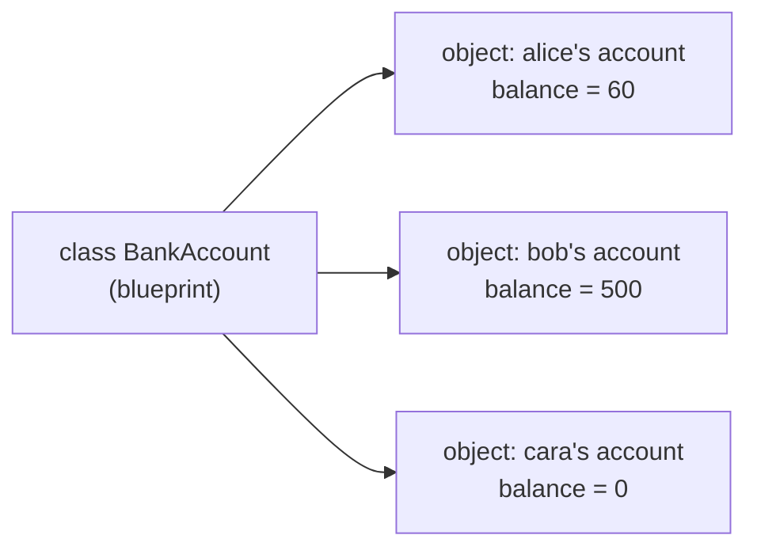
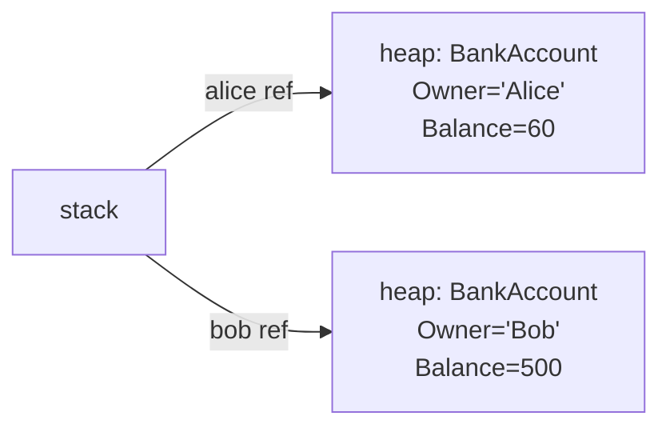

Up to now, our programs have been **variables + methods**. Data
lived in one place; the code that worked on it lived in another.

That works fine for small examples. But as a program grows, the
gap between "the data" and "the rules about that data" becomes a
real problem. If a `BankAccount` is "a `double balance` plus a
bunch of rules about how it can change," what stops some unrelated
piece of code from just writing `balance = -9999` and breaking
everything?

The answer is the **class** — a way to bundle data and the
behavior that owns it into a single unit.

## A program of just variables and methods

<CodeBlock
  adapter="csharp"
  initialCode={`using System;

double balance = 0;

void Deposit(double amount) { balance += amount; }
void Withdraw(double amount) { balance -= amount; }

Deposit(100);
Withdraw(40);
Console.WriteLine(balance);   // 60
`}
/>

It works. But it represents *one* account. If we needed two
accounts, we'd have to invent `balance1`, `balance2`, and a
`Deposit1`, `Deposit2`... which is ridiculous. We need a way to
say "an account is a *kind of thing*, and I can have as many as I
want."

## A class is a blueprint

A **class** describes what every *instance* of a thing should
look like and what it should be able to do.

An **object** is an actual instance built from that blueprint.

The class is the *idea* of a bank account. The objects are the
actual accounts.

## Our first class

<CodeBlock
  adapter="csharp"
  initialCode={`using System;

public class BankAccount
{
    public string Owner;
    public double Balance;

    public void Deposit(double amount) { Balance += amount; }
    public void Withdraw(double amount) { Balance -= amount; }
}

var alice = new BankAccount();
alice.Owner = "Alice";
alice.Deposit(100);
alice.Withdraw(40);

var bob = new BankAccount();
bob.Owner = "Bob";
bob.Deposit(500);

Console.WriteLine($"{alice.Owner}: {alice.Balance}");
Console.WriteLine($"{bob.Owner}: {bob.Balance}");
`}
/>

Read it carefully:

- `public class BankAccount { ... }` declares the blueprint.
- `Owner` and `Balance` are **fields** — data that every instance
  owns its own copy of.
- `Deposit` and `Withdraw` are **methods** that work on *this*
  instance's data.
- `new BankAccount()` creates a fresh object on the heap.
- `alice.Deposit(100)` runs `Deposit` *on `alice`* — so `Balance`
  inside the method refers to *alice's* `Balance`, not bob's.

Two objects, two independent balances, one class.

## A picture of the heap

`alice` and `bob` are *references* sitting on the stack. The
actual objects live on the heap. This is exactly the value-vs-
reference picture from the type system chapter.

## Constructors: building a valid object

Leaving fields uninitialized after `new` is a recipe for bugs.
A **constructor** is a special method that runs once, when the
object is created, and is the natural place to put initialization.

<CodeBlock
  adapter="csharp"
  initialCode={`using System;

public class BankAccount
{
    public string Owner;
    public double Balance;

    public BankAccount(string owner, double openingBalance)
    {
        Owner = owner;
        Balance = openingBalance;
    }

    public void Deposit(double amount) { Balance += amount; }
    public void Withdraw(double amount) { Balance -= amount; }
}

var alice = new BankAccount("Alice", 100);
alice.Withdraw(40);

Console.WriteLine($"{alice.Owner}: {alice.Balance}");
`}
/>

Now you cannot create a `BankAccount` without supplying an owner
and an opening balance. The class guarantees its own minimum
validity.

## `this`: the current object

Inside a method, `this` refers to "the object the method was
called on." You can usually omit it, but it's useful when a
parameter has the same name as a field.

<CodeBlock
  adapter="csharp"
  initialCode={`using System;

public class Point
{
    public double X;
    public double Y;

    public Point(double x, double y)
    {
        this.X = x;
        this.Y = y;
    }

    public double DistanceFromOrigin()
    {
        // here X and Y mean this.X and this.Y
        return Math.Sqrt(X * X + Y * Y);
    }
}

var p = new Point(3, 4);
Console.WriteLine(p.DistanceFromOrigin());   // 5
`}
/>

## Properties: smart fields

Public fields are convenient but expose your internals directly.
The idiomatic C# way to expose data is via a **property**, which
*looks* like a field at the call site but is really a pair of
methods — a `get` and a `set` — that you can later replace with
validation or computed logic without breaking callers.

<CodeBlock
  adapter="csharp"
  initialCode={`using System;

public class Person
{
    // auto-implemented property — the compiler creates a hidden field
    public string Name { get; set; } = "";
    public int Age { get; set; }

    // computed (read-only) property
    public bool IsAdult => Age >= 18;
}

var p = new Person { Name = "Ada", Age = 30 };
Console.WriteLine($"{p.Name}, adult? {p.IsAdult}");
`}
/>

We'll lean on properties heavily in the next chapter when we add
validation.

## Multi-file: a class lives in its own file

The customary convention is **one public class per file**, with
the filename matching the class name. Bigger programs naturally
grow into many files.

<CodeBlock
  adapter="csharp"
  entryFilename="Program.cs"
  files={[
    {
      filename: "Program.cs",
      initialContent: `using System;

var alice = new BankAccount("Alice", 100);
alice.Withdraw(40);
alice.Deposit(20);
Console.WriteLine($"{alice.Owner}: {alice.Balance}");
`,
    },
    {
      filename: "BankAccount.cs",
      initialContent: `public class BankAccount
{
    public string Owner { get; }
    public double Balance { get; private set; }

    public BankAccount(string owner, double openingBalance)
    {
        Owner = owner;
        Balance = openingBalance;
    }

    public void Deposit(double amount) => Balance += amount;
    public void Withdraw(double amount) => Balance -= amount;
}
`,
    },
  ]}
/>

Notice how the entry file reads like a *narrative* — "open an
account, withdraw, deposit, print" — while the rules of being a
bank account live in their own file. That separation is the whole
game.

## Practice

<ChallengeCard
  adapter="csharp"
  title="A Rectangle class"
  instructions={`Implement a \`Rectangle\` class with:

- A constructor taking \`double width, double height\`.
- Properties \`Width\` and \`Height\` (read-only after construction).
- A method \`double Area()\` returning width × height.
- A method \`double Perimeter()\` returning 2 × (width + height).

\`Program.cs\` already creates a \`Rectangle(3, 4)\` and prints exactly:

\`\`\`
area=12
perimeter=14
\`\`\``}
  entryFilename="Program.cs"
  files={[
    {
      filename: "Program.cs",
      initialContent: `using System;

var r = new Rectangle(3, 4);
Console.WriteLine($"area={r.Area()}");
Console.WriteLine($"perimeter={r.Perimeter()}");
`,
    },
    {
      filename: "Rectangle.cs",
      initialContent: `public class Rectangle
{
    // TODO: properties, constructor, Area, Perimeter
}
`,
      solutionContent: `public class Rectangle
{
    public double Width { get; }
    public double Height { get; }

    public Rectangle(double width, double height)
    {
        Width = width;
        Height = height;
    }

    public double Area() => Width * Height;
    public double Perimeter() => 2 * (Width + Height);
}
`,
    },
  ]}
  tests={[
    {
      id: "rect",
      name: "Prints area and perimeter exactly",
      expect: { stdoutLines: ["area=12", "perimeter=14"], stdoutLinesExact: true },
    },
  ]}
/>

## Test your understanding

<MultipleChoice
  markdown={`What's the difference between a class and an object?

- They are two words for the same thing
  > They're related but distinct.
- A class is created at runtime; an object is created at compile time
  > It's the opposite — classes are described in source; objects are created at runtime.
- [o] A class is a blueprint; an object is an actual instance built from that blueprint at runtime
  > One class can have any number of objects.
- A class is a value type; an object is a reference type
  > Classes are always reference types in C#, but that doesn't define the relationship.`}
/>

<MultipleChoice
  markdown={`What does a constructor do?

- It destroys the object when it's no longer needed
  > That's the GC's job (and, conceptually, a finalizer).
- [o] It runs once when the object is created, typically to initialize the object's data into a valid state
- It runs every time a method on the object is called
  > It runs only at creation time.
- It is required to return a value
  > A constructor has no return type.`}
/>

<Callout type="success">
You can now design and create your own kinds of things. Next we
make those things *robust* by hiding their internals — the
discipline of **encapsulation and abstraction**.
</Callout>
