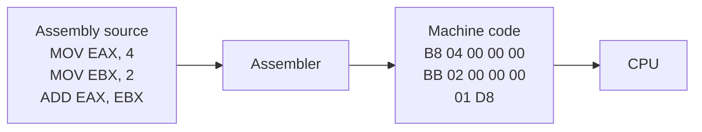
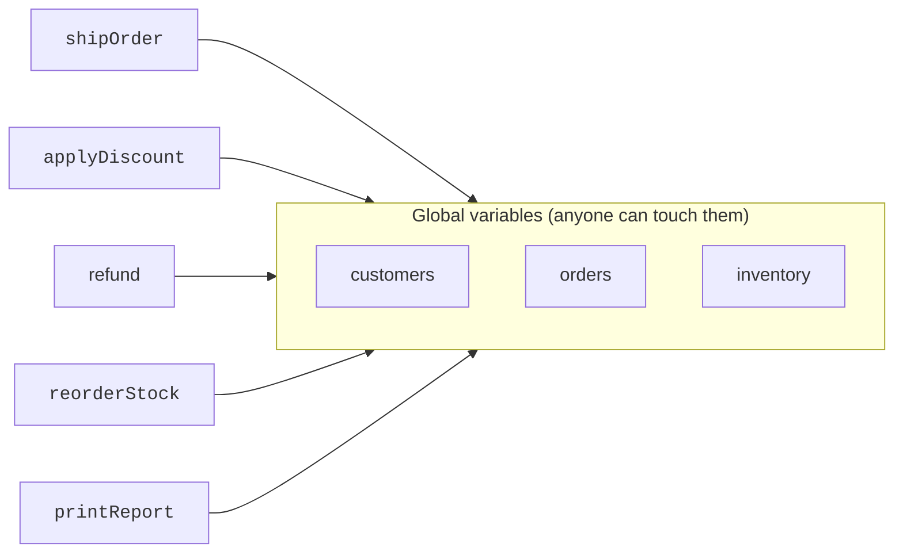

To understand why C# exists, we have to start a long way before C#.
We have to go back to the years when programming barely looked like
"writing code" at all — and then watch what happened as programs
grew from a few hundred lines into millions.

## The first programs were physical

The earliest computers were programmed by **rewiring them**.
Programmers like Kathleen Booth, Grace Hopper, and the women of
ENIAC connected cables and flipped switches by hand to make the
machine carry out one specific calculation. There was no "source
code." There was just *the wiring*.


This worked for a single problem at a time. To run a different
calculation, you had to rewire the machine. Useful — but not how
you build anything large.

## From wires to numbers: machine code

The next leap was **storing the program as numbers** in the
computer's memory. Instead of cables, each instruction was a number
the CPU knew how to interpret. Add two registers? That might be the
number `0x01`. Jump to a different instruction? Maybe `0x4E`.

Programmers wrote sequences like:

```
B8 04 00 00 00
BB 02 00 00 00
01 D8
```

Each row is one instruction. This was an immense improvement (the
program could now be loaded from punch cards or tape), but humans
are not good at reading hex. It was also **completely
machine-specific**: a program written for one CPU was useless on
another.

## Assembly language: names for the numbers

The first abstraction was **assembly language**. Instead of writing
`B8 04`, you wrote `MOV EAX, 4`. A small program called an
*assembler* translated those mnemonics back into the same numbers
the CPU expected.



Assembly gave us readable names, comments, and labels — but it was
still tied to one specific CPU and one specific computer. Porting a
program from one machine to another meant rewriting it from scratch.

## High-level languages: thinking above the machine

The breakthrough was **high-level languages** like Fortran (1957),
COBOL (1959), Algol (1960), and later C (1972). For the first time,
you could write something close to mathematical notation:

```text
total = 0
for i from 1 to 100
    total = total + i
```

…and let a **compiler** translate that into the machine code for
whatever CPU you happened to own. A program written in C could be
recompiled — without changing the source — to run on different
hardware. That alone was a revolution.

The same idea, expressed in modern C#:

<CodeBlock
  adapter="csharp"
  files={[
    {
      filename: "main.cs",
      starterCode: `using System;

int total = 0;
for (int i = 1; i <= 100; i++)
{
    total = total + i;
}

Console.WriteLine($"total = {total}");
`,
    },
  ]}
/>

Notice how the C# version reads almost like English. You do not need
to know which CPU you are on. You do not need to know which register
holds `total`. The compiler handles all of that.

## The software crisis: programs outgrew programmers

By the late 1960s and early 1970s, the *amount* of software being
written exploded. Operating systems, payroll systems, airline
booking, banking, missile guidance — all suddenly needed to be
*much* larger than anything before. Single programs grew to hundreds
of thousands of lines.

And almost all of that code was written in a style we now call
**procedural**: a long list of functions that read and wrote a
shared pile of global variables.



This style works fine for *small* programs. But once a program had
500 functions and 3,000 variables, the picture became a nightmare:

- Any function could change any variable.
- A bug in one corner could break code in a totally different corner.
- Two programmers working on the same project could not agree on
  *who owned* a piece of data.
- Adding a feature often broke three others.

In 1968, NATO held a conference where senior engineers admitted
something embarrassing: **we don't actually know how to build big
software reliably.** They called this the **software crisis**.

<Callout type="info" title="Why this matters for C#">
Every major language designed after 1970 — including C++, Java,
Python, and **C#** — was shaped by a desire to *prevent* the kind of
chaos that the software crisis exposed. Encapsulation, types,
modules, classes, garbage collection, and exceptions are all
responses to that crisis.
</Callout>

## What kept getting worse

Even after high-level languages, a few specific problems kept
biting programmers over and over again:

1. **Memory bugs.** In C, you had to manually allocate and free
   memory. Forgetting either one caused crashes or silent data
   corruption that might appear *days* later.
2. **No safety net for types.** It was easy to accidentally treat
   a number as a pointer (an address into memory), or a piece of
   text as a number, with disastrous results.
3. **No good way to group data with behavior.** Customer information
   lived in one place; the functions that worked on customers lived
   somewhere else; nothing forced them to stay consistent.
4. **No way to enforce rules.** "A bank balance must never go
   negative" was a comment in the documentation, not a rule the
   *compiler* could check.

## Where we go from here

This is the world C# was eventually designed to fix. But the first
big answer to the software crisis was not C#. It was a new way of
*organizing* programs called **object-oriented programming** — and
that is the next chapter of our story.

## Test your understanding

<MultipleChoice
  markdown={`Why did programmers move from machine code to assembly language?

- Assembly produced faster programs
  > Not really — assembly translates one-for-one into the same machine code, so it doesn't make the program faster.
- [o] Assembly used readable mnemonics like \`MOV\` and labels instead of raw numbers, making programs easier to write and debug
  > Assembly is essentially a human-friendly notation for the exact same instructions.
- Assembly programs could run on any CPU
  > No. Assembly is still CPU-specific.
- Assembly removed the need for memory management
  > It didn't. Memory was still entirely the programmer's problem.`}
/>

<MultipleChoice
  markdown={`What was the core complaint of the "software crisis"?

- Computers were too slow
  > Hardware was actually improving rapidly.
- Programming languages were too high-level
  > The complaint was the opposite — that the tools and styles weren't *high-level enough* to manage big programs.
- [o] As programs grew larger, the dominant style (procedural code with global state) became impossible to maintain reliably
  > That motivated the search for better ways to *organize* large codebases — which led directly to OOP.
- Universities weren't training enough programmers
  > Workforce size was a separate concern; the crisis was about the *practice* of building software.`}
/>
