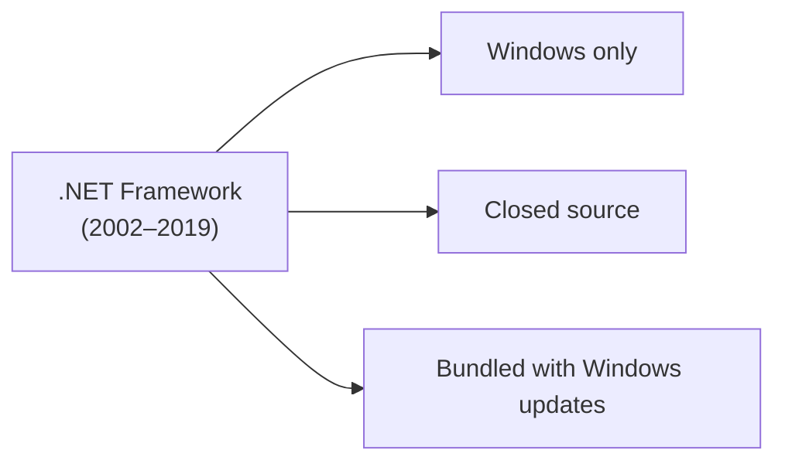
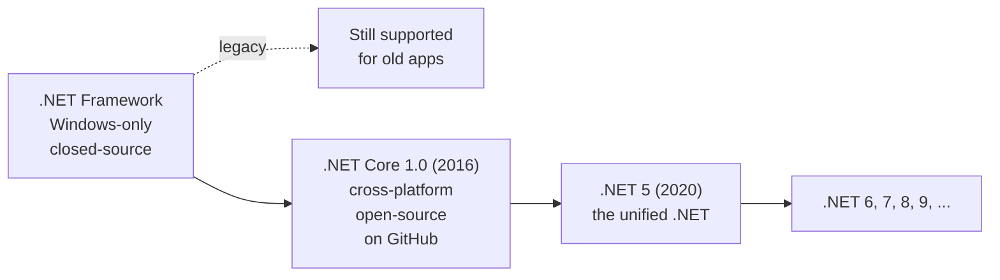
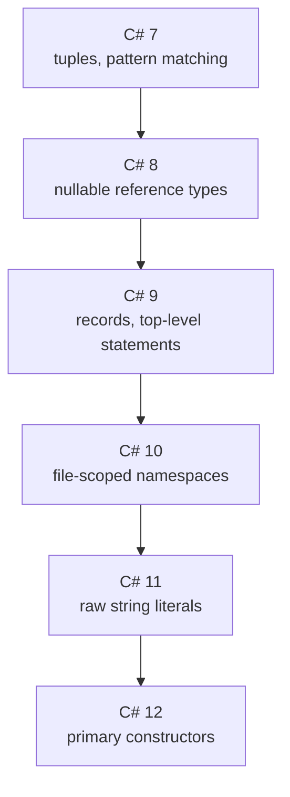
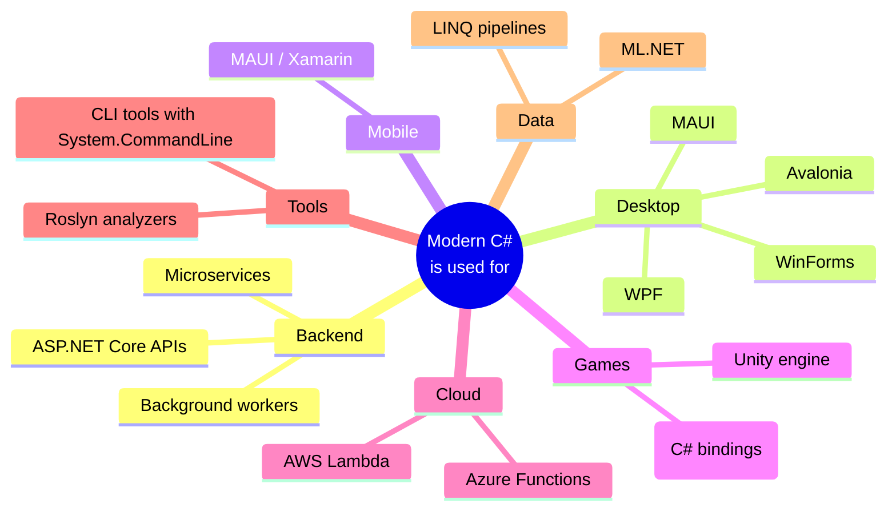

When .NET shipped in 2002, it was a very specific thing: a
managed runtime, a giant standard library, and a few languages —
all running **on Windows**, all owned by **Microsoft**, all
**closed-source**.

Twenty-plus years later, .NET looks completely different. It runs
on Linux and macOS. Its code is on GitHub. It is developed in the
open with thousands of outside contributors. Most of its users are
not Microsoft customers in the old sense at all.

This page tells that arc, because it shapes the C# you will write
today.

## The original .NET Framework (2002–2019)



The original product was called **.NET Framework**. It was:

- **Windows-only.** No Linux, no macOS.
- **Closed-source.** Microsoft owned and shipped it.
- **Shipped with Windows.** You generally couldn't install two
  major versions side-by-side easily, and upgrades came tied to
  Windows itself.

For its first decade this was fine — .NET Framework was hugely
successful in enterprises that already ran Windows everywhere.

But two big shifts were happening in the wider world:

1. **The cloud.** Companies were renting servers from Amazon (AWS),
   Google, and later Microsoft itself (Azure). Most of those
   servers ran **Linux**, not Windows.
2. **Mobile and macOS.** Developers increasingly worked on Macs.
   iPhones and Androids dominated mobile.

A Windows-only .NET could not credibly serve either trend.

## Mono: a community runs ahead

A determined developer named **Miguel de Icaza** had already seen
this coming. In 2004 he led a project called **Mono** — an
open-source, cross-platform implementation of .NET that ran on
Linux and macOS. Mono kept the .NET ecosystem alive on non-Windows
platforms for years, and was later used as the foundation for:

- **Xamarin** — using C# to build iOS and Android apps.
- **Unity** — the most popular game engine in the world, where you
  write your gameplay logic in C#.

Mono proved that .NET *could* run anywhere. The question was
whether Microsoft would embrace that direction.

## .NET Core: Microsoft starts over (2016)

Around 2014, under new leadership (Satya Nadella became CEO in
2014, with a famous "Microsoft loves Linux" stance), the company
made a decision that would have been unthinkable a decade earlier:
it would build a **new**, **cross-platform**, **open-source**
implementation of .NET, and shift the entire ecosystem onto it.



The new product was first called **.NET Core**. It was:

- **Cross-platform.** Windows, Linux, macOS — all first-class.
- **Open source.** Developed in public on GitHub.
- **Side-by-side installable.** You could have .NET 6 and .NET 8
  on the same machine and pick a different one per project.
- **Modular and faster.** Smaller deploy footprints; major
  performance improvements every release.

In 2020, Microsoft dropped "Core" from the name and shipped
**.NET 5**, unifying the old .NET Framework and .NET Core into a
single product line. From that point on, the rhythm has been one
major release per year:

| Version | Year | Notes |
| --- | --- | --- |
| .NET Core 1.0 | 2016 | First cross-platform release |
| .NET Core 2.x / 3.x | 2017–2019 | Major library and tooling growth |
| .NET 5 | 2020 | "Core" dropped; unified product |
| .NET 6 | 2021 | Long-term support; minimal APIs |
| .NET 7 | 2022 | Performance focus |
| .NET 8 | 2023 | LTS; native AOT improvements |
| .NET 9+ | 2024+ | Ongoing yearly releases |

**.NET Framework** still exists and still ships security patches.
But all *new* C# development happens on modern .NET. When this
course says ".NET", it means modern .NET — the cross-platform
open-source one.

## C# kept evolving in lockstep

C# has had its own steady release cadence, and in modern .NET each
new language version ships alongside a new runtime version. A few
features you will actually use:



The thread connecting all these additions: **let the programmer
write less ceremony around the same ideas.** Compare an old-style
"hello world" with a modern one.

Old style (C# 1.0 era):

```csharp
using System;

namespace HelloApp
{
    class Program
    {
        static void Main(string[] args)
        {
            Console.WriteLine("Hello, World!");
        }
    }
}
```

Modern style (C# 9+ "top-level statements"):

<CodeBlock
  adapter="csharp"
  initialCode={`using System;

Console.WriteLine("Hello, World!");
`}
/>

Both compile to the same thing. The second is just less in your
way. That is the spirit of modern C#.

## Where C# is used today

Because .NET now runs everywhere, C# has spread far beyond its
original enterprise-Windows roots:



You may not work in *all* of these areas. But it is useful to know
that the same language — sometimes the same standard library — can
take you across this whole landscape.

## What "modern C#" assumes

Throughout this course, when we say "modern C#" we mean:

- You're using **.NET 6 or later** (we test on the latest LTS).
- You can write **top-level statements** without a `Main` method.
- You have **`record`**, **`var`**, **string interpolation**, and
  **nullable reference types** available.
- You think of the **runtime** as the cross-platform .NET, not
  the legacy .NET Framework.

The browser playground in this course runs on the .NET WebAssembly
runtime, so every example you see should run in your browser.

## Test your understanding

<MultipleChoice
  markdown={`What is the difference between ".NET Framework" and "modern .NET"?

- They are the same thing with different marketing
  > Not quite — they're separate codebases with different capabilities.
- [o] .NET Framework is the original Windows-only, closed-source product (still maintained). Modern .NET (formerly .NET Core, now .NET 5/6/7/8+) is cross-platform, open-source, and where all new development happens.
- .NET Framework is faster than modern .NET
  > In fact, modern .NET has had major performance improvements every release.
- Modern .NET only runs on Linux
  > Modern .NET runs on Windows, Linux, and macOS.`}
/>

<MultipleChoice
  markdown={`Which of the following best describes the design direction of recent C# versions (C# 7 onward)?

- Removing features to make the language smaller
  > C# has been *adding* features, not removing them.
- [o] Adding ergonomic features that let you express the same ideas with less ceremony (top-level statements, records, pattern matching, etc.)
  > The language has grown, but each addition is meant to *reduce* boilerplate around something you were already doing.
- Replacing the runtime with the JVM
  > That has not happened and would not make sense.
- Making C# look more like assembly
  > The trend has been in the opposite direction.`}
/>

<Callout type="success">
Last stop on our story: a single page summarizing **why C# matters
today**, and then we dive into the actual programming.
</Callout>
