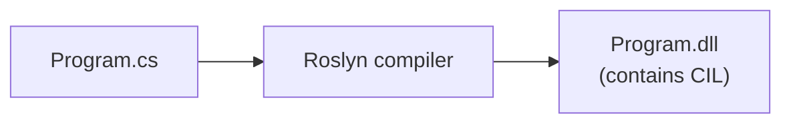
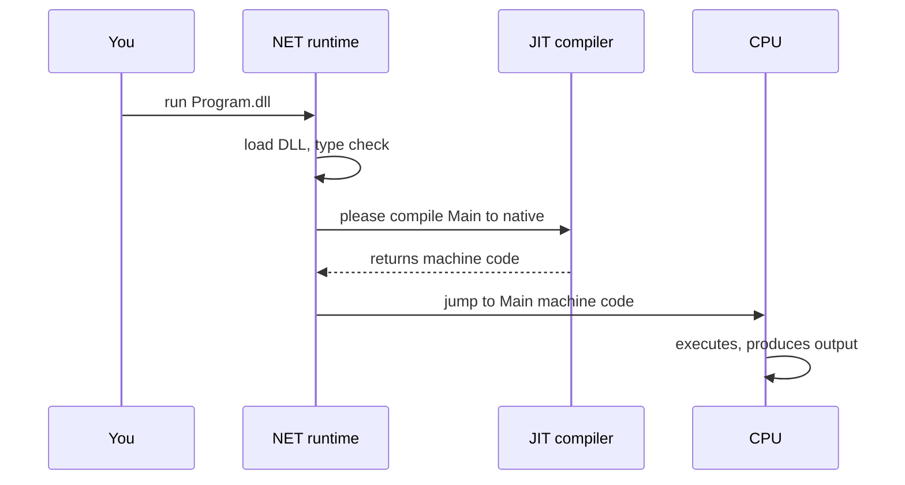
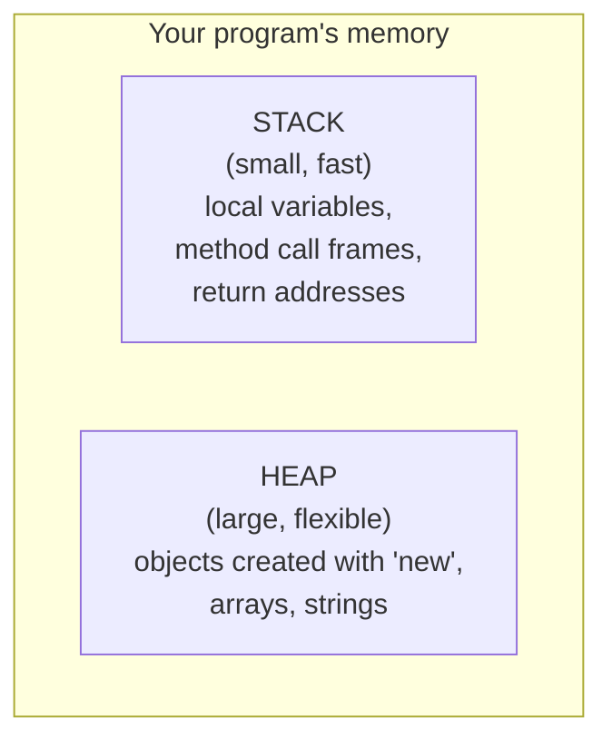
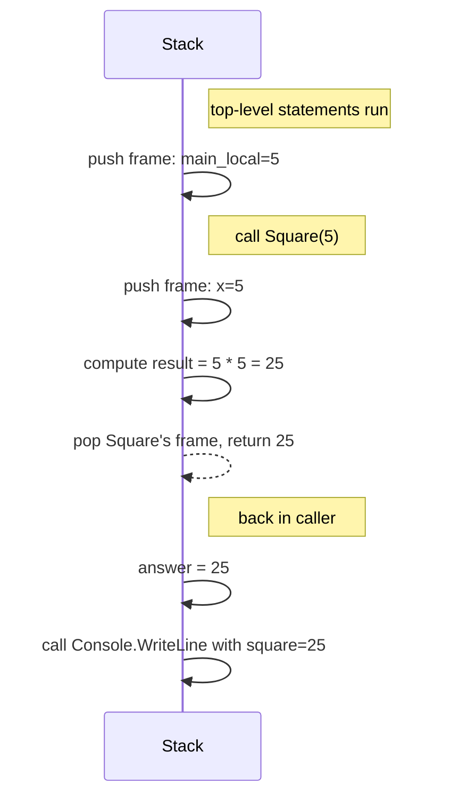
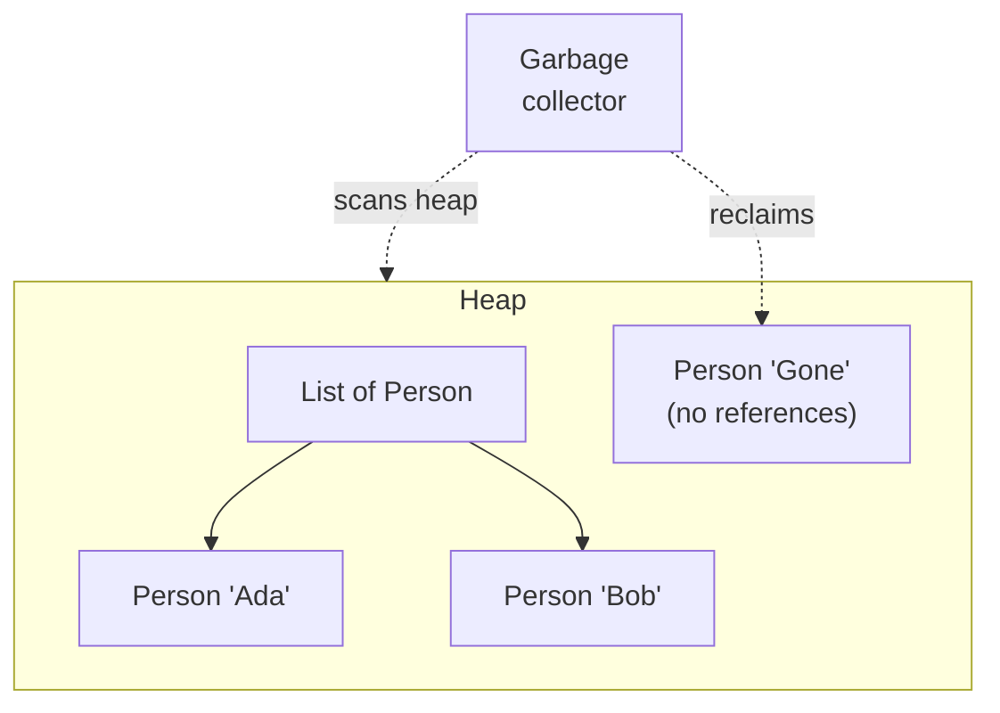

When you click **Run** in this site's playground, a lot more
happens than "the code goes." This page is a tour of *every*
stage, in plain language. Understanding this picture is the
difference between feeling like programming is magic and feeling
like you know what's going on.

We'll keep it conceptual — you don't need to memorize bytecodes or
CPU instructions, just build the mental model.

## The big picture

**Source code (`.cs` files) → Compiler (Roslyn) → Intermediate Language (CIL / IL) → Runtime (.NET CLR or WebAssembly) → JIT compiler → CPU + memory → Output to console / files / screen**

There are five real "things" in that pipeline, plus the CPU. Let's
walk through them.

## 1. Source code

This is what you write.

<CodeBlock
  adapter="csharp"
  starterCode={`using System;

int a = 3;
int b = 4;
int c = a + b;
Console.WriteLine($"a + b = {c}");
`}
/>

It's text. To the computer, it is meaningless until something
translates it. The translator is called the **compiler**.

## 2. The compiler turns source into Intermediate Language

For C#, the compiler is called **Roslyn**. Roslyn takes your `.cs`
files and produces a **`.dll`** (or `.exe`) containing a
lower-level language called **CIL** (Common Intermediate Language,
sometimes "IL" for short).

CIL is not the machine code your CPU runs. It is a portable, more
abstract instruction set designed for the .NET runtime. The reason
to compile to CIL (instead of directly to your CPU's machine code)
is that the same `.dll` can then run on any machine, regardless of
its CPU architecture.

You can think of CIL as a "halfway language": low-level enough that
the runtime can run it efficiently, but high-level enough that
it's not tied to one CPU.

## 3. The runtime loads and verifies your program

When you run your program, the .NET **runtime** (the CLR — Common
Language Runtime) loads the `.dll` and does a number of things
before any of your code executes:

- **Type checks.** The runtime verifies that your program's types
  are consistent — for example, you're not trying to use a number
  as a method.
- **Security checks.** Make sure the program isn't trying to do
  something it isn't allowed to.
- **Memory setup.** Reserve a chunk of memory for the **stack** and
  the **heap** (we'll meet both shortly).

If you ever see `Could not load file or assembly` or similar
errors before your program runs at all, this stage is usually
where the trouble is.

## 4. JIT compilation: IL → native CPU code

Right before your code is about to run, the runtime uses a
**Just-In-Time** (JIT) compiler to turn IL into the real machine
code for the CPU you're on.

This is why your *first* run might feel slightly slow: the JIT is
working. Subsequent calls to the same method are essentially free
because the machine code has been cached.

## 5. Memory: the stack and the heap

While your program runs, it uses memory. The runtime divides that
memory into two big regions, and you'll hear about both for the
rest of your career.

- The **stack** holds the bookkeeping for each method call: its
  local variables, its parameters, and where to return when it's
  done. It's called a stack because method calls pile on top of
  each other and pop off in reverse order.
- The **heap** holds long-lived objects whose lifetime isn't tied
  to one method call. Anything you create with `new` (a `List`, a
  `Person`, a `Library`) lives on the heap.

You usually don't think about which region a value lives in. But
when something surprising happens — "why did changing one variable
also change another?" — the answer almost always traces back to
this picture. We'll come back to it when we talk about value vs
reference types.

## 6. Method call walkthrough

Let's trace a tiny program step by step.

<CodeBlock
  adapter="csharp"
  starterCode={`using System;

int Square(int x)
{
    int result = x * x;
    return result;
}

int main_local = 5;
int answer = Square(main_local);
Console.WriteLine($"square = {answer}");
`}
/>

Here is what happens in the stack while this runs:

Two things to notice:

- Every method call gets its **own stack frame**, with its **own
  copy** of its parameters and local variables.
- When the method returns, that frame is **destroyed**, and the
  caller picks up where it left off.

This is why a variable named `x` inside `Square` and a variable
named `x` somewhere else don't interfere — they're in different
frames.

## 7. Garbage collection: who frees memory

In C and C++, *you* are responsible for freeing memory you
allocated. In C#, the runtime does it for you, via the **garbage
collector** (GC).

The garbage collector periodically pauses your program briefly,
walks the heap, identifies objects that no living code can still
reach, and frees their memory.

You will not "feel" the garbage collector most of the time. But the
fact that it exists is the reason you can write programs like this
without worrying about memory:

<CodeBlock
  adapter="csharp"
  starterCode={`using System;
using System.Collections.Generic;

List<int> MakeNumbers(int n)
{
    var list = new List<int>();
    for (int i = 0; i < n; i++)
        list.Add(i);
    return list;
}

// Each call allocates a fresh list on the heap.
// When the variable goes out of scope and nothing references the
// returned list, the garbage collector will reclaim it. We don't
// have to do anything.

var nums = MakeNumbers(10);
Console.WriteLine($"got a list of length {nums.Count}");

// Overwriting 'nums' makes the old list eligible for collection.
nums = MakeNumbers(5);
Console.WriteLine($"now a list of length {nums.Count}");
`}
/>

## 8. The full lifecycle, one more time

Here is the whole picture, now with the pieces named.

1. You write `.cs` source.
2. Roslyn compiles it to IL (`.dll`).
3. The runtime loads the `.dll`, type-checks it, and sets up the stack and heap.
4. The JIT compiles IL to CPU machine code on demand.
5. The CPU executes; the stack holds calls, the heap holds objects.
6. The GC reclaims unreferenced heap objects.
7. The program exits, and the OS frees all memory.

That is the *entire* journey of one C# program. Every later
chapter in this course is just a closer look at some piece of this
picture.

## Test your understanding

<MultipleChoice
  markdown={`What does the Roslyn compiler produce when it compiles a C# program?

- Machine code for your CPU
  > Not directly — that happens later, at runtime, via the JIT.
- A Word document
  > No.
- [o] An assembly (a \`.dll\` or \`.exe\`) containing Intermediate Language (IL)
  > IL is a portable lower-level representation that the .NET runtime knows how to execute.
- A pre-rendered video of your program running
  > No.`}
/>

<MultipleChoice
  markdown={`What is the difference between the **stack** and the **heap**?

- The stack is for code, the heap is for data
  > Both hold data; code is stored separately.
- They are the same thing
  > They are distinct memory regions with different lifetime rules.
- [o] The stack holds short-lived bookkeeping for method calls (parameters, locals, return addresses). The heap holds longer-lived objects created with \`new\` and managed by the garbage collector.
- The heap is faster than the stack
  > It's usually the other way around — stack access is extremely fast.`}
/>

<MultipleChoice
  markdown={`What does the **garbage collector** do?

- Deletes unused files from your disk
  > That's disk cleanup, not GC.
- Recompiles your code
  > That's the JIT.
- [o] Finds heap objects that no living code can still reach, and reclaims their memory so it can be reused
  > This is what makes C# a "memory-safe" language in everyday use.
- Slows your program down on purpose
  > It does occasionally pause work to scan the heap, but its purpose is to *reclaim* memory, not to slow things down.`}
/>
