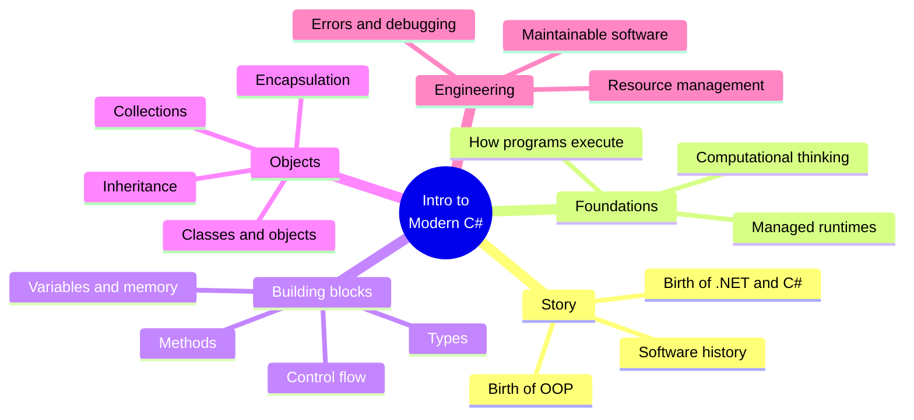

Welcome to **Introduction to Modern C#**. This course is designed for
learners with **zero to little programming experience**. If you have
never written a line of code, or you have copy-pasted a few scripts
without ever really understanding what was happening, you are exactly
the audience this course was written for.

C# is the *vehicle*, but the real goal is much bigger than any one
language. By the end of the course you should be able to:

- Look at a real-world problem and break it into pieces a computer can
  handle.
- Understand what is *actually happening* inside the machine when your
  code runs — memory, types, methods, objects, the runtime.
- Read and write small to medium C# programs with confidence.
- Reason about programs that don't behave the way you expected, and
  fix them.
- Speak the vocabulary of modern software engineering: object,
  reference, encapsulation, exception, abstraction, runtime, garbage
  collector.

<svg
  viewBox="0 0 640 220"
  role="img"
  aria-label="A sharp sign built from translucent crossing bars with a colored dot resting at each of the four crossings — four threads of one course meeting in C#"
  style={{ display: "block", width: "100%", maxWidth: "560px", height: "auto", margin: "2.5rem auto" }}
>
  <g style={{ color: "var(--ds-blue-500)" }} fill="currentColor">
    <rect x="270" y="36" width="16" height="148" rx="8" fillOpacity="0.3" />
    <rect x="338" y="36" width="16" height="148" rx="8" fillOpacity="0.3" />
    <rect x="230" y="84" width="180" height="16" rx="8" fillOpacity="0.14" />
    <rect x="230" y="136" width="180" height="16" rx="8" fillOpacity="0.14" />
  </g>
  <g style={{ color: "var(--ds-blue-500)" }} fill="currentColor">
    <circle cx="278" cy="92" r="8" />
  </g>
  <g style={{ color: "var(--ds-green-500)" }} fill="currentColor">
    <circle cx="346" cy="92" r="8" />
  </g>
  <g style={{ color: "var(--ds-yellow-500)" }} fill="currentColor">
    <circle cx="278" cy="144" r="8" />
  </g>
  <g style={{ color: "var(--ds-red-500)" }} fill="currentColor">
    <circle cx="346" cy="144" r="8" />
  </g>
  <g fill="currentColor" opacity="0.25">
    <circle cx="150" cy="70" r="4" />
    <circle cx="120" cy="150" r="3" />
    <circle cx="492" cy="64" r="3" />
    <circle cx="520" cy="142" r="4" />
    <circle cx="190" cy="110" r="2.5" />
    <circle cx="455" cy="108" r="2.5" />
  </g>
</svg>

## What you will learn

The course is split into seven parts. The first part is a **story** —
how programming languages evolved, why object-oriented programming
appeared, where Java fit in, why Microsoft built .NET, and why
**Anders Hejlsberg** ended up designing C#. The rest of the course is
hands-on: variables, types, control flow, methods, classes, objects,
collections, errors, debugging, and software organization.

## What this course is *not*

This course is **not** a framework bootcamp. We deliberately do *not*
spend time on:

- Heavy ASP.NET Core tutorials
- Enterprise frameworks and dependency injection containers
- Cloud, DevOps, and Kubernetes
- Advanced concurrency
- Competitive-programming puzzles
- Memorizing design patterns
- Compiler internals

Those are valuable topics — but they are the second thing you learn,
not the first. Trying to learn them before you understand variables,
references, methods, and objects is the most common reason new
programmers stall.

## How to use this site

Every page mixes prose with three kinds of interactive widgets:

1. **Executable C# code blocks.** Each block is compiled by **Roslyn**
   and runs on the **.NET WebAssembly** runtime *inside your browser*.
   The first run in a session is slow because the runtime has to boot;
   subsequent runs are fast.
2. **Multi-file challenge cards.** Real C# programs live in many
   files. You will see workspaces with several `.cs` files side by
   side and fill in the missing pieces.
3. **Multiple-choice questions.** Short single-answer checks at the
   end of most pages, with per-choice explanations so even a wrong
   answer teaches you something.

<Callout type="info" title="Each code block is independent">
A variable, class, or method defined in one `<CodeBlock>` is **not**
visible in the next one. Every example is self-contained.
</Callout>

## A tiny taste

This is a complete C# program. It introduces a class, an object, a
field, and two methods. Read it once, then click **Run**.

<CodeBlock
  adapter="csharp"
  files={[
    {
      filename: "main.cs",
      starterCode: `using System;

class Lamp
{
    private bool isOn;
    private string name;

    public Lamp(string name)
    {
        this.name = name;
        this.isOn = false;
    }

    public void TurnOn()
    {
        isOn = true;
    }
    public void TurnOff()
    {
        isOn = false;
    }

    public string Describe() => $"{name} lamp is {(isOn ? "ON" : "off")}";
}

class Program
{
    static void Main()
    {
        var desk = new Lamp("desk");
        Console.WriteLine(desk.Describe());
        desk.TurnOn();
        Console.WriteLine(desk.Describe());
        desk.TurnOff();
        Console.WriteLine(desk.Describe());
    }
}
`,
    },
  ]}
/>

If that example feels intimidating, that is completely normal — it
uses ideas we have not yet introduced (`class`, `private`, `this`,
constructors, expression-bodied methods). The point is just to show
you what a real C# program looks like. By the end of the course,
every line of that example will feel obvious.

## Where to next
