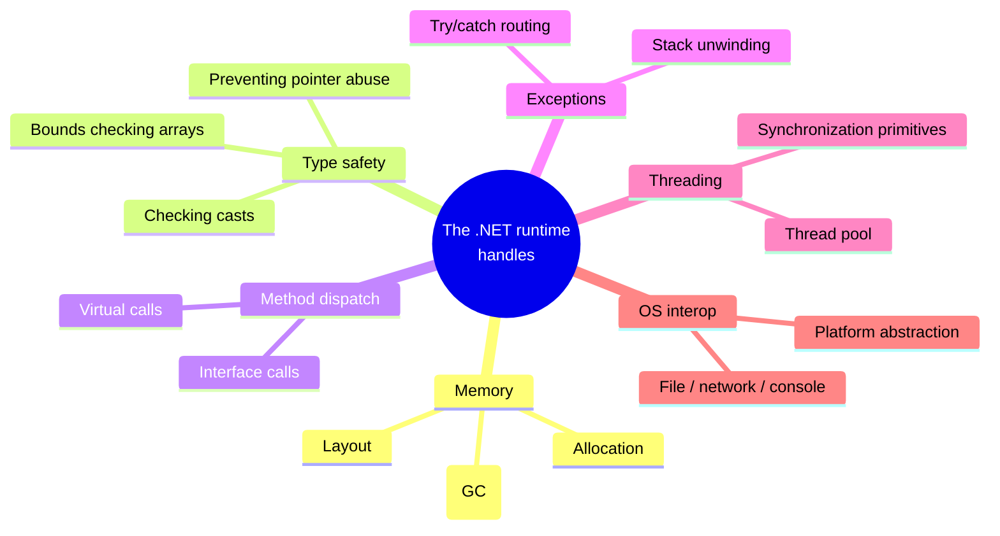
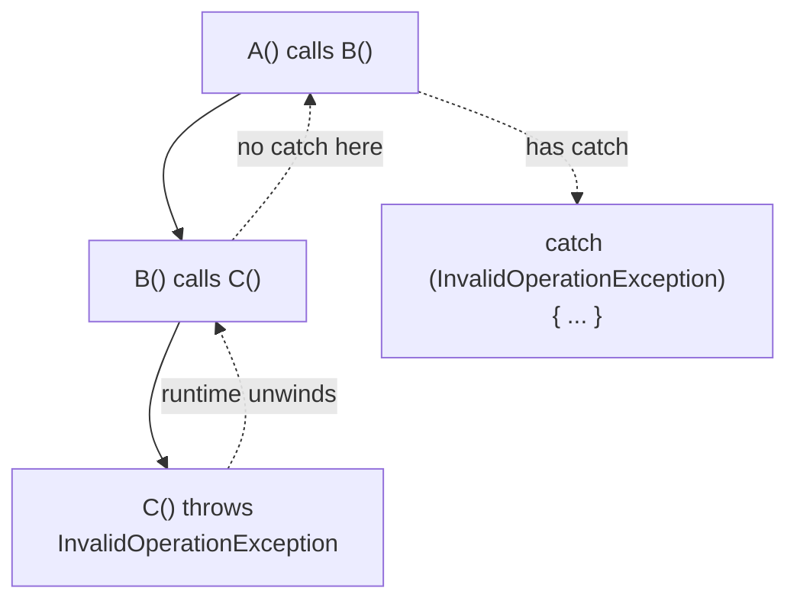
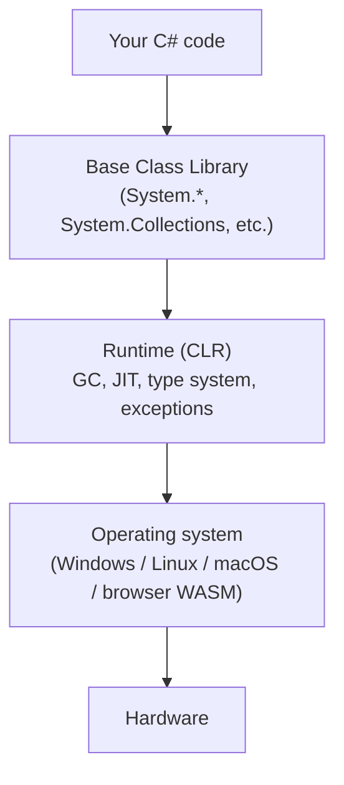

We've used the words "runtime" and "managed" for several chapters
now. This page makes them concrete. By the end you should be able
to point at the .NET runtime and say *exactly* what it does for you
and why that matters.

We'll stay conceptual — no deep internals. The goal is intuition,
not a reading list of CLR source code.

## What is a runtime, in one paragraph?

A **runtime** is a piece of software that runs *alongside* your
program, providing services your program would otherwise have to
do itself: loading code, managing memory, looking up methods,
enforcing safety rules, handling exceptions, talking to the
operating system.

You can have an *unmanaged* runtime (think of the very thin one
behind a C program — basically just the C standard library and
some startup glue), or a *managed* one (the .NET runtime, the JVM,
the V8 JavaScript engine).

"Managed" means the runtime takes ownership of the parts of
programming that are easy to get wrong.

## What .NET manages for you

Each leaf is something *you* would have to write yourself in a
language like C. We'll touch on the most important ones.

### Memory: allocation and garbage collection

You already saw this. When you write `new List<int>()`, the
runtime finds free space on the heap, hands you a reference, and
remembers the object. Later, the garbage collector reclaims it
when nothing can reach it anymore.

You don't decide *when* memory is freed. You just decide when you
stop *using* it. That's a much smaller responsibility.

<CodeBlock
  adapter="csharp"
  initialCode={`using System;
using System.Collections.Generic;

void Burn()
{
    var huge = new List<int>();
    for (int i = 0; i < 500_000; i++) huge.Add(i);
    Console.WriteLine($"made {huge.Count} ints");
    // No 'free', no 'delete'. The runtime will clean up.
}

Burn();
Burn();
Burn();
Console.WriteLine("done");
`}
/>

### Type safety: the runtime catches you

The compiler catches *many* type errors before the program runs.
But some can only be detected at runtime — for example, casting an
object to a wrong type, or indexing an array out of bounds.

In an unmanaged language, doing the wrong thing might silently
corrupt memory and crash later. In .NET, the runtime catches it and
throws an **exception** at the exact spot it happened.

<CodeBlock
  adapter="csharp"
  initialCode={`using System;

int[] xs = { 10, 20, 30 };

try
{
    int bad = xs[7];      // out of bounds
    Console.WriteLine(bad);
}
catch (IndexOutOfRangeException ex)
{
    Console.WriteLine($"caught: {ex.Message}");
}

object o = "hello";
try
{
    int n = (int)o;       // wrong cast
    Console.WriteLine(n);
}
catch (InvalidCastException ex)
{
    Console.WriteLine($"caught: {ex.Message}");
}
`}
/>

The runtime *refuses* to do the unsafe thing. That refusal is the
gift of a managed environment — bugs become visible immediately
instead of festering in memory you didn't know you damaged.

### Method dispatch and the type system

When you call `someObject.DoThing()`, the runtime sometimes needs
to figure out *which* `DoThing` to actually call — for example, if
`someObject` is a `Dog` stored in an `Animal` variable, calling
`Bark` should go to `Dog.Bark`, not some generic `Animal.Bark`.

This is **virtual dispatch**, and it's how **polymorphism** (which
we'll meet later) works. The runtime maintains tables behind the
scenes so this lookup is fast and correct.

### Exceptions: a managed control flow

When something goes wrong in C#, you can `throw` an exception.
The runtime then "unwinds the stack" — pops method frames one by
one, looking for a `catch` block that wants this kind of exception.

You don't write the unwinding logic. The runtime does. All you
write is `throw`, `try`, `catch`, and `finally`.

### Threading and the OS

When you ask the runtime to read a file or open a network
connection, it uses platform-specific code under the hood — but
exposes the same API on Windows, Linux, and macOS. Your code stays
the same. Same for threads: you say `Task.Run(...)` and the
runtime handles the messy details of OS threads.

## What you give up

The price of all this convenience:

| Convenience | Price |
| --- | --- |
| Memory is managed for you | A small amount of CPU and RAM overhead |
| GC reclaims dead objects | Occasional brief pauses for collection |
| Runtime type and bounds checks | A tiny per-operation cost |
| One binary runs on many CPUs | A JIT warm-up cost at startup |
| Same API across OSes | A runtime must be installed (or embedded) |

For the kinds of software you'll write in this course — and for
the vast majority of professional software — this trade is
overwhelmingly worth it. The bugs you *avoid* with a managed
runtime would have cost you far more time than the runtime
overhead ever will.

## A picture of where C# code lives

It can help to picture all the layers at once.

Every line of C# you write is, in a sense, sitting on top of all
those layers. When something feels mysterious, it almost always
helps to ask "which of these layers is doing this?"

## A note on the browser

This course runs C# *in your browser* using a special version of
the .NET runtime compiled to **WebAssembly** (WASM). The runtime
behaves the same — same GC, same exceptions, same type system —
but instead of running on Windows or Linux, it runs inside the
browser's WASM sandbox. From your perspective as a programmer,
that's invisible. You just write C#.

## Test your understanding

<MultipleChoice
  markdown={`Which of these is *not* a service that the .NET runtime provides for you?

- Memory allocation and reclamation
  > It does this.
- Type safety checks at runtime
  > It does this.
- [o] Choosing variable names for you automatically
  > Correct — naming is your responsibility, not the runtime's.
- Exception unwinding
  > It does this.`}
/>

<MultipleChoice
  markdown={`What is the *main* reason languages like C# add a small amount of runtime overhead compared with C?

- The runtime is poorly written
  > The .NET runtime is one of the most heavily optimized in the world.
- Managed code can't use modern CPUs
  > It absolutely can.
- [o] In exchange for the overhead, the runtime catches whole categories of bugs (memory leaks, dangling pointers, type confusion, buffer overruns) that you'd otherwise have to find yourself
  > Correct. This trade is one of the best deals in programming.
- C# files are larger
  > File size isn't the cost being paid.`}
/>

<Callout type="success">
You now have the conceptual layer cake clearly in mind. Time to
zoom *into* it. Next: **variables and memory** — the smallest piece
of any program.
</Callout>
