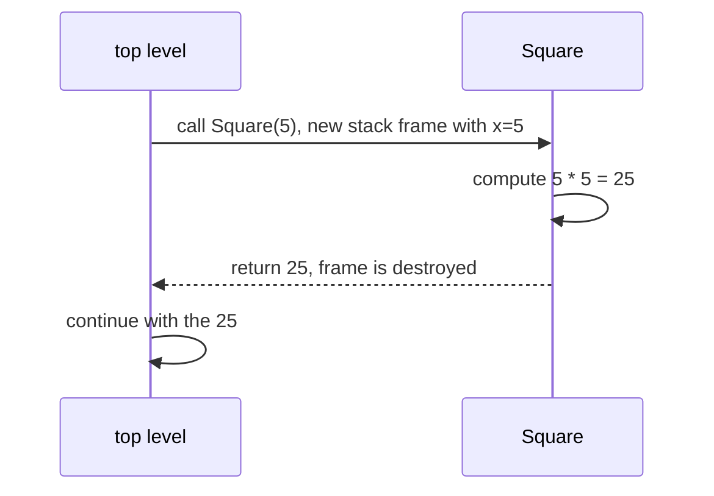

A **method** is a named block of code that takes inputs, does
something, and (optionally) returns a result. Methods are the
basic unit of *reuse* in C#, and the practice of breaking a
program into many small methods is the heart of what programmers
mean by **modularity**.

If "a variable is a named box of data," then "a method is a named
box of behavior."

## A first method

<CodeBlock
  adapter="csharp"
  starterCode={`using System;

int Square(int x)
{
    return x * x;
}

Console.WriteLine(Square(5));
Console.WriteLine(Square(12));
Console.WriteLine(Square(Square(3))); // 9, then 81
`}
/>

Read the declaration left to right:

- **`int`** — the method **returns** an `int`.
- **`Square`** — the method's **name**.
- **`(int x)`** — it takes one **parameter** named `x` of type
  `int`.
- **`{ return x * x; }`** — the **body** runs when the method is
  called.

Calling the method (`Square(5)`) takes its body, plugs in the
argument, and gives back a value you can use anywhere.

## Parameters and arguments

A **parameter** is the name in the method's declaration; an
**argument** is the actual value supplied at the call site. They
match up in order.

<CodeBlock
  adapter="csharp"
  starterCode={`using System;

double Average(int a, int b)
{
    return (a + b) / 2.0;
}

Console.WriteLine(Average(10, 20)); // 15
Console.WriteLine(Average(7, 8));   // 7.5
`}
/>

The names `a` and `b` exist **only inside** `Average`. They
disappear the moment the method returns.

## `void` methods: do something, return nothing

If a method doesn't need to return a value, its return type is
`void`.

<CodeBlock
  adapter="csharp"
  starterCode={`using System;

void Greet(string name)
{
    Console.WriteLine($"hello, {name}");
}

Greet("Ada");
Greet("Bob");
`}
/>

`void` methods are usually about *side effects*: writing to the
console, modifying a file, mutating an object. A method that has
neither a return value nor a useful side effect doesn't do
anything at all.

## A picture of a method call

Earlier we saw that each method call gets its own **stack frame**.
That picture is worth pinning to the wall:

Inside `Square`, the variable `x` is just a name for the value `5`.
When `Square` returns, that name disappears. If the caller had its
own variable named `x`, it would be unaffected.

## Expression-bodied methods

A short method that's just `return some expression;` can be
written more compactly with `=>`:

<CodeBlock
  adapter="csharp"
  starterCode={`using System;

int Square(int x) => x * x;
int Cube(int x) => x * x * x;
bool IsEven(int x) => x % 2 == 0;

Console.WriteLine(Square(4));
Console.WriteLine(Cube(3));
Console.WriteLine(IsEven(10));
`}
/>

Same meaning as the longer form, just less noise. Use whichever
makes a particular method easier to read.

## Why bother with methods at all?

Suppose you have to compute a Body Mass Index three times in your
program. Without methods, you write the formula three times. With
methods, you write it once.

<CodeBlock
  adapter="csharp"
  starterCode={`using System;

double Bmi(double kg, double meters) => kg / (meters * meters);

Console.WriteLine($"Alice: {Bmi(60, 1.65):F1}");
Console.WriteLine($"Bob:   {Bmi(85, 1.80):F1}");
Console.WriteLine($"Cara:  {Bmi(72, 1.70):F1}");
`}
/>

Three reasons this is better than copy-pasting the formula three
times:

1. **One place to fix bugs.** If the formula is wrong, fix it once.
2. **Self-documenting.** `Bmi(60, 1.65)` *reads* like "BMI of 60 kg
   at 1.65 m." The raw arithmetic doesn't.
3. **Easier to test.** You can call `Bmi(...)` from a test with
   known inputs and check the output, without running the whole
   program.

## Defaults and named arguments

C# lets you declare defaults for parameters and let callers pass
arguments **by name**, which makes intent clear at the call site.

<CodeBlock
  adapter="csharp"
  starterCode={`using System;

void Log(string message, string level = "INFO", bool toFile = false)
{
    Console.WriteLine($"[{level}] {message} (toFile={toFile})");
}

Log("starting up");
Log("disk almost full", level: "WARN");
Log("crash", level: "ERROR", toFile: true);
`}
/>

`level: "WARN"` is much clearer than passing positional arguments
and hoping the reader remembers the parameter order. Use named
arguments when an argument might otherwise be cryptic (especially
booleans).

## Method overloading

You can have multiple methods with the **same name** but **different
parameter lists**. The compiler picks the right one based on the
arguments you pass.

<CodeBlock
  adapter="csharp"
  starterCode={`using System;

int Add(int a, int b) => a + b;
double Add(double a, double b) => a + b;
string Add(string a, string b) => a + b;

Console.WriteLine(Add(2, 3));
Console.WriteLine(Add(1.5, 2.5));
Console.WriteLine(Add("hello, ", "world"));
`}
/>

Use overloading sparingly — too many overloads can confuse readers.
The common cases are:

- "Same operation on different primitive types."
- "Same operation with a default vs explicit configuration."

## Modularity: small methods that do one thing

The single most useful habit you can build as a beginner is this:

> When a method gets longer than ~20 lines, see if you can pull
> out a meaningfully-named smaller method.

Compare the two versions below.

### Long, monolithic version

<CodeBlock
  adapter="csharp"
  starterCode={`using System;
using System.Collections.Generic;

void DescribeNumbers(int[] nums)
{
    int sum = 0;
    foreach (var n in nums)
        sum += n;

    int min = nums[0];
    foreach (var n in nums)
        if (n < min)
            min = n;

    int max = nums[0];
    foreach (var n in nums)
        if (n > max)
            max = n;

    double avg = (double)sum / nums.Length;

    Console.WriteLine($"count={nums.Length}, sum={sum}, min={min}, max={max}, avg={avg:F2}");
}

DescribeNumbers(new[] { 3, 1, 4, 1, 5, 9, 2, 6 });
`}
/>

### Modular version, same behavior

<CodeBlock
  adapter="csharp"
  starterCode={`using System;
using System.Collections.Generic;

int Sum(int[] xs)
{
    int s = 0;
    foreach (var n in xs)
        s += n;
    return s;
}
int Min(int[] xs)
{
    int m = xs[0];
    foreach (var n in xs)
        if (n < m)
            m = n;
    return m;
}
int Max(int[] xs)
{
    int m = xs[0];
    foreach (var n in xs)
        if (n > m)
            m = n;
    return m;
}
double Avg(int[] xs) => (double)Sum(xs) / xs.Length;

void Describe(int[] xs)
{
    Console.WriteLine($"count={xs.Length}, sum={Sum(xs)}, min={Min(xs)}, max={Max(xs)}, avg={Avg(xs):F2}");
}

Describe(new[] { 3, 1, 4, 1, 5, 9, 2, 6 });
`}
/>

Each helper does *exactly one thing*. The summary method `Describe`
now reads almost like English. If we needed to test `Sum` alone,
we could.

## Common method-design rules of thumb

- **Name methods after what they do.** `CalculateTax(...)`, not
  `Process(...)`.
- **Aim for one job per method.** If you'd need an "and" to describe
  it, it's doing too much.
- **Prefer returning a value over mutating shared state.** Pure
  functions are easier to reason about.
- **Limit parameters.** Three is comfortable. Five is suspicious.
  Seven is a redesign.
- **Don't repeat yourself.** If the same code shows up twice, it
  belongs in a method.

## Multi-file methods: organizing across files

Bigger programs split methods across multiple `.cs` files. Each
file usually contains one class (we'll meet classes in the next
section). The compiler builds them all together.

<CodeBlock
  adapter="csharp"
  entryFilename="Program.cs"
  files={[
    {
      filename: "Program.cs",
      initialContent: `using System;

Console.WriteLine(MathUtils.Square(4));
Console.WriteLine(MathUtils.Average(10, 20));
`,
    },
    {
      filename: "MathUtils.cs",
      initialContent: `public static class MathUtils
{
    public static int Square(int x) => x * x;
    public static double Average(int a, int b) => (a + b) / 2.0;
}
`,
    },
  ]}
/>

We'll dig into `static`, `class`, and `public` in the next chapter.
Just notice: methods live inside a class; multiple files combine
into one program; the call site `MathUtils.Square(4)` reads
naturally.

## Practice

<ChallengeCard
  adapter="csharp"
  title="Helpers for a simple stats report"
  instructions={`Build two methods on the static class \`Stats\`:

- \`int Sum(int[] xs)\` returns the sum of the array.
- \`int Max(int[] xs)\` returns the maximum value (assume the array has at least one element).

\`Program.cs\` calls both with a fixed array and prints exactly:

\`\`\`
sum=20
max=7
\`\`\``}
  entryFilename="Program.cs"
  files={[
    {
      filename: "Program.cs",
      initialContent: `using System;

int[] data = { 3, 7, 5, 1, 4 };
Console.WriteLine($"sum={Stats.Sum(data)}");
Console.WriteLine($"max={Stats.Max(data)}");
`,
    },
    {
      filename: "Stats.cs",
      initialContent: `public static class Stats
{
    // TODO: implement Sum and Max
    public static int Sum(int[] xs) => 0;
    public static int Max(int[] xs) => 0;
}
`,
      solutionContent: `public static class Stats
{
    public static int Sum(int[] xs)
    {
        int s = 0;
        foreach (var x in xs) s += x;
        return s;
    }

    public static int Max(int[] xs)
    {
        int m = xs[0];
        foreach (var x in xs) if (x > m) m = x;
        return m;
    }
}
`,
    },
  ]}
  tests={[
    {
      id: "report",
      name: "Prints exactly the expected report",
      expect: { stdoutLines: ["sum=20", "max=7"], stdoutLinesExact: true },
    },
  ]}
/>

## Test your understanding

<MultipleChoice
  markdown={`What does the keyword \`void\` mean in a method declaration?

- The method never runs
  > It runs normally.
- The method has no parameters
  > A method can have parameters regardless of return type.
- [o] The method returns no value to the caller
  > You call it for its side effects, not for a returned value.
- The method is private
  > Visibility is controlled by separate keywords like \`public\` and \`private\`.`}
/>

<MultipleChoice
  markdown={`Why is "small methods doing one thing" a good habit?

- Smaller methods compile faster
  > The compile-time difference is negligible.
- The language requires it
  > It doesn't.
- [o] Small focused methods are easier to name, test, reuse, and reason about — and changes stay localized
  > This is the central argument for modularity.
- Smaller methods use less memory
  > Method size has almost no impact on memory usage.`}
/>
