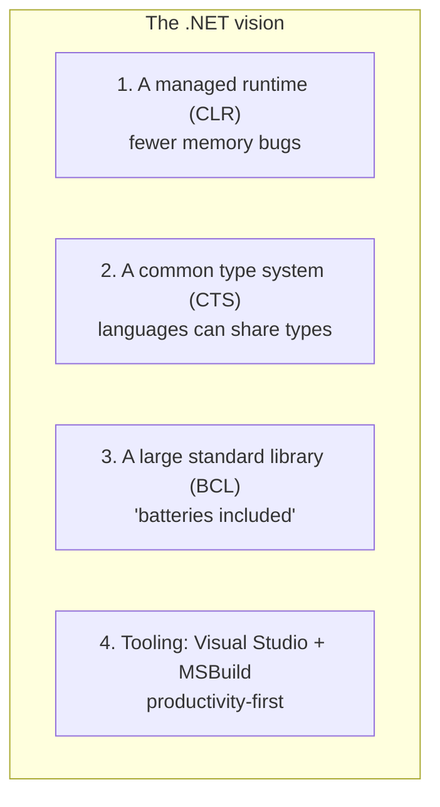
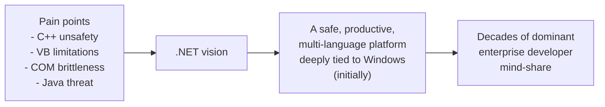

By the late 1990s, Microsoft had a plan. Rather than chase Java
language-by-language, it would build something *bigger*: a unified
runtime and toolchain that could host **many languages at once**,
share a common type system across them, and be tightly integrated
with Windows.

That plan was called **.NET** (pronounced "dot net"). It was first
described publicly in 2000 and shipped as **.NET Framework 1.0** in
2002 — alongside the first version of **C#**.

## What .NET set out to be

Microsoft's pitch for .NET had four pillars. Each one was a direct
response to a problem from the previous chapters.

Let's unpack each one.

### 1. The Common Language Runtime (CLR)

The **Common Language Runtime** is to .NET what the JVM is to Java:
a managed runtime that takes care of memory, type safety, security,
threads, and exceptions. Your program is compiled to a portable
intermediate format (Microsoft called it **CIL** — Common
Intermediate Language, sometimes called IL), and the CLR
just-in-time compiles it to real machine code as it runs.

This is essentially the same architecture as the JVM, with one
important twist: from day one, the CLR was designed to host
**multiple languages**, not just one.

### 2. The Common Type System (CTS)

Java has one language: Java. Sun was very protective of that.

Microsoft, by contrast, *embraced* the fact that different teams
prefer different languages — and asked: "what if your VB.NET
component could be called from C# as if it were a C# class, and the
return value handed off to an F# program, and all three saw the same
types?"

That required a **Common Type System** — a shared definition of
what an `int`, a `string`, an `object`, a `class`, and so on,
*mean* across every .NET language.

In practice this means: if you write a class library in C#, a
VB.NET program can use it directly with no glue code. Types match.
Method calls match. Exceptions match. Strings match.

In the COM/ActiveX era this kind of cross-language work was a
nightmare. In .NET it just works.

### 3. The Base Class Library (BCL)

The **Base Class Library** is the giant standard library that ships
with .NET. It contains thousands of types for the everyday work of
programming:

- Strings, numbers, dates, and times
- Collections (lists, dictionaries, sets, queues)
- Files, directories, and streams
- Networking (TCP, HTTP, sockets)
- XML and JSON
- Cryptography
- Threading and asynchronous code

Java had ushered in the idea of "batteries included" standard
libraries. Microsoft took it further: the BCL is enormous, and the
fact that *every* .NET language gets it for free is one of the
biggest reasons developers stick with .NET.

You have already used the BCL: every time you write `Console.WriteLine`
or `using System.Collections.Generic;`, you are pulling in BCL
types.

<CodeBlock
  adapter="csharp"
  initialCode={`using System;
using System.Collections.Generic;

// All of these types come from the Base Class Library.
var fruits = new List<string> { "apple", "banana", "cherry" };
var counts = new Dictionary<string, int>();

foreach (var f in fruits)
{
    counts[f] = f.Length;
}

foreach (var kv in counts)
{
    Console.WriteLine($"{kv.Key} -> {kv.Value}");
}
`}
/>

`List<T>`, `Dictionary<TKey, TValue>`, `string`, `Console`,
`foreach` over `KeyValuePair` — all BCL. You did not write any of
that.

### 4. Productivity-first tooling

Finally, Microsoft bet hard on **developer tooling**. Visual Studio
combined an editor, a compiler, a debugger, a profiler, a designer
for forms, and project management into a single coherent
experience. For developers used to wrangling separate command-line
tools, this felt magical.

Modern alternatives like **Visual Studio Code**, **JetBrains
Rider**, and the **`dotnet`** command-line tool now share the
stage, but the productivity-first culture set in early.

## "One runtime, many languages" in practice

The most distinctive part of .NET's design is the multi-language
story. Practically, that has meant:

| Language | Style | Used for |
| --- | --- | --- |
| **C#** | Object-oriented, statically typed | The default — most .NET code |
| **VB.NET** | Object-oriented, syntactically friendly | Older line-of-business apps |
| **F#** | Functional, statically typed | Data, finance, modeling |
| **IronPython / IronRuby** | Dynamic | Scripting (less common today) |

You can mix them in the same solution. A C# project can reference
an F# project and vice versa. Both compile to the same CIL and run
on the same CLR.

## The strategic bet

Stepping back, .NET was an enormous strategic bet for Microsoft:

The bet paid off. By the mid-2000s, .NET — and with it, C# — was
the default platform for building enterprise software on Windows.
Banking, insurance, healthcare, manufacturing, retail, and
government IT departments adopted it in huge numbers.

But the story was not over. .NET in 2002 was **Windows-only**, and
the world was about to spend the next decade and a half moving to
*everything-but-Windows* — Linux servers, macOS laptops, mobile
devices. We will see in the chapter "The evolution of .NET" how
Microsoft eventually had to rewrite the platform from scratch to
catch up.

But first: who actually *designed* C#? And why does C# look the way
it does? On to **Anders Hejlsberg and the birth of C#**.

## Test your understanding

<MultipleChoice
  markdown={`What does the Common Language Runtime (CLR) do?

- It is a chat program for developers
  > Different acronym.
- It is the editor used to write C# code
  > That's the IDE (Visual Studio, Rider, etc.).
- [o] It is the managed runtime that loads, JIT-compiles, and runs all .NET programs, regardless of which .NET language they were written in
  > CLR is to .NET what the JVM is to Java.
- It is a database engine
  > Unrelated.`}
/>

<MultipleChoice
  markdown={`Why does .NET include a "Common Type System"?

- To make C# files smaller
  > File size isn't the motivation.
- [o] So that types defined in one .NET language (e.g., F#) can be used directly from another (e.g., C#) with no glue code
  > The CTS is what makes the multi-language story actually work.
- To enforce naming conventions
  > Naming is governed by style guides, not the CTS.
- To make .NET incompatible with Java
  > Compatibility decisions are separate from the type system.`}
/>

<Callout type="success">
Next: the man who designed C#, and why his background made C# look
the way it does. On to **Anders Hejlsberg and the birth of C#**.
</Callout>
