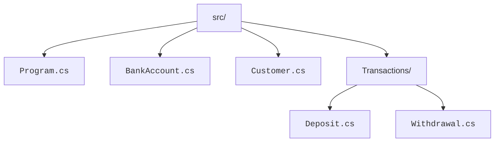
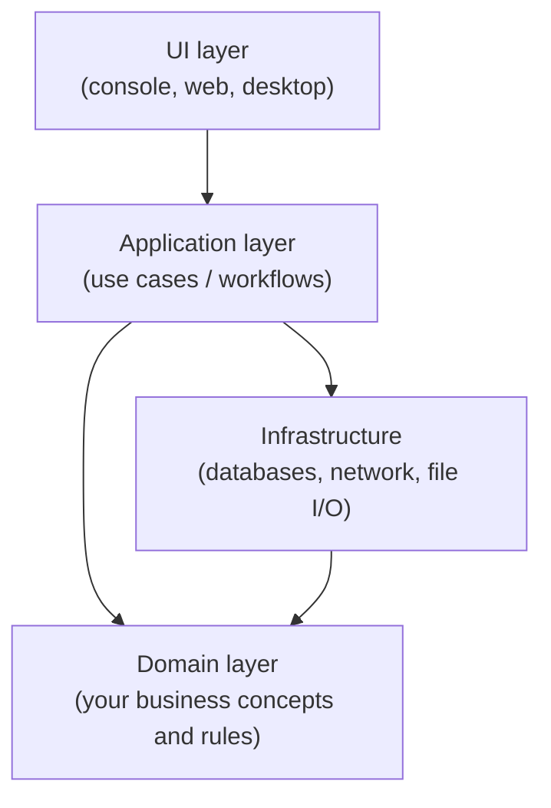

A toy program lives in one file. A real one might span hundreds.
Without some way to *organize* those files, every project would
eventually become an unnavigable mess.

C# gives you three nested levels of organization:

1. **Files** — physical containers, usually one class each.
2. **Namespaces** — logical containers, naming and grouping types.
3. **Projects** (and **solutions**) — compilation units that produce
   a single output (.dll, .exe, web app, etc.).

Plus a fourth, less tangible but more important layer: the
**architecture** of your program — how its pieces talk to each
other.

## Files

The C# convention is *one public class per file, named after the
class*. So `BankAccount.cs` contains `class BankAccount`, and so
on.

You *can* put multiple classes in one file (the compiler doesn't
care), but it's a bad habit: when you want to find `BankAccount`,
you don't want to grep — you want to open the file with that name.



Sub-folders mirror your *conceptual* groupings — and conventionally
mirror namespaces too.

## Namespaces

A **namespace** is a logical label that prefixes a type's name.
It lets two libraries have a class called `Logger` without
clashing, and it lets *your* program group related types.

<CodeBlock
  adapter="csharp"
  entryFilename="Program.cs"
  files={[
    {
      filename: "Program.cs",
      initialContent: `using System;
using Banking;

var a = new BankAccount("Alice", 100);
Console.WriteLine($"{a.Owner}: {a.Balance}");
`,
    },
    {
      filename: "BankAccount.cs",
      initialContent: `namespace Banking;

public class BankAccount
{
    public string Owner { get; }
    public double Balance { get; private set; }

    public BankAccount(string owner, double opening)
    {
        Owner = owner;
        Balance = opening;
    }
}
`,
    },
  ]}
/>

A few things to notice:

- `namespace Banking;` is the modern **file-scoped** form. Everything
  below it lives in the `Banking` namespace.
- `using Banking;` at the top of `Program.cs` is what lets us write
  `BankAccount` instead of `Banking.BankAccount`.
- Without `using Banking;`, the call would have to be
  `new Banking.BankAccount(...)` — explicit but verbose.

A common pattern is to give namespaces names like `Company.Project.Area`,
e.g. `Acme.OrderingService.Domain`.

## Projects and solutions

In a real workspace (not a single-file playground like this one),
your code lives in a **project** described by a `.csproj` file.
A project compiles to a single output — a console app, a library, a
web app.

Multiple projects can be grouped into a **solution** (`.sln`),
which is just a list of projects that ship together. Typical
layouts:

```
MyApp.sln
├── MyApp/               # console / web app (the "entry" project)
│   └── MyApp.csproj
├── MyApp.Core/          # business rules — no UI, no DB
│   └── MyApp.Core.csproj
└── MyApp.Tests/         # unit tests for the above
    └── MyApp.Tests.csproj
```

We're not setting up a multi-project workspace here, but you should
recognize the shape — it's nearly universal in professional C#.

## Layering: the intuition

Most real programs naturally split into a small number of layers
that depend *downward* but not upward:



Two rules of thumb:

1. **Inner layers don't depend on outer layers.** The domain knows
   nothing about HTTP or SQL. That's what makes it testable.
2. **The dependency direction never cycles.** A → B and B → A is a
   sign your modules should be merged or one of them split.

You don't have to formalize these layers in tiny programs. But as
soon as you have more than a handful of classes, you'll start to
*feel* the pull of layering, and it's worth working with it instead
of against it.

## A small example of conscious organization

<CodeBlock
  adapter="csharp"
  entryFilename="Program.cs"
  files={[
    {
      filename: "Program.cs",
      initialContent: `using System;
using Bank.Domain;
using Bank.App;

var alice = new BankAccount("Alice", 100);
var teller = new Teller();

teller.Deposit(alice, 50);
teller.Withdraw(alice, 30);

Console.WriteLine($"{alice.Owner} has {alice.Balance}");
`,
    },
    {
      filename: "BankAccount.cs",
      initialContent: `namespace Bank.Domain;

public class BankAccount
{
    public string Owner { get; }
    public decimal Balance { get; private set; }

    public BankAccount(string owner, decimal opening)
    {
        Owner = owner;
        Balance = opening;
    }

    public void ApplyDelta(decimal delta)
    {
        if (Balance + delta < 0)
            throw new InvalidOperationException("would overdraw");
        Balance += delta;
    }
}
`,
    },
    {
      filename: "Teller.cs",
      initialContent: `using Bank.Domain;

namespace Bank.App;

public class Teller
{
    public void Deposit(BankAccount a, decimal amount) => a.ApplyDelta(amount);
    public void Withdraw(BankAccount a, decimal amount) => a.ApplyDelta(-amount);
}
`,
    },
  ]}
/>

Notice the *direction* of dependency: `Bank.App` uses
`Bank.Domain`, but the domain doesn't know `Bank.App` exists. If
we ever added a web UI, it would sit *outside* both and pull from
them.

## How to decide what goes where

A useful checklist when adding a new class:

- Does it represent a real-world concept (account, customer, order)?
  → **Domain**.
- Does it coordinate work to accomplish a user goal?
  → **Application** (sometimes called "services" or "use cases").
- Does it deal with the outside world (HTTP, DB, file system)?
  → **Infrastructure**.
- Does it render or accept input from the user?
  → **UI** (web, console, GUI).

When you're not sure: start by putting the new class with the code
that most naturally collaborates with it, then refactor later if a
clearer place emerges.

## Test your understanding

<MultipleChoice
  markdown={`What is a *namespace* in C#?

- A folder on disk
  > Folders and namespaces often mirror each other but they're different concepts.
- [o] A logical label that groups types so they can be referenced without name collisions and organized by topic
- A separate executable
  > That would be a project.
- A reserved keyword for the main entry point
  > It is a keyword, but its job is grouping types.`}
/>

<MultipleChoice
  markdown={`Why does it matter that "inner" layers (like the domain) don't depend on "outer" layers (like the UI)?

- The compiler refuses to build the other way
  > It will happily build either way.
- The convention is purely aesthetic
  > The benefit is very concrete.
- [o] Keeping dependencies pointing inward means the core business logic can be tested and reused without dragging the UI or database along
  > This is the heart of "clean" architecture.
- It makes the program start faster
  > Startup isn't really affected.`}
/>
