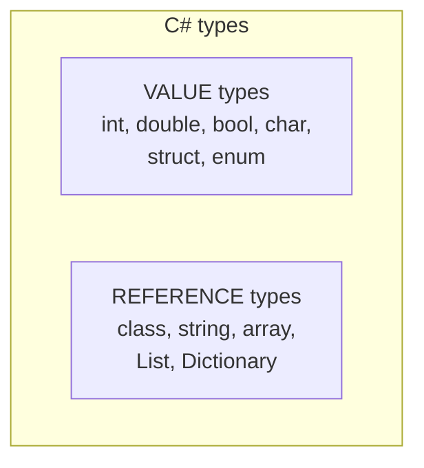
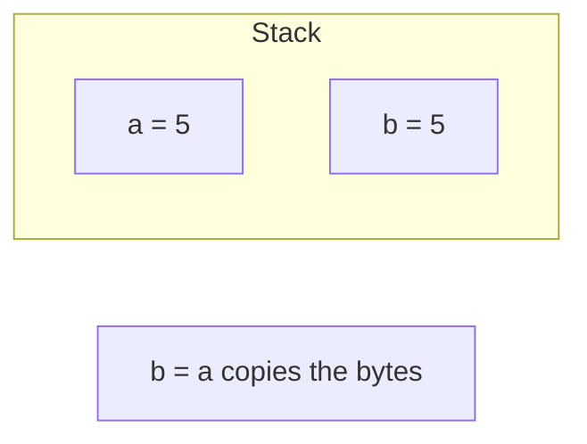
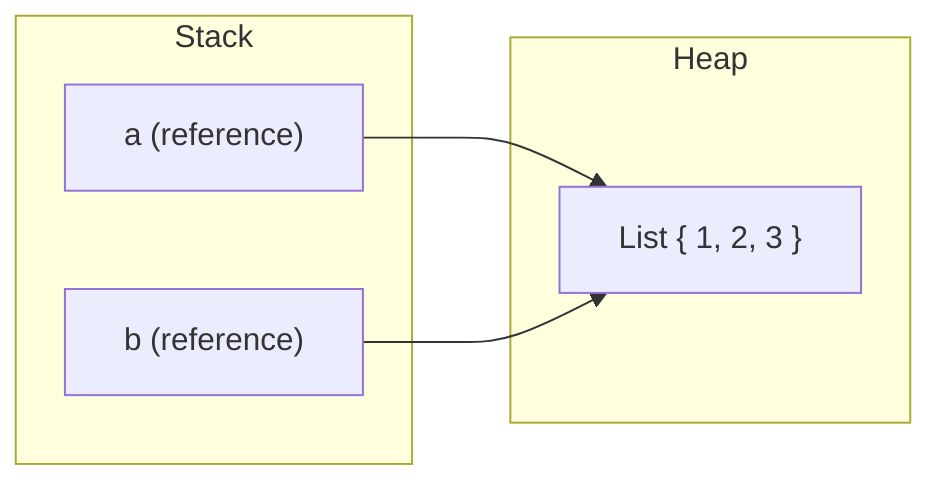
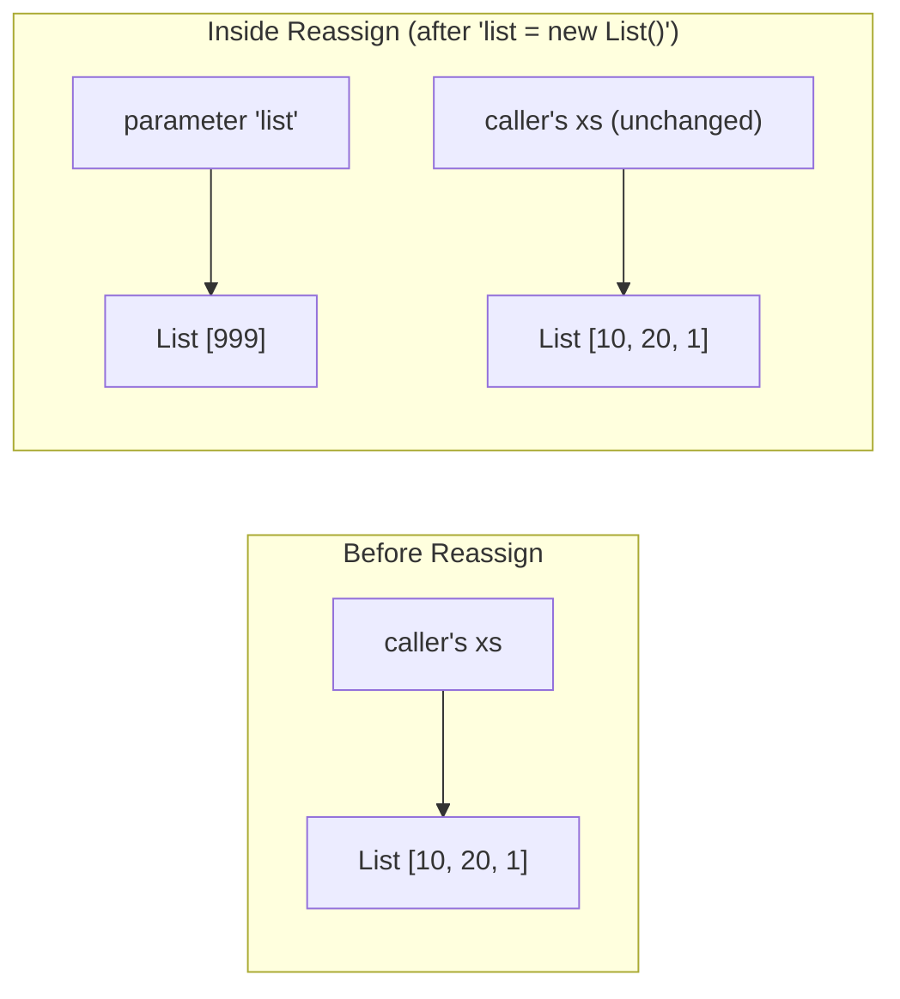

We've been using the word **type** for a while now. This page is
the one where we slow down and look at it properly. C# is what's
called a **statically typed** language, and the type system is one
of the biggest reasons C# programs are easier to maintain than
programs in dynamically typed languages.

## Static typing in one sentence

> In C#, every variable, parameter, field, and return value has a
> **type that is known at compile time**, and the compiler refuses
> to compile any code that uses those values in a way that doesn't
> match.

That's it. The compiler is doing a constant check: *does this code
make sense given the types?*

<CodeBlock
  adapter="csharp"
  initialCode={`using System;

int age = 30;
string name = "Ada";

// The compiler knows 'age' is int and 'name' is string.
Console.WriteLine($"{name} is {age} years old");

// The compiler would refuse this:
// int oops = name + age;   // ❌ can't add string and int into an int

// You can format strings together, though:
string description = name + " is " + age + " years old";
Console.WriteLine(description);
`}
/>

Static typing is not glamorous. But the moment you have a program
of more than a few hundred lines, it becomes the difference between
"works the first time" and "fails in production at 3 AM."

## What a type really *is*

A **type** is a *promise about what a value can do*. When you say
`int age = 30;`, you're promising:

- This box holds a 32-bit integer.
- You can add it, compare it, increment it.
- You **cannot** call `.Substring(0, 3)` on it (that's a string
  operation).

The compiler reads those promises and enforces them. If you try to
call `.Substring` on `age`, you don't find out at 3 AM — you find
out when you press Build.

## Built-in primitive types (reminder)

We saw most of these last chapter. A summary, plus some new ones:

| Category | Types | Example |
|----------|-------|---------|
| Whole numbers | `byte`, `short`, `int`, `long` | `42` |
| Unsigned whole numbers | `byte`, `ushort`, `uint`, `ulong` | `42u` |
| Floating-point | `float`, `double` | `3.14` |
| High-precision decimal | `decimal` | `19.99m` |
| Truth values | `bool` | `true` |
| One character | `char` | `'A'` |
| Text | `string` | `"hello"` |
| "Any object" | `object` | (anything) |

## Type conversions

Sometimes you really do need to turn one type into another. C# has
two flavors of conversion.

### Implicit conversions (safe, automatic)

If the conversion can't lose information, the compiler does it for
you with no syntax:

<CodeBlock
  adapter="csharp"
  initialCode={`using System;

int small = 100;
long big = small;        // implicit int -> long (always safe)

float f = 3.5f;
double d = f;            // implicit float -> double

Console.WriteLine($"big = {big}, d = {d}");
`}
/>

### Explicit conversions (you take responsibility)

If the conversion *might* lose information, the compiler refuses
unless you cast explicitly with `(type)value`:

<CodeBlock
  adapter="csharp"
  initialCode={`using System;

double price = 19.99;
int rounded = (int)price;   // explicit cast — drops the .99

Console.WriteLine($"price = {price}");
Console.WriteLine($"rounded (truncated) = {rounded}");

long bigNumber = 5_000_000_000L;
int truncated = (int)bigNumber;   // overflow — produces a wrong answer
Console.WriteLine($"truncated = {truncated}");
`}
/>

The `(int)` is the compiler saying *"OK, you're on the hook for any
data you lose."*

### Parsing strings

A very common operation: turn a string like `"42"` into an `int`.

<CodeBlock
  adapter="csharp"
  initialCode={`using System;

string text = "42";

int n = int.Parse(text);            // throws if 'text' isn't a number
Console.WriteLine($"parsed: {n}");

bool ok = int.TryParse("not a number", out int result);
Console.WriteLine($"TryParse ok={ok}, result={result}");
`}
/>

`int.Parse` throws an exception on bad input. `int.TryParse`
returns `false` and gives you a default value instead — that's
usually the safer choice when input might be junk.

## Value types vs reference types

This is the single most important distinction in the C# type
system. Knowing it cleanly will save you from many head-scratching
bugs.

The difference is in *what gets copied* when you assign or pass to
a method.

### Value types: assignment copies the value

<CodeBlock
  adapter="csharp"
  initialCode={`using System;

int a = 5;
int b = a;    // copies the value 5
b = 99;       // changes only b
Console.WriteLine($"a = {a}, b = {b}");
`}
/>

`a` is still `5`. Changing `b` did nothing to `a`. They are
independent boxes that happened to hold the same number for a
moment.

### Reference types: assignment copies the reference

A reference type lives on the **heap**. The variable holds a
*reference* (an address) to the object, not the object itself.

<CodeBlock
  adapter="csharp"
  initialCode={`using System;
using System.Collections.Generic;

var a = new List<int> { 1, 2, 3 };
var b = a;            // copies the reference, not the list
b.Add(99);            // modifies the same list

Console.WriteLine($"a has {a.Count} items: [{string.Join(", ", a)}]");
Console.WriteLine($"b has {b.Count} items: [{string.Join(", ", b)}]");
`}
/>

`a` and `b` are two *names* for the **same** list. Adding through
`b` shows up through `a`, because there is only one list on the
heap.

If you wanted a real copy, you'd ask explicitly:

<CodeBlock
  adapter="csharp"
  initialCode={`using System;
using System.Collections.Generic;

var a = new List<int> { 1, 2, 3 };
var b = new List<int>(a);   // explicit copy
b.Add(99);

Console.WriteLine($"a: [{string.Join(", ", a)}]");
Console.WriteLine($"b: [{string.Join(", ", b)}]");
`}
/>

### Why strings act "like values"

Strings are reference types — but they are also **immutable**. You
cannot change the contents of a string once it's created. Every
"change" creates a new string.

<CodeBlock
  adapter="csharp"
  initialCode={`using System;

string a = "hello";
string b = a;          // copies the reference
b = b + " world";      // does NOT mutate the original; creates a new string

Console.WriteLine($"a = {a}");
Console.WriteLine($"b = {b}");
`}
/>

Because strings can't be mutated, you get "value-like" behavior
even though the underlying type is a reference type. This is why
most programmers think of `string` as "basically a primitive."

## Methods, references, and surprises

Reference behavior also matters when you *pass* objects to methods.

<CodeBlock
  adapter="csharp"
  initialCode={`using System;
using System.Collections.Generic;

void AppendOne(List<int> list)
{
    list.Add(1);             // mutates the caller's list
}

void Reassign(List<int> list)
{
    list = new List<int>();  // reassigns the local parameter; caller unaffected
    list.Add(999);
}

var xs = new List<int> { 10, 20 };
AppendOne(xs);
Console.WriteLine($"after AppendOne: [{string.Join(", ", xs)}]");

Reassign(xs);
Console.WriteLine($"after Reassign:  [{string.Join(", ", xs)}]");
`}
/>

`AppendOne` reaches *through* the reference and changes the list.
`Reassign` only changes its **local** copy of the reference, so the
caller doesn't see it. This trips up beginners constantly. Take a
minute to picture it:

## `nullable` types

A reference variable can hold a special value called `null`, which
means "no object at all."

<CodeBlock
  adapter="csharp"
  initialCode={`using System;

string? maybeName = null;        // 'string?' = "string or null"

if (maybeName is null)
{
    Console.WriteLine("no name yet");
}
else
{
    Console.WriteLine($"name is {maybeName.ToUpper()}");
}
`}
/>

In modern C#, `string` (without `?`) means "definitely not null,"
and `string?` means "might be null." The compiler warns you if you
forget to check.

We will come back to nulls in *Error handling*. For now, just know
they exist, and that the `?` is the language's way of saying "be
careful."

## Test your understanding

<MultipleChoice
  markdown={`Static typing means:

- The values of variables can't change
  > That's "constant," a different idea.
- The runtime checks types as the program runs
  > That's dynamic typing.
- [o] The compiler knows the type of every variable and refuses to compile code that uses values in a way that doesn't match their type
- C# uses no types at all
  > C# is one of the most strongly typed mainstream languages.`}
/>

<MultipleChoice
  markdown={`After this code runs:

\`\`\`csharp
var a = new List<int> { 1, 2 };
var b = a;
b.Add(3);
\`\`\`

What is in \`a\`?

- \`[1, 2]\`
  > Both variables point to the same list — \`b.Add(3)\` affects what \`a\` sees.
- \`[3]\`
  > The original items are still there.
- [o] \`[1, 2, 3]\`
  > \`a\` and \`b\` reference the *same* list on the heap.
- Compile error
  > It compiles fine.`}
/>

<MultipleChoice
  markdown={`What's the safest way to convert a user-supplied string to an integer?

- \`(int)userInput\`
  > That's a cast, not a parse; it won't compile for strings.
- \`int.Parse(userInput)\` and ignore the result
  > It throws on bad input — your program will crash.
- [o] \`int.TryParse(userInput, out int n)\` and handle the \`false\` case
  > \`TryParse\` returns \`false\` instead of throwing, so you can react gracefully.
- Convert it to \`double\` first and then to \`int\`
  > Doesn't solve the "what if it's not a number?" problem.`}
/>

<Callout type="success">
You now know the rules of the type system. Next: how to make
decisions and repeat work with **control flow**.
</Callout>
