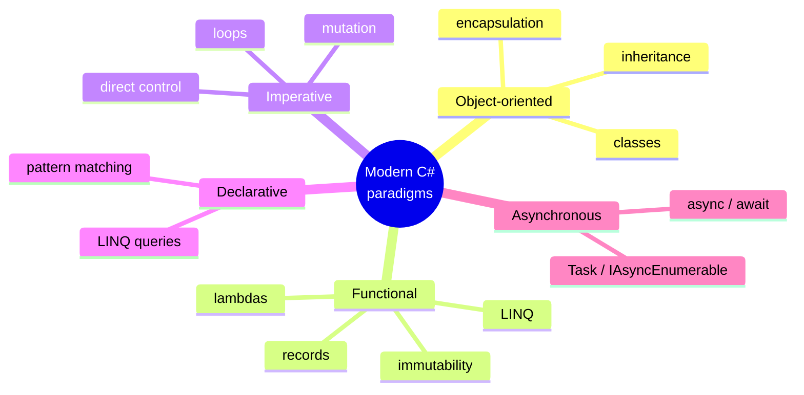

We've spent six pages on the history. Before we leave the story
behind and start writing real code, let's land in the present and
ask: **why is C# worth learning in the 2020s?**

There are five honest answers.

## 1. It's a multi-paradigm language for almost any kind of program

Modern C# is not just an object-oriented language anymore. Over the
years it has grown into a **multi-paradigm** language that supports
several different styles of programming — all in the same project,
sometimes in the same file:

You can write classic OOP with classes and interfaces, *or* write
functional pipelines with LINQ and immutable records, *or* drop into
imperative loops when that's the clearest way — and mix and match
inside one program. That flexibility means a single skill set
takes you very far.

A small taste, with three styles side by side:

<CodeBlock
  adapter="csharp"
  initialCode={`using System;
using System.Collections.Generic;
using System.Linq;

int[] xs = { 3, 1, 4, 1, 5, 9, 2, 6, 5, 3 };

// 1. Imperative
int sumImp = 0;
foreach (var x in xs)
{
    if (x % 2 == 0) sumImp += x;
}
Console.WriteLine($"imperative sum of evens: {sumImp}");

// 2. Functional / declarative with LINQ
int sumFn = xs.Where(x => x % 2 == 0).Sum();
Console.WriteLine($"LINQ sum of evens:        {sumFn}");

// 3. Object-oriented — wrap the data in a small class
var stats = new Stats(xs);
Console.WriteLine($"OO sum of evens:           {stats.SumOfEvens()}");

class Stats
{
    private readonly int[] data;
    public Stats(int[] data) { this.data = data; }
    public int SumOfEvens() => data.Where(x => x % 2 == 0).Sum();
}
`}
/>

Same answer, three styles, one language. That is the everyday
reality of modern C#.

## 2. It is the default language for huge categories of software

These are not aspirations — these are places where, if you walk
into a real team, C# is overwhelmingly likely to be the language
they use.

| Domain | Why C# dominates |
| --- | --- |
| **Enterprise backend systems** | Decades of ecosystem; ASP.NET Core; rich libraries; long-term support |
| **Desktop on Windows** | WPF, WinForms, MAUI; first-class platform integration |
| **Cross-platform desktop and mobile** | .NET MAUI, Avalonia |
| **Game development** | **Unity** — the world's most-used game engine — uses C# for gameplay code |
| **Cloud backends** | Azure was built with C#; AWS Lambda and Google Cloud Functions both support .NET |
| **Internal tools / line-of-business apps** | The single biggest hidden iceberg of C# code in the world |

The result is a job market with steady, well-paid demand at every
seniority level — not the trendiest language of any given year, but
one of the most reliably employable.

## 3. The runtime and ecosystem are excellent

A language is only as good as the platform it runs on. .NET in 2025
is genuinely excellent in ways that take time to appreciate:

- **Performance.** Modern .NET is one of the fastest managed
  runtimes in the world. Every release has measurable wins.
- **Cross-platform.** Same code runs on Windows, Linux, macOS.
- **Tooling.** Visual Studio, JetBrains Rider, VS Code with C# Dev
  Kit. World-class debugging, refactoring, and profiling.
- **NuGet.** A massive package ecosystem (the equivalent of npm /
  pip / Maven for .NET) with hundreds of thousands of libraries.
- **First-class async.** `async`/`await` was popularized by C# and
  remains one of the cleanest async stories of any language.
- **Open source.** The runtime, the compiler (Roslyn), the
  standard library, and most major frameworks are all on GitHub.

## 4. Learning C# teaches you to think like a software engineer

This is the reason most relevant to *this course*. C# is a great
teaching language because it makes you *be explicit* about the
things that matter:

- Every variable has a **type** the compiler checks.
- Every piece of state belongs to a **class** or **struct**.
- Every method has a clearly declared **signature**.
- The **runtime** does memory management for you, but you can see
  *why* it does what it does.
- The language pushes you toward **encapsulation** and
  **modularity** without dragging you into the deep end of
  pointers and manual memory.

That set of habits — *think in types, organize by responsibility,
let the runtime help, write code that other humans can read* —
transfers to every other modern language. Once you can write good
C#, you can write good Java, good TypeScript, good Kotlin, and good
Swift with far less effort. The mental model is shared.

## 5. C# has a future, not just a past

Languages live or die based on whether they're still evolving.
Plenty of important languages have flatlined. C# has not. There has
been a meaningful new C# release essentially every year for the
last decade, and the design team continues to invest in:

- **Performance.** Span\<T\>, `ref struct`, native AOT.
- **Expressiveness.** Pattern matching, records, primary
  constructors.
- **Safety.** Nullable reference types, required members.
- **Interop with new ecosystems.** WebAssembly (which is how this
  very course is running C# in your browser!), cloud-native runtime
  tooling, ML.NET.

Modern C# is not a museum piece. It is one of the most actively
developed languages in mainstream use.

## What you will *not* learn in this course

Even though all of the above is true, this course is deliberately
focused. We will **not** spend time on:

- Heavy ASP.NET Core web tutorials
- Cloud and DevOps tooling (Azure, Docker, Kubernetes)
- Complex dependency injection containers
- Advanced multithreading and parallelism
- The Gang of Four design patterns catalogue
- Interview / competitive-programming puzzles

Those are important *next* steps. They are not appropriate *first*
steps. This course gets you to the point where any of those topics
becomes approachable.

## What you *will* be able to do at the end of this course

After working through the remaining chapters, you will be able to:

- Read and understand small to medium C# programs without
  Stack Overflow holding your hand.
- Write your own programs that use variables, types, control
  flow, methods, classes, objects, collections, exceptions, and
  basic file I/O.
- Decompose a small real-world problem into a few well-designed
  classes and methods.
- Reason about what is happening *inside the runtime* when your
  code runs.
- Diagnose and fix bugs in your own programs systematically,
  rather than by guessing.
- Pick up a more advanced topic — ASP.NET Core, Unity, MAUI,
  whatever — and not feel lost on the fundamentals.

## A final taste before we begin

Here is a slightly bigger program that uses ideas from every
upcoming part of the course. You are not expected to understand it
all yet. Read it, run it, and notice that even though it does
several things, the *shape* of the code is calm and organized.

<CodeBlock
  adapter="csharp"
  initialCode={`using System;
using System.Collections.Generic;
using System.Linq;

record Book(string Title, string Author, int Year);

class Library
{
    private readonly List<Book> books = new();

    public void Add(Book b) => books.Add(b);

    public IEnumerable<Book> ByAuthor(string author) =>
        books.Where(b => b.Author == author);

    public int Count => books.Count;
}

class Program
{
    static void Main()
    {
        var lib = new Library();
        lib.Add(new Book("The Pragmatic Programmer", "Hunt",     1999));
        lib.Add(new Book("Code Complete",             "McConnell", 2004));
        lib.Add(new Book("Refactoring",               "Fowler",   1999));

        Console.WriteLine($"library has {lib.Count} books");

        foreach (var b in lib.ByAuthor("Fowler"))
        {
            Console.WriteLine($"  by Fowler: {b.Title} ({b.Year})");
        }
    }
}
`}
/>

By the end of this course, every line above will feel obvious.

## Test your understanding

<MultipleChoice
  markdown={`Which of the following best describes "modern C# is multi-paradigm"?

- Modern C# only supports object-oriented programming
  > That was almost true in 1.0; it is no longer true.
- Modern C# is a purely functional language
  > It supports functional style, but it is not pure.
- [o] Modern C# supports object-oriented, functional, imperative, and declarative styles in the same program, and you can mix and match as appropriate
  > That flexibility is one of C#'s biggest strengths today.
- Modern C# only supports declarative LINQ queries
  > LINQ is one important feature, but far from the whole language.`}
/>

<MultipleChoice
  markdown={`Why is C# a good language to *learn programming with*, as opposed to just for getting a specific job?

- It is the shortest language to type
  > C# is not particularly terse.
- It is the only language with a garbage collector
  > Many languages have garbage collectors.
- [o] It forces you to be explicit about types, organization, and responsibilities — habits that transfer to every other modern language
  > The mental model you build here applies to Java, Kotlin, TypeScript, Swift, and many others.
- It runs faster than every other language
  > Performance varies; that's not the educational argument.`}
/>

<Callout type="success">
That's the end of the story. The rest of this course is hands-on.
Next: **computational thinking** — the very first habit any
programmer develops, and the one that pays off forever.
</Callout>
