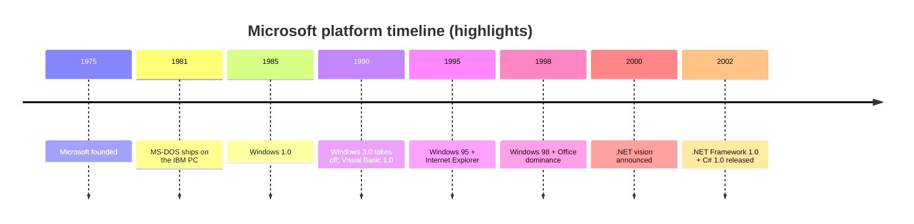
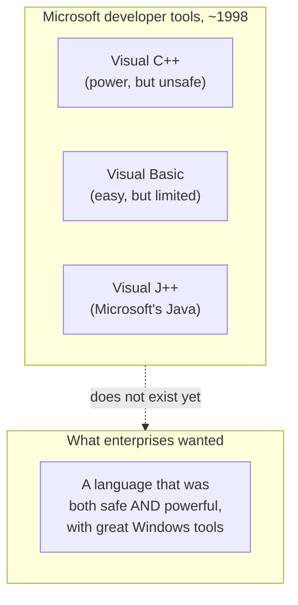
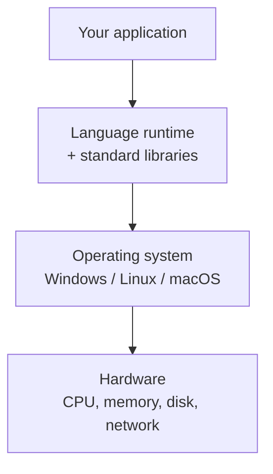

To understand why C# exists, you have to understand the world C# was
born into. By the late 1990s, Microsoft was not just *a* software
company. It was, by an enormous margin, the dominant platform for
business computing on the planet.

This page is a quick tour of that world. We won't run any C# code
here — just lay down the historical scaffolding you'll need for the
rest of the story.

## From a startup to a platform

Microsoft began in 1975 as a small company writing programming
language tools. Its first major product was a BASIC interpreter for
the Altair 8800 — a hobbyist computer. The company's big break came
in 1981, when IBM chose Microsoft's **MS-DOS** as the operating
system for its new IBM PC.

By 1995, **Windows 95** made graphical computing mainstream. By the
late 1990s, the vast majority of office computers in the world ran
Windows, Microsoft Office, and Internet Explorer. Microsoft wasn't
just a vendor — it was the *substrate* most business software ran
on.

## What "enterprise software" actually means

"Enterprise software" is a vague phrase, but it has a concrete
meaning. It is the unglamorous code that runs the business world:

- **Accounting and payroll systems.** Every paycheck issued in a
  Fortune 500 company.
- **Inventory and supply chain systems.** What's in the warehouse,
  what was shipped, what needs reordering.
- **Customer relationship management (CRM).** Who your customers
  are, what they bought, when to call them.
- **Internal line-of-business tools.** The form a bank teller fills
  in when you open an account; the screen a hospital nurse uses to
  enter a patient's vitals.

This software has unglamorous but ferocious requirements:

| Requirement | Why it matters |
| --- | --- |
| **Reliability** | Payroll cannot be "down for maintenance" on payday. |
| **Long lifetime** | The same system may run for 20 years. |
| **Maintainability** | Many developers will work on it over decades. |
| **Integration** | It must talk to databases, printers, networks, and other systems. |
| **Auditability** | Regulators may demand to see exactly what happened. |

These requirements explain almost every decision .NET and C# would
later make.

## The Microsoft developer toolchain before .NET

By the late 1990s, Microsoft offered three major tools for building
software on Windows:

Each tool had real strengths and real weaknesses:

- **Visual C++** gave you raw, fast access to Windows. But C++ is
  notoriously unsafe: pointer bugs, memory leaks, and crashes were
  daily companions. Productivity was low. Hiring junior developers
  who could be trusted with C++ was hard.
- **Visual Basic** was the opposite — it made it astonishingly easy
  to drag a button onto a form and write a few lines to make it
  work. But it was not really suitable for large, complex systems.
- **Visual J++** was Microsoft's version of Java. It had the safety
  developers wanted, but it became the center of a *huge* legal and
  technical fight with Sun Microsystems (the owner of Java), which
  we'll get to in the next chapter.

What was missing was a *single* language that was as safe as Java,
as productive as Visual Basic, and as powerful as C++ — and that
was deeply integrated with Windows.

## COM, ActiveX, and the integration headache

A second problem was that Windows applications needed to *talk to
each other* — Excel embedding a chart from another tool, a Word
document calling out to a custom plugin, a banking app driving a
spreadsheet. Microsoft's answer was a technology called **COM** (the
Component Object Model), later extended as **ActiveX**.

COM worked. It was used everywhere. But it was also famously brittle:

- Registering and unregistering components in the Windows registry.
- Cryptic error codes like `HRESULT 0x80004005`.
- Each language (C++, VB, J++) had a completely different way of
  using COM.

Senior engineers at Microsoft increasingly believed that the next
big platform needed to fix *all* of this at once: safety,
productivity, integration, and language interoperability.

## What a "platform" really is

Before we move on, it's worth pausing on the word **platform**,
because it will come up constantly.

A platform is everything *underneath* your application that you
don't have to write yourself: the operating system, the runtime,
the standard library, the file system, the network stack, the GUI
framework. The job of a great platform is to make the things you
*do* write feel small and focused.

By the year 2000, Microsoft was preparing to bet the company on a
new platform that would unify its languages, fix the safety
problems of C++, integrate cleanly across applications, and (it was
hoped) win the next decade of computing.

That platform would be called **.NET**, and its flagship language
would be **C#**.

But before we get there, we have one more thread to weave in: the
language that frightened Microsoft enough to motivate all of this in
the first place — **Java**.

## Test your understanding

<MultipleChoice
  markdown={`Which of these is the *best* description of "enterprise software"?

- Software written only by very large companies
  > Closer, but the defining trait isn't the company size — it's what the software *does*.
- Games and consumer apps
  > Those exist, but are a different category.
- [o] Long-lived business software (payroll, CRM, inventory, line-of-business tools) with strong requirements around reliability, integration, and maintainability
  > Correct. Those requirements drove most of the design choices in .NET and C#.
- Software written exclusively in C#
  > Enterprise software predates C# by decades.`}
/>

<MultipleChoice
  markdown={`What was the main gap in Microsoft's developer toolchain in the late 1990s?

- Microsoft had no programming languages of its own
  > It had several — Visual C++, Visual Basic, Visual J++.
- Windows wasn't popular enough to write software for
  > Windows was overwhelmingly dominant on business desktops.
- [o] There was no single language that combined safety, productivity, and power, with deep Windows integration
  > Correct. Each existing tool excelled at one dimension and was weak on another. That gap is exactly what C# was created to fill.
- C++ wasn't installed on enough machines
  > Compiler installation wasn't the bottleneck.`}
/>

<Callout type="success">
Next: the language that pushed Microsoft to build .NET in the first
place. On to **Java and the rise of managed runtimes**.
</Callout>
