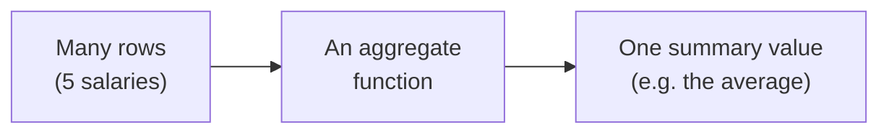
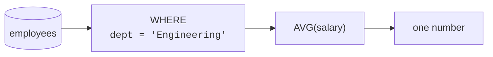

So far every query returned roughly one result row per table row.
Now we flip that: **aggregate functions** take *many* rows and boil
them down to a **single summary value**. "How many customers?"
"What is the total revenue?" "What is the average order size?" These
are aggregate questions, and they are the heart of reporting.

## From many rows to one number

The five core aggregates cover most needs:

| Function | Answers | Example |
| --- | --- | --- |
| `COUNT(*)` | How many rows? | number of employees |
| `SUM(col)` | What is the total? | total payroll |
| `AVG(col)` | What is the average? | average salary |
| `MIN(col)` | What is the smallest? | lowest salary |
| `MAX(col)` | What is the largest? | highest salary |

## Counting rows

`COUNT(*)` counts rows. Run it and notice the result is a single row
with a single number — the whole table collapsed to a count:

<SqlCodeBlock
  dialect="postgres"
  title="How many employees are there?"
  initSql={`CREATE TABLE employees (
  id SERIAL PRIMARY KEY, name TEXT, dept TEXT, salary NUMERIC
);
INSERT INTO employees (name, dept, salary) VALUES
  ('Alice','Engineering',120000),('Bob','Engineering',95000),
  ('Carol','Sales',80000),('Dave','Sales',72000),('Eve','Marketing',68000);`}
  starterCode={`SELECT
  COUNT(*) AS employee_count
FROM
  employees;`}
/>

## Totals, averages, extremes

You can compute several aggregates in one query. Each one reads the
same set of rows and produces its own summary:

<SqlCodeBlock
  dialect="postgres"
  title="A one-line salary report"
  initSql={`CREATE TABLE employees (
  id SERIAL PRIMARY KEY, name TEXT, dept TEXT, salary NUMERIC
);
INSERT INTO employees (name, dept, salary) VALUES
  ('Alice','Engineering',120000),('Bob','Engineering',95000),
  ('Carol','Sales',80000),('Dave','Sales',72000),('Eve','Marketing',68000);`}
  starterCode={`SELECT
  COUNT(*) AS headcount,
  SUM(salary) AS total_payroll,
  ROUND(AVG(salary)) AS avg_salary,
  MIN(salary) AS lowest,
  MAX(salary) AS highest
FROM
  employees;`}
/>

One row, five numbers — a complete summary of the whole table. This
single query would be a whole afternoon of manual spreadsheet work
on a large dataset.

## Aggregates over a filtered set

Aggregates respect `WHERE`. The filter runs first, then the
aggregate summarizes only the surviving rows. "Average salary *in
Engineering*" is just an average with a filter:

<SqlCodeBlock
  dialect="postgres"
  title="Average salary among engineers only"
  initSql={`CREATE TABLE employees (
  id SERIAL PRIMARY KEY, name TEXT, dept TEXT, salary NUMERIC
);
INSERT INTO employees (name, dept, salary) VALUES
  ('Alice','Engineering',120000),('Bob','Engineering',95000),
  ('Carol','Sales',80000),('Dave','Sales',72000),('Eve','Marketing',68000);`}
  starterCode={`SELECT
  ROUND(AVG(salary)) AS avg_eng_salary
FROM
  employees
WHERE
  dept = 'Engineering';`}
/>

## Two subtleties to remember

**1. Aggregates ignore NULLs (except `COUNT(*)`).** `AVG`, `SUM`,
`MIN`, `MAX`, and `COUNT(column)` skip rows where that column is
`NULL`. Only `COUNT(*)` counts every row regardless. This is usually
what you want — an unknown salary should not drag an average toward
zero.

**2. `COUNT(*)` vs `COUNT(column)`.** `COUNT(*)` counts rows;
`COUNT(phone)` counts rows where `phone` is **not** `NULL`. The gap
between them tells you how many values are missing:

<SqlCodeBlock
  dialect="postgres"
  title="Counting rows vs counting present values"
  initSql={`CREATE TABLE customers (
  id SERIAL PRIMARY KEY, name TEXT, phone TEXT
);
INSERT INTO customers (name, phone) VALUES
  ('Ada','555-0101'),('Grace',NULL),('Linus','555-0102'),('Mae',NULL);`}
  starterCode={`SELECT
  COUNT(*) AS total_rows,
  COUNT(phone) AS rows_with_phone
FROM
  customers;`}
/>

Four rows, but only two phones on file — the difference reveals the
two missing values at a glance.

## Check your understanding

<MultipleChoice
  markdown={`What does an **aggregate function** like \`SUM\` or \`AVG\` do?

- It returns one result row for each row in the table.
  > That describes ordinary column selection; aggregates collapse many rows into a summary.
- [o] It combines many rows into a single summary value, such as a total or an average.
  > Aggregates reduce a set of rows down to one number, which is the basis of reporting.
- It deletes rows that match a condition.
  > Deleting rows is \`DELETE\`; aggregates only read and summarize.
- It sorts the rows.
  > Sorting is \`ORDER BY\`; aggregation summarizes rather than orders.

Aggregate functions reduce many rows to a single summarizing value.`}
/>

<MultipleChoice
  markdown={`A table has 4 rows; the \`phone\` column is \`NULL\` in 2 of them. What do \`COUNT(*)\` and \`COUNT(phone)\` return?

- Both return 4.
  > \`COUNT(phone)\` skips NULLs, so it cannot also be 4 when two phones are missing.
- Both return 2.
  > \`COUNT(*)\` counts every row regardless of NULLs, so it is 4, not 2.
- [o] \`COUNT(*)\` returns 4 (all rows); \`COUNT(phone)\` returns 2 (only non-NULL phones).
  > \`COUNT(*)\` counts rows, while \`COUNT(column)\` counts only rows where that column has a value.
- \`COUNT(*)\` returns 2; \`COUNT(phone)\` returns 4.
  > It is the reverse: counting all rows gives the larger number, and counting present phones gives the smaller.

\`COUNT(*)\` counts all rows; \`COUNT(column)\` counts only non-NULL values in that column.`}
/>

<MultipleChoice
  markdown={`How does \`AVG(salary)\` treat rows where \`salary\` is \`NULL\`?

- It counts them as 0, lowering the average.
  > Treating unknown as zero would distort the average; SQL avoids that by ignoring NULLs.
- [o] It ignores those rows, averaging only the rows that have a salary value.
  > Aggregates like \`AVG\` skip NULLs, so the average reflects only known salaries.
- It raises an error.
  > NULLs do not cause an error in \`AVG\`; they are simply excluded.
- It returns NULL for the whole query.
  > A single NULL salary does not nullify the result; only the NULL rows are skipped.

\`AVG\` (like \`SUM\`, \`MIN\`, \`MAX\`) ignores NULLs and summarizes only the present values.`}
/>

## Practice challenge

<SqlChallengeCard
  dialect="postgres"
  title="Count, total, and average"
  instructions={`The \`payments\` table has an \`amount\` column. Return a single row with the number of payments as \`n\`, their total as \`total\`, and their average as \`avg\`.`}
  initSql={`CREATE TABLE payments (
  id     SERIAL PRIMARY KEY,
  amount NUMERIC(8, 2) NOT NULL
);
INSERT INTO payments (amount) VALUES (50.00), (20.00), (30.00), (100.00);`}
  starterCode={`-- One row with three aggregate columns:
SELECT
FROM
  payments;`}
  solutionSql={`SELECT
  COUNT(*) AS n,
  SUM(amount) AS total,
  AVG(amount) AS avg
FROM
  payments;`}
  tests={[
    {
      id: "columns",
      name: "Returns n, total, avg",
      description: "Three aggregate columns, named with aliases.",
      expectedColumns: ["n", "total", "avg"],
    },
    {
      id: "row_count",
      name: "Returns a single summary row",
      description: "Aggregates over the whole table collapse to one row.",
      expectedRowCount: 1,
    },
    {
      id: "matches",
      name: "Matches the reference solution",
      description: "n = 4, total = 200.00, avg = 50.00.",
      matchesSolution: true,
    },
  ]}
/>
