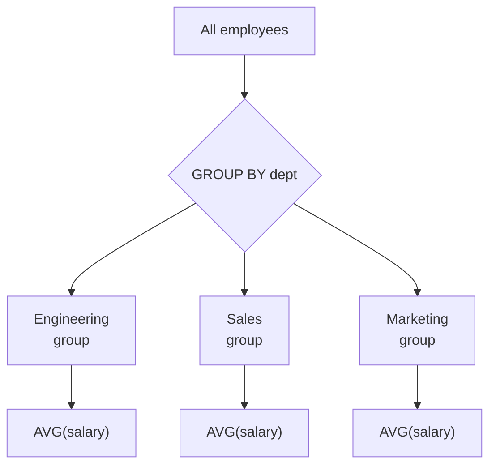
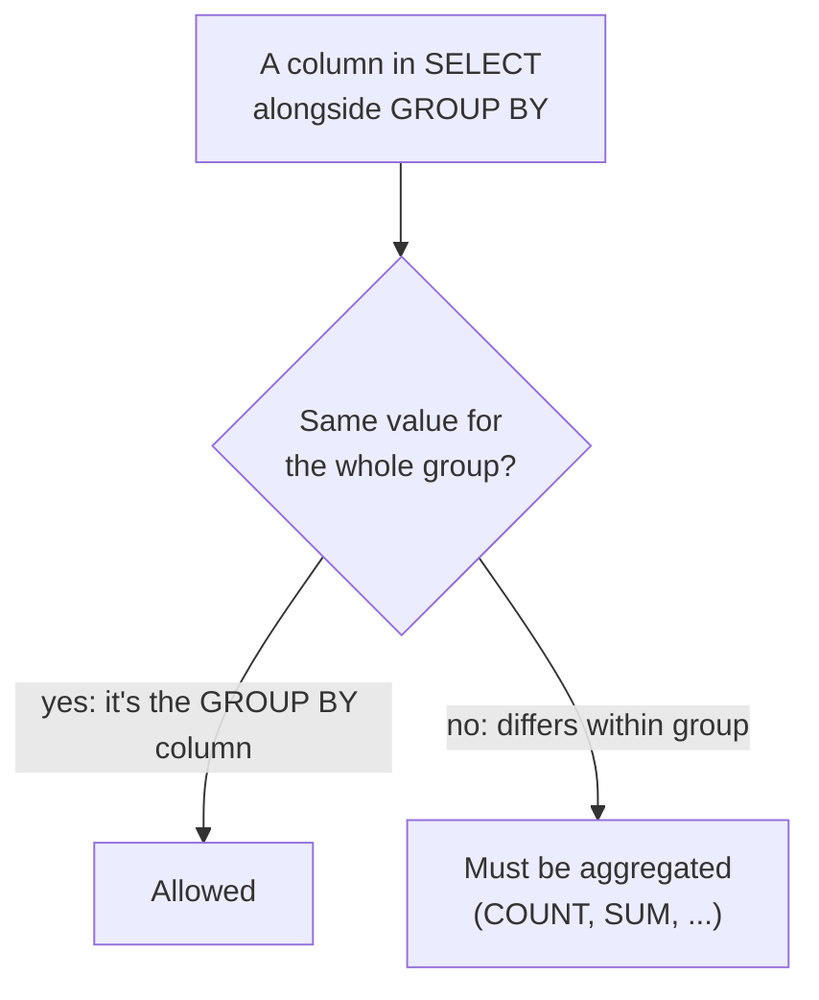
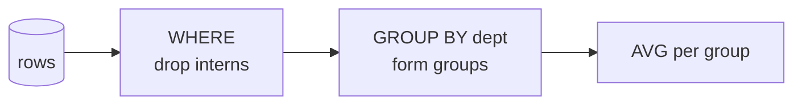

Aggregates gave us *one* number for a whole table. But real
questions are usually *per category*: revenue **per product**,
headcount **per department**, orders **per customer**. `GROUP BY` is
the tool for exactly this, and it is one of the most powerful ideas
in SQL. Take your time — there are extra checks at the end.

## The idea: split, then summarize

`GROUP BY column` divides the rows into **groups** that share the
same value in that column, then computes the aggregate **once per
group** instead of once for the whole table.

Instead of one average salary, you get one average salary *per
department* — a far more useful answer.

## Your first GROUP BY

<SqlCodeBlock
  dialect="postgres"
  title="Headcount and average pay per department"
  initSql={`CREATE TABLE employees (
  id SERIAL PRIMARY KEY, name TEXT, dept TEXT, salary NUMERIC
);
INSERT INTO employees (name, dept, salary) VALUES
  ('Alice','Engineering',120000),('Bob','Engineering',95000),
  ('Carol','Sales',80000),('Dave','Sales',72000),('Eve','Marketing',68000);`}
  initialCode={`SELECT
  dept,
  COUNT(*)           AS headcount,
  ROUND(AVG(salary)) AS avg_salary
FROM employees
GROUP BY dept
ORDER BY dept;`}
/>

One row per department, each with its own count and average. Read it
as: *"for each department, how many people and what is the average
salary."* The `dept` column tells you which group each summary row
describes.

## The golden rule of GROUP BY

Here is the rule that, once understood, makes `GROUP BY` click — and
whose violation causes the most common error beginners hit:

> Every column in your `SELECT` must either be **in the `GROUP BY`**
> or be wrapped in an **aggregate function.**

Why? Because each output row represents a *whole group*. A column
like `dept` is safe — it is the same for everyone in the group. But
a column like `name` differs *within* the group, so the database
cannot pick a single value for the group's row. It refuses, rather
than guess.

<Callout type="warn" title="The classic error">
`SELECT dept, name, COUNT(*) ... GROUP BY dept` fails, because
`name` is neither grouped nor aggregated — there are many names in
one department, so which would the single Engineering row show? If
you want names, either group by name too, or aggregate it (e.g.
`STRING_AGG(name, ', ')` to list them).
</Callout>

## Grouping by more than one column

You can group by several columns; the groups become the unique
*combinations* of those columns. "Sales per region per year" groups
by both region and year:

<SqlCodeBlock
  dialect="postgres"
  title="Total sales per region per year"
  initSql={`CREATE TABLE sales (
  id SERIAL PRIMARY KEY, region TEXT, year INTEGER, amount NUMERIC
);
INSERT INTO sales (region, year, amount) VALUES
  ('West', 2025, 100), ('West', 2025, 50), ('West', 2026, 200),
  ('East', 2025, 80),  ('East', 2026, 120), ('East', 2026, 60);`}
  initialCode={`SELECT region, year, SUM(amount) AS total
FROM sales
GROUP BY region, year
ORDER BY region, year;`}
/>

Each row is now one (region, year) pair. Grouping by multiple
columns is how you build cross-tabulated summaries.

## Where GROUP BY sits in the query

Filtering with `WHERE` happens **before** grouping — so you can
restrict which rows enter the groups:

<SqlCodeBlock
  dialect="postgres"
  title="Average salary per department, excluding interns"
  initSql={`CREATE TABLE employees (
  id SERIAL PRIMARY KEY, name TEXT, dept TEXT, salary NUMERIC, is_intern BOOLEAN
);
INSERT INTO employees (name, dept, salary, is_intern) VALUES
  ('Alice','Engineering',120000,false),('Bob','Engineering',95000,false),
  ('Carol','Sales',80000,false),('Dave','Sales',40000,true),('Eve','Sales',72000,false);`}
  initialCode={`SELECT dept, ROUND(AVG(salary)) AS avg_salary
FROM employees
WHERE is_intern = false
GROUP BY dept
ORDER BY dept;`}
/>

`WHERE` thins the rows first; *then* the survivors are grouped and
averaged. Filtering on the *aggregated* results (e.g. "only groups
with more than 5 people") needs a different clause — `HAVING` — which
is the next page.

## Check your understanding

<MultipleChoice
  markdown={`What does \`GROUP BY dept\` do to the rows before aggregating?

- It deletes all but one row per department.
  > No rows are deleted; they are organized into groups so each group can be summarized.
- [o] It splits the rows into groups that share the same \`dept\` value, so an aggregate is computed once per group.
  > Grouping buckets rows by the column's value, then each bucket gets its own aggregate result.
- It sorts the rows by department.
  > Grouping is not sorting; you would still add \`ORDER BY\` for a guaranteed order.
- It renames the \`dept\` column.
  > \`GROUP BY\` organizes rows; it does not rename columns.

\`GROUP BY\` buckets rows by a shared value so each bucket is summarized separately.`}
/>

<MultipleChoice
  markdown={`This query fails: \`SELECT dept, name, COUNT(*) FROM employees GROUP BY dept;\`. Why?

- Because \`COUNT(*)\` cannot be used with \`GROUP BY\`.
  > \`COUNT(*)\` is exactly what you use with \`GROUP BY\`; it is not the problem.
- [o] Because \`name\` is neither in the \`GROUP BY\` nor wrapped in an aggregate, so there is no single \`name\` for each department group.
  > Each output row stands for a whole department, but a department has many names, so the database cannot choose one.
- Because you cannot select more than one column at a time.
  > Selecting multiple columns is fine; the issue is specifically the ungrouped, unaggregated \`name\`.
- Because \`dept\` must be aggregated.
  > \`dept\` is the grouping column, so it is correctly allowed as-is; \`name\` is the offender.

Every selected column must be grouped or aggregated, and \`name\` is neither.`}
/>

<MultipleChoice
  markdown={`When you \`GROUP BY region, year\`, what does each result row represent?

- One row per region only, ignoring year.
  > Both columns participate, so year is not ignored; groups are formed from the pair.
- [o] One row per unique combination of region and year.
  > Grouping by several columns forms a group for each distinct combination of their values.
- One row per individual sale.
  > Grouping collapses individual sales into summaries per combination, not per sale.
- A single grand-total row.
  > A single total would be a query with no \`GROUP BY\`; here the totals are split per combination.

Grouping by multiple columns produces one summary row per distinct combination of those columns.`}
/>

<MultipleChoice
  markdown={`In a query with both \`WHERE\` and \`GROUP BY\`, which happens first?

- \`GROUP BY\` runs first, then \`WHERE\` filters the groups.
  > Filtering individual rows happens before they are gathered into groups; filtering groups is a different clause (\`HAVING\`).
- [o] \`WHERE\` filters individual rows first, then the surviving rows are grouped.
  > \`WHERE\` thins the raw rows, and only those that remain are organized into groups and aggregated.
- They run at the same time with no defined order.
  > There is a definite order: row filtering precedes grouping.
- \`WHERE\` cannot be used together with \`GROUP BY\`.
  > \`WHERE\` and \`GROUP BY\` are frequently combined; \`WHERE\` simply applies first.

\`WHERE\` filters rows before grouping; to filter the groups themselves you use \`HAVING\`.`}
/>
