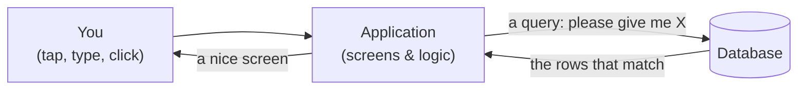
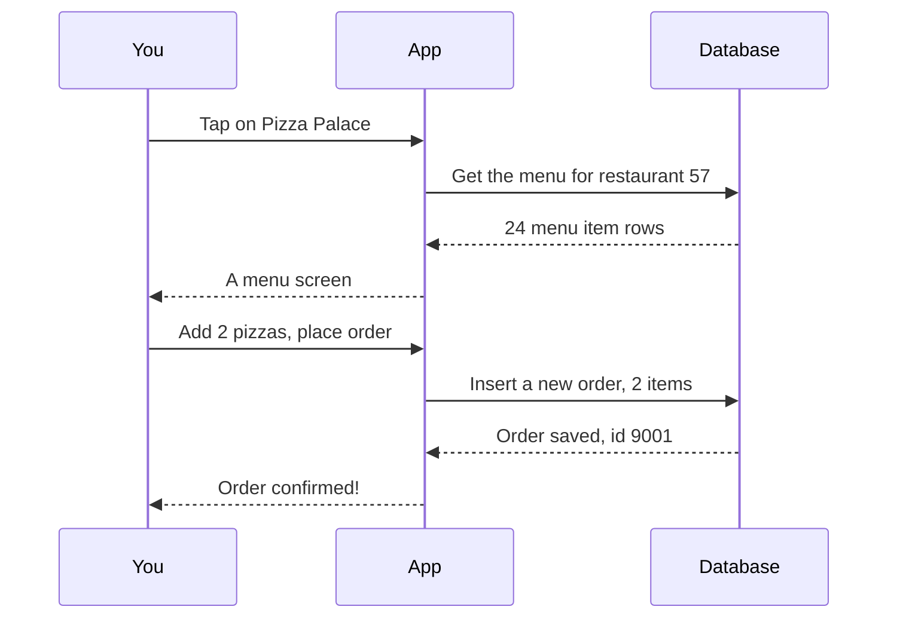
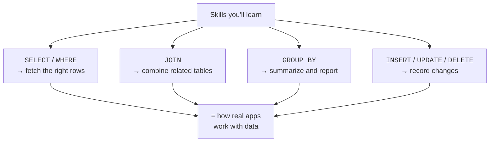

You now know what a database is and why it exists. Let us see where
it lives in the software you use every day — because once you can
picture that, SQL stops being abstract and starts being obviously
useful.

## The app is not the data

When you use an app — a store, a chat, a banking site — there are
really **two separate things** working together:

1. The **application**: the screens, buttons, and logic you
   interact with.
2. The **database**: the quiet, screen-less system that remembers
   everything.

The application **never stores the real data itself**. Every time
it needs to remember or retrieve something, it sends a request to
the database and uses the answer to build what you see.

## What is a "query"?

A **query** is a request you send to a database, written in SQL. The
word sounds technical, but a query is just a **precise question or
instruction**:

- "Give me all messages in this chat, newest first." (a question)
- "Add this new order." (an instruction)
- "Change this user's email." (an instruction)
- "Delete this saved item." (an instruction)

The database reads the query, does the work, and sends back either
the requested rows or a confirmation that the change happened.

<Callout type="info" title="Queries do more than ask questions">
Although "query" sounds like *asking*, in practice SQL queries also
*change* data — inserting, updating, and deleting rows. We will
learn the asking kind (`SELECT`) most deeply, because reading data
well is the foundation for everything else.
</Callout>

## A concrete trip through an app

Suppose you open a food-delivery app and tap a restaurant. Here is
the conversation happening behind the scenes:

Notice the rhythm: **every** meaningful action becomes one or more
queries. Show a menu? That is a query. Place an order? That is a
query. View past orders? Another query. The app is, to a
surprising degree, a friendly face on top of a stream of SQL.

## Why this matters for you

Understanding this picture changes how you read the rest of the
course. When you learn `SELECT ... WHERE`, you are learning exactly
how an app fetches "this user's unread messages." When you learn
`JOIN`, you are learning how an app shows "your orders, with each
restaurant's name attached." You are not learning trivia — you are
learning the language that powers the software world.

## Check your understanding

<MultipleChoice
  markdown={`In a typical app, where does the real, long-lived data actually live?

- Inside the buttons and screens of the application itself.
  > The visible part of an app builds screens, but it does not durably store the underlying data; it asks the database for it.
- [o] In the database, which the application queries whenever it needs to store or retrieve information.
  > The application is a face on top of the data; the database is the system that durably remembers everything.
- Only in the user's memory.
  > People forget; the whole point of a database is durable, reliable storage independent of any person.
- Nowhere — apps recalculate everything each time.
  > Apps must remember orders, messages, and accounts between sessions, which is exactly why they rely on a database.

The application handles interaction; the database handles durable storage, and the two communicate through queries.`}
/>

<MultipleChoice
  markdown={`What is a SQL **query**, in plain terms?

- A type of button inside an application.
  > Buttons are part of the application's interface; a query is the request the app sends to the database when a button is used.
- A backup copy of the database.
  > A backup is a safety copy of data; a query is an instruction or question sent to the database.
- [o] A precise request — a question or an instruction — sent to the database, written in SQL.
  > Whether it reads data or changes it, a query is the message that tells the database exactly what to do.
- The physical disk where data is stored.
  > Storage hardware holds the data; a query is the request that asks the database to read or change that data.

A query is how you ask a database a question or tell it to make a change.`}
/>
