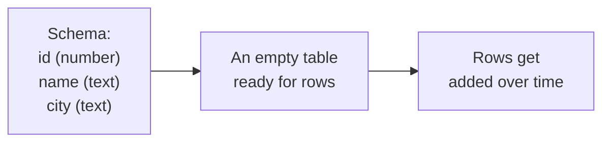

You do not need to know how a car engine works to drive. Likewise,
you do not need to know the deep internals of a database to use one
well. But a *little* intuition about how data is stored will make
everything that follows click into place.

<svg
  viewBox="0 0 640 200"
  role="img"
  aria-label="A jumble of colored facts on the left is lined up into a neat grid of rows and columns on the right"
  style={{ display: "block", width: "100%", maxWidth: "640px", height: "auto", margin: "2.5rem auto" }}
>
  <g style={{ color: "var(--ds-blue-500)" }} fill="currentColor">
    <circle cx="105" cy="60" r="9" />
    <rect x="126" y="114" width="20" height="13" rx="4" transform="rotate(-15 136 120)" fillOpacity="0.7" />
    <circle cx="160" cy="160" r="6" fillOpacity="0.6" />
  </g>
  <g style={{ color: "var(--ds-green-500)" }} fill="currentColor">
    <rect x="142" y="44" width="17" height="17" rx="5" transform="rotate(20 150 52)" />
    <circle cx="178" cy="95" r="10" fillOpacity="0.8" />
  </g>
  <g style={{ color: "var(--ds-yellow-500)" }} fill="currentColor">
    <circle cx="90" cy="112" r="7" />
    <polygon points="100,164 118,164 109,148" fillOpacity="0.8" />
  </g>
  <g fill="currentColor">
    <rect x="232" y="100" width="46" height="8" rx="4" opacity="0.25" />
    <polygon points="278,88 278,120 308,104" opacity="0.3" />
  </g>
  <g fill="currentColor" opacity="0.08">
    <rect x="350" y="58" width="56" height="28" rx="6" />
    <rect x="412" y="58" width="56" height="28" rx="6" />
    <rect x="474" y="58" width="56" height="28" rx="6" />
    <rect x="350" y="92" width="56" height="28" rx="6" />
    <rect x="412" y="92" width="56" height="28" rx="6" />
    <rect x="474" y="92" width="56" height="28" rx="6" />
    <rect x="350" y="126" width="56" height="28" rx="6" />
    <rect x="412" y="126" width="56" height="28" rx="6" />
    <rect x="474" y="126" width="56" height="28" rx="6" />
  </g>
  <g style={{ color: "var(--ds-blue-500)" }} fill="currentColor">
    <circle cx="378" cy="72" r="6" />
    <circle cx="440" cy="106" r="6" />
    <circle cx="502" cy="106" r="6" fillOpacity="0.6" />
    <circle cx="440" cy="140" r="6" fillOpacity="0.6" />
  </g>
  <g style={{ color: "var(--ds-green-500)" }} fill="currentColor">
    <circle cx="440" cy="72" r="6" />
    <circle cx="378" cy="106" r="6" />
    <circle cx="502" cy="140" r="6" />
  </g>
  <g style={{ color: "var(--ds-yellow-500)" }} fill="currentColor">
    <circle cx="502" cy="72" r="6" />
    <circle cx="378" cy="140" r="6" />
  </g>
</svg>

## From facts to rows

Almost all useful data is a collection of **facts about things**.
"This customer is named Ada and lives in Toronto." "This order was
placed on March 3rd for \$42." A database's job is to keep millions
of such facts tidy.

The relational database's big idea is to group facts into neat
**rectangles**. Each rectangle is a **table**. Inside a table:

- A **row** is one thing — one customer, one order, one product.
- A **column** is one attribute of those things — a name, a city,
  a price.
- A **cell** (one row, one column) holds a single value.

Table: `customers`

| id | name | city |
| --- | --- | --- |
| 1 | Ada | Toronto |
| 2 | Linus | Helsinki |
| 3 | Grace | New York |

That labeled grid of rows and columns is the single most important
image in this entire course. Almost everything we do is either
*reading* such a grid, *changing* it, or *combining* two of them.

## Why a grid?

Why store data as rectangles instead of, say, paragraphs of text?
Because a grid makes questions answerable in a uniform way:

- "How many rows are there?" → count the rows.
- "Which rows have `city = 'Toronto'`?" → check one column.
- "What is the average price?" → look down the `price` column.

Every value has a **known place** (which row, which column) and a
**known kind** (text, number, date). That regularity is what lets a
computer answer questions about the data mechanically and quickly.

<Callout type="info" title="Same shape, everywhere">
This rows-and-columns shape is the same one you see in a
spreadsheet — and that is no accident. The grid is just an
extremely natural way to lay out facts about many similar things.
The difference is what the *system around the grid* can do.
</Callout>

## A table is described by its columns

Before a table can hold any rows, the database needs to know its
**shape**: what columns exist and what kind of value each holds.
This description is called the table's **schema**.

You define the schema once ("a customer has a numeric id, a text
name, and a text city"), and from then on every row must fit that
shape. This is a feature, not a restriction: because every row has
the same columns of the same kinds, the database can store, check,
and search them efficiently and catch mistakes early.

## Seeing it for real

Here is the table from the diagram, brought to life. Click *Run* to
see the stored grid come back to you.

<SqlCodeBlock
  dialect="postgres"
  title="A stored table is just a grid of rows and columns"
  initSql={`CREATE TABLE customers (
  id   INTEGER,
  name TEXT,
  city TEXT
);
INSERT INTO customers (id, name, city) VALUES
  (1, 'Ada',   'Toronto'),
  (2, 'Linus', 'Helsinki'),
  (3, 'Grace', 'New York');`}
  starterCode={`SELECT
  *
FROM
  customers;`}
/>

The `*` means "every column." The result you see — three rows,
three columns — *is* the stored data. We will spend the whole
**Querying Data** section learning to ask for exactly the slices we
want instead of everything.

## Check your understanding

<MultipleChoice
  markdown={`In a relational table, what does a single **row** represent?

- One attribute, such as "city," shared by all the data.
  > That describes a *column* — a single attribute. A row is something else.
- [o] One thing — for example one customer or one order — with a value for each column.
  > A row gathers all the attributes of a single entity into one record across the table's columns.
- The name of the table.
  > The table name labels the whole grid, not an individual row.
- The rules describing what columns the table has.
  > Those rules are the table's *schema*, not a row.

A row is a single record: one thing, described across all of the table's columns.`}
/>

<MultipleChoice
  markdown={`A table's **schema** describes what about the table?

- The current number of rows it contains.
  > The row count changes constantly as data is added or removed; the schema is the stable description of the table's structure.
- [o] Its structure — which columns exist and what kind of value each column holds.
  > Defining the columns and their types up front is what lets the database store, validate, and search rows consistently.
- The colors used to display the table.
  > Appearance is a property of whatever tool displays the data, not of the database schema.
- The list of people allowed to read the table.
  > Access rules are a separate concern; the schema is about the table's columns and their types.

The schema is the blueprint of a table: its columns and the type of value each one stores.`}
/>
