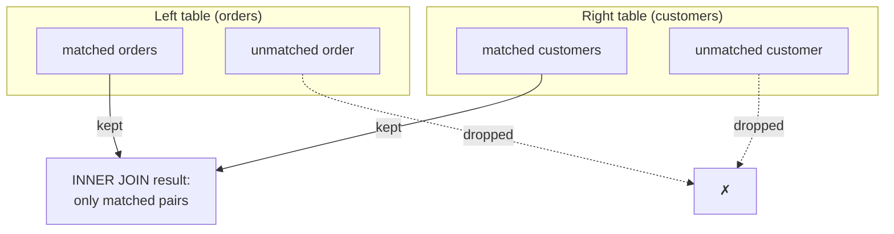

The join you met on the previous page was an **inner join**, the
default and most common kind. Its rule is simple and worth saying
precisely: an inner join keeps **only the rows that have a match in
both tables.** Rows with no partner are dropped.

## The rule, in a picture

If an order points to a customer who exists → it appears. If a
customer has no orders → they do not appear. Only the **overlap**
survives.

## Seeing what survives and what drops

This data is rigged to show the rule. There is an order with no
matching customer, and a customer with no orders. Watch both vanish
from an inner join:

<SqlCodeBlock
  dialect="postgres"
  title="Inner join keeps only matches"
  initSql={`CREATE TABLE customers (
  id   INTEGER PRIMARY KEY,
  name TEXT
);
CREATE TABLE orders (
  id          INTEGER PRIMARY KEY,
  customer_id INTEGER,
  amount      NUMERIC
);
INSERT INTO customers (id, name) VALUES
  (1, 'Ada'),
  (2, 'Grace'),
  (3, 'Linus');         -- Linus has no orders
INSERT INTO orders (id, customer_id, amount) VALUES
  (101, 1, 42),
  (102, 1, 18),
  (103, 2, 99),
  (104, 7, 55);         -- customer 7 does not exist`}
  starterCode={`SELECT c.name, o.id AS order_id, o.amount
FROM customers c
JOIN orders o ON o.customer_id = c.id
ORDER BY c.name, o.id;`}
/>

The result shows Ada (two orders) and Grace (one). **Linus is
absent** (no orders to match), and **order 104 is absent** (its
customer 7 does not exist). That is the inner join doing its job:
no match, no row.

<Callout type="info" title="INNER is optional">
`JOIN` and `INNER JOIN` mean exactly the same thing — `INNER` is the
default, so people usually just write `JOIN`. Writing it out can
make your intent explicit when a query also contains outer joins.
</Callout>

## When an inner join is the right choice

Use an inner join when you only care about rows that are connected —
which is most of the time:

- "Orders **with** their customer details" — you do not want
  customer-less orders.
- "Students **and** the courses they are enrolled in" — empty
  enrollments are irrelevant.
- "Products **that have** been sold" — unsold products are not part
  of the question.

The giveaway is the word **with** or **that have**: you want rows
that *do* have a counterpart.

## Joining more than two tables

Real questions often span three tables. You chain joins, each with
its own `ON`. Here orders connect to both customers and products:

<SqlCodeBlock
  dialect="postgres"
  title="A three-table inner join"
  initSql={`CREATE TABLE customers (
  id INTEGER PRIMARY KEY, name TEXT
);
CREATE TABLE products (
  id INTEGER PRIMARY KEY, title TEXT, price NUMERIC
);
CREATE TABLE orders (
  id INTEGER PRIMARY KEY,
  customer_id INTEGER,
  product_id INTEGER
);
INSERT INTO customers (id, name) VALUES (1,'Ada'),(2,'Grace');
INSERT INTO products (id, title, price) VALUES (10,'Book',20),(11,'Pen',3);
INSERT INTO orders (id, customer_id, product_id) VALUES
  (101,1,10),(102,1,11),(103,2,10);`}
  starterCode={`SELECT c.name, p.title, p.price
FROM orders o
JOIN customers c ON c.id = o.customer_id
JOIN products  p ON p.id = o.product_id
ORDER BY c.name, p.title;`}
/>

Each `JOIN ... ON ...` adds one more connected table. The pattern
scales: the `orders` table sits in the middle, linking customers to
the products they bought. This is everyday relational querying.

## Check your understanding

<MultipleChoice
  markdown={`What rows does an **inner join** include in its result?

- Every row from both tables, matched or not.
  > Including all unmatched rows describes an outer join; an inner join is stricter.
- [o] Only rows that have a matching row in both tables.
  > An inner join keeps a row only when the \`ON\` condition finds a partner on the other side.
- Only rows from the left table.
  > An inner join is symmetric and based on matches, not on one chosen side.
- Only rows where both tables are empty.
  > Empty tables would produce no rows at all; an inner join returns matched pairs.

An inner join returns only the matched rows present in both tables.`}
/>

<MultipleChoice
  markdown={`A customer named Linus has no orders. In an \`INNER JOIN\` between customers and orders, does Linus appear?

- Yes, with all his order columns shown.
  > He has no orders, so there is nothing to show; an inner join cannot include an unmatched customer.
- [o] No — with no matching order, an inner join drops him entirely.
  > An inner join keeps a customer only if at least one order matches, so Linus is excluded.
- Yes, but only if the orders table is empty.
  > An empty orders table would simply produce no matches for anyone, still excluding Linus.
- It causes an error.
  > Unmatched rows are normal and simply omitted; they do not cause an error.

With no matching order, an inner join leaves an order-less customer out of the result.`}
/>

<MultipleChoice
  markdown={`You want "all products that have actually been sold." Which join expresses this best?

- An outer join that keeps unsold products too.
  > Keeping unsold products contradicts "that have actually been sold"; you want only matched products.
- [o] An inner join between products and orders, keeping only products with a matching order.
  > "That have been sold" means you want only products with at least one order — exactly an inner join.
- No join at all; just select from products.
  > Selecting from products alone cannot tell which were sold; you need to match against orders.
- A join with no \`ON\` condition.
  > Omitting \`ON\` does not express "has a matching sale"; you need the match condition of an inner join.

"Products that have been sold" calls for an inner join keeping only matched products.`}
/>
