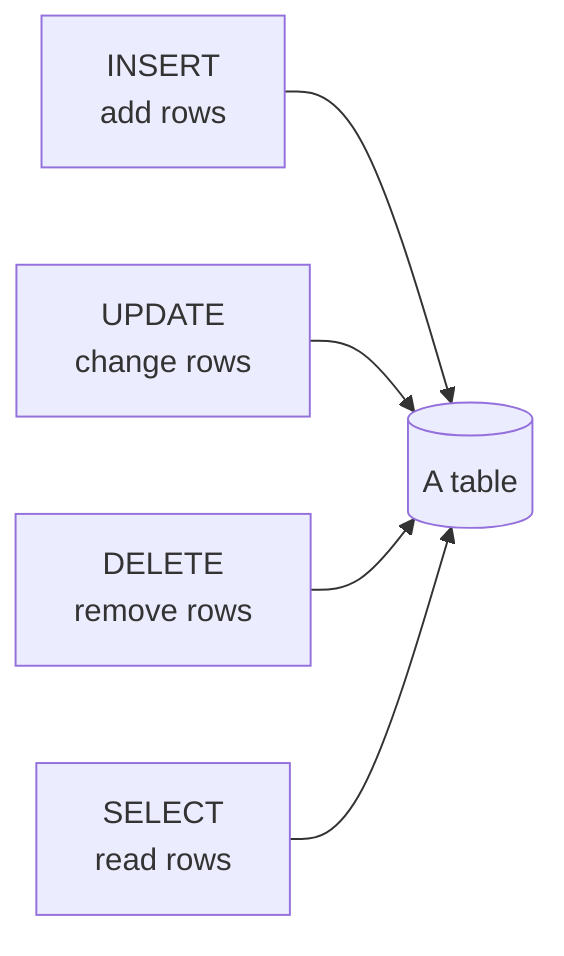
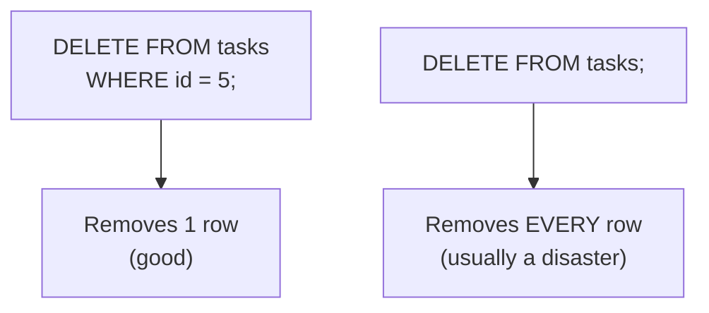

A table is only useful once it holds data. This page covers the
three statements that *change* a table's contents: `INSERT` (add
rows), `UPDATE` (change rows), and `DELETE` (remove rows). Together
with `SELECT`, these four verbs cover almost everything an
application ever does to data.

## INSERT: adding rows

`INSERT` puts new rows into a table. You name the columns, then
supply matching values:

<SqlCodeBlock
  dialect="postgres"
  title="Insert one row and several rows"
  starterCode={`CREATE TABLE tasks (
  id SERIAL PRIMARY KEY,
  title TEXT NOT NULL,
  done BOOLEAN DEFAULT false
);

-- One row:
INSERT INTO
  tasks (title)
VALUES
  ('Buy milk');

-- Several rows at once, separated by commas:
INSERT INTO
  tasks (title, done)
VALUES
  ('Walk the dog', true),
  ('Write report', false),
  ('Call dentist', false);

SELECT
  *
FROM
  tasks
ORDER BY
  id;`}
/>

A few things to absorb:

- The column list `(title, done)` and the values must line up in the
  same order.
- We left out `id` (it is `SERIAL`, so Postgres fills it) and
  sometimes `done` (its `DEFAULT false` kicks in).
- You can insert many rows in one statement by listing several
  `(...)` groups.

## UPDATE: changing existing rows

`UPDATE` changes values in rows that already exist. You set new
values with `SET`, and — crucially — you say *which* rows with
`WHERE`:

<SqlCodeBlock
  dialect="postgres"
  title="Mark one task as done"
  initSql={`CREATE TABLE tasks (
  id    SERIAL PRIMARY KEY,
  title TEXT NOT NULL,
  done  BOOLEAN DEFAULT false
);
INSERT INTO tasks (title, done) VALUES
  ('Buy milk', false),
  ('Walk the dog', false),
  ('Write report', false);`}
  starterCode={`UPDATE tasks
SET
  done = true
WHERE
  title = 'Buy milk';

SELECT
  *
FROM
  tasks
ORDER BY
  id;`}
/>

Only the "Buy milk" row changed, because `WHERE title = 'Buy milk'`
selected exactly that row.

## DELETE: removing rows

`DELETE` removes rows. Again, `WHERE` decides which ones:

<SqlCodeBlock
  dialect="postgres"
  title="Delete completed tasks"
  initSql={`CREATE TABLE tasks (
  id    SERIAL PRIMARY KEY,
  title TEXT NOT NULL,
  done  BOOLEAN DEFAULT false
);
INSERT INTO tasks (title, done) VALUES
  ('Buy milk', true),
  ('Walk the dog', false),
  ('Write report', true);`}
  starterCode={`DELETE FROM tasks
WHERE
  done = true;

SELECT
  *
FROM
  tasks
ORDER BY
  id;`}
/>

The two finished tasks are gone; the unfinished one remains.

## The most important warning in this course

`UPDATE` and `DELETE` **without a `WHERE` clause affect every row in
the table.** This is the single most common way beginners
accidentally destroy data.

<Callout type="warn" title="Always think about WHERE first">
Before you run any `UPDATE` or `DELETE`, ask: *"which rows do I want
to change?"* and write the `WHERE` clause to match. A reliable habit
is to first run a `SELECT` with the same `WHERE` to see exactly which
rows you are about to affect, then swap `SELECT *` for your `UPDATE`
or `DELETE`.
</Callout>

## Preview before you change

Practice the safe habit right here. First the `SELECT` shows you the
target rows; only then do you change them.

<SqlCodeBlock
  dialect="postgres"
  title="Look before you leap"
  initSql={`CREATE TABLE tasks (
  id    SERIAL PRIMARY KEY,
  title TEXT NOT NULL,
  done  BOOLEAN DEFAULT false
);
INSERT INTO tasks (title, done) VALUES
  ('Buy milk', false),
  ('Walk the dog', false),
  ('Write report', false);`}
  starterCode={`-- Step 1: SELECT to preview which rows match.
SELECT
  *
FROM
  tasks
WHERE
  title LIKE 'W%';

-- Step 2 (once you're sure), the matching change would be:
-- UPDATE tasks SET done = true WHERE title LIKE 'W%';`}
/>

This "preview with `SELECT`, then act" rhythm will save you from
painful mistakes for the rest of your data career.

## Check your understanding

<MultipleChoice
  markdown={`What happens if you run \`DELETE FROM tasks;\` with no \`WHERE\` clause?

- It deletes only the most recently added row.
  > Without a \`WHERE\`, \`DELETE\` does not single out one row; it applies to all of them.
- It does nothing because a \`WHERE\` is required.
  > A \`WHERE\` is *not* required, which is exactly why this is dangerous; the statement runs and affects everything.
- [o] It deletes every row in the \`tasks\` table.
  > With no \`WHERE\` to limit it, the deletion applies to all rows — a common and costly beginner mistake.
- It deletes the table's structure as well as its rows.
  > Removing the table itself is \`DROP TABLE\`; \`DELETE\` removes rows but leaves the (now empty) table.

Without \`WHERE\`, \`DELETE\` and \`UPDATE\` apply to every row — always scope them deliberately.`}
/>

<MultipleChoice
  markdown={`Which clause determines *which* rows an \`UPDATE\` or \`DELETE\` affects?

- \`SET\`
  > \`SET\` specifies the new values for an \`UPDATE\`; it does not choose which rows are affected.
- [o] \`WHERE\`
  > \`WHERE\` is the condition that selects exactly the rows to update or delete.
- \`VALUES\`
  > \`VALUES\` supplies data for an \`INSERT\`; it does not filter rows for updates or deletes.
- \`FROM\`
  > \`FROM\` names the table; the row selection is done by \`WHERE\`.

\`WHERE\` is what limits an \`UPDATE\` or \`DELETE\` to the intended rows.`}
/>

<MultipleChoice
  markdown={`Why is it a good habit to run a \`SELECT\` with your \`WHERE\` condition before running a matching \`DELETE\`?

- Because \`DELETE\` does not work unless a \`SELECT\` ran first.
  > \`DELETE\` does not depend on a prior \`SELECT\`; the habit is about safety, not a requirement.
- [o] To preview exactly which rows the condition matches, so you don't delete more than you intend.
  > Seeing the matched rows first confirms your \`WHERE\` is correct before you make an irreversible change.
- Because \`SELECT\` automatically backs up the rows.
  > \`SELECT\` only reads rows; it does not create a backup of them.
- Because it makes the \`DELETE\` run faster.
  > Previewing does not speed up the delete; it protects you from mistakes.

Previewing matched rows with \`SELECT\` verifies your condition before an irreversible change.`}
/>
