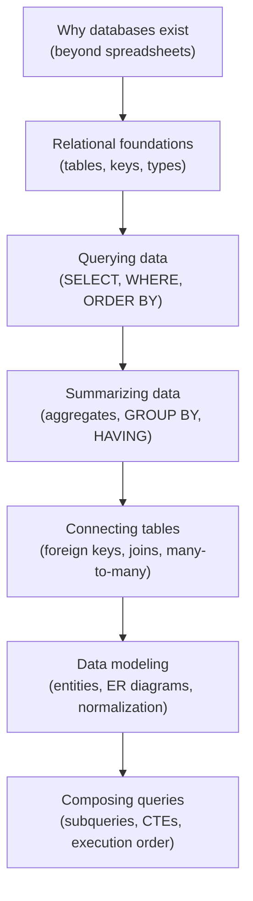

You started this course not sure what a database really *was*. Now
you can reason about tables, keys, relationships, and queries — and,
more importantly, you understand **why** each of those ideas exists.
That conceptual foundation is the hard part, and you have it.

## What you've built up

The course moved deliberately from "why" to "how" to "how to think":

Each layer rested on the one before it. Joins only made sense once
keys did; normalization only made sense once you felt the pain of
duplication; the execution order tied the whole querying story
together.

## The big ideas worth keeping

If you remember only a handful of things, make it these:

- **A database stores each fact once, in a structured place** — that
  is what separates it from a spreadsheet and prevents data from
  contradicting itself.
- **Keys connect tables.** A primary key names a row; a foreign key
  points to one. Everything relational grows from this.
- **Joins recombine what normalization split apart.** You store data
  cleanly in separate tables, then join to view it together.
- **SQL is declarative.** You describe *what* you want; the database
  figures out *how*. The logical execution order explains the rest.
- **Model before you build.** Naming entities and relationships first
  saves you from tangled tables later.

<Callout type="success" title="You can now read real queries">
Pick almost any SQL query in the wild and you can now decode it:
identify the tables in `FROM`, the row filter in `WHERE`, the groups,
the joins, and the columns. That literacy is exactly what this course
set out to give you.
</Callout>

## Practice to make it stick

Concepts solidify by *doing*. A few ways to keep going:

- **Re-solve the examples from memory.** Close the page, then rebuild
  a join or a `GROUP BY` query from scratch in any playground on this
  site.
- **Model something you know.** Sketch tables and an ER diagram for a
  hobby, a sports league, or your music library. Ask: what are the
  entities and relationships?
- **Ask questions of data.** Take any dataset and write five
  questions, then answer each with a query — counts, averages,
  filters, joins.

<SqlCodeBlock
  dialect="postgres"
  title="One last query — bringing it together"
  initSql={`CREATE TABLE customers (
  id INTEGER PRIMARY KEY, name TEXT
);
CREATE TABLE orders (
  id INTEGER PRIMARY KEY, customer_id INTEGER, amount NUMERIC
);
INSERT INTO customers (id, name) VALUES (1,'Ada'),(2,'Grace'),(3,'Linus');
INSERT INTO orders (id, customer_id, amount) VALUES
  (101,1,42),(102,1,18),(103,2,99),(104,2,15),(105,2,30);`}
  starterCode={`-- A join, a group, an aggregate, a HAVING filter, and a sort —
-- every major idea from the course in one readable query.
SELECT
  c.name,
  COUNT(*) AS order_count,
  SUM(o.amount) AS total_spent
FROM
  customers c
  JOIN orders o ON o.customer_id = c.id
GROUP BY
  c.name
HAVING
  SUM(o.amount) > 50
ORDER BY
  total_spent DESC;`}
/>

If you can read that query and predict its result before running it,
you have genuinely learned to think relationally.

## Where to go from here

This was a *foundations* course, focused on SQL and relational
thinking. When you are ready to go further, natural next topics
include:

- **More SQL depth** — `CASE` expressions, window functions, richer
  date and text handling, and set operations like `UNION`.
- **Indexes and performance** — how databases find rows quickly, and
  when to add an index. (You met the *why*; the *how* is a deep
  field.)
- **Designing larger schemas** — modeling real applications with many
  related entities.
- **Using databases from code** — how applications connect to
  PostgreSQL and run the queries you now understand.

But there is no rush. The relational way of thinking you have built
here is the foundation everything else stands on. Keep asking
questions of data, keep writing queries, and the rest will follow.

Welcome to working with databases.
