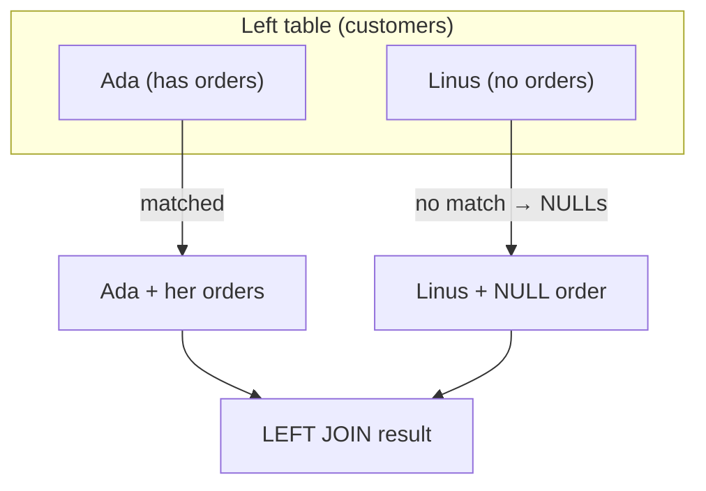
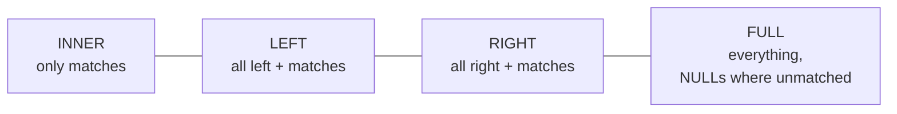

An inner join silently drops rows that have no match. But sometimes
the **unmatched rows are exactly what you want to see**: "customers
who have *never* ordered," "products that have *never* sold." For
those questions you need an **outer join**, which deliberately keeps
unmatched rows.

## LEFT JOIN: keep all rows from the left table

A `LEFT JOIN` keeps **every row from the left (first) table**,
matched or not. Where a match exists, the right table's columns are
filled in. Where none exists, those columns come back as `NULL`.

The key insight: the left table is **fully preserved**. The right
table is "optional" — it contributes data when it can and `NULL`s
when it cannot.

<SqlCodeBlock
  dialect="postgres"
  title="Every customer, even those with no orders"
  initSql={`CREATE TABLE customers (
  id   INTEGER PRIMARY KEY,
  name TEXT
);
CREATE TABLE orders (
  id          INTEGER PRIMARY KEY,
  customer_id INTEGER,
  amount      NUMERIC
);
INSERT INTO customers (id, name) VALUES
  (1,'Ada'), (2,'Grace'), (3,'Linus');   -- Linus has no orders
INSERT INTO orders (id, customer_id, amount) VALUES
  (101,1,42), (102,2,99);`}
  starterCode={`SELECT c.name, o.id AS order_id, o.amount
FROM customers c
LEFT JOIN orders o ON o.customer_id = c.id
ORDER BY c.name;`}
/>

Linus appears, with `NULL` for `order_id` and `amount` — the join's
honest way of saying "this customer matched nothing." An inner join
would have hidden him entirely.

## Finding the unmatched rows

A `LEFT JOIN` plus `WHERE ... IS NULL` is the classic recipe for
"find the rows with **no** match." Keep everyone, then keep only the
ones whose match came back empty:

<SqlCodeBlock
  dialect="postgres"
  title="Customers who have never ordered"
  initSql={`CREATE TABLE customers (
  id INTEGER PRIMARY KEY, name TEXT
);
CREATE TABLE orders (
  id INTEGER PRIMARY KEY, customer_id INTEGER, amount NUMERIC
);
INSERT INTO customers (id, name) VALUES (1,'Ada'),(2,'Grace'),(3,'Linus'),(4,'Mae');
INSERT INTO orders (id, customer_id, amount) VALUES (101,1,42),(102,2,99);`}
  starterCode={`SELECT c.name
FROM customers c
LEFT JOIN orders o ON o.customer_id = c.id
WHERE o.id IS NULL
ORDER BY c.name;`}
/>

Linus and Mae have no orders, so their joined `o.id` is `NULL`, and
the filter keeps exactly them. This pattern — *outer join, then test
for `NULL`* — answers a whole family of "who is missing?" questions.

## RIGHT and FULL joins

Once `LEFT JOIN` makes sense, its siblings are easy:

- **`RIGHT JOIN`** keeps every row from the **right** table instead
  of the left. It is just a `LEFT JOIN` with the tables mentally
  swapped — most people simply reorder the tables and use `LEFT`.
- **`FULL JOIN`** keeps **every row from both** tables, filling
  `NULL`s on whichever side lacks a match.

<Callout type="info" title="A simple way to choose">
Ask: *"whose rows must I keep even without a match?"* Keep the left
table → `LEFT JOIN`. Keep both → `FULL JOIN`. Keep only matched rows
→ plain `INNER JOIN`. Naming the table you refuse to lose tells you
the join.
</Callout>

## Why NULLs appear — and that it is correct

The `NULL`s in an outer join are not a glitch; they are the *truth*.
There genuinely is no order for Linus, so "his order amount" is
genuinely unknown/absent — exactly what `NULL` means (recall the
**Working with NULL** page). Outer joins and `NULL` are natural
partners: the join preserves a row, and `NULL` faithfully marks the
information that the missing side could not supply.

## Check your understanding

<MultipleChoice
  markdown={`What does a \`LEFT JOIN\` keep that an \`INNER JOIN\` does not?

- Nothing; they are identical.
  > They differ precisely on unmatched rows, so they are not identical.
- [o] Every row from the left table, even those with no match in the right table (filling NULLs for the missing side).
  > A left join preserves all left-table rows and supplies NULLs where the right table has no match.
- Only rows that match in both tables.
  > That is what an inner join keeps; a left join additionally keeps unmatched left rows.
- Every row from the right table only.
  > Preserving all right-table rows describes a right join, not a left join.

A left join preserves all left-table rows, using NULLs where the right side has no match.`}
/>

<MultipleChoice
  markdown={`In a \`LEFT JOIN\` of customers to orders, a customer with no orders appears with what in the order columns?

- Zeros.
  > A missing match is not represented as zero; zero would falsely imply a real \$0 order.
- Empty strings.
  > Numeric and id columns are not blanked to empty strings; the absence is marked differently.
- [o] NULLs, marking that there was no matching order to supply those values.
  > Outer joins fill unmatched columns with NULL, honestly signaling missing data.
- The previous customer's order values.
  > Joins never borrow another row's values; unmatched columns become NULL.

Unmatched columns in an outer join are filled with NULL, the marker for absent values.`}
/>

<MultipleChoice
  markdown={`Which pattern finds "customers who have never placed an order"?

- An inner join between customers and orders.
  > An inner join drops order-less customers, so it can never reveal them.
- [o] A \`LEFT JOIN\` from customers to orders, then \`WHERE o.id IS NULL\`.
  > Keeping all customers and then filtering for the NULL (unmatched) side isolates those with no orders.
- A \`LEFT JOIN\` then \`WHERE o.id IS NOT NULL\`.
  > Testing \`IS NOT NULL\` keeps the matched customers — the opposite of who you want.
- \`SELECT DISTINCT\` on the orders table.
  > The orders table only contains customers who *did* order, so it cannot list those who never did.

Outer-join everyone, then keep the rows whose match is NULL to find the unmatched customers.`}
/>

<MultipleChoice
  markdown={`A \`FULL JOIN\` between two tables returns which rows?

- Only the rows that match in both tables.
  > That is an inner join; a full join is the most inclusive kind.
- Only the left table's rows.
  > Keeping just the left side is a left join; a full join keeps both sides.
- [o] Every row from both tables, with NULLs wherever a row on one side has no match on the other.
  > A full join preserves unmatched rows from both tables, filling NULLs for the absent side.
- No rows, because both sides must match.
  > A full join does not require matches; it includes everything from both tables.

A full join keeps all rows from both tables, using NULLs where either side is unmatched.`}
/>
