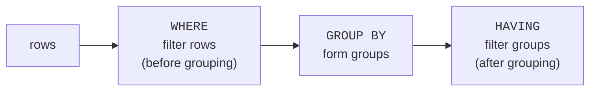

You **write** a query as `SELECT ... FROM ... WHERE ... GROUP BY ...`,
but PostgreSQL does **not** run it in that order. SQL has a hidden
**logical execution order**, and learning it explains a whole class
of confusing errors — like "why can't I use an alias in `WHERE`?"
This is one of the most clarifying ideas in all of SQL.

<svg
  viewBox="0 0 640 210"
  role="img"
  aria-label="The same clauses in two columns — the order you write them on the left, the numbered order the database really runs them on the right, linked by crossing bands"
  style={{ display: "block", width: "100%", maxWidth: "640px", height: "auto", margin: "2.5rem auto" }}
>
  <g fill="currentColor" opacity="0.15">
    <polygon points="240,40 378,148 378,152 240,44" />
    <polygon points="240,76 378,40 378,44 240,80" />
    <polygon points="240,112 378,76 378,80 240,116" />
    <polygon points="240,148 378,112 378,116 240,152" />
    <polygon points="240,184 378,184 378,188 240,188" />
  </g>
  <g style={{ color: "var(--ds-blue-500)" }} fill="currentColor">
    <rect x="120" y="30" width="120" height="24" rx="9" fillOpacity="0.6" />
    <rect x="120" y="66" width="120" height="24" rx="9" fillOpacity="0.6" />
    <rect x="120" y="102" width="120" height="24" rx="9" fillOpacity="0.6" />
    <rect x="120" y="138" width="120" height="24" rx="9" fillOpacity="0.6" />
    <rect x="120" y="174" width="120" height="24" rx="9" fillOpacity="0.6" />
  </g>
  <g style={{ color: "var(--ds-green-500)" }} fill="currentColor">
    <rect x="400" y="30" width="120" height="24" rx="9" fillOpacity="0.7" />
    <rect x="400" y="66" width="120" height="24" rx="9" fillOpacity="0.7" />
    <rect x="400" y="102" width="120" height="24" rx="9" fillOpacity="0.7" />
    <rect x="400" y="138" width="120" height="24" rx="9" fillOpacity="0.7" />
    <rect x="400" y="174" width="120" height="24" rx="9" fillOpacity="0.7" />
    <circle cx="392" cy="42" r="10" />
    <circle cx="392" cy="78" r="10" />
    <circle cx="392" cy="114" r="10" />
    <circle cx="392" cy="150" r="10" />
    <circle cx="392" cy="186" r="10" />
  </g>
  <g style={{ color: "var(--ds-white)" }} fill="currentColor">
    <text x="392" y="47" textAnchor="middle" fontFamily="var(--font-mono), ui-monospace, monospace" fontSize="12" fontWeight="700">1</text>
    <text x="392" y="83" textAnchor="middle" fontFamily="var(--font-mono), ui-monospace, monospace" fontSize="12" fontWeight="700">2</text>
    <text x="392" y="119" textAnchor="middle" fontFamily="var(--font-mono), ui-monospace, monospace" fontSize="12" fontWeight="700">3</text>
    <text x="392" y="155" textAnchor="middle" fontFamily="var(--font-mono), ui-monospace, monospace" fontSize="12" fontWeight="700">4</text>
    <text x="392" y="191" textAnchor="middle" fontFamily="var(--font-mono), ui-monospace, monospace" fontSize="12" fontWeight="700">5</text>
  </g>
</svg>

## Written order vs. execution order

The order you type is for human readability. The order the database
*reasons* about the query is different:

1. **`FROM` / `JOIN`** — gather and combine tables.
2. **`WHERE`** — filter individual rows.
3. **`GROUP BY`** — form groups.
4. **`HAVING`** — filter groups.
5. **`SELECT`** — choose columns, compute aliases.
6. **`DISTINCT`** — remove duplicates.
7. **`ORDER BY`** — sort.
8. **`LIMIT`** — keep the first N.

Read the numbers: `FROM` is first, `SELECT` is near the **end**, and
`LIMIT` is last. The clause you *write* first (`SELECT`) is among the
*last* to actually run.

## Why this explains real errors

Most "why doesn't this work?" moments dissolve once you know the
order. Two classic examples:

**You cannot use a `SELECT` alias in `WHERE`.** Because `WHERE`
(step 2) runs *before* `SELECT` (step 5), the alias does not exist
yet when `WHERE` is evaluated:

<SqlCodeBlock
  dialect="postgres"
  title="An alias is not visible to WHERE"
  initSql={`CREATE TABLE orders (
  id     INTEGER PRIMARY KEY,
  amount NUMERIC
);
INSERT INTO orders (id, amount) VALUES (1,20),(2,80),(3,60);`}
  starterCode={`-- This FAILS: "doubled" does not exist yet when WHERE runs.
-- SELECT amount * 2 AS doubled FROM orders WHERE doubled > 100;
-- This works: repeat the expression, since WHERE runs before SELECT.
SELECT
  amount * 2 AS doubled
FROM
  orders
WHERE
  amount * 2 > 100
ORDER BY
  doubled;`}
/>

**But you *can* use the alias in `ORDER BY`,** because `ORDER BY`
(step 7) runs *after* `SELECT` (step 5), by which time the alias
exists. The execution order predicts exactly which works.

<Callout type="info" title="A rule you can now derive, not memorize">
"Aliases work in `ORDER BY` but not in `WHERE`" used to be a fact to
memorize. Now it is something you can *derive*: `ORDER BY` comes
after `SELECT`, `WHERE` comes before it. The order is the
explanation.
</Callout>

## Tracing a full query

Watch every clause take its turn on this query. Each step hands its
result to the next:

<SqlCodeBlock
  dialect="postgres"
  title="Every clause, in execution order"
  initSql={`CREATE TABLE orders (
  id          INTEGER PRIMARY KEY,
  customer_id INTEGER,
  amount      NUMERIC
);
INSERT INTO orders (id, customer_id, amount) VALUES
  (1,1,20),(2,1,80),(3,2,60),(4,2,15),(5,3,95),(6,3,40);`}
  starterCode={`SELECT
  customer_id,
  SUM(amount) AS total
FROM
  orders
WHERE
  amount > 10
GROUP BY
  customer_id
HAVING
  SUM(amount) > 50
ORDER BY
  total DESC
LIMIT
  2;`}
/>

Trace it in execution order:

1. **FROM** `orders` — start with all rows.
2. **WHERE** `amount > 10` — drop the small individual orders.
3. **GROUP BY** `customer_id` — bundle rows into one group per
   customer.
4. **HAVING** `SUM(amount) > 50` — drop groups whose total is too
   small.
5. **SELECT** `customer_id, SUM(amount) AS total` — compute the
   output, naming the sum `total`.
6. **ORDER BY** `total DESC` — sort the surviving groups.
7. **LIMIT 2** — keep the top two.

This is the **query transformation pipeline**: each stage reshapes a
table and passes it on. Every query you write — however complex —
flows through these same steps.

## WHERE vs. HAVING, settled

The order also makes the `WHERE`/`HAVING` distinction obvious.
`WHERE` (step 2) runs **before** grouping, so it filters *individual
rows*. `HAVING` (step 4) runs **after** grouping, so it filters
*whole groups*:

You cannot filter on `SUM(amount)` in `WHERE`, because the sum does
not exist until grouping happens — which is step 3, *after* `WHERE`.
You must use `HAVING`. Once again, the order is the reason.

## Check your understanding

<MultipleChoice
  markdown={`Which clause is evaluated **first** in a SQL query's logical execution order?

- \`SELECT\`, because it is written first.
  > Written order is not execution order; \`SELECT\` actually runs near the end.
- [o] \`FROM\` (and its joins), which gathers the source rows before anything else.
  > Execution begins by assembling the tables in \`FROM\`, then filtering and shaping them.
- \`ORDER BY\`, because sorting must happen up front.
  > Sorting happens late, after the rows and columns are determined.
- \`WHERE\`, before the tables are even chosen.
  > \`WHERE\` filters rows, but only after \`FROM\` has produced them.

Execution starts with \`FROM\`; \`SELECT\` and \`ORDER BY\` come much later.`}
/>

<MultipleChoice
  markdown={`Why can a column alias defined in \`SELECT\` be used in \`ORDER BY\` but **not** in \`WHERE\`?

- Because \`ORDER BY\` is optional and \`WHERE\` is required.
  > Being optional or not has nothing to do with alias visibility.
- [o] Because \`WHERE\` runs before \`SELECT\` (so the alias does not exist yet), while \`ORDER BY\` runs after \`SELECT\`.
  > Aliases are created at the \`SELECT\` step, so only clauses that run after it can see them.
- Because aliases only work with numbers.
  > Alias visibility depends on execution order, not on data type.
- Because \`WHERE\` cannot reference any columns at all.
  > \`WHERE\` can reference real columns; it just cannot see aliases created later in \`SELECT\`.

\`WHERE\` runs before \`SELECT\`, so the alias is not yet defined; \`ORDER BY\` runs after, so it is.`}
/>

<MultipleChoice
  markdown={`Why must you filter on \`SUM(amount) > 50\` using \`HAVING\` rather than \`WHERE\`?

- Because \`WHERE\` cannot contain numbers.
  > \`WHERE\` handles numeric comparisons fine; the issue is when the sum is computed.
- [o] Because the group's \`SUM\` is only formed at the \`GROUP BY\` step, which runs after \`WHERE\`; \`HAVING\` runs after grouping.
  > \`WHERE\` acts before groups exist, so it cannot see a group total; \`HAVING\` filters after grouping.
- Because \`HAVING\` is just a faster version of \`WHERE\`.
  > They filter at different stages — rows vs. groups — not at different speeds.
- Because \`SUM\` cannot be used anywhere except \`HAVING\`.
  > \`SUM\` also appears in \`SELECT\`; the point is that group filtering happens in \`HAVING\`.

Group aggregates exist only after \`GROUP BY\`, so filtering on them belongs in \`HAVING\`, not \`WHERE\`.`}
/>

<MultipleChoice
  markdown={`In the execution order, where does \`LIMIT\` fall?

- First, to reduce work before anything else.
  > \`LIMIT\` cannot run first because it needs the final, sorted rows to choose from.
- Right after \`FROM\`.
  > Immediately after \`FROM\` the rows are neither filtered nor sorted, so limiting then would be meaningless.
- [o] Last, after \`ORDER BY\`, keeping the first N of the final sorted rows.
  > \`LIMIT\` acts at the very end, trimming the already-sorted result to N rows.
- Before \`WHERE\`.
  > Limiting before filtering would keep the wrong rows; \`LIMIT\` is the final step.

\`LIMIT\` runs last, after sorting, to keep the first N rows of the final result.`}
/>
