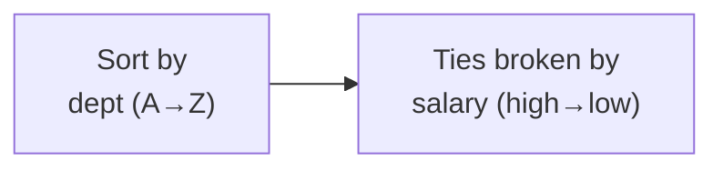
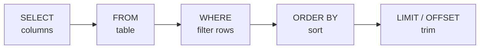

Recall that a table is an **unordered** bag of rows. If you want
your results in a particular order, you must say so. That is what
`ORDER BY` is for. And once results are ordered, `LIMIT` lets you
keep just the first few — together they power every "top sellers"
and "most recent" list you have ever seen.

## ORDER BY: deliberate order

`ORDER BY` sorts the result by one or more columns. Add `ASC` for
ascending (the default) or `DESC` for descending:

<SqlCodeBlock
  dialect="postgres"
  title="Highest-paid first"
  initSql={`CREATE TABLE employees (
  id SERIAL PRIMARY KEY, name TEXT, dept TEXT, salary NUMERIC
);
INSERT INTO employees (name, dept, salary) VALUES
  ('Alice','Engineering',120000),('Bob','Engineering',95000),
  ('Carol','Sales',80000),('Dave','Sales',72000),('Eve','Marketing',68000);`}
  starterCode={`SELECT
  name,
  salary
FROM
  employees
ORDER BY
  salary DESC;`}
/>

Swap `DESC` for `ASC` (or remove it) to flip to lowest-first.
Sorting works on text too — text sorts alphabetically.

## Sorting by more than one column

When the first column ties, a second sort column breaks the tie.
Think of it like sorting a class first by grade, then by name within
each grade:

<SqlCodeBlock
  dialect="postgres"
  title="By department, then by salary within each department"
  initSql={`CREATE TABLE employees (
  id SERIAL PRIMARY KEY, name TEXT, dept TEXT, salary NUMERIC
);
INSERT INTO employees (name, dept, salary) VALUES
  ('Alice','Engineering',120000),('Bob','Engineering',95000),
  ('Carol','Sales',80000),('Dave','Sales',72000),('Eve','Marketing',68000);`}
  starterCode={`SELECT
  dept,
  name,
  salary
FROM
  employees
ORDER BY
  dept ASC,
  salary DESC;`}
/>

The rows are grouped by department alphabetically, and *within* each
department, sorted by salary high to low. The order of the columns
in `ORDER BY` is the order of priority.

## LIMIT: just the top rows

`LIMIT n` keeps only the first `n` rows of the result. Combined with
`ORDER BY`, it answers "top N" questions:

<SqlCodeBlock
  dialect="postgres"
  title="The three highest earners"
  initSql={`CREATE TABLE employees (
  id SERIAL PRIMARY KEY, name TEXT, salary NUMERIC
);
INSERT INTO employees (name, salary) VALUES
  ('Alice',120000),('Bob',95000),('Carol',80000),
  ('Dave',72000),('Eve',68000);`}
  starterCode={`SELECT
  name,
  salary
FROM
  employees
ORDER BY
  salary DESC
LIMIT
  3;`}
/>

<Callout type="warn" title="LIMIT without ORDER BY is meaningless">
Because rows have no inherent order, `LIMIT 3` *without* an
`ORDER BY` gives you "some three rows" — and which three is
unpredictable. Always pair `LIMIT` with `ORDER BY` when you mean
"the top three." If you genuinely just want a quick peek at any few
rows, that is the one acceptable exception.
</Callout>

## Skipping rows with OFFSET

`OFFSET n` skips the first `n` rows before returning. `OFFSET`
together with `LIMIT` is how applications show "pages" of results —
page 1 is `LIMIT 10 OFFSET 0`, page 2 is `LIMIT 10 OFFSET 10`, and
so on:

<SqlCodeBlock
  dialect="postgres"
  title="The second page of two rows"
  initSql={`CREATE TABLE employees (
  id SERIAL PRIMARY KEY, name TEXT, salary NUMERIC
);
INSERT INTO employees (name, salary) VALUES
  ('Alice',120000),('Bob',95000),('Carol',80000),
  ('Dave',72000),('Eve',68000);`}
  starterCode={`SELECT
  name,
  salary
FROM
  employees
ORDER BY
  salary DESC
LIMIT
  2
OFFSET
  2;`}
/>

The query orders everyone, skips the top 2, and returns the next 2 —
Carol and Dave. This is the engine behind "Next page" buttons across
the web.

## Putting the clauses in order

So far you have met four clauses. They must appear in this order:

You can leave out the middle ones, but whichever you include must
follow this sequence. *Select* from a table, *filter*, *sort*, then
*trim* — a pipeline that reads almost like a sentence.

## Check your understanding

<MultipleChoice
  markdown={`Which clause puts query results into a specific, deliberate order?

- \`WHERE\`
  > \`WHERE\` filters which rows appear; it does not arrange their order.
- [o] \`ORDER BY\`
  > \`ORDER BY\` sorts the result rows by one or more columns, ascending or descending.
- \`LIMIT\`
  > \`LIMIT\` trims the number of rows but does not decide their order.
- \`SELECT\`
  > \`SELECT\` chooses columns; ordering rows is a separate step.

\`ORDER BY\` is the clause that sorts results.`}
/>

<MultipleChoice
  markdown={`Why should \`LIMIT 5\` almost always be paired with an \`ORDER BY\`?

- Because \`LIMIT\` will error without \`ORDER BY\`.
  > \`LIMIT\` runs fine alone; the issue is meaning, not a syntax error.
- [o] Because rows have no inherent order, so without \`ORDER BY\` you get an unpredictable five rows rather than a meaningful "top five."
  > To get a definite "top" or "first" five, you must first impose an order; otherwise the choice is arbitrary.
- Because \`ORDER BY\` makes \`LIMIT\` run faster.
  > Pairing them is about correctness of meaning, not speed.
- Because \`LIMIT\` only works on sorted tables.
  > \`LIMIT\` works on any result; the point is that "which rows" is undefined without an order.

Without an \`ORDER BY\`, \`LIMIT\` returns an arbitrary subset, not a meaningful top-N.`}
/>

<MultipleChoice
  markdown={`You want the second page of results, showing rows 3 and 4 of an ordered list. Which clause combination does this?

- \`LIMIT 4\`
  > That returns the first four rows, not specifically the third and fourth.
- [o] \`LIMIT 2 OFFSET 2\`
  > Skipping the first 2 rows with \`OFFSET 2\` and taking 2 with \`LIMIT 2\` yields exactly rows 3 and 4.
- \`OFFSET 4\`
  > That skips the first four rows and returns everything after, not just two rows.
- \`WHERE row = 2\`
  > There is no inherent row-number column to filter on; pagination uses \`LIMIT\` and \`OFFSET\`.

\`OFFSET\` skips earlier rows and \`LIMIT\` caps how many follow — together they implement pagination.`}
/>

<MultipleChoice
  markdown={`In \`ORDER BY dept ASC, salary DESC\`, how are rows arranged?

- Only by salary, ignoring department.
  > Department is listed first, so it is the primary sort key; salary only breaks ties within a department.
- Randomly, because two columns conflict.
  > Multiple sort columns do not conflict; they act in priority order.
- [o] First by department ascending; rows with the same department are then ordered by salary descending.
  > The first column is the primary sort, and later columns break ties, so salary orders rows within each department.
- By salary first, then department.
  > The column order in \`ORDER BY\` sets priority, and department comes first here.

Earlier columns in \`ORDER BY\` take priority; later ones break ties.`}
/>

## Practice challenge

<SqlChallengeCard
  dialect="postgres"
  title="The two newest books"
  instructions={`Return the \`title\` and \`year\` of the two most recently published books, newest first.`}
  initSql={`CREATE TABLE books (
  id     SERIAL PRIMARY KEY,
  title  TEXT NOT NULL,
  author TEXT NOT NULL,
  year   INTEGER
);
INSERT INTO books (title, author, year) VALUES
  ('The Pragmatic Programmer', 'Hunt & Thomas', 1999),
  ('Clean Code', 'Robert C. Martin', 2008),
  ('Refactoring', 'Martin Fowler', 2018),
  ('SQL for Smarties', 'Joe Celko', 1995);`}
  starterCode={`-- Newest first, then keep only the top two:
SELECT
  title,
  year
FROM
  books;`}
  solutionSql={`SELECT
  title,
  year
FROM
  books
ORDER BY
  year DESC
LIMIT
  2;`}
  tests={[
    {
      id: "columns",
      name: "Returns title and year",
      description: "Those two columns.",
      expectedColumns: ["title", "year"],
    },
    {
      id: "row_count",
      name: "Returns exactly two rows",
      description: "Limited to the two newest.",
      expectedRowCount: 2,
    },
    {
      id: "matches",
      name: "Matches the reference solution",
      description: "Refactoring (2018) then Clean Code (2008).",
      matchesSolution: true,
      ordered: true,
    },
  ]}
/>
