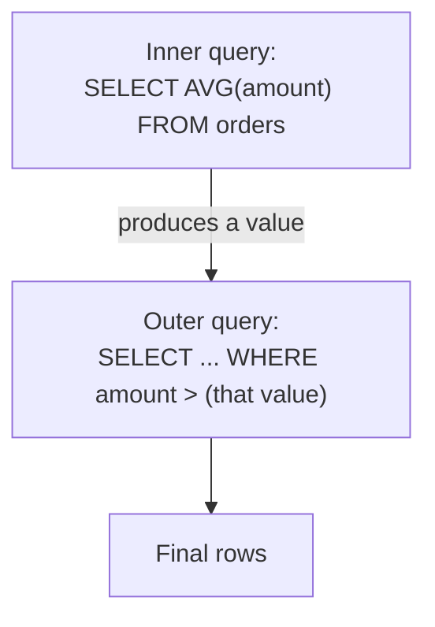
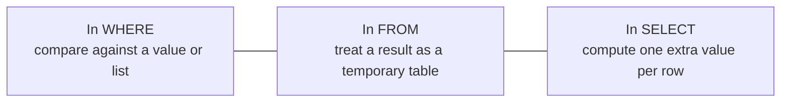

So far each question has been one `SELECT`. But some questions are
*layered*: "show me orders bigger than the **average** order." You
cannot know the average until you compute it — so you write a query
**inside** a query. That inner query is a **subquery**.

## The idea: a query as an input

A subquery is a `SELECT` wrapped in parentheses, whose result feeds
the outer query. PostgreSQL runs the inner query first, then uses
its answer.

Think of it as plugging the inner result into the outer query before
the outer query runs.

## A subquery that returns one value

The simplest subquery returns a **single value** — like an average —
which you compare against in a `WHERE` clause:

<SqlCodeBlock
  dialect="postgres"
  title="Orders larger than the average"
  initSql={`CREATE TABLE orders (
  id     INTEGER PRIMARY KEY,
  amount NUMERIC
);
INSERT INTO orders (id, amount) VALUES
  (1, 20), (2, 5), (3, 80), (4, 35), (5, 60);`}
  starterCode={`SELECT
  id,
  amount
FROM
  orders
WHERE
  amount > (
    SELECT
      AVG(amount)
    FROM
      orders
  )
ORDER BY
  amount;`}
/>

The inner `SELECT AVG(amount)` computes `40`. The outer query then
behaves as if you had written `WHERE amount > 40` — but you never had
to know the number yourself. Change the data and it stays correct.

<Callout type="info" title="Why not just type the number?">
You could run the average separately and paste `40` into your query.
But then it is frozen — add an order and it is wrong. A subquery
recomputes every time, so the query is always right by construction.
</Callout>

## A subquery that returns a list: IN

A subquery can also return a **column of values**, which pairs
naturally with `IN`. Here the inner query lists the ids of customers
who have ordered, and the outer query selects those customers:

<SqlCodeBlock
  dialect="postgres"
  title="Customers who have placed an order"
  initSql={`CREATE TABLE customers (
  id INTEGER PRIMARY KEY, name TEXT
);
CREATE TABLE orders (
  id INTEGER PRIMARY KEY, customer_id INTEGER
);
INSERT INTO customers (id, name) VALUES (1,'Ada'),(2,'Grace'),(3,'Linus');
INSERT INTO orders (id, customer_id) VALUES (101,1),(102,1),(103,2);`}
  starterCode={`SELECT
  name
FROM
  customers
WHERE
  id IN (
    SELECT
      customer_id
    FROM
      orders
  )
ORDER BY
  name;`}
/>

The inner query produces the set `{1, 2}`; the outer query keeps
customers whose `id` is in that set — Ada and Grace. Linus, absent
from the list, is excluded. (This is one of several ways to express
the question; a join could do it too.)

## Subqueries in different places

A subquery can appear in several parts of a statement, depending on
the shape of its result:

- **In `WHERE`** — the most common, as above: compare a column to a
  computed value or set.
- **In `FROM`** — use a query's result as if it were a table (a
  "derived table"), then query *that*.
- **In `SELECT`** — produce a single extra value alongside each row.

You will use the `WHERE` form constantly; the others appear as
questions grow more complex.

## Check your understanding

<MultipleChoice
  markdown={`What is a subquery?

- A query that can only count rows.
  > Subqueries can return values, lists, or whole tables — not only counts.
- [o] A \`SELECT\` written inside another query, whose result is used by the outer query.
  > A subquery is nested inside another statement, and its output feeds the surrounding query.
- A faster version of a regular query.
  > Nesting is about expressing layered logic, not inherently about speed.
- A query that modifies the table structure.
  > Subqueries read data to feed another query; they do not alter structure.

A subquery is a nested SELECT whose result is consumed by the outer query.`}
/>

<MultipleChoice
  markdown={`Why use \`WHERE amount > (SELECT AVG(amount) FROM orders)\` instead of typing the average as a fixed number?

- Because PostgreSQL forbids numbers in WHERE clauses.
  > Literal numbers are perfectly legal in WHERE; the issue is keeping them current.
- [o] Because the subquery recomputes the average from current data, so the query stays correct as data changes.
  > A hard-coded number goes stale, while the subquery is recalculated every time the query runs.
- Because subqueries always run faster than arithmetic.
  > The benefit here is correctness and maintainability, not guaranteed speed.
- Because you cannot use AVG outside a subquery.
  > AVG works in many contexts; the subquery is about feeding its result into the comparison.

The subquery recomputes the value each run, so the comparison never goes stale.`}
/>

<MultipleChoice
  markdown={`A subquery used with \`IN\`, like \`WHERE id IN (SELECT customer_id FROM orders)\`, should return what shape of result?

- A whole table with many columns.
  > \`IN\` compares one value against a set of single values, not a multi-column table.
- [o] A single column of values that the outer column is checked against.
  > \`IN\` tests whether a value appears in the list of values the subquery returns.
- Exactly one row and one column always.
  > A single value suits \`=\`, but \`IN\` is designed for a list of values, not just one.
- No result; \`IN\` ignores the subquery.
  > \`IN\` depends entirely on the subquery's returned list of values.

\`IN\` pairs with a subquery that returns a single column of values to match against.`}
/>
