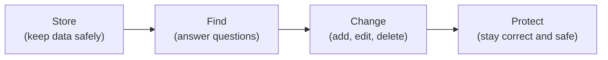
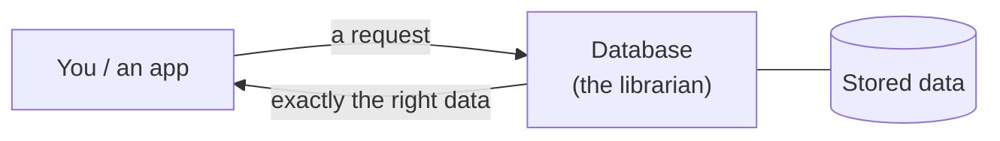

Before we write a single line of SQL, let us answer the question
that almost every tutorial skips: **what actually is a database?**

<svg
  viewBox="0 0 640 220"
  role="img"
  aria-label="A tidy bookshelf of colored data books with one book gliding along a dotted arc to a waiting reader — an organized collection that can be searched and served"
  style={{ display: "block", width: "100%", maxWidth: "640px", height: "auto", margin: "2.5rem auto" }}
>
  <g fill="currentColor" opacity="0.07">
    <rect x="120" y="28" width="260" height="170" rx="14" />
  </g>
  <g fill="currentColor" opacity="0.18">
    <rect x="132" y="88" width="236" height="5" rx="2.5" />
    <rect x="132" y="148" width="236" height="5" rx="2.5" />
  </g>
  <g style={{ color: "var(--ds-blue-500)" }} fill="currentColor">
    <rect x="140" y="56" width="11" height="32" rx="4" />
    <rect x="172" y="56" width="11" height="32" rx="4" fillOpacity="0.5" />
    <rect x="204" y="56" width="11" height="32" rx="4" />
    <rect x="268" y="56" width="11" height="32" rx="4" fillOpacity="0.6" />
    <rect x="156" y="116" width="11" height="32" rx="4" />
    <rect x="220" y="116" width="11" height="32" rx="4" fillOpacity="0.5" />
    <rect x="284" y="116" width="11" height="32" rx="4" />
  </g>
  <g style={{ color: "var(--ds-green-500)" }} fill="currentColor">
    <rect x="156" y="56" width="11" height="32" rx="4" fillOpacity="0.8" />
    <rect x="252" y="56" width="11" height="32" rx="4" />
    <rect x="188" y="116" width="11" height="32" rx="4" fillOpacity="0.7" />
    <rect x="252" y="116" width="11" height="32" rx="4" />
  </g>
  <g style={{ color: "var(--ds-yellow-500)" }} fill="currentColor">
    <rect x="188" y="56" width="11" height="32" rx="4" />
    <rect x="140" y="116" width="11" height="32" rx="4" fillOpacity="0.7" />
    <rect x="268" y="116" width="11" height="32" rx="4" />
    <rect x="316" y="116" width="11" height="32" rx="4" fillOpacity="0.6" />
  </g>
  <g fill="currentColor" opacity="0.3">
    <circle cx="260" cy="40" r="3.5" />
    <circle cx="310" cy="34" r="3.5" />
    <circle cx="360" cy="40" r="3.5" />
    <circle cx="408" cy="56" r="3.5" />
    <circle cx="448" cy="78" r="3.5" />
  </g>
  <g style={{ color: "var(--ds-green-500)" }} fill="currentColor">
    <rect x="478" y="94" width="12" height="34" rx="5" />
  </g>
  <g style={{ color: "var(--ds-blue-500)" }} fill="currentColor">
    <circle cx="530" cy="134" r="11" />
    <rect x="512" y="150" width="36" height="30" rx="12" fillOpacity="0.35" />
  </g>
</svg>

## A first, honest definition

A **database** is an organized collection of information, together
with software that lets you **store**, **find**, **change**, and
**protect** that information reliably — even when many people and
programs use it at the same time.

Read that again slowly. There are four verbs hiding in it, and they
are the whole reason databases exist:

A pile of files can *store* data. A database is what you get when
storing is the easy part, and **finding, changing, and protecting**
the data — quickly, correctly, and at scale — become the hard part.

## The everyday version

You already use databases dozens of times a day without noticing:

- When you check your bank balance, a database returns your
  transactions.
- When you search a store's website for "blue running shoes, size
  9," a database answers.
- When a hospital pulls up your medical history, a database holds
  it.
- When a messaging app shows your chat history, a database stores
  every message.

In every one of these cases, the same hard problems show up:
there is a *lot* of data, *many* people touch it at once, the data
must stay *correct*, and questions must be answered *fast*.

<Callout type="info" title="Database vs. database system">
Strictly speaking, the organized data is the *database*, and the
software that manages it is the *database management system*, or
**DBMS**. PostgreSQL is a DBMS. In everyday speech people say
"database" for both, and so will we — but it is useful to know that
the data and the software managing it are two different things.
</Callout>

## What a database is *not*

It helps to clear up some common confusions early:

- A database is **not** just a single spreadsheet. (We will compare
  them carefully in a later page — the differences are bigger than
  they first appear.)
- A database is **not** a website or an app. A website might *use* a
  database behind the scenes, but the database itself has no buttons
  or screens.
- A database is **not** necessarily huge. A database can hold ten
  rows or ten billion. What makes it a database is *how* it manages
  the data, not how much there is.

## A tiny mental model

For the rest of this course, hold this picture in your head: a
database is a **trustworthy librarian** for your data.

You do not walk into the stacks and rummage around yourself. You
hand the librarian a precise request — *"every customer in Ohio who
ordered last month"* — and the librarian goes and fetches exactly
that, quickly, without losing or damaging anything, even while
answering hundreds of other requests at the same time.

The language you use to make those requests is **SQL**, and we will
start learning it soon. But first, let us understand *why* this
librarian needs to exist at all.

## Check your understanding

<MultipleChoice
  markdown={`Which of the following best describes what a database is?

- A single spreadsheet file stored on your desktop.
  > A spreadsheet can hold data, but a database is defined by the software that lets many users reliably store, find, change, and protect data — often far beyond what a spreadsheet can do.
- A website that displays information to users.
  > A website may *use* a database, but the database itself has no user interface. They are separate things.
- [o] An organized collection of data plus software that lets you reliably store, find, change, and protect it.
  > This captures the four jobs — store, find, change, protect — that make something a database rather than just a pile of files.
- A programming language for building apps.
  > A programming language is a tool for writing software; a database is the system that manages data. SQL is a language *for talking to* databases, which is different again.

A database is the combination of organized data and the management
system that keeps it reliable, searchable, and safe.`}
/>

<MultipleChoice
  markdown={`A small app stores just 12 rows of data but uses PostgreSQL to manage them. Is it using a database?

- No — 12 rows is far too little to count as a database.
  > Size is not what makes something a database. A database can hold a dozen rows or billions.
- [o] Yes — what makes it a database is how the data is managed, not how much data there is.
  > The defining feature is reliable storing, finding, changing, and protecting of data, regardless of volume.
- Only if the 12 rows grow into millions later.
  > It is a database the moment it is managed by a database system, no matter the future size.
- It depends on whether the app has a website.
  > Whether an app has a user interface has nothing to do with whether it uses a database.

The defining quality of a database is *how* the data is managed, not its size or whether an app has a front end.`}
/>
