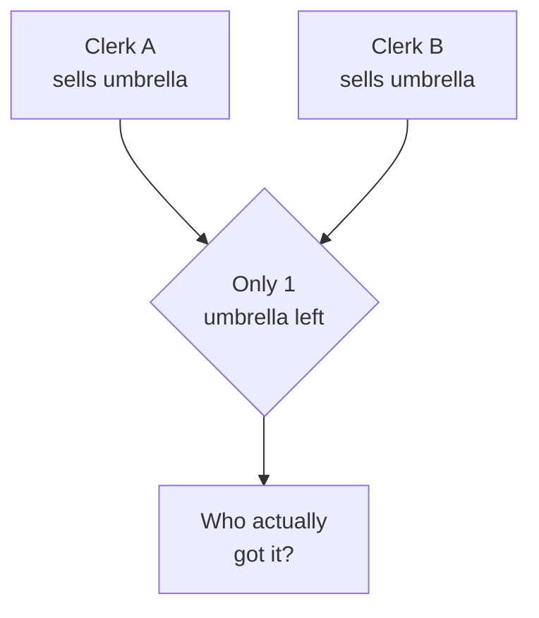
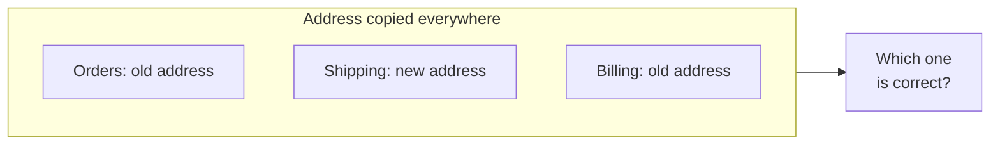
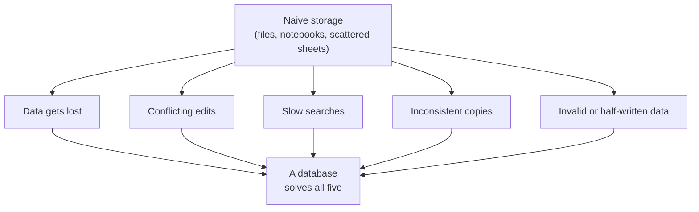

Databases were not invented because someone thought they were
elegant. They were invented because, without them, working with
data at any real scale becomes a nightmare. Let us look at the
specific nightmares.

<svg
  viewBox="0 0 640 220"
  role="img"
  aria-label="Loose pages tumble away in the wind on the left while the same data sits as tidy dots inside a sturdy vault on the right"
  style={{ display: "block", width: "100%", maxWidth: "640px", height: "auto", margin: "2.5rem auto" }}
>
  <g fill="currentColor">
    <rect x="70" y="46" width="56" height="72" rx="6" opacity="0.2" transform="rotate(-14 98 82)" />
    <rect x="140" y="70" width="56" height="72" rx="6" opacity="0.14" transform="rotate(10 168 106)" />
    <rect x="95" y="120" width="56" height="72" rx="6" opacity="0.1" transform="rotate(22 123 156)" />
  </g>
  <g fill="currentColor" opacity="0.3">
    <rect x="82" y="60" width="32" height="6" rx="3" transform="rotate(-14 98 82)" />
    <rect x="82" y="74" width="24" height="6" rx="3" transform="rotate(-14 98 82)" />
  </g>
  <g style={{ color: "var(--ds-red-500)" }} fill="currentColor">
    <rect x="215" y="30" width="50" height="64" rx="6" fillOpacity="0.35" transform="rotate(28 240 62)" />
    <circle cx="290" cy="44" r="3.5" fillOpacity="0.3" />
    <circle cx="305" cy="58" r="3.5" fillOpacity="0.25" />
    <circle cx="316" cy="74" r="3.5" fillOpacity="0.2" />
  </g>
  <g style={{ color: "var(--ds-blue-500)" }} fill="currentColor">
    <rect x="400" y="50" width="180" height="130" rx="16" fillOpacity="0.12" />
    <circle cx="442" cy="86" r="7" />
    <circle cx="490" cy="86" r="7" fillOpacity="0.6" />
    <circle cx="442" cy="146" r="7" fillOpacity="0.6" />
    <circle cx="490" cy="116" r="7" />
    <circle cx="538" cy="146" r="7" />
  </g>
  <g style={{ color: "var(--ds-green-500)" }} fill="currentColor">
    <circle cx="538" cy="86" r="7" />
    <circle cx="442" cy="116" r="7" fillOpacity="0.7" />
    <circle cx="538" cy="116" r="7" fillOpacity="0.7" />
    <circle cx="490" cy="146" r="7" />
    <rect x="560" y="95" width="10" height="40" rx="5" />
  </g>
</svg>

## Problem 1: Keeping data without losing it

Imagine a shop that records every sale in a notebook. The notebook
can be lost, burned, soaked, or simply run out of pages. If two
clerks each keep their own notebook, the shop's records are now
split across two places that may disagree.

A database provides **durable, central storage**: one trusted place
where data lives, survives crashes, and can be backed up.

## Problem 2: Many people at once

Now imagine ten clerks all trying to update the same inventory
count at the same moment. Two of them sell the last umbrella within
the same second. Who got it? Without coordination, the data ends up
wrong — the system might sell the same umbrella twice.

Databases solve this with **concurrency control**: they let many
users read and write at the same time while keeping the data
consistent, so the last umbrella is sold exactly once.

## Problem 3: Finding things quickly

A notebook with 100 sales is easy to scan. A notebook with
10 million sales is not. Answering *"how much did we sell in March
to customers in Ohio?"* by reading every line by hand would take
days.

Databases are built to **answer questions fast**, even over huge
amounts of data, using clever internal structures (we will meet the
idea of an *index* later) so that finding the right rows does not
require reading every row.

## Problem 4: Keeping data consistent

Suppose a customer's address is written in five different places. A
customer moves. Now you must remember to update all five — and if
you miss one, your data quietly contradicts itself. Which address
is correct? Nobody knows.

Databases let you store each fact **once** and refer to it from
everywhere else, so updating it in one place updates it everywhere.
This idea — *don't repeat the same fact* — is at the very heart of
relational databases, and we will return to it many times.

## Problem 5: Protecting the data

Data must be protected from two kinds of harm: **accidents** (a
program crashes halfway through a sale) and **bad values** (someone
types a price of "banana" or an age of -7).

Databases protect against both. They can guarantee that a change
either fully happens or does not happen at all (no half-finished
sales), and they can **enforce rules** about what counts as valid
data, refusing values that break the rules.

## The big picture

Every feature you will learn in this course exists to solve one of
these five problems. When a concept feels abstract, ask yourself:
*which of these nightmares is this protecting me from?* The answer
is almost always illuminating.

## Check your understanding

<MultipleChoice
  markdown={`Storing a customer's address in five different places creates which classic problem that databases are designed to prevent?

- The data takes up too much disk space to store.
  > Storage space is rarely the real issue; copying a short address five times costs almost nothing. The deeper danger is the data disagreeing with itself.
- [o] Inconsistency — if the address changes, some copies may be updated and others missed, so the data contradicts itself.
  > Storing a fact once and referring to it everywhere is exactly how relational databases avoid this, and it is a theme we return to throughout the course.
- The address becomes impossible to search.
  > Having multiple copies does not prevent searching; the real risk is that the copies disagree after an update.
- The database runs out of memory.
  > Memory exhaustion is unrelated to having a few duplicate addresses; the genuine problem is conflicting copies.

Storing the same fact in many places risks those copies drifting out of sync — the consistency problem.`}
/>

<MultipleChoice
  markdown={`Two clerks try to sell the last item in stock at the same instant. Which database capability prevents the item from being sold twice?

- Fast searching over large tables.
  > Speed helps answer questions quickly but does not, by itself, coordinate simultaneous changes to the same data.
- Backing up data to survive crashes.
  > Backups protect against data loss, but they do not arbitrate between two simultaneous edits.
- [o] Concurrency control — coordinating simultaneous reads and writes so the data stays consistent.
  > Concurrency control is precisely what lets many users act at once while ensuring the last item is sold exactly once.
- Enforcing that prices are numbers, not text.
  > Validating data types keeps individual values sensible, but it does not resolve a race between two simultaneous sales.

Coordinating simultaneous access so the data stays correct is the job of concurrency control.`}
/>
