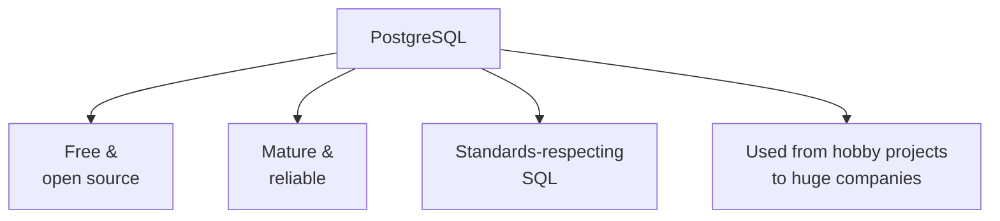
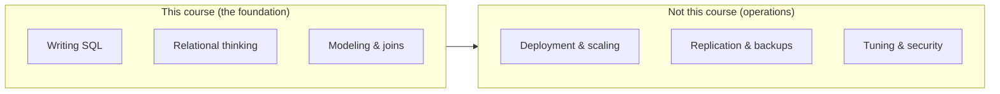

This course teaches SQL using **PostgreSQL** (often shortened to
**Postgres**). Before we start querying, let us answer two quick
questions: what is PostgreSQL, and why did we pick it?

## What PostgreSQL is

PostgreSQL is a **relational database management system** — the
software that stores your tables, runs your SQL queries, and keeps
your data safe and consistent. It is the "librarian" from our
earlier mental model, made real.

A few things make it stand out:

- It is **free and open source.** Anyone can use it, read its code,
  and run it without paying for a license.
- It is **mature and trusted.** It has been developed for decades
  and is known for being correct, stable, and standards-respecting.
- It is used **everywhere** — from tiny side projects to some of
  the largest companies and applications in the world.

## Why it is great for *learning*

Some of PostgreSQL's qualities make it an especially good place to
learn the fundamentals:

1. **It follows the SQL standard closely.** The SQL you learn here
   transfers cleanly to other databases, because Postgres tends to
   do things "the standard way" rather than with quirky shortcuts.
2. **It is strict in the helpful way.** Postgres enforces data
   types and rules carefully, so it teaches you good habits and
   catches mistakes early instead of silently accepting bad data.
3. **It is honest about results.** What you see is what is stored —
   a great property when you are building a mental model of how
   data behaves.

<Callout type="info" title="You are running real PostgreSQL right now">
The runnable SQL blocks in this course use **PGlite** — the actual
PostgreSQL engine compiled to run inside your web browser. It is
not a simplified imitation. When a query works here, it works in a
"real" PostgreSQL too.
</Callout>

## We are *not* learning database administration

It is worth being clear about scope. PostgreSQL is a deep system
with many advanced, operational features: replication, backups,
performance tuning, security roles, clustering, and more. Those
belong to the world of **database administration** and production
operations.

This course stays firmly on the **left** side: the SQL and
relational foundations that everything else is built on. You will
be far better prepared for the operational topics later precisely
because you took the time to build this base now.

## Let's confirm it works

Here is the simplest possible query — it asks PostgreSQL to compute
something and hand it back. No tables required. Click *Run*.

<SqlCodeBlock
  dialect="postgres"
  title="Hello from PostgreSQL"
  starterCode={`SELECT 'Hello, PostgreSQL!' AS greeting, 2 + 2 AS sum;`}
/>

You just ran a real PostgreSQL query. The `AS` parts simply give
each result column a friendly name — something we will use often.
In the next section we move from these ideas into hands-on querying.

## Check your understanding

<MultipleChoice
  markdown={`What *is* PostgreSQL?

- A spreadsheet program with extra formulas.
  > PostgreSQL is not a spreadsheet; it is a database management system that stores tables and runs SQL.
- A programming language that competes with SQL.
  > PostgreSQL is a database system that *uses* SQL; it is not itself a programming language competing with SQL.
- [o] A free, open-source relational database management system that stores tables and runs SQL queries.
  > That captures it: the software that manages relational data and answers SQL queries, available freely and openly.
- A cloud hosting provider.
  > Cloud providers may *offer* PostgreSQL, but PostgreSQL itself is the database software, not a hosting company.

PostgreSQL is the relational database management system this course uses to store data and run SQL.`}
/>

<MultipleChoice
  markdown={`Why is PostgreSQL a good database to *learn* SQL on?

- Because it uses a unique SQL dialect that works nowhere else.
  > It is the opposite: Postgres follows the SQL standard closely, so your skills transfer to other databases.
- Because it silently accepts any value you type, so you never see errors.
  > Postgres is helpfully strict about types and rules, catching mistakes early rather than hiding them.
- [o] Because it follows the SQL standard closely and enforces rules carefully, so good habits and skills transfer to other databases.
  > Standards-respecting behavior plus helpful strictness make it an excellent teacher of solid fundamentals.
- Because it is the only database that exists.
  > There are many relational databases; Postgres is chosen here for its quality and standards-compliance, not exclusivity.

Its closeness to the SQL standard and careful enforcement of rules make it an ideal place to build solid foundations.`}
/>
