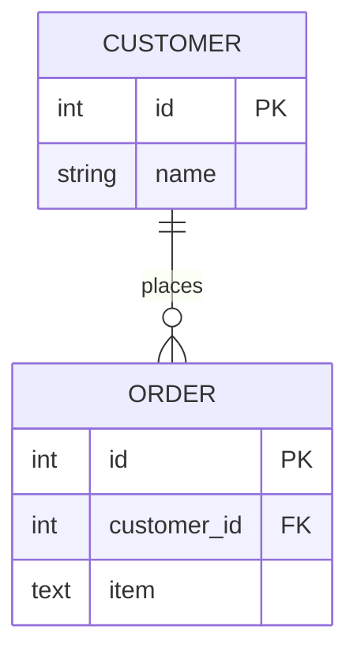
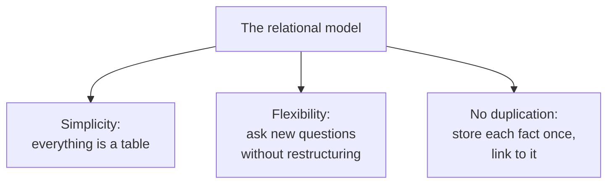

You will hear the phrase **relational database** constantly. It
sounds intimidating. It is actually one of the most elegant and
approachable ideas in all of computing, and this page is about
*why* that idea took over the world.

## The core idea in one sentence

A **relational database** organizes data into **tables**, and lets
those tables **relate to one another** through shared values.

That is it. Customers in one table, orders in another, and a shared
value (a customer's id) ties each order back to its customer.

The diagram says: a customer can *place* many orders, and each
order belongs to one customer. The link is the `customer_id` stored
on each order. (We will learn to read these diagrams properly in
the **Data Modeling** section — for now, just feel the shape.)

## Why "relational"?

A common misconception is that "relational" refers to the
*relationships between tables*. It is a reasonable guess, and the
relationships are real and important — but the name actually comes
from mathematics, where a **relation** is essentially a table of
rows. The deeper point is the same either way: the whole approach
is built around tidy tables and the connections between them.

## Why this idea beat the alternatives

Before relational databases became standard, data was often stored
in rigid, tangled structures where the *paths* between pieces of
data were baked in. Want to ask a question nobody anticipated? Too
bad — you might have to restructure everything.

The relational model changed the game with three gifts:

### Gift 1: Everything is a table

There is exactly one shape to learn: the table. Customers, orders,
products, payments — all tables. This uniformity makes the whole
system easy to reason about.

### Gift 2: Ask anything, anytime

Because the data is not locked into pre-built paths, you can pose
*new* questions at any time just by writing a new query. "Which
customers in Ohio bought umbrellas in March?" Nobody had to plan
for that question in advance.

### Gift 3: Store each fact once

Keep customers in the customers table and orders in the orders
table. A customer's name lives in **one** place. Orders just
reference the customer by id. Update the name once, and every order
sees the change. This is the cure for the inconsistency problem we
met earlier.

## Seeing relationships pay off

The query below answers a question that touches *both* tables —
"show each order with its customer's name" — even though the name
is stored only in the customers table. That is the relational model
delivering on its promise.

<SqlCodeBlock
  dialect="postgres"
  title="Two tables, one connected answer"
  initSql={`CREATE TABLE customers (
  id    INTEGER,
  name  TEXT,
  state TEXT
);
CREATE TABLE orders (
  id          INTEGER,
  customer_id INTEGER,
  item        TEXT
);
INSERT INTO customers (id, name, state) VALUES
  (1, 'Ada', 'OH'),
  (2, 'Grace', 'NY'),
  (3, 'Linus', 'OH');
INSERT INTO orders (id, customer_id, item) VALUES
  (101, 1, 'Umbrella'),
  (102, 1, 'Boots'),
  (103, 2, 'Umbrella'),
  (104, 3, 'Hat');`}
  starterCode={`-- Customers from Ohio and what they ordered
SELECT
  c.name,
  c.state,
  o.item
FROM
  customers c
  JOIN orders o ON o.customer_id = c.id
WHERE
  c.state = 'OH'
ORDER BY
  c.name;`}
/>

We will demystify every part of that query in the coming sections.
The takeaway right now: two simple tables, linked by a shared id,
can answer rich questions — and the customer names were never
duplicated.

## Check your understanding

<MultipleChoice
  markdown={`What is the central idea of a relational database?

- Storing all data in one enormous single table.
  > Relational databases deliberately split data into multiple focused tables rather than one giant one.
- Storing data only as plain paragraphs of text.
  > Relational databases store data in structured tables of rows and columns, not free-form text.
- [o] Organizing data into multiple tables that relate to one another through shared values.
  > Separate, focused tables connected by shared values (like a customer id on each order) is exactly the relational model.
- Avoiding tables entirely in favor of folders of files.
  > The table is the fundamental building block of the relational model, not folders of files.

Relational databases split data into focused tables and connect them through shared values.`}
/>

<MultipleChoice
  markdown={`A key advantage of the relational model is that you can ask questions nobody planned for in advance. Why is that possible?

- Because every possible question is pre-computed and stored.
  > Nothing pre-computes every question; that would be impossible. The flexibility comes from how the data is structured.
- [o] Because data is stored in flexible tables rather than rigid, pre-built paths, so a new query can answer a new question.
  > Since the data is not locked into fixed access paths, you simply write a new query whenever a new question arises.
- Because relational databases never store relationships.
  > Relationships are central to the relational model; the flexibility comes from tables, not from omitting relationships.
- Because the database guesses what you will ask next.
  > The database does not predict questions; it lets you express any question on demand through SQL.

Flexible table storage lets you write new queries for new questions at any time, without restructuring the data.`}
/>
