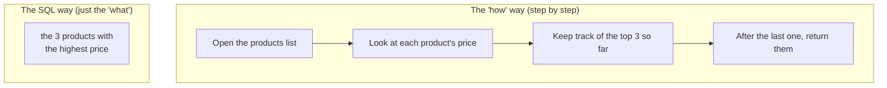
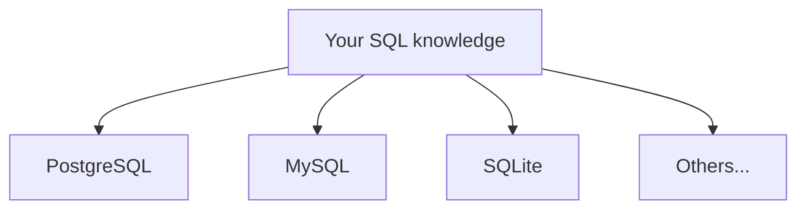

We keep mentioning **SQL**. It is time to meet it properly — not
the syntax yet, but the *idea*. Why does talking to a database
require a special language at all?

## SQL = Structured Query Language

**SQL** (often pronounced "sequel" or spelled out "S-Q-L") stands
for **Structured Query Language**. It is the standard language for
working with relational databases: asking them questions, and
telling them to store, change, or remove data.

The key word is **language**. Just as you use English to make
requests of a person, you use SQL to make requests of a database.
And like any language, it has vocabulary (`SELECT`, `FROM`,
`WHERE`) and grammar (the order those words go in).

## You say *what*, not *how*

Here is the single most important idea about SQL, and it is
genuinely surprising: **you describe the result you want, not the
steps to compute it.**

Compare two ways of getting "the three most expensive products":



With most programming, you would write out every step (the left
side). With SQL, you simply *state the goal* (the right side) and
the database figures out the steps for you. This style is called
**declarative**: you declare *what* you want and let the system
work out *how* to get it.

<Callout type="info" title="Why 'declarative' is a big deal">
Because you only describe the result, the database is free to find
the *fastest* way to produce it — and it can change that strategy
as your data grows, without you rewriting your query. You focus on
the question; the database worries about efficiency.
</Callout>

## A tiny taste, read like English

Look at this query and read it aloud:

```sql
SELECT name, price
FROM products
WHERE price > 100
ORDER BY price DESC;
```

It says: *"Select the name and price, from the products, where the
price is over 100, ordered by price from high to low."* That is
almost plain English — and that readability is by design. SQL was
created in the 1970s with the explicit goal that people who were
not professional programmers could use it.

## One language, many databases

SQL is a **standard**. That means the same core language works
across many different database systems — PostgreSQL, MySQL, SQLite,
SQL Server, Oracle, and more. Learn the fundamentals once, and you
can talk to almost any relational database.



Each system adds its own extra features and small dialect
differences, but the heart of the language — `SELECT`, `WHERE`,
`JOIN`, `GROUP BY` — is shared. Everything you learn in this course
transfers far beyond PostgreSQL.

## See declarative thinking in action

You will not write the *steps* below — only the *what*. Run it and
notice how little you had to say to get a precise, sorted answer.

<SqlCodeBlock
  dialect="postgres"
  title="State the goal; the database finds the steps"
  initSql={`CREATE TABLE products (
  name  TEXT,
  price NUMERIC
);
INSERT INTO products (name, price) VALUES
  ('Keyboard', 80),
  ('Monitor', 300),
  ('Mouse', 25),
  ('Desk', 220),
  ('Lamp', 45);`}
  starterCode={`SELECT name, price
FROM products
WHERE price > 100
ORDER BY price DESC;`}
/>

You never told PostgreSQL *how* to scan the rows, compare prices,
or sort them. You stated the result you wanted, and it delivered.
That is the essence of SQL.

## Check your understanding

<MultipleChoice
  markdown={`SQL is described as a **declarative** language. What does that mean?

- You must write out every step the database should take to compute the answer.
  > That describes an *imperative* style. SQL is the opposite: you leave the steps to the database.
- [o] You describe the result you want, and the database figures out the steps to produce it.
  > Declaring the desired result and letting the system find an efficient path is exactly what makes SQL declarative.
- It can only be used to delete data.
  > SQL covers reading, inserting, updating, and deleting; "declarative" refers to its style, not a limitation to deletion.
- It only works on a single brand of database.
  > SQL is a shared standard that works across many database systems; that is a separate strength from being declarative.

Declarative means you state *what* you want; the database determines *how* to get it.`}
/>

<MultipleChoice
  markdown={`Why is it valuable that SQL is a widely adopted **standard**?

- It guarantees every database is exactly identical with no differences.
  > Systems still have their own dialects and extra features; the standard ensures the *core* language is shared, not perfect uniformity.
- It means SQL can never change or improve.
  > Being a standard does not freeze the language; it evolves while keeping a stable, shared core.
- [o] The same core skills work across many database systems, so what you learn transfers broadly.
  > Learning SELECT, WHERE, JOIN, and GROUP BY once lets you work with PostgreSQL, MySQL, SQLite, and more.
- It makes SQL run faster than any other language.
  > Standardization is about portability of knowledge, not raw speed.

A shared standard means your SQL knowledge carries over from one relational database to the next.`}
/>
