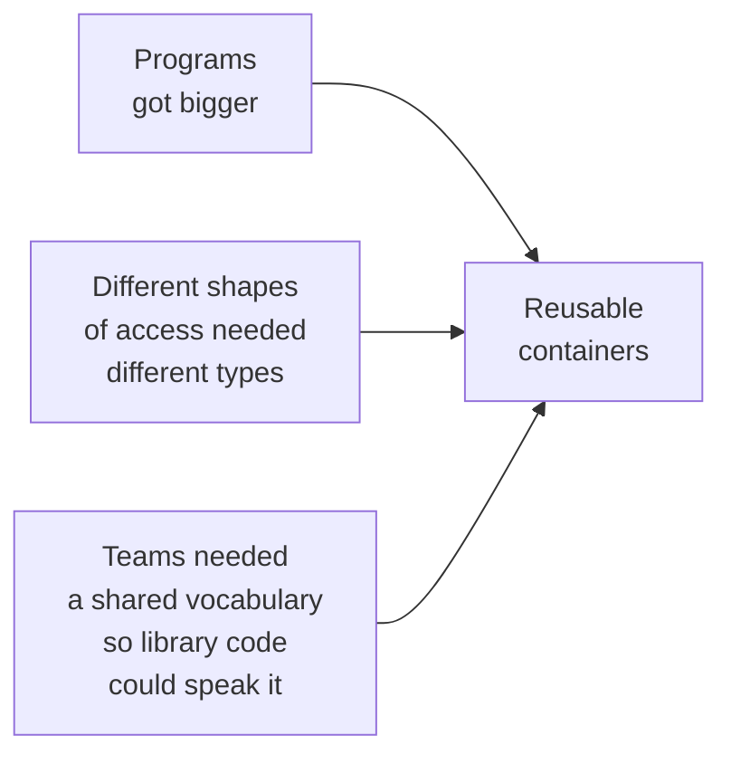

The history of *every* mainstream language goes through the same arc:
arrays first, then containers. C had arrays in 1972 and the STL
arrived for C++ in the mid-1990s. Smalltalk had a rich container
library from the start. Python had `list` and `dict` baked into the
language. Java, when it first shipped in 1996, had **four** container
classes and one helper interface in `java.util`:

- `Vector` — a growable array of `Object`
- `Stack` — a `Vector` with `push` / `pop`
- `Hashtable` — a key-to-value map of `Object`
- `Properties` — a `Hashtable` for `String` pairs
- `Enumeration` — an interface for walking through them

That was it. For three years (Java 1.0, 1.1) those were the entire
collection story. The story is worth telling because the *next*
generation of containers — the Collections Framework — was designed
specifically to fix what these classes got wrong.

## Why containers had to come into the language

Three pressures forced the issue:

A function that takes "a list of things and gives you back the unique
ones" should not need to know whether you passed it a hand-rolled
growing array or a linked list. It should accept *a container shape*.
That requires the container shapes to be **named in the standard
library**, so every program in the world reaches for the same names.

## Vector: the first growable list

`Vector` is the great-grandparent of `ArrayList`. It is a growable
array of `Object`, with `addElement`, `removeElement`,
`elementAt(int)`, and a small army of legacy methods.

<CodeBlock
  adapter="java"
  initialCode={`import java.util.Vector;
import java.util.Enumeration;

public class Main {
    public static void main(String[] args) {
        // Vector was the original "growable array of anything".
        Vector v = new Vector();
        v.addElement("Ada");
        v.addElement("Linus");
        v.addElement(42);            // also legal — it's a Vector of Object

        // Walk it the 1996 way, with Enumeration.
        Enumeration e = v.elements();
        while (e.hasMoreElements()) {
            Object o = e.nextElement();
            System.out.println(o + " (a " + o.getClass().getSimpleName() + ")");
        }
    }
}
`}
/>

Read that carefully. **There is no element type.** A `Vector` of
customers and a `Vector` of integers are the same Java type. Whatever
comes out has to be downcast:

<CodeBlock
  adapter="java"
  initialCode={`import java.util.Vector;

public class Main {
    public static void main(String[] args) {
        Vector v = new Vector();
        v.addElement("hello");

        // Have to downcast on the way out. Try changing "String" to "Integer".
        String s = (String) v.elementAt(0);
        System.out.println(s.toUpperCase());
    }
}
`}
/>

If a teammate accidentally adds an `Integer`, that cast blows up at
*runtime*, not at compile time. This is the bug class that generics
were eventually invented to kill.

## Stack: a Vector with push and pop

`Stack` is a small subclass of `Vector` that adds `push`, `pop`,
`peek`, and `empty`. It is the textbook example of how the early
library used inheritance where it should have used composition (we'll
return to this — modern code prefers `ArrayDeque` for stack behavior).

<CodeBlock
  adapter="java"
  initialCode={`import java.util.Stack;

public class Main {
    public static void main(String[] args) {
        Stack stack = new Stack();
        stack.push("first");
        stack.push("second");
        stack.push("third");

        while (!stack.empty()) {
            System.out.println("pop: " + stack.pop());
        }
    }
}
`}
/>

Because `Stack extends Vector`, you can *also* call `elementAt(0)` on
it and reach the bottom of the stack, breaking the abstraction. That
is a famous wart — and a great example of why "is-a" inheritance is
a dangerous design tool to reach for first.

## Hashtable: the first map

`Hashtable` is the great-grandparent of `HashMap`. It maps keys to
values using a hash function.

<CodeBlock
  adapter="java"
  initialCode={`import java.util.Hashtable;
import java.util.Enumeration;

public class Main {
    public static void main(String[] args) {
        Hashtable phone = new Hashtable();
        phone.put("Ada",   "555-0101");
        phone.put("Linus", "555-0102");
        phone.put("Grace", "555-0103");

        // Cast on the way out, again.
        String n = (String) phone.get("Grace");
        System.out.println("Grace -> " + n);

        // Walk the keys with Enumeration.
        Enumeration keys = phone.keys();
        while (keys.hasMoreElements()) {
            Object k = keys.nextElement();
            System.out.println(k + " -> " + phone.get(k));
        }
    }
}
`}
/>

Same problems as `Vector`: untyped, and *also* synchronized on every
method. Every `put` and every `get` took a lock — useful in 1996
when threading was new, expensive every day after.

## Enumeration: the original iterator

`Enumeration<E>` predates `Iterator<E>` and has only two methods:
`hasMoreElements()` and `nextElement()`. The for-each loop did not
exist yet; everyone wrote the `while` loop by hand.

<CodeBlock
  adapter="java"
  initialCode={`import java.util.Vector;
import java.util.Enumeration;

public class Main {
    public static void main(String[] args) {
        Vector v = new Vector();
        v.addElement("a"); v.addElement("b"); v.addElement("c");

        Enumeration e = v.elements();
        while (e.hasMoreElements()) {
            String s = (String) e.nextElement();
            System.out.println(s);
        }
    }
}
`}
/>

It worked. It was uniform-*ish*. But it could not be used in the
for-each loop, it could not be removed during iteration, and there
was nothing standard above it — every container exposed its own
"walking" method (`elements()` for `Vector`, `keys()` and
`elements()` for `Hashtable`, etc.).

## Lessons from the first generation

By 1997 the cracks were obvious:

| What the early containers did | What it cost |
| --- | --- |
| One container interface (effectively, "container of `Object`") | No compile-time type safety; casts everywhere |
| Synchronization built into every method | Slow even when single-threaded |
| Inheritance used for `Stack extends Vector` | Leaky abstractions you couldn't truly hide behind |
| No shared interface like `List` or `Map` | A method that worked on one container shape couldn't be reused for another |
| `Enumeration` rather than something more capable | No `remove()` during walks, no integration with future for-each |

Every one of those bullets becomes a *design goal* in the Java 1.2
Collections Framework — and a *language-level fix* in Java 5 generics.

## The same idea, rewritten with a hand-rolled container

Just to feel what reusable containers *look* like, here is a tiny
generic-free generic-style container that mimics `Vector`. Notice
that even building one such thing is non-trivial — and now imagine
needing one for "list", "set", "map", "queue", "stack",
"linked list", "tree map", and so on.

<CodeBlock
  adapter="java"
  entryFilename="Main.java"
  files={[
    {
      filename: "Main.java",
      initialContent: `public class Main {
    public static void main(String[] args) {
        Bag bag = new Bag();
        bag.add("Ada");
        bag.add("Linus");
        bag.add("Grace");

        for (int i = 0; i < bag.size(); i++) {
            // Downcast required — the bag is untyped.
            String s = (String) bag.get(i);
            System.out.println(s);
        }
    }
}
`,
    },
    {
      filename: "Bag.java",
      initialContent: `public class Bag {
    private Object[] data = new Object[2];
    private int      size = 0;

    public void add(Object o) {
        if (size == data.length) {
            Object[] bigger = new Object[data.length * 2];
            for (int i = 0; i < size; i++) bigger[i] = data[i];
            data = bigger;
        }
        data[size++] = o;
    }

    public Object get(int i) { return data[i]; }
    public int    size()      { return size; }
}
`,
    },
  ]}
/>

This little `Bag` is essentially `Vector` minus the threading and the
ceremony. If every team in the world is going to need one anyway,
*the language should ship it*. That insight is what produced the
Collections Framework.

## Test your understanding

<MultipleChoice
  markdown={`Why does \`Vector.get(...)\` return \`Object\` and force a cast in pre-Java-5 code?

- Because \`Object\` is faster than other types
  > Speed is unrelated.
- [o] Because \`Vector\` had no element-type parameter — the same class held any kind of element
  > Correct. Without generics, a container had to be defined in terms of \`Object\`, and the cast was the price of mixing types.
- Because \`Vector\` is an interface, not a class
  > \`Vector\` is a class.
- Because Java compiles all collections to \`Object[]\` at runtime
  > That's an oversimplification of erasure; the cast issue predates generics entirely.`}
/>

<MultipleChoice
  markdown={`What is wrong with \`Stack extends Vector\`?

- It's not allowed by the compiler
  > It is allowed.
- [o] It exposes Vector's index-based methods, breaking the LIFO abstraction a stack is supposed to provide
  > Correct. Inheritance gives users of Stack access to the parent's API, so a "stack" suddenly supports indexing into the middle of itself.
- It causes a stack overflow at runtime
  > It does not.
- It prevents Stack from being iterated
  > Stack inherits Vector's iteration just fine.`}
/>

<MultipleChoice
  markdown={`Beyond type safety, what's a second major reason \`Hashtable\` is considered legacy?

- It only supports \`Integer\` keys
  > It accepts any \`Object\` as a key.
- [o] Every method is synchronized, so it pays a locking cost even in single-threaded code
  > Correct. The original design baked thread-safety in unconditionally; modern code uses \`HashMap\` and adds synchronization only where needed.
- It cannot store more than 16 entries
  > It can grow arbitrarily.
- It was removed in Java 9
  > It still exists; it's just considered legacy.`}
/>

<Callout type="success" title="Next up">
The Java team eventually accepted that the first-generation
containers needed a redesign. In 1998 they shipped the answer: the
**Java Collections Framework**.
</Callout>
