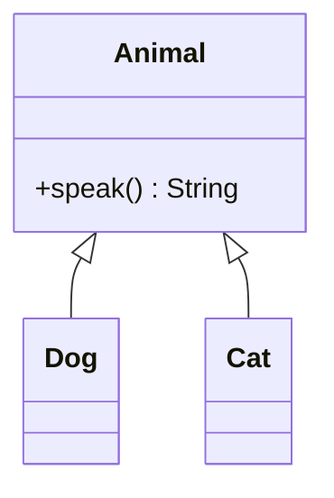
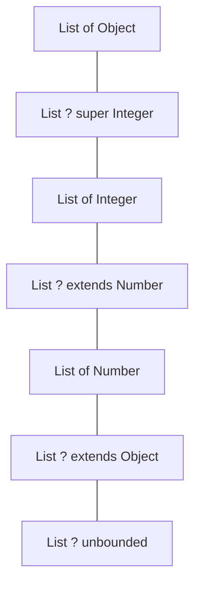

This page is the trickiest one in the course, and the one that most
separates "I have used generics" from "I understand generics."

It centers on a single fact about Java generics:

> `List<Dog>` is **not** a subtype of `List<Animal>`, even though
> `Dog` is a subtype of `Animal`.

That looks wrong at first glance. Once you understand *why* Java
designed it that way, everything else — `? extends T`, `? super T`,
PECS — falls out naturally.

## The setup



`Dog` and `Cat` both extend `Animal`. So far, normal OOP.

## Why List&lt;Dog&gt; is not List&lt;Animal&gt;

Imagine the rule were the other way — that `List<Dog>` *was* a
`List<Animal>`. Then this code would compile and crash:

```
List<Dog> dogs = new ArrayList<>();
List<Animal> animals = dogs;     // pretend this were legal
animals.add(new Cat());          // adding a Cat to a List<Dog>!
Dog d = dogs.get(0);             // ClassCastException
```

The compiler will never allow that, so Java declares generic types
**invariant**: `List<X>` and `List<Y>` are not subtype-related, even
when `X` and `Y` are.

<CodeBlock
  adapter="java"
  starterCode={`import java.util.ArrayList;
import java.util.List;

public class Main {
  public static void main(String[] args) {
    List<Integer> ints = new ArrayList<>();
    // List<Number> nums = ints;     // compile error — would let us add a
    // Double

    System.out.println(ints);
  }
}
`}
/>

Invariance is *safe* — but it is also *inflexible*. Now we need a way
to say "I just want to *read* numbers" or "I just want to *write*
integers," without losing type safety. That is what wildcards give
us.

## The unbounded wildcard: ?

`List<?>` means "a list of *something*, but I do not know what." You
can read from it as `Object`, and you cannot write into it (except
`null`):

<CodeBlock
  adapter="java"
  starterCode={`import java.util.ArrayList;
import java.util.List;

public class Main {
  // Works for ANY list — prints elements.
  static void printAll(List<?> xs) {
    for (Object o : xs)
      System.out.println(o);
    // xs.add("hi");   // compile error — we don't know the element type
  }

  public static void main(String[] args) {
    List<Integer> a = new ArrayList<>();
    a.add(1);
    a.add(2);
    List<String> b = new ArrayList<>();
    b.add("alpha");
    b.add("beta");

    printAll(a);
    printAll(b);
  }
}
`}
/>

That's `List<?>`: maximally general, but read-only.

## Upper-bounded: ? extends T (you can read T)

`List<? extends Number>` means "a list of some specific subtype of
`Number`." The compiler does not know *which* subtype, so it is
strict about writes — but reads are guaranteed to be a `Number`:

<CodeBlock
  adapter="java"
  starterCode={`import java.util.ArrayList;
import java.util.List;

public class Main {
  // Can SUM any list whose elements are Number or a subtype.
  static double sum(List<? extends Number> xs) {
    double total = 0;
    for (Number n : xs)
      total += n.doubleValue(); // read as Number
    // xs.add(1);    // compile error — could be List<Double>, can't add Integer
    return total;
  }

  public static void main(String[] args) {
    List<Integer> ints = new ArrayList<>();
    ints.add(1);
    ints.add(2);
    ints.add(3);

    List<Double> dbls = new ArrayList<>();
    dbls.add(1.5);
    dbls.add(2.5);

    System.out.println("sum ints = " + sum(ints));
    System.out.println("sum dbls = " + sum(dbls));
  }
}
`}
/>

`? extends T` is what you use when your method **only consumes** the
collection — it just reads elements.

## Lower-bounded: ? super T (you can write T)

`List<? super Integer>` means "a list of `Integer`, or any
*supertype* of `Integer` (e.g. `Number`, `Object`)." You can safely
*add* `Integer`s to such a list, but reads come out as `Object`
(the compiler only knows the elements are some supertype of
`Integer`):

<CodeBlock
  adapter="java"
  starterCode={`import java.util.ArrayList;
import java.util.List;

public class Main {
  // Can FILL any list that can hold Integer (or supertype).
  static void fillIntegers(List<? super Integer> sink) {
    sink.add(1);
    sink.add(2);
    sink.add(3);
    // Integer i = sink.get(0);   // compile error — only know it's Object
  }

  public static void main(String[] args) {
    List<Number> nums = new ArrayList<>();
    List<Object> objects = new ArrayList<>();

    fillIntegers(nums);    // Number IS a supertype of Integer  ✓
    fillIntegers(objects); // Object IS a supertype of Integer  ✓

    System.out.println(nums);
    System.out.println(objects);
  }
}
`}
/>

`? super T` is what you use when your method **only produces** values
(it writes into the collection).

## The PECS rule

This is the most famous mnemonic in Java generics, coined by Josh
Bloch:

> **Producer Extends, Consumer Super.**
>
> - If the collection *produces* values out to you (you read from
>   it), use `? extends T`.
> - If the collection *consumes* values from you (you write into
>   it), use `? super T`.
> - If it does both, use exactly `T` (no wildcard).

The classic illustration is `Collections.copy(dest, src)`:

```
public static <T> void copy(List<? super T> dest, List<? extends T> src)
```

`src` is the *producer* (we read from it): `? extends T`. `dest` is
the *consumer* (we write into it): `? super T`.

## Picture: variance on a number line



`? extends T` shrinks toward subtypes (read-only side). `? super T`
shrinks toward supertypes (write-only side). Plain `T` is the fixed
point in the middle.

## A more concrete example: a generic max

`Collections.max` is a real-world PECS exemplar. Its signature is
roughly:

```
public static <T extends Comparable<? super T>> T max(Collection<? extends T> coll)
```

That's a mouthful, so let's decode it:

- `T extends Comparable<? super T>` — `T` must be comparable to
  *itself or any supertype*. (Why `? super T`? Because if `Animal`
  implements `Comparable<Animal>`, then a `Dog` is "comparable
  enough" — it inherits the comparison from `Animal`.)
- `Collection<? extends T>` — the collection *produces* `T`s. We
  read; we never write into it.

<CodeBlock
  adapter="java"
  starterCode={`import java.util.ArrayList;
import java.util.Collections;
import java.util.List;

public class Main {
  public static void main(String[] args) {
    List<Integer> ints = new ArrayList<>();
    ints.add(3);
    ints.add(9);
    ints.add(1);

    // Collections.max accepts the wider signature, so this just works.
    System.out.println("max = " + Collections.max(ints));
  }
}
`}
/>

## A multi-file challenge of PECS

Here is the canonical exercise: write a method `copyAll(dest, src)`
that copies from one list to another, where the element types might
differ in the safe direction.

<CodeBlock
  adapter="java"
  entryFilename="Main.java"
  files={[
    {
      filename: "Main.java",
      initialContent: `import java.util.ArrayList;
import java.util.List;

public class Main {
  public static void main(String[] args) {
    List<Integer> ints = new ArrayList<>();
    ints.add(1);
    ints.add(2);
    ints.add(3);

    List<Number> nums = new ArrayList<>(); // Number is a supertype of Integer

    Copier.copyAll(nums, ints); // dest = Number, src = Integer
    System.out.println(nums);
  }
}
`,
    },
    {
      filename: "Copier.java",
      initialContent: `import java.util.List;

public class Copier {
  // PECS: src produces (? extends T), dest consumes (? super T)
  public static <T> void copyAll(List<? super T> dest, List<? extends T> src) {
    for (T x : src)
      dest.add(x);
  }
}
`,
    },
  ]}
/>

Try changing the signatures (e.g. swap `extends` and `super`) and see
what the compiler tells you. The error messages are a great way to
learn the variance rules.

## When *not* to use wildcards

Wildcards are for *method parameters*. They are almost never the
right thing for *return types* or *fields*, because they push the
"I don't know the type" problem onto every caller.

```
// Bad return type — caller has nothing useful to do with it
public List<? extends Number> getNumbers() { ... }

// Good — be specific about what you produce
public List<Integer> getIntegers() { ... }
```

Rule of thumb: **wildcards in, concrete types out.**

## Practice

<ChallengeCard
  adapter="java"
  title="Apply PECS to addAll"
  instructions={`Write a class \`Bag<T>\` that wraps a \`List<T>\` and exposes:

- A constructor with no arguments.
- \`void add(T item)\` — appends an item.
- \`void addAll(Iterable<? extends T> items)\` — copies all items from any iterable whose element type is \`T\` or a subtype (PECS: src is a producer, so \`? extends T\`).
- \`List<T> all()\` — returns the underlying list.

Expected output (when the provided \`Main\` runs):

\`\`\`
[1, 2, 3, 10, 20]
\`\`\``}
  entryFilename="Main.java"
  files={[
    {
      filename: "Main.java",
      initialContent: `import java.util.ArrayList;
import java.util.List;

public class Main {
  public static void main(String[] args) {
    Bag<Number> bag = new Bag<>();
    bag.add(1);
    bag.add(2);
    bag.add(3);

    List<Integer> moreInts = new ArrayList<>();
    moreInts.add(10);
    moreInts.add(20);

    bag.addAll(moreInts); // List<Integer> is "? extends Number"
    System.out.println(bag.all());
  }
}
`,
    },
    {
      filename: "Bag.java",
      initialContent: `import java.util.ArrayList;
import java.util.List;

public class Bag<T> {
  private final List<T> data = new ArrayList<>();

  public void add(T item) { data.add(item); }

  // TODO: addAll must accept any Iterable<? extends T>
  public void addAll(/* TODO */) {
    // TODO
  }

  public List<T> all() { return data; }
}
`,
      solutionContent: `import java.util.ArrayList;
import java.util.List;

public class Bag<T> {
  private final List<T> data = new ArrayList<>();
  public void add(T item) { data.add(item); }
  public void addAll(Iterable<? extends T> items) {
    for (T x : items)
      data.add(x);
  }
  public List<T> all() { return data; }
}
`,
    },
  ]}
  tests={[
    {
      id: "pecs-addall",
      name: "Bag.addAll accepts Iterable of T-or-subtype",
      expect: { stdoutEquals: "[1, 2, 3, 10, 20]" },
    },
  ]}
/>

## Test your understanding

<MultipleChoice
  markdown={`Why is \`List<Dog>\` not assignable to \`List<Animal>\`?

- Because \`Dog\` and \`Animal\` are different classes
  > They are — but that's true of subclass relationships generally.
- [o] Because if it were, you could add a \`Cat\` to a \`List<Dog>\` via the wider reference, breaking type safety
  > Java keeps generics invariant precisely to prevent that smuggling.
- Because Java doesn't support polymorphism for collections
  > It does support polymorphism — through wildcards.
- Because \`Animal\` is abstract
  > Whether \`Animal\` is abstract is irrelevant here.`}
/>

<MultipleChoice
  markdown={`What does **PECS** stand for, and when do you apply each side?

- "Public, Encapsulated, Composed, Shared" — for OO design
  > Made-up; PECS is about variance.
- [o] "Producer Extends, Consumer Super" — use \`? extends T\` for parameters you only read from, \`? super T\` for parameters you only write into
  > PECS is the standard mnemonic for choosing wildcard variance.
- "Performance, Encapsulation, Cohesion, Safety"
  > Made-up.
- "Parameter Extends, Class Super" — applied to class declarations
  > PECS is about method-parameter wildcards, not class type parameters.`}
/>

<MultipleChoice
  markdown={`Why is using \`List<? extends Number>\` as a *return* type generally a bad idea?

- It is forbidden by the compiler
  > It compiles.
- [o] It pushes "I don't know the exact element type" onto every caller, while a concrete return type like \`List<Integer>\` is just as easy to produce
  > Wildcards belong on inputs (where you want flexibility); outputs should be specific.
- It causes runtime casts to fail
  > It does not cause runtime cast failures.
- It is slower than \`List<Integer>\` at runtime
  > Performance is identical.`}
/>
