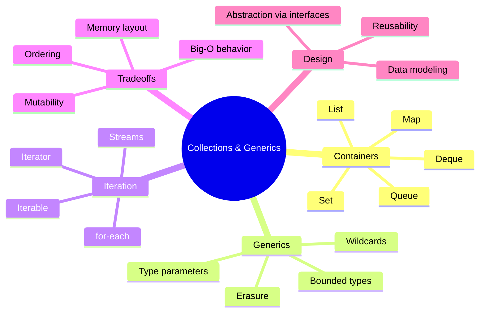
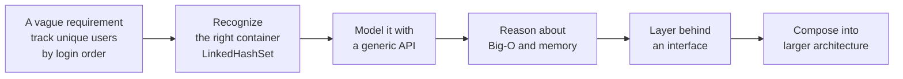

Welcome to **Java Collections and Generics Deep Dive**, a course
about *thinking in data*. It is designed for people who already know
basic Java syntax and object-oriented programming and now want to
deeply understand the part of the standard library that nearly every
real program leans on: the **Java Collections Framework** and the
**generic type system** that makes it safe to use.

This is a computer-science course, not a framework or interview
bootcamp. We use Java because its collections are mature, explicit,
and well-documented — and because Java's generics force you to be
honest about what your data *is*. By the end you should be able to
look at a problem ("the system needs to track all active orders by
customer, in arrival order, with fast lookup by id") and reach for
the right container without thinking, model the data with confidence,
and explain *why* one collection wins over another.

## What this course is about

You will spend most of your time on:

- **Why collections exist** — the structural problems with raw arrays
  and procedural data handling that made reusable containers
  inevitable
- **The shape of the framework** — `Iterable`, `Collection`, `List`,
  `Set`, `Map`, `Queue`, `Deque`, and how their interfaces compose
- **Generic type systems** — declaring generic classes and methods,
  bounded type parameters, wildcards (`? extends T`, `? super T`),
  type erasure, and why PECS exists
- **Tradeoffs** — when `ArrayList` beats `LinkedList`, when
  `HashMap` beats `TreeMap`, what `LinkedHashSet` really costs, and
  how to reason about Big-O and memory in practice
- **Equality, hashing, and ordering** — the `equals`/`hashCode`
  contract, `Comparable`, `Comparator`, and the bugs that lurk when
  you get them wrong
- **Collection-oriented design** — modeling real systems as
  collections of values, layering abstractions through interfaces,
  and writing APIs that read like English

This course intentionally does **not** spend much time on web
frameworks, build tools, ORMs, dependency-injection containers, or
production operations. Those skills are valuable, but they distract
from the more durable skill of *knowing your data structures cold*.

## How to use this site

Every page mixes prose with three kinds of interactive widget:

1. **Executable Java code blocks.** Each block is compiled by `javac`
   and run on the JVM inside your browser via **CheerpJ**. The first
   run in a session is slow because the JVM has to boot; subsequent
   runs are fast.
2. **Multi-file challenge cards.** Real collection code lives across
   many files — interface, implementation, value type, driver. You
   will see workspaces with several `.java` files side by side and
   fill in the missing parts.
3. **Multiple-choice questions.** Short single-answer checks at the
   end of most pages, with a per-choice explanation so a wrong answer
   still teaches you something.

<Callout type="info" title="Each code block is independent">
A variable, class, or method defined in one `<CodeBlock>` is **not**
visible in the next. This keeps every example self-contained. For a
persistent multi-file workspace, open the
[Java Playground](/playground/java) in a new tab.
</Callout>

## A tiny taste

Here is the very first idea of the course in code: a `List<String>` is
a typed, resizable sequence — and the *type parameter* `<String>` is
what stops you from accidentally putting an `Integer` next to a name.

<CodeBlock
  adapter="java"
  initialCode={`import java.util.ArrayList;
import java.util.List;

public class Main {
    public static void main(String[] args) {
        List<String> names = new ArrayList<>();
        names.add("Ada");
        names.add("Linus");
        names.add("Grace");

        // names.add(42);   // compile error — the list is List<String>

        for (String name : names) {
            System.out.println("Hello, " + name);
        }

        System.out.println("There are " + names.size() + " names.");
    }
}
`}
/>

Three things to notice — they will reappear on almost every page:

- `List<String>` is a **generic type**. The `<String>` is the
  *type parameter*. Without it, the list would hold `Object`s and
  every read would need a cast.
- We program to the **interface** `List`, not the concrete
  implementation `ArrayList`. Swapping in `new LinkedList<>()`
  would not change a single other line.
- `for (String name : names)` is **iteration through `Iterable`** —
  the for-each loop only works because `List` extends `Iterable`,
  which is the single most important interface in the framework.

## What you'll be able to do by the end

Let's start where every interesting story about software starts: with
the problem that the tools we had weren't enough.
