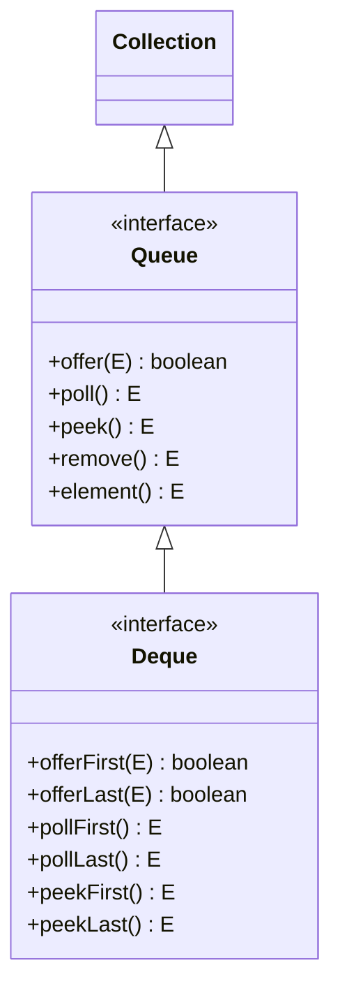
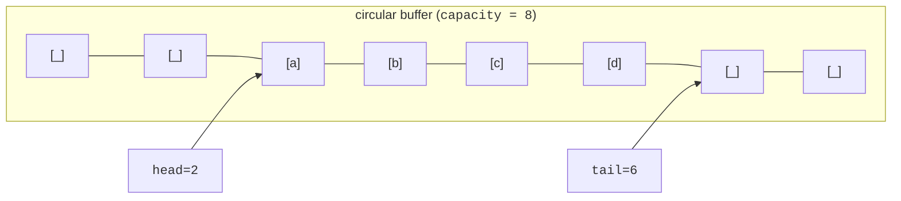

Lists are about *position*. Sets are about *presence*. Maps are about
*association*. The last collection family is about **insertion and
removal at the ends**:

- A **queue** is a one-ended pipe: things enter at the back, leave
  at the front. Think of a line at a coffee shop. (FIFO.)
- A **deque** (pronounced *deck*) is a queue with two ends: you can
  add or remove at either side. Think of a deck of cards you can
  draw from either end.

## The interfaces

`Queue` has two versions of each operation: a "soft" one that returns
`null` or `false` on failure (`offer`, `poll`, `peek`), and a "loud"
one that throws on failure (`add`, `remove`, `element`). **Prefer
the soft versions** — they make queue-emptiness a value, not an
exception.

## ArrayDeque: the modern default

`ArrayDeque` is the default implementation of `Deque`, and the
default implementation of `Queue` in modern code. It is a circular
buffer of `Object` — contiguous memory, no node allocation per
element, very fast.

Front and back are pointers into the array; they wrap around. Both
ends are `O(1)`.

<CodeBlock
  adapter="java"
  files={[
    {
      filename: "main.java",
      starterCode: `import java.util.ArrayDeque;
import java.util.Deque;

public class Main {
  public static void main(String[] args) {
    Deque<String> dq = new ArrayDeque<>();
    dq.offerLast("first");
    dq.offerLast("second");
    dq.offerFirst("zeroth");

    System.out.println(dq); // [zeroth, first, second]
    System.out.println("peek front: " + dq.peekFirst());
    System.out.println("peek back:  " + dq.peekLast());

    System.out.println("pop front:  " + dq.pollFirst());
    System.out.println("pop back:   " + dq.pollLast());
    System.out.println("left over:  " + dq);
  }
}
`,
    },
  ]}
/>

## Use ArrayDeque as a queue (FIFO)

When you need a plain queue (line-at-the-coffee-shop semantics),
`ArrayDeque` is the right choice:

<CodeBlock
  adapter="java"
  files={[
    {
      filename: "main.java",
      starterCode: `import java.util.ArrayDeque;
import java.util.Queue;

public class Main {
  public static void main(String[] args) {
    Queue<String> q = new ArrayDeque<>();
    q.offer("first");
    q.offer("second");
    q.offer("third");

    while (!q.isEmpty()) {
      System.out.println("serving: " + q.poll());
    }
  }
}
`,
    },
  ]}
/>

## Use ArrayDeque as a stack (LIFO)

You can also use it as a stack — and you *should*, instead of the
legacy `java.util.Stack`:

<CodeBlock
  adapter="java"
  files={[
    {
      filename: "main.java",
      starterCode: `import java.util.ArrayDeque;
import java.util.Deque;

public class Main {
  public static void main(String[] args) {
    Deque<Integer> stack = new ArrayDeque<>();
    stack.push(1);
    stack.push(2);
    stack.push(3); // push = addFirst

    while (!stack.isEmpty()) {
      System.out.println("pop: " + stack.pop()); // pop = removeFirst
    }
  }
}
`,
    },
  ]}
/>

A `Deque` is a *better* stack than `java.util.Stack` for the same
reason `ArrayList` is a better growing array than `Vector`: cleaner
API, no inheritance leaks, no unnecessary synchronization.

## A canonical algorithm: BFS with a queue

Breadth-first search on a graph is the queue's textbook job. Every
node is *visited* in the order it was discovered — exactly FIFO.

<CodeBlock
  adapter="java"
  files={[
    {
      filename: "main.java",
      starterCode: `import java.util.*;

public class Main {
  public static void main(String[] args) {
    // Tiny graph: 1 -> {2, 3}; 2 -> {4}; 3 -> {4, 5}; 4 -> {}; 5 -> {}
    Map<Integer, List<Integer>> g =
        Map.of(1, List.of(2, 3), 2, List.of(4), 3, List.of(4, 5), 4, List.of(),
               5, List.of());

    Set<Integer> seen = new HashSet<>();
    Queue<Integer> q = new ArrayDeque<>();
    List<Integer> order = new ArrayList<>();

    q.offer(1);
    seen.add(1);
    while (!q.isEmpty()) {
      int node = q.poll();
      order.add(node);
      for (int nb : g.get(node)) {
        if (seen.add(nb))
          q.offer(nb); // add returns true on first sight
      }
    }
    System.out.println("BFS order = " + order);
  }
}
`,
    },
  ]}
/>

Swap the `Queue` for an `ArrayDeque`-as-stack and you have DFS.

## PriorityQueue: the heap

`PriorityQueue` is a `Queue` whose `poll()` always returns the
**smallest** element according to natural order (or a `Comparator`
you provide). It is backed by a *binary heap*, so `offer` and
`poll` are both `O(log n)`.

<CodeBlock
  adapter="java"
  files={[
    {
      filename: "main.java",
      starterCode: `import java.util.Comparator;
import java.util.PriorityQueue;

public class Main {
  public static void main(String[] args) {
    PriorityQueue<Integer> pq = new PriorityQueue<>();
    pq.offer(5);
    pq.offer(1);
    pq.offer(9);
    pq.offer(3);

    while (!pq.isEmpty())
      System.out.println(pq.poll());

    System.out.println("--- reverse order ---");
    PriorityQueue<Integer> rev = new PriorityQueue<>(Comparator.reverseOrder());
    rev.offer(5);
    rev.offer(1);
    rev.offer(9);
    rev.offer(3);
    while (!rev.isEmpty())
      System.out.println(rev.poll());
  }
}
`,
    },
  ]}
/>

Real uses: Dijkstra's algorithm, scheduling, "top-K" selection, event
simulation.

<Callout type="warn" title="PriorityQueue iteration is *not* sorted">
`for (E x : pq)` walks the underlying heap array, which is in heap
order, not sorted order. To get sorted order, drain via repeated
`poll()`.
</Callout>

## Choosing the right queue at a glance

| Need | Pick |
| --- | --- |
| FIFO queue | `ArrayDeque` |
| LIFO stack | `ArrayDeque` (via `push` / `pop`) |
| Double-ended | `ArrayDeque` |
| Priority order | `PriorityQueue` |
| Concurrent FIFO (multiple threads) | `ConcurrentLinkedQueue` or `ArrayBlockingQueue` (out of scope here) |

## A multi-file example: a tiny task scheduler

A scheduler is essentially a priority queue of tasks ordered by
deadline. The "smallest deadline" task runs next.

<CodeBlock
  adapter="java"
  entryFilename="Main.java"
  files={[
    {
      filename: "Main.java",
      starterCode: `public class Main {
  public static void main(String[] args) {
    Scheduler s = new Scheduler();
    s.add(new Task("backup", 30));
    s.add(new Task("email", 10));
    s.add(new Task("reindex", 50));
    s.add(new Task("heartbeat", 5));

    while (s.hasWork()) {
      Task t = s.next();
      System.out.println("running " + t.name() + " (deadline=" + t.deadline() +
                         ")");
    }
  }
}
`,
    },
    {
      filename: "Task.java",
      starterCode: `public record Task(String name, int deadline) {}
`,
    },
    {
      filename: "Scheduler.java",
      starterCode: `import java.util.Comparator;
import java.util.PriorityQueue;

public class Scheduler {
  private final PriorityQueue<Task> q =
      new PriorityQueue<>(Comparator.comparingInt(Task::deadline));

  public void add(Task t) { q.offer(t); }
  public boolean hasWork() { return !q.isEmpty(); }
  public Task next() { return q.poll(); }
}
`,
    },
  ]}
/>

`Comparator.comparingInt(Task::deadline)` extracts the deadline and
orders ascending — the smallest deadline comes out first. We will go
deeper on comparators in the next chapter.

## Practice

<ChallengeCard
  adapter="java"
  title="A bounded sliding window over a stream"
  instructions={`Write a class \`SlidingWindow<E>\` backed by an \`ArrayDeque<E>\` that:

- Takes \`int capacity\` in its constructor (assume \`capacity >= 1\`).
- \`void add(E item)\`: appends \`item\` at the back; if size exceeds \`capacity\`, removes the oldest from the front.
- \`List<E> snapshot()\`: returns the current contents in oldest-to-newest order.

Expected output:

\`\`\`
[1, 2, 3]
[2, 3, 4]
[3, 4, 5]
\`\`\``}
  entryFilename="Main.java"
  files={[
    {
      filename: "Main.java",
      starterCode: `public class Main {
  public static void main(String[] args) {
    SlidingWindow<Integer> w = new SlidingWindow<>(3);
    w.add(1);
    w.add(2);
    w.add(3);
    System.out.println(w.snapshot());
    w.add(4);
    System.out.println(w.snapshot());
    w.add(5);
    System.out.println(w.snapshot());
  }
}
`,
    },
    {
      filename: "SlidingWindow.java",
      starterCode: `import java.util.ArrayDeque;
import java.util.ArrayList;
import java.util.Deque;
import java.util.List;

public class SlidingWindow<E> {
  // TODO
}
`,
      solutionCode: `import java.util.ArrayDeque;
import java.util.ArrayList;
import java.util.Deque;
import java.util.List;

public class SlidingWindow<E> {
  private final int capacity;
  private final Deque<E> dq = new ArrayDeque<>();

  public SlidingWindow(int capacity) { this.capacity = capacity; }

  public void add(E item) {
    dq.offerLast(item);
    if (dq.size() > capacity)
      dq.pollFirst();
  }

  public List<E> snapshot() { return new ArrayList<>(dq); }
}
`,
    },
  ]}
  tests={[
    {
      id: "sliding-window",
      name: "SlidingWindow keeps the last N items in order",
      expect: { stdoutEquals: "[1, 2, 3]\n[2, 3, 4]\n[3, 4, 5]" },
    },
  ]}
/>

## Test your understanding

<MultipleChoice
  markdown={`Which is the modern recommended implementation when you want a plain FIFO \`Queue<E>\`?

- \`LinkedList\`
  > It works, but \`ArrayDeque\` is faster and uses less memory.
- [o] \`ArrayDeque\`
  > Circular array, both ends \`O(1)\`, far better cache behavior than a linked list.
- \`PriorityQueue\`
  > That gives you priority order, not FIFO.
- \`Vector\`
  > Legacy and synchronized.`}
/>

<MultipleChoice
  markdown={`What does \`pq.poll()\` return on a non-empty \`PriorityQueue<Integer>\` built with default ordering?

- The most recently inserted element
  > That would be LIFO, not priority.
- The first inserted element
  > That would be FIFO, not priority.
- [o] The smallest element according to natural order
  > The heap is a min-heap by default; use \`Comparator.reverseOrder()\` for a max-heap.
- A random element
  > Heap order is deterministic, not random.`}
/>

<MultipleChoice
  markdown={`What's wrong with iterating a \`PriorityQueue\` to get sorted output?

- Iteration throws \`UnsupportedOperationException\`
  > It does not.
- [o] Iteration walks the underlying heap array, which is *not* in sorted order — drain via \`poll()\` if you need sorted order
  > Heap order only guarantees the *root* is the smallest; the rest is partially ordered.
- It is \`O(n²)\`
  > Iteration is \`O(n)\`.
- It mutates the queue
  > Iteration alone doesn't mutate; only \`poll()\` removes.`}
/>
