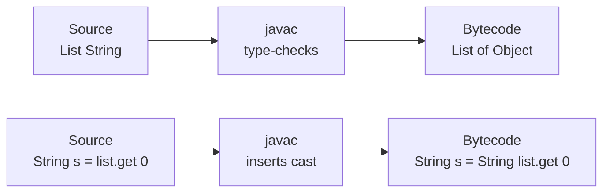

Generics are a *compile-time* feature in Java. At runtime, the JVM
knows almost nothing about them. This was a deliberate choice — it
let Java 5 add generics without breaking any class file that
predated them — but it has a small bag of consequences that every
working Java programmer eventually trips on.

This page lays them out so you don't have to learn each one by
crash.

## What erasure actually does

When `javac` compiles a generic class, it **erases** the type
parameter to its erasure (the most specific bound, usually `Object`):

```
// You write:
public class Box<T> {
    private T value;
    public T  get()       { return value; }
    public void put(T v)  { value = v; }
}

// The JVM sees, essentially:
public class Box {
    private Object value;
    public Object get()        { return value; }
    public void   put(Object v){ value = v; }
}
```

At the *use sites*, the compiler inserts casts to recover the
declared type:

```
Box<String> b = new Box<>();
b.put("hi");
String s = b.get();        // compiler inserts: (String) b.get();
```

That is the whole trick. Generics give you compile-time guarantees;
at runtime, they look like the old `Object`-based code, with the
casts written for you.



## Consequence 1: you cannot ask for the type parameter at runtime

There is no way to ask, at runtime, "what type parameter is this
collection?" Because the answer literally is not stored anywhere.

<CodeBlock
  adapter="java"
  starterCode={`import java.util.ArrayList;
import java.util.List;

public class Main {
  public static void main(String[] args) {
    List<String> ss = new ArrayList<>();
    List<Integer> is = new ArrayList<>();

    // At runtime, both are the same class.
    System.out.println(ss.getClass() == is.getClass()); // true
    System.out.println(ss.getClass().getName());        // java.util.ArrayList
  }
}
`}
/>

That is why `if (x instanceof List<String>)` is illegal. You can
write `if (x instanceof List<?>)` (the wildcard says "I don't claim
to know the parameter"), but not the specific form.

## Consequence 2: you cannot create an array of a generic type

The JVM tracks element types for arrays at runtime — that is what
makes `new String[10]` refuse a `Date`. Because generics are erased,
the compiler cannot generate a meaningful element-type check for
`new T[10]`. So it forbids it.

<CodeBlock
  adapter="java"
  starterCode={`public class Main {
  public static void main(String[] args) {
    // T[] arr = new T[10];     // not allowed
    // Pair<String,Integer>[] ps = new Pair<String,Integer>[10];  // not allowed

    // Workarounds:
    Object[] raw = new Object[10];
    @SuppressWarnings("unchecked")
    String[] cast = (String[]) new String[10]; // OK — String is concrete

    System.out.println("ok: " + raw.length + ", " + cast.length);
  }
}
`}
/>

In practice you almost never want a generic array — you want a
`List<T>` or `Map<K,V>`. That's the JCF's whole point.

## Consequence 3: you cannot overload by type parameter

Because both forms erase to the same bytecode signature, the
following is forbidden:

```
// Not allowed — both erase to printer(List)
public void printer(List<String>  xs) { ... }
public void printer(List<Integer> xs) { ... }
```

If you need different behavior per type, give the methods different
names, or take a `Class<T>` token, or use overloading by something
the compiler *can* tell apart.

## Consequence 4: static fields do not "see" the type parameter

There is only one `Class` object per generic class — not one per
parameterization. So static state is shared across all
parameterizations.

<CodeBlock
  adapter="java"
  starterCode={`public class Main {
  static class Counter<T> {
    static int instances = 0; // ONE counter, shared
    Counter() { instances++; }
  }

  public static void main(String[] args) {
    new Counter<String>();
    new Counter<Integer>();
    new Counter<Double>();
    System.out.println("instances = " + Counter.instances); // 3, not 1+1+1
  }
}
`}
/>

Usually you do not want static state in a generic class anyway. When
you find yourself reaching for it, that is a hint that the state
belongs *outside* the generic class.

## Consequence 5: heap pollution and the @SafeVarargs annotation

Varargs of a generic type (`List<String>... lists`) are arrays under
the hood, which we just said doesn't mix with generics. The compiler
warns about *heap pollution*: that the array's runtime element type
is the erasure, not the generic type, so an unrelated value could
sneak in.

If your method genuinely does not store anything bad into the array,
you can suppress the warning with `@SafeVarargs`:

<CodeBlock
  adapter="java"
  starterCode={`import java.util.ArrayList;
import java.util.List;

public class Main {
  @SafeVarargs
  static <T> List<T> listOf(T... items) {
    List<T> out = new ArrayList<>();
    for (T x : items)
      out.add(x);
    return out;
  }

  public static void main(String[] args) {
    List<String> xs = listOf("a", "b", "c");
    System.out.println(xs);
  }
}
`}
/>

This is exactly how the JDK declares `List.of(E... e)`.

## What erasure preserves

It is easy to think erasure throws everything away. Worth noting what
it *keeps*:

- **Class metadata is intact.** The bytecode signature on a class or
  method still records the generic information (in a separate
  attribute), which tools like the IDE and reflection's
  `ParameterizedType` can read.
- **Bridge methods.** When a generic class's method gets specialized,
  `javac` generates extra "bridge" methods to keep polymorphism
  working. You can see them with `javap -v`.
- **Compile-time safety.** This is the big one. The *whole point* of
  generics — the cast that never fails — survives erasure intact.

## When erasure bites you in real life

Three patterns where erasure most often shows up in working code:

1. **You want to ask "is this a List of X?"** You can't — only
   `instanceof List<?>`. If you need the element type, you have to
   pass a `Class<X>` token.
2. **You want to create a `T[]` inside a generic class.** You
   can't — return `List<T>`, or take a `Class<T>` to do it
   reflectively (`Array.newInstance`).
3. **You want different `static` fields per parameterization.** You
   can't — and probably don't want to.

## Passing a Class&lt;T&gt; token: the standard workaround

When you genuinely need the type at runtime — for reading from JSON,
constructing arrays, looking up in a registry — accept a
`Class<T>` parameter:

<CodeBlock
  adapter="java"
  starterCode={`import java.util.ArrayList;
import java.util.List;

public class Main {
  // Filter a heterogeneous list to elements of a given type.
  static <T> List<T> only(Iterable<?> items, Class<T> type) {
    List<T> out = new ArrayList<>();
    for (Object o : items) {
      if (type.isInstance(o))
        out.add(type.cast(o));
    }
    return out;
  }

  public static void main(String[] args) {
    List<Object> mixed = new ArrayList<>();
    mixed.add("alpha");
    mixed.add(42);
    mixed.add("beta");
    mixed.add(3.14);

    List<String> strings = only(mixed, String.class);
    System.out.println(strings);
  }
}
`}
/>

This is the trick the JDK uses in `Collections.checkedList(List, Class)`
and many reflective APIs.

## Test your understanding

<MultipleChoice
  markdown={`What does \`new ArrayList<String>().getClass() == new ArrayList<Integer>().getClass()\` return at runtime?

- \`false\` — they are different parameterized types
  > That would be true if Java kept type parameters at runtime, but it doesn't.
- [o] \`true\` — both share the same erasure (\`ArrayList\`)
  > Generics are erased; the runtime class is the same regardless of the type parameter.
- A compile error
  > It compiles.
- \`null\`
  > \`getClass()\` is never \`null\`.`}
/>

<MultipleChoice
  markdown={`Why is \`new T[10]\` illegal inside a generic class?

- Arrays don't allow size 10
  > Arrays allow any non-negative size.
- [o] Arrays carry their element type at runtime, but \`T\` is erased — the JVM can't enforce the element type, so the language forbids the construction
  > Use \`List<T>\` (or a \`Class<T>\` token plus \`Array.newInstance\`) instead.
- It would always throw \`ClassCastException\`
  > It would create *unsafe* arrays, which is precisely why it's banned at compile time.
- The JVM only supports primitive arrays
  > It supports object arrays too.`}
/>

<MultipleChoice
  markdown={`If you absolutely need to know the element type of a generic structure at runtime, what's the standard workaround?

- Read a private field with reflection
  > Reflection can't recover what was never stored.
- Use \`instanceof List<X>\` checks
  > Such checks are forbidden by the language.
- [o] Accept a \`Class<T>\` token as a constructor or method parameter and use it for \`isInstance\`, \`cast\`, or array creation
  > This is the pattern used by \`Collections.checkedList\`, many reflective APIs, and most JSON libraries.
- Switch to a different language
  > Unnecessary; the \`Class<T>\` idiom handles essentially every case.`}
/>
