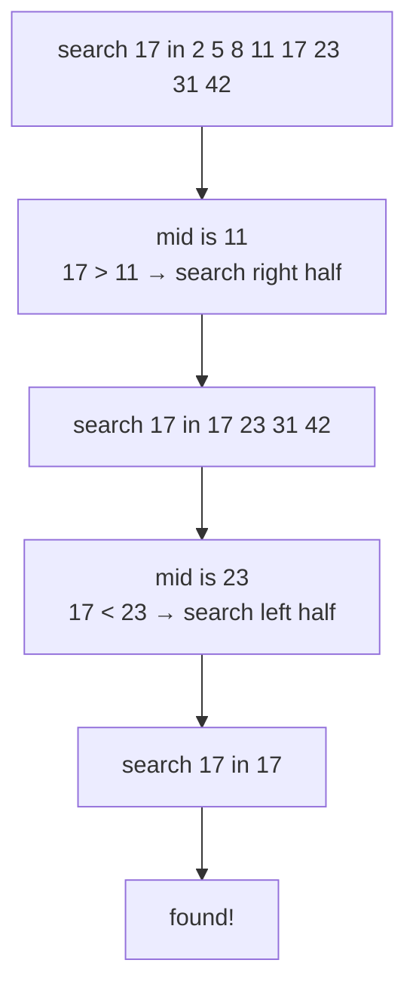
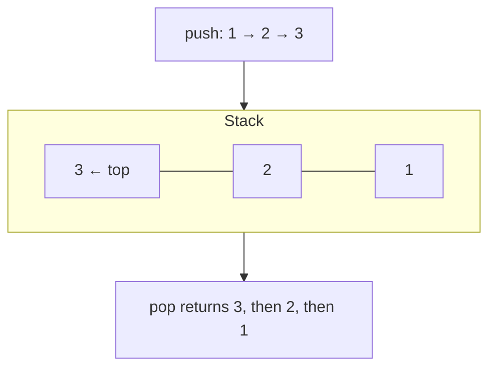
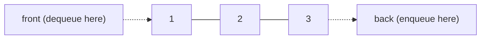

So far we have used data structures (lists, sets, maps) and
written ad-hoc loops. This page introduces the **classic algorithms
and structures** that show up in real software again and again. We
will not get formal — no Big-O notation lectures — but we *will*
develop intuition for *which idea to reach for* and *why it works*.

## Linear search

The simplest possible search: look at each element until you find
what you want, or run out.

<CodeBlock
  adapter="java"
  starterCode={`public class Main {
  public static void main(String[] args) {
    int[] xs = {4, 9, 1, 7, 2};
    System.out.println("index of 7  = " + indexOf(xs, 7));
    System.out.println("index of 99 = " + indexOf(xs, 99));
  }

  static int indexOf(int[] xs, int target) {
    for (int i = 0; i < xs.length; i++) {
      if (xs[i] == target)
        return i;
    }
    return -1;
  }
}
`}
/>

Linear search:

- Works on **any** collection — sorted, unsorted, anything iterable.
- In the worst case, looks at *every* element. Doubling the
  collection roughly doubles the time.
- Is exactly what `List.contains(...)` and `List.indexOf(...)` do
  internally for a plain `ArrayList`.

For small lists, this is fine. For 10 million elements, repeatedly,
it is too slow. Then you need…

## Binary search

If the collection is **sorted**, you can do *vastly* better. Look
at the middle element. If it matches, done. If your target is
smaller, search the left half. Otherwise the right half. Each step
eliminates *half* of what is left.

A list of 1 million elements is fully searched in **20** comparisons
(2^20 ≈ 1M). A list of 1 billion: about **30** comparisons.

<CodeBlock
  adapter="java"
  starterCode={`public class Main {
  public static void main(String[] args) {
    int[] sorted = {2, 5, 8, 11, 17, 23, 31, 42};
    System.out.println("index of 17 = " + binarySearch(sorted, 17));
    System.out.println("index of 4  = " + binarySearch(sorted, 4));
  }

  static int binarySearch(int[] xs, int target) {
    int lo = 0, hi = xs.length - 1;
    while (lo <= hi) {
      int mid = lo + (hi - lo) / 2; // avoids integer overflow
      if (xs[mid] == target)
        return mid;
      if (xs[mid] < target)
        lo = mid + 1;
      else
        hi = mid - 1;
    }
    return -1;
  }
}
`}
/>

The cost of binary search: the input must be sorted. So sorting is
itself worth investing in.

## A simple sort: selection sort

Sorting is one of the most-studied subjects in CS. The fancy ones
(quick sort, merge sort) are clever; the slow ones are easy to
understand. Here is **selection sort**: on each pass, find the
smallest remaining element and put it in the next position.

<CodeBlock
  adapter="java"
  starterCode={`import java.util.Arrays;

public class Main {
  public static void main(String[] args) {
    int[] xs = {5, 3, 8, 1, 4};
    selectionSort(xs);
    System.out.println(Arrays.toString(xs));
  }

  static void selectionSort(int[] xs) {
    for (int i = 0; i < xs.length; i++) {
      int minIdx = i;
      for (int j = i + 1; j < xs.length; j++) {
        if (xs[j] < xs[minIdx])
          minIdx = j;
      }
      // swap xs[i] and xs[minIdx]
      int tmp = xs[i];
      xs[i] = xs[minIdx];
      xs[minIdx] = tmp;
    }
  }
}
`}
/>

Selection sort takes time proportional to the *square* of the list
length. For 10,000 elements, fine. For 10,000,000 elements, way too
slow — for that you'd use the JDK's built-in `Arrays.sort`, which
is `O(n log n)`.

The general rule: **you almost never write a sort in production
Java.** You call `Collections.sort(list)` or `Arrays.sort(arr)`.
But writing one *once* in your life makes the cost of sorting
intuitive forever.

## Two abstract data types: stack and queue

A **data structure** is *how* something is stored. An **abstract
data type** (ADT) is *what operations it supports*. Two ADTs you
will meet everywhere:

### Stack — Last In, First Out (LIFO)

You push items on top; you pop them off the top.

Stacks model call frames (we saw it on the stack-and-heap page!),
undo history, brace matching in parsers, depth-first search.

### Queue — First In, First Out (FIFO)

You enqueue items at the back; you dequeue from the front. Like a
line at a coffee shop.

Queues model task scheduling, message buffers, breadth-first
search.

Java has classes for both — `Deque` (often used as a stack via
`ArrayDeque`) and `Queue` (often `LinkedList` or `ArrayDeque`):

<CodeBlock
  adapter="java"
  starterCode={`import java.util.ArrayDeque;
import java.util.Deque;
import java.util.LinkedList;
import java.util.Queue;

public class Main {
  public static void main(String[] args) {
    // stack: LIFO
    Deque<Integer> stack = new ArrayDeque<>();
    stack.push(1);
    stack.push(2);
    stack.push(3);
    System.out.println("pop -> " + stack.pop()); // 3
    System.out.println("pop -> " + stack.pop()); // 2

    // queue: FIFO
    Queue<String> q = new LinkedList<>();
    q.add("a");
    q.add("b");
    q.add("c");
    System.out.println("poll -> " + q.poll()); // a
    System.out.println("poll -> " + q.poll()); // b
  }
}
`}
/>

## Knowing what to reach for

A working programmer's mental table of first-resort tools:

| Problem | First-resort tool |
| --- | --- |
| "Is X in this collection?" | `HashSet.contains` |
| "What value goes with key K?" | `HashMap.get` |
| "What's the smallest element?" | sort once, take first; or use a priority queue |
| "Process items in arrival order" | `Queue` |
| "Process items in last-in-first-out order" | `Deque` as a stack |
| "Find an item in a sorted list" | binary search |
| "Sort a list" | `Collections.sort` |
| "I'll iterate a million times — does \`contains\` need to be fast?" | use a Set, not a List |

You will, of course, run into problems that don't fit this table.
But this table covers an *astonishing* fraction of day-to-day code.

<MultipleChoice
  markdown={`Why does binary search require a sorted input?

- Sorting makes elements take less memory
  > It does not.
- The algorithm uses the index parity
  > It does not.
- [o] Each step compares the target to the middle element and then *discards an entire half* of the remaining range based on the ordering; without an ordering, you cannot rule out a half
  > Ruling out a half only works if the data is ordered so "too big" and "too small" mean something.
- Java's binary search throws an exception on unsorted input
  > Behavior is *undefined*, but it doesn't necessarily throw — it can simply return wrong answers.`}
/>

<MultipleChoice
  markdown={`In a *stack* (LIFO), the last item you pushed is…

- Lost forever
  > It is still there.
- The next-to-last to come out
  > No — it's the very next one.
- [o] The first one to come out when you pop
  > LIFO means last-in, first-out: the most recent push is on top and pops first.
- Sorted to the bottom
  > Stacks do not sort.`}
/>

<MultipleChoice
  markdown={`A program calls \`list.contains(x)\` inside a tight loop 1,000,000 times on a 1,000,000-element ArrayList. Which change is most likely to fix the resulting slowness?

- Replace the loop with recursion
  > Won't help and may overflow the stack.
- Sort the list first and keep using \`contains\`
  > \`contains\` does not benefit from sorting.
- [o] Replace the ArrayList with a HashSet so each \`contains\` call runs in roughly constant time
  > A set looks up by hash instead of scanning, turning each \`contains\` from linear to near-constant.
- Re-create the list with a smaller capacity
  > Does not change \`contains\`'s linear cost.`}
/>

## A challenge

<ChallengeCard
  adapter="java"
  title="Reverse a string with a stack"
  instructions={`Implement \`Reverser.reverse(String s)\` using a \`Deque<Character>\` as a stack: push every character, then pop them all back into a StringBuilder.

\`Main.java\` is provided. Expected output (exact):

\`\`\`
!olleh
\`\`\``}
  entryFilename="Main.java"
  files={[
    {
      filename: "Main.java",
      initialContent: `public class Main {
  public static void main(String[] args) {
    System.out.println(Reverser.reverse("hello!"));
  }
}
`,
    },
    {
      filename: "Reverser.java",
      initialContent: `import java.util.ArrayDeque;
import java.util.Deque;

public class Reverser {
  public static String reverse(String s) {
    // TODO: use a Deque<Character> as a stack
    return s;
  }
}
`,
      solutionContent: `import java.util.ArrayDeque;
import java.util.Deque;

public class Reverser {
  public static String reverse(String s) {
    Deque<Character> stack = new ArrayDeque<>();
    for (int i = 0; i < s.length(); i++) {
      stack.push(s.charAt(i));
    }
    StringBuilder out = new StringBuilder(s.length());
    while (!stack.isEmpty()) {
      out.append(stack.pop());
    }
    return out.toString();
  }
}
`,
    },
  ]}
  tests={[
    {
      id: "rev",
      name: "Stack-based reverse",
      expect: {
        stdoutLines: ["!olleh"],
        stdoutLinesExact: true,
      },
    },
  ]}
/>

You now have a vocabulary for the dozen most common patterns. The
last conceptual page widens the lens one more time: **how is a
*whole program* organized?**
