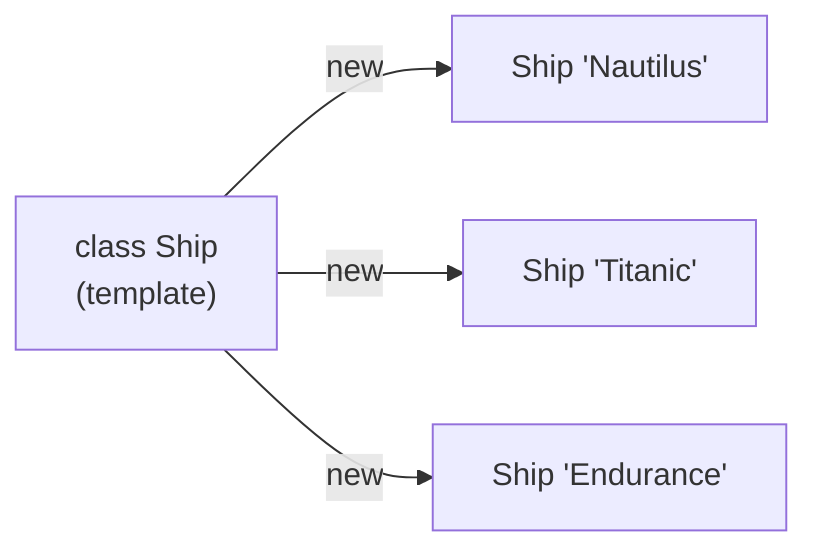
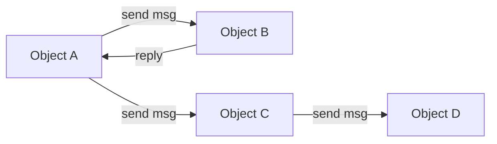
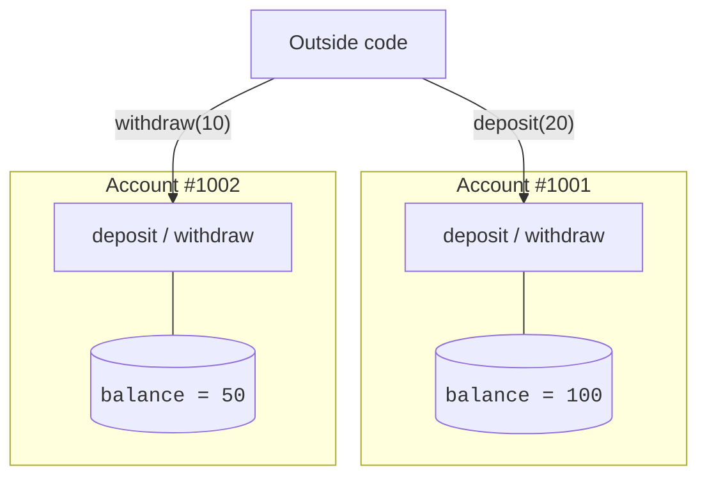

The deepest answer to the software crisis did not come from
re-arranging procedures. It came from a totally different way of
thinking about what a program *is*.

The new idea: a program is not a recipe. A program is a **society of
objects** that talk to each other by sending messages.

<svg
  viewBox="0 0 640 230"
  role="img"
  aria-label="Four objects of different shapes joined by dotted routes with little envelopes in transit between them — a program as a society of objects sending messages"
  style={{ display: "block", width: "100%", maxWidth: "640px", height: "auto", margin: "2.5rem auto" }}
>
  <g style={{ color: "var(--ds-blue-500)" }} fill="currentColor">
    <circle cx="170" cy="90" r="30" fillOpacity="0.85" />
    <rect x="485" y="153" width="70" height="34" rx="17" fillOpacity="0.55" />
  </g>
  <g style={{ color: "var(--ds-green-500)" }} fill="currentColor">
    <rect x="402" y="44" width="56" height="56" rx="14" fillOpacity="0.85" />
  </g>
  <g style={{ color: "var(--ds-yellow-500)" }} fill="currentColor">
    <polygon points="300,142 325,156 325,184 300,198 275,184 275,156" fillOpacity="0.85" />
  </g>
  <g style={{ color: "var(--ds-white)" }} fill="currentColor">
    <rect x="160" y="86" width="20" height="6" rx="3" fillOpacity="0.85" />
    <rect x="420" y="69" width="20" height="6" rx="3" fillOpacity="0.85" />
    <rect x="290" y="167" width="20" height="6" rx="3" fillOpacity="0.85" />
  </g>
  <g fill="currentColor" opacity="0.3">
    <circle cx="214" cy="78" r="3" />
    <circle cx="240" cy="70" r="3" />
    <circle cx="312" cy="62" r="3" />
    <circle cx="340" cy="60" r="3" />
    <circle cx="368" cy="60" r="3" />
    <circle cx="420" cy="110" r="3" />
    <circle cx="408" cy="126" r="3" />
    <circle cx="350" cy="156" r="3" />
    <circle cx="330" cy="162" r="3" />
    <circle cx="340" cy="184" r="3" />
    <circle cx="370" cy="180" r="3" />
    <circle cx="400" cy="176" r="3" />
    <circle cx="430" cy="172" r="3" />
    <circle cx="458" cy="168" r="3" />
  </g>
  <g style={{ color: "var(--ds-yellow-500)" }} fill="currentColor">
    <rect x="264" y="58" width="22" height="15" rx="3" transform="rotate(-6 275 65)" />
  </g>
  <g style={{ color: "var(--ds-green-500)" }} fill="currentColor">
    <rect x="376" y="138" width="22" height="15" rx="3" transform="rotate(8 387 145)" />
  </g>
  <g style={{ color: "var(--ds-gray-900)" }} fill="currentColor">
    <polygon points="266,60 275,68 284,60 275,64" fillOpacity="0.45" transform="rotate(-6 275 65)" />
    <polygon points="378,140 387,148 396,140 387,144" fillOpacity="0.45" transform="rotate(8 387 145)" />
  </g>
</svg>

## Simula: the first OOP language

In the 1960s, two Norwegian researchers, **Ole-Johan Dahl** and
**Kristen Nygaard**, were building software to simulate physical
systems — ships in a harbor, customers at a bank, particles in a
fluid. They noticed something. The most natural way to write a
simulation is to model each *thing in the real world* as a *thing in
the program*: a ship in the harbor *is* a `Ship` in the code, with
its own position, speed, and behaviors.

They built a language called **Simula 67** around this idea. Simula
introduced two words that we still use every single day:

- **Class** — the description, the template, the blueprint of a kind
  of thing.
- **Object** — an actual *instance* of that thing, with its own data.

This was a quiet revolution. Programs were no longer just "code that
manipulates data." Programs were *populations of small things*, each
holding their own data and offering their own behavior.

## Smalltalk: the radical version

In the 1970s, at Xerox PARC in California, **Alan Kay** and his team
took Simula's idea to the extreme and built **Smalltalk**. Smalltalk
said:

> **Everything is an object. Objects communicate only by sending
> messages.**

In Smalltalk, even a number was an object. Even `true` and `false`
were objects. There was no other way to do anything — if you wanted
something to happen, you sent a message to an object.

Smalltalk also introduced the modern graphical user interface, the
window-and-mouse environment, and the idea of *live* programming
where you could change a running program while it was still running.
A staggering amount of what we now take for granted in computing came
out of this one research group.

## Why "objects" tamed complexity

Recall the central pain of the procedural era: global data that any
procedure could change. OOP solved this in a beautifully simple way.

> **Each object owns its own data, and only its own methods can touch
> that data.**

That single rule — later called **encapsulation** — meant that when a
piece of data was wrong, you only had to look at *one* object's
methods to find out who was responsible. It scoped the search. It put
the data behind a door, and the door had a label saying *who* could
open it.

Outside code can ask an account to deposit or withdraw, but it
cannot reach in and just rewrite the balance. The rules of the
account live *with* the account.

## The four big ideas you will keep meeting

Object-oriented programming, as it stabilized over the 1970s and 80s,
is built on four ideas. Don't try to memorize them yet — we will
spend many pages on each of them later. Just notice the shape of the
list:

| Idea | One-sentence summary |
| --- | --- |
| **Encapsulation** | Each object hides its data and exposes only behavior. |
| **Abstraction** | Callers see *what* an object does, not *how* it does it. |
| **Inheritance** | A new class can be defined as "a kind of" an existing class. |
| **Polymorphism** | The same message can mean different things to different objects. |

These four ideas, together, are the toolkit that lets us build
programs in the millions of lines without our heads exploding.

<MultipleChoice
  markdown={`Which language introduced the concepts of *class* and *object*?

- C
  > C is procedural; classes and objects came later.
- Smalltalk
  > Smalltalk popularized them, but they were invented earlier.
- [o] Simula 67
  > Simula, built for simulations, introduced classes and objects.
- Java
  > Java is a major adopter, not the inventor.`}
/>

<MultipleChoice
  markdown={`What is the *single biggest problem* that encapsulation was invented to solve?

- Programs were too slow
  > Encapsulation is about correctness and maintainability, not speed.
- [o] In large procedural programs, any code could change any data, making bugs nearly impossible to localize
  > Encapsulation gives each piece of data a single owner.
- Programmers wanted to type less
  > OOP usually adds typing, not removes it.
- Computers did not have enough memory for procedures
  > Memory was not the issue.`}
/>

## From research to industry

Simula and Smalltalk were brilliant, but they were also rare. Most
real software was still written in C, COBOL, and Pascal. The ideas
were powerful; they had not yet escaped the research labs.

Three things had to happen for OOP to take over the world:

1. A practical, *production-grade* language had to absorb the ideas.
2. That language had to work on every kind of computer — not just one
   research workstation.
3. The industry had to be in enough pain to *try something new*.

In the 1980s and 90s, the planets aligned. We will look at that next.
