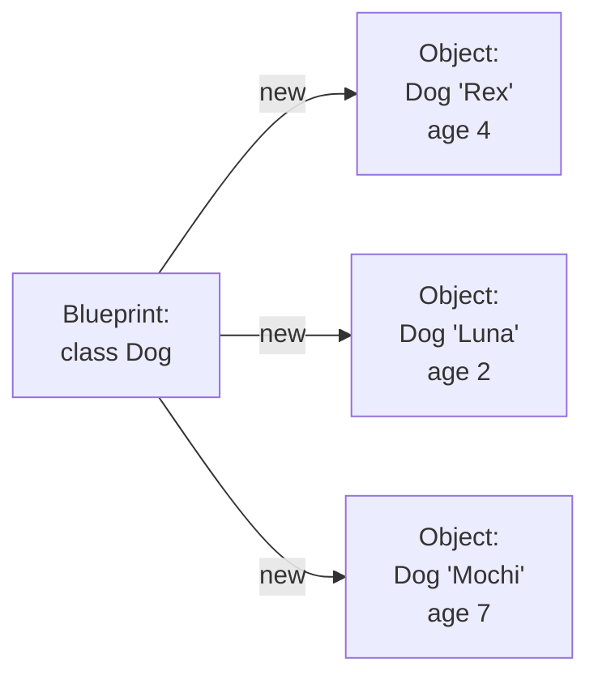
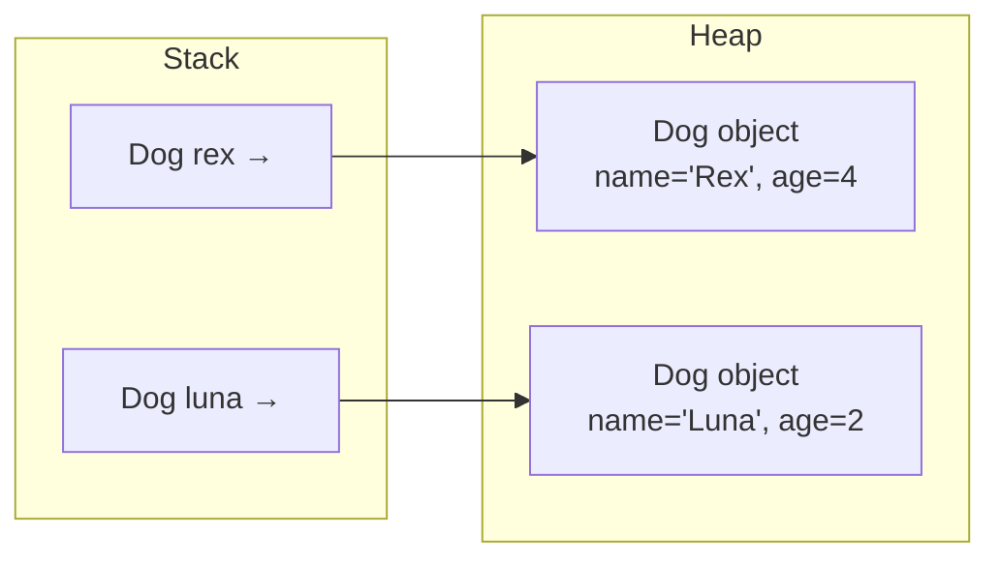
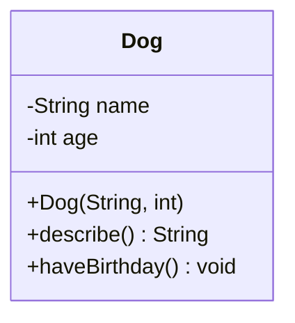

A **class** is a blueprint. An **object** is a thing built from
that blueprint. This sentence is the entire course in compressed
form. If you internalize the difference, the rest of Java becomes a
matter of vocabulary.

## The blueprint vs the thing built from it

Think of the architect's drawing of a house. The drawing says "three
bedrooms, two bathrooms, a kitchen." You cannot live in the drawing.
You live in *a particular house built from the drawing*. From the
same drawing you can build many houses, each at its own address,
each with its own occupants.

In Java, the keyword `class` declares a blueprint. The keyword `new`
builds an object from it. Each object has its own copy of the
class's **fields** (its state) and can respond to the class's
**methods** (its behavior).

## Your first real class

<CodeBlock
  adapter="java"
  initialCode={`public class Main {
    public static void main(String[] args) {
        Dog rex  = new Dog("Rex",  4);
        Dog luna = new Dog("Luna", 2);

        System.out.println(rex.describe());
        System.out.println(luna.describe());

        rex.haveBirthday();
        System.out.println(rex.describe());
        System.out.println(luna.describe());   // unchanged
    }
}

class Dog {
    String name;
    int    age;

    Dog(String name, int age) {       // constructor
        this.name = name;
        this.age  = age;
    }

    String describe() {                // method (behavior)
        return name + " is " + age + " years old";
    }

    void haveBirthday() {
        age = age + 1;
    }
}
`}
/>

Pay attention to the punctuation:

- `class Dog { ... }` — the blueprint.
- `new Dog("Rex", 4)` — calls the constructor, which builds an
  object.
- `rex` and `luna` are **two different objects**. Each has its own
  `name` and `age`. Calling `rex.haveBirthday()` changes `rex.age`,
  not `luna.age`.

That last point is the entire reason classes are useful: each object
keeps its own state.

## A picture of two objects in memory

The variables `rex` and `luna` live in the stack frame of `main`.
The actual `Dog` objects live on the heap. Each variable holds a
*reference* — an arrow — to its own object.

This is the *reference type* picture from the variables lesson, now
applied to a class you wrote yourself.

## The anatomy of a class

A class declaration typically has three sections:

| Part | Purpose |
| --- | --- |
| **Fields** | The state every instance carries |
| **Constructor(s)** | How to bring a valid new instance into existence |
| **Methods** | The behavior — what every instance can do |

We will meet *static* members in a future page; ignore them for now.

## Multi-file convention: one public class per file

Real Java programs put each public top-level class in its **own
file**, named exactly like the class. From now on, when an example
has more than one class, we will show each in its own file.

<CodeBlock
  adapter="java"
  entryFilename="Main.java"
  files={[
    {
      filename: "Main.java",
      initialContent: `public class Main {
    public static void main(String[] args) {
        Book hp = new Book("Harry Potter", "J. K. Rowling", 1997);
        Book lr = new Book("The Lord of the Rings", "J. R. R. Tolkien", 1954);

        System.out.println(hp.citation());
        System.out.println(lr.citation());
        System.out.println("Older: " + (hp.olderThan(lr) ? hp.title() : lr.title()));
    }
}
`,
    },
    {
      filename: "Book.java",
      initialContent: `public class Book {
    private final String title;
    private final String author;
    private final int    year;

    public Book(String title, String author, int year) {
        this.title  = title;
        this.author = author;
        this.year   = year;
    }

    public String title()  { return title; }
    public String author() { return author; }
    public int    year()   { return year; }

    public String citation() {
        return author + ", \\"" + title + "\\" (" + year + ")";
    }

    public boolean olderThan(Book other) {
        return this.year < other.year;
    }
}
`,
    },
  ]}
/>

A few things to notice:

- `private final` fields — `private` means no code outside `Book`
  can touch them; `final` means they cannot be reassigned after the
  constructor finishes. We are saying: a `Book`'s title, author,
  and year are *part of its identity* and must not change.
- `title()`, `author()`, `year()` are **accessor methods** (getters)
  — they answer questions about state without exposing the fields
  themselves.
- `olderThan(Book other)` takes another `Book` as a parameter.
  Because the comparison happens *inside* `Book` itself, it can
  access `other.year` even though `year` is private.

## `this`: the object the method is running on

Every non-static method has an invisible parameter called `this`. It
refers to **the object the method was called on**. When you write
`rex.describe()`, inside `describe`, `this` is `rex`. When you write
`luna.describe()`, inside the *same* method body, `this` is `luna`.

You usually do not have to type `this`. You *must* type it when you
have a parameter or local variable with the same name as a field —
which is why constructors so often look like `this.name = name;`.

## `null` and what happens when there's no object

A reference variable that does not yet point to any object holds the
special value `null`. Calling a method on `null` throws a
`NullPointerException` — Java's most famous error.

<CodeBlock
  adapter="java"
  initialCode={`public class Main {
    public static void main(String[] args) {
        String s = null;

        System.out.println("about to call .length()");
        try {
            System.out.println(s.length());      // NPE here
        } catch (NullPointerException e) {
            System.out.println("caught: " + e.getClass().getSimpleName());
        }
    }
}
`}
/>

We will return to exceptions later. For now: when you see
`NullPointerException`, it means *you tried to use an object that
wasn't there*.

<MultipleChoice
  markdown={`Which sentence correctly distinguishes a class from an object?

- They are exactly the same thing
  > They are very different.
- An object is the blueprint; a class is one specific instance
  > That's backwards.
- [o] A class is a blueprint describing structure and behavior; an object is one specific instance created from that blueprint
  > Correct. Many objects, one class.
- A class is for primitives; an object is for reference types
  > Both classes and objects are reference-type concepts.`}
/>

<MultipleChoice
  markdown={`Inside a method called on \`rex\`, what does \`this\` refer to?

- The class \`Dog\` itself
  > That would be relevant only for static members.
- The most recently created \`Dog\`
  > No, it refers to the specific receiver.
- [o] The specific \`Dog\` object the method was called on — that is, \`rex\`
  > Correct.
- A reserved field automatically present on every object
  > It's a keyword, not a field.`}
/>

## A small challenge

<ChallengeCard
  adapter="java"
  title="Build a Counter class"
  instructions={`Create a class \`Counter\` with:

- A private \`int\` field \`value\` that starts at \`0\`.
- A method \`void bump()\` that increases \`value\` by 1.
- A method \`int value()\` that returns the current value.

\`Main.java\` is fixed. It must print exactly:

\`\`\`
c=3
d=1
\`\`\``}
  entryFilename="Main.java"
  files={[
    {
      filename: "Main.java",
      initialContent: `public class Main {
    public static void main(String[] args) {
        Counter c = new Counter();
        c.bump(); c.bump(); c.bump();
        Counter d = new Counter();
        d.bump();
        System.out.println("c=" + c.value());
        System.out.println("d=" + d.value());
    }
}
`,
    },
    {
      filename: "Counter.java",
      initialContent: `public class Counter {
    // TODO: implement
}
`,
      solutionContent: `public class Counter {
    private int value = 0;

    public void bump() {
        value++;
    }

    public int value() {
        return value;
    }
}
`,
    },
  ]}
  tests={[
    {
      id: "counter",
      name: "Each Counter keeps its own state",
      expect: {
        stdoutLines: ["c=3", "d=1"],
        stdoutLinesExact: true,
      },
    },
  ]}
/>

The fact that `c` and `d` keep separate counts, even though both are
the same kind of object, is the heart of object-oriented programming.
Next we make the rules around fields explicit: **encapsulation and
abstraction**.
