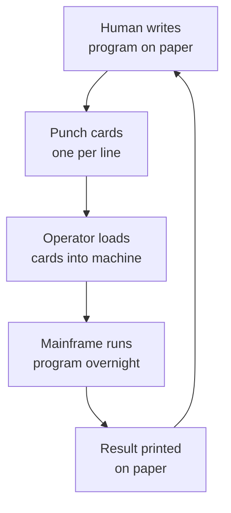
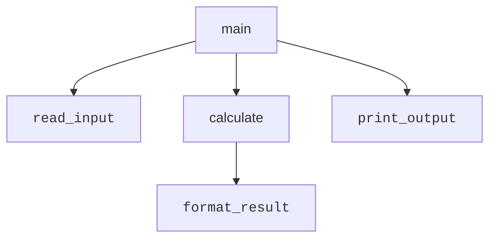

Before there was Java, before there were objects, before there was
even a screen and a keyboard for most programmers, there were
machines that could only follow one instruction at a time. The story
of programming is, in large part, the story of humans inventing
better and better ways to *tell a machine what to do without going
insane*.

## Programs as physical things

In the 1940s and 50s, a "program" was not a file. It was a deck of
**punched cards**, or a roll of paper tape with holes in it, or a
patch panel with wires plugged from socket to socket. A programmer
would carry their program in a cardboard box, hand it to an operator,
and come back the next day to find out whether it had worked.



Every cycle of "edit, run, see what happened" could take *days*. So
programmers learned to think extremely carefully before writing a
single instruction. This is an instinct we have mostly lost — modern
tools run our code in milliseconds — but it is worth remembering: a
program is a plan you are giving to a machine, and bad planning is
expensive.

## Machine code and assembly

The earliest programs were written in **machine code**: long strings
of `0`s and `1`s that the CPU could execute directly. To add two
numbers you might write something like `00010101 00000011`.
Unreadable. Error-prone. Different on every machine.

**Assembly language** was the first improvement. Instead of binary,
you could write short mnemonics like `ADD R1, R2` or `MOV AX, 5`. An
assembler then turned those mnemonics into the right binary. This was
a huge leap forward, but each kind of CPU still had its own assembly
language. A program written for one machine would not run on another.

## High-level languages and procedures

In the late 1950s and 1960s, languages like **FORTRAN**, **COBOL**,
**ALGOL**, **C**, and **Pascal** introduced something revolutionary:
the ability to write programs in something that looked like math or
English, and let a **compiler** translate that into machine code for
whatever CPU you happened to have.

These languages were **procedural**. A program was a sequence of
*procedures* (also called *functions* or *subroutines*) that
manipulated *data*. You would call procedure A, which would call
procedure B, which would change some variables, and eventually the
program would print a result.



For decades, this was *the* way to write software. And it worked —
for a while.

<MultipleChoice
  markdown={`Why did assembly language replace direct machine code for most programmers?

- It made programs run faster
  > Assembly translates to the same machine code; speed is unchanged.
- [o] It gave instructions short readable names, so humans could write and debug them more easily
  > Assembly was the first major step toward making programs human-readable.
- It allowed the same program to run on any CPU
  > That came later, with high-level languages.
- It removed the need for an operator to load programs
  > Operators were still needed for a long time after assembly arrived.`}
/>

## Programs as recipes

The mental model of early programming was simple: a program is a
**recipe**. You write down each step, in order. You run the recipe.
You get a result.

That model is still useful today. When we eventually meet our first
Java program, it will look very much like a recipe:

```text
1. Create a variable called name and set it to "world".
2. Repeat three times:
       Print "Hello, name!".
```

Procedural thinking — "do this, then do that, then if X do this
other thing" — is the foundation under everything we are about to
learn. Even when we are designing complex object-oriented systems,
*inside* each method we will still be writing little recipes.

## What was missing

Procedural programs were good at small tasks. But as software started
to grow — payroll systems, airline reservations, missile guidance —
something began to go wrong. Programs were becoming so large that
nobody could understand them anymore. Bugs were everywhere. Projects
were chronically late.

The industry was about to run face-first into something later called
the **software crisis**. That is the next page.

<MultipleChoice
  markdown={`What is a *procedure* (or *function*) in early procedural languages?

- A file containing data
  > Files store data; procedures contain instructions.
- A type of machine instruction
  > Procedures are built *out of* machine instructions, but are higher-level.
- [o] A named, reusable sequence of instructions that other parts of the program can call
  > Procedures are the basic building block of procedural programming.
- A diagram explaining the program
  > Diagrams describe code, but a procedure is real code itself.`}
/>

<Callout type="info">
You will see the word "function" used interchangeably with
"procedure" and "method" throughout your career. In Java, the
preferred term is **method**, because every function lives inside a
class. We will be very strict about that distinction soon.
</Callout>
